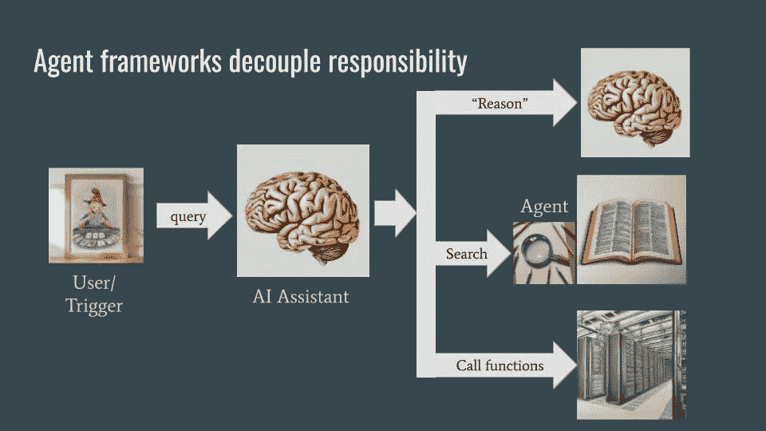
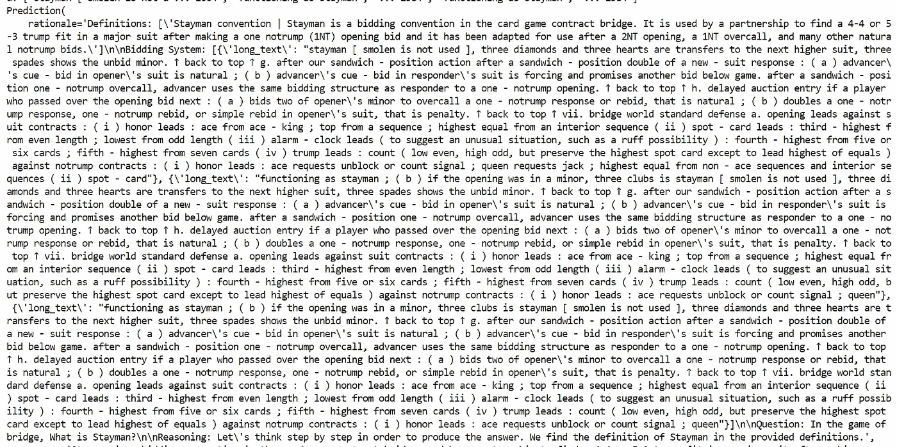

# 使用 DSPy 构建 AI 助手

> 原文：[`towardsdatascience.com/building-an-ai-assistant-with-dspy-2e1e749a1a95?source=collection_archive---------0-----------------------#2024-03-07`](https://towardsdatascience.com/building-an-ai-assistant-with-dspy-2e1e749a1a95?source=collection_archive---------0-----------------------#2024-03-07)

## 一种编程和调整提示无关的 LLM 代理流水线的方法

[](https://lakshmanok.medium.com/?source=post_page---byline--2e1e749a1a95--------------------------------)[](https://towardsdatascience.com/?source=post_page---byline--2e1e749a1a95--------------------------------) [Lak Lakshmanan](https://lakshmanok.medium.com/?source=post_page---byline--2e1e749a1a95--------------------------------)

·发表于[Towards Data Science](https://towardsdatascience.com/?source=post_page---byline--2e1e749a1a95--------------------------------) ·阅读时间 9 分钟·2024 年 3 月 7 日

--

我讨厌提示工程。有一方面，我不想在 LLM 面前俯首称臣（“你是世界上最棒的文案写手……”）、贿赂它（“如果你……，我会给你 10 美元小费”）或烦扰它（“确保……”）。另一方面，提示是脆弱的——对提示语做些许更改就能导致输出发生重大变化。这使得使用 LLM 开发可重复的功能变得困难。

不幸的是，今天开发基于 LLM 的应用程序涉及调整和修改提示语。从编写计算机精确执行的编程语言代码，到编写自然语言指令（计算机并不完全遵循）似乎并没有进步。这就是我发现使用 LLM 进行工作的原因感到沮丧——我更喜欢编写和调试我可以实际推理的计算机程序。

那么，如果你能使用一个高级编程框架在 LLM 之上进行编程，并让框架为你编写和调整提示语呢？那岂不是太好了？这——能够在不处理提示的情况下编程构建代理流水线，并且以数据驱动和与 LLM 无关的方式调整这些流水线——正是[ DSPy](https://github.com/stanfordnlp/dspy)背后的关键前提。

## 一个 AI 助手

为了说明 DSPy 是如何工作的，我将构建一个 AI 助手。

什么是 AI 助手？它是一个为人类执行任务提供帮助的计算机程序。理想的 AI 助手会*主动*地代表用户工作（聊天机器人可以作为功能备份，用于查找产品中不易找到的功能或为终端用户提供客户支持，但不应是应用程序中主要/唯一的 AI 助手）。因此，设计 AI 助手的过程包括思考工作流程，并确定如何通过 AI 来简化它。

一个典型的 AI 助手通过以下方式简化工作流程：（1）检索与任务相关的公司政策等信息，（2）从客户发送的文档中提取信息，（3）根据对政策和文档的文本分析填写表格或检查单，（4）收集参数并代表用户调用函数，（5）识别潜在错误并突出风险。

我将使用一个桥牌作为例子来说明 AI 助手的用例。尽管我正在为桥牌叫牌构建 AI 助手，但你并不需要了解桥牌就能理解这里的概念。我选择桥牌的原因是，桥牌中有大量术语、涉及相当多的人类判断，并且有多个外部工具供顾问使用。这些是你可能想为其构建 AI 助手的行业问题和后台流程的关键特征。但因为它是一个游戏，所以其中不涉及机密信息。

## 代理框架

当被问到类似“什么是 Stayman？”的问题时，助手会使用多个后台服务来执行其任务。这些后台服务通过代理进行调用，而这些代理本身是基于语言模型构建的。与软件工程中的微服务类似，使用代理和后台服务允许解耦和专业化——AI 助手不需要知道事情是如何完成的，只需要知道需要完成什么，而每个代理只需了解如何做自己的事情。



一个代理框架。图片由作者提供。图片中的草图是使用 Gemini 生成的。

在代理框架中，代理通常是较小的语言模型（LMs），这些模型需要准确，但不具备世界知识。代理能够进行“推理”（通过思维链）、搜索（通过检索增强生成）和执行非文本工作（通过提取参数传递给后台函数）。代理框架的前端是一个非常流利且连贯的大型语言模型（LLM）。这个 LLM 知道它需要处理的意图，以及如何路由这些意图。它还需要具备世界知识。通常，会有一个单独的政策或监管 LLM 作为过滤器。当用户发起查询时（聊天机器人用例）或发生触发事件时（主动助手用例），AI 助手会被调用。

## 使用 DSPy 的零样本提示

要构建上述整个架构，我将使用 DSPy。[整个代码可以在 GitHub 上找到](https://github.com/lakshmanok/lakblogs/tree/main/bridge_bidding_advisor)；从该目录下的[bidding_advisor.py](https://github.com/lakshmanok/lakblogs/blob/main/bridge_bidding_advisor/bidding_advisor.py)开始，跟着一起操作。

在 DSPy 中，发送提示给 LLM 并获取响应的过程如下：

```py
class ZeroShot(dspy.Module):
    """
    Provide answer to question
    """
    def __init__(self):
        super().__init__()
        self.prog = dspy.Predict("question -> answer")

    def forward(self, question):
        return self.prog(question="In the game of bridge, " + question)
```

上面的代码段中发生了四个事情：

1.  编写一个 dspy.Module 的子类

1.  在 init 方法中，设置一个 LM 模块。最简单的方式是使用 dspy.Predict，它是一个单一的调用。

1.  Predict 构造函数接受一个签名。这里，我表示有一个输入（问题）和一个输出（答案）。

1.  编写一个 forward()方法，接受指定的输入（这里是：问题），并返回签名中承诺的内容（这里是：答案）。它通过调用在 init 方法中创建的 dspy.Predict 对象来实现。

我本可以直接传递问题，但为了展示我可以在某种程度上影响提示，我添加了一些上下文。

注意，上面的代码完全与 LLM 无关，且提示中没有任何谄媚、贿赂等内容。

要调用上述模块，首先初始化 dspy 并配置一个 LLM：

```py
gemini = dspy.Google("models/gemini-1.0-pro",
                         api_key=api_key,
                         temperature=temperature)
dspy.settings.configure(lm=gemini, max_tokens=1024)
```

然后，调用你的模块：

```py
module = ZeroShot()
response = module("What is Stayman?")
print(response)
```

当我这么做时，得到了：

```py
Prediction(
    answer='Question: In the game of bridge, What is Stayman?\nAnswer: A conventional bid of 2♣ by responder after a 1NT opening bid, asking opener to bid a four-card major suit if he has one, or to pass if he does not.'
)
```

想要使用不同的 LLM？将设置配置行更改为：

```py
gpt35 = dspy.OpenAI(model="gpt-3.5-turbo",
                        api_key=api_key,
                        temperature=temperature)
dspy.settings.configure(lm=gpt35, max_tokens=1024)
```

## 文本提取

如果 DSPy 只是让调用 LLMs 更容易并且将 LLM 进行抽象化，那么人们也不会对 DSPy 如此兴奋。让我们继续构建 AI 助手，并在过程中展示一些其他的优势。

假设我们想使用 LLM 进行实体提取。我们可以通过指示 LLM 识别我们要提取的内容（日期、产品 SKU 等）来实现。在这里，我们会要求它找出桥牌术语：

```py
class Terms(dspy.Signature):
    """
    List of extracted entities
    """
    prompt = dspy.InputField()
    terms = dspy.OutputField(format=list)

class FindTerms(dspy.Module):
    """
    Extract bridge terms from a question
    """
    def __init__(self):
        super().__init__()
        self.entity_extractor = dspy.Predict(Terms)

    def forward(self, question):
        max_num_terms = max(1, len(question.split())//4)
        instruction = f"Identify up to {max_num_terms} terms in the following question that are jargon in the card game bridge."
        prediction = self.entity_extractor(
            prompt=f"{instruction}\n{question}"
        )
        return prediction.terms
```

虽然我们本可以将模块的签名表示为“提示 -> 条件”，但我们也可以将签名表示为一个 Python 类。

在一个语句上调用此模块：

```py
module = FindTerms()
response = module("Playing Stayman and Transfers, what do you bid with 5-4 in the majors?")
print(response)
```

我们将得到：

```py
['Stayman', 'Transfers']
```

注意，这段代码是多么简洁和易读。

## RAG

DSPy 内置了多个检索器。但这些本质上只是函数，你可以将现有的检索代码封装到 dspy.Retriever 中。它支持多个流行的检索器，包括 ChromaDB：

```py
from chromadb.utils import embedding_functions
default_ef = embedding_functions.DefaultEmbeddingFunction()
bidding_rag = ChromadbRM(CHROMA_COLLECTION_NAME, CHROMADB_DIR, default_ef, k=3)
```

当然，我得先获取一本关于桥牌叫牌的文档，将其拆分并加载到 ChromaDB 中。如果你感兴趣，代码在仓库里，但由于与本文无关，我将略过不提。

## 编排

现在你已经实现了所有的代理，每个代理都是一个独立的 dspy.Module。接下来，构建编排 LLM，它接收命令或触发器并以某种方式调用代理模块。

模块的编排也发生在一个 dspy.Module 中：

```py
class AdvisorSignature(dspy.Signature):
    definitions = dspy.InputField(format=str)  # function to call on input to make it a string
    bidding_system = dspy.InputField(format=str) # function to call on input to make it a string
    question = dspy.InputField()
    answer = dspy.OutputField()

class BridgeBiddingAdvisor(dspy.Module):
    """
    Functions as the orchestrator. All questions are sent to this module.
    """
    def __init__(self):
        super().__init__()
        self.find_terms = FindTerms()
        self.definitions = Definitions()
        self.prog = dspy.ChainOfThought(AdvisorSignature, n=3)

    def forward(self, question):
        terms = self.find_terms(question)
        definitions = [self.definitions(term) for term in terms]
        bidding_system = bidding_rag(question)
        prediction = self.prog(definitions=definitions,
                               bidding_system=bidding_system,
                               question="In the game of bridge, " + question,
                               max_tokens=-1024)
        return prediction.answer
```

我没有使用 dspy.Predict 作为最终步骤，而是使用了 ChainOfThought（COT=3）。

## 优化器

现在我们已经设置好了整个链条，我们当然可以直接调用调度模块来进行测试。但更重要的是，我们可以让 dspy 根据示例数据自动调整提示。

要加载这些示例并让 dspy 进行调整（这叫做提示器，但这个名称将改为优化器，这更准确地描述了它的功能），我这样做：

```py
traindata = json.load(open("trainingdata.json", "r"))['examples']
trainset = [dspy.Example(question=e['question'], answer=e['answer']) for e in traindata]

# train
teleprompter = teleprompt.LabeledFewShot()
optimized_advisor = teleprompter.compile(student=BridgeBiddingAdvisor(), trainset=trainset)

# use optimized advisor just like the original orchestrator
response = optimized_advisor("What is Stayman?")
print(response)
```

我在上面的示例中只用了 3 个示例，但显然，你会使用成百上千个示例来获得一个经过适当调优的提示集。值得注意的是，调整是针对整个管道进行的；你不需要一个一个模块地调整。

优化后的管道更好吗？

原始管道对这个问题的返回结果如下（也显示了中间输出，并且“两颗梅花”是错误的）：

```py
a: Playing Stayman and Transfers, what do you bid with 5-4 in the majors?
b: ['Stayman', 'Transfers']
c: ['Stayman convention | Stayman is a bidding convention in the card game contract bridge. It is used by a partnership to find a 4-4 or 5-3 trump fit in a major suit after making a one notrump (1NT) opening bid and it has been adapted for use after a 2NT opening, a 1NT overcall, and many other natural notrump bids.', "Jacoby transfer | The Jacoby transfer, or simply transfers, in the card game contract bridge, is a convention initiated by responder following partner's notrump opening bid that forces opener to rebid in the suit ranked just above that bid by responder. For example, a response in diamonds forces a rebid in hearts and a response in hearts forces a rebid in spades. Transfers are used to show a weak hand with a long major suit, and to ensure that opener declare the hand if the final contract is in the suit transferred to, preventing the opponents from seeing the cards of the stronger hand."]
d: ['stayman ( possibly a weak ... 1602', '( scrambling for a two -  ... 1601', '( i ) two hearts is weak  ... 1596']
Two spades.
```

优化后的管道返回了正确答案“Smolen”：

```py
a: Playing Stayman and Transfers, what do you bid with 5-4 in the majors?
b: ['Stayman', 'Transfers']
c: ['Stayman convention | Stayman is a bidding convention in the card game contract bridge. It is used by a partnership to find a 4-4 or 5-3 trump fit in a major suit after making a one notrump (1NT) opening bid and it has been adapted for use after a 2NT opening, a 1NT overcall, and many other natural notrump bids.', "Jacoby transfer | The Jacoby transfer, or simply transfers, in the card game contract bridge, is a convention initiated by responder following partner's notrump opening bid that forces opener to rebid in the suit ranked just above that bid by responder. For example, a response in diamonds forces a rebid in hearts and a response in hearts forces a rebid in spades. Transfers are used to show a weak hand with a long major suit, and to ensure that opener declare the hand if the final contract is in the suit transferred to, preventing the opponents from seeing the cards of the stronger hand."]
d: ['stayman ( possibly a weak ... 1602', '( scrambling for a two -  ... 1601', '( i ) two hearts is weak  ... 1596']
After a 1NT opening, Smolen allows responder to show 5-4 in the majors with game-forcing values.
```

原因在于 dspy 创建的提示。例如，对于问题“什么是 Stayman？”，请注意，它已经根据术语定义和 RAG 中的多个匹配项构建了一个推理过程：



该提示由 dspy.ChainOfThought 根据术语定义、RAG 等创建。

再次强调，我并没有编写上面调整过的提示。这些都是为我编写的。你也可以看到这未来的发展方向——你可能能够微调整个管道，使其在更小的语言模型上运行。

祝你愉快！

## 下一步

1.  查看我的[GitHub 代码](https://github.com/lakshmanok/lakblogs/tree/main/bridge_bidding_advisor)，从[bidding_advisor.py](https://github.com/lakshmanok/lakblogs/blob/main/bridge_bidding_advisor/bidding_advisor.py)开始。

1.  在这里了解更多关于 DSPy 的信息：[`dspy-docs.vercel.app/docs/intro`](https://dspy-docs.vercel.app/docs/intro)

1.  在这里学习如何玩桥牌：[`www.trickybridge.com/`](https://www.trickybridge.com/)（抱歉，我忍不住了）。
