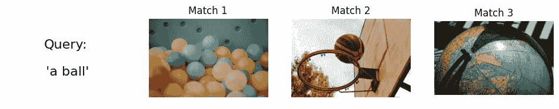
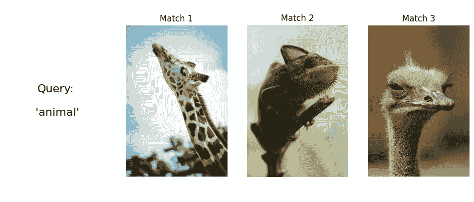
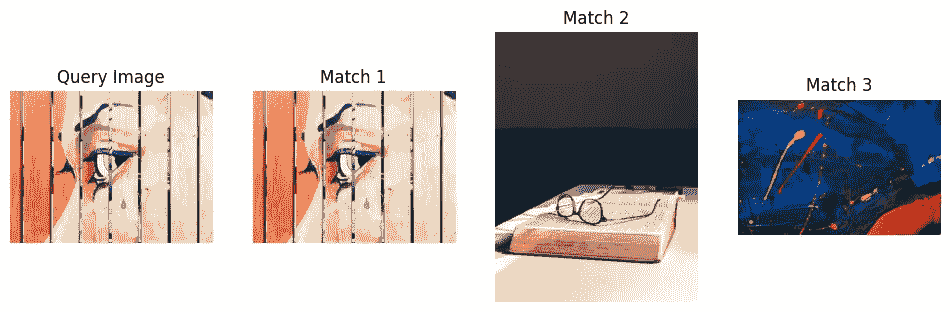

# 使用 FAISS 和 CLIP 构建图像相似度搜索引擎

> 原文：[`towardsdatascience.com/building-an-image-similarity-search-engine-with-faiss-and-clip-2211126d08fa?source=collection_archive---------3-----------------------#2024-08-23`](https://towardsdatascience.com/building-an-image-similarity-search-engine-with-faiss-and-clip-2211126d08fa?source=collection_archive---------3-----------------------#2024-08-23)

## 一篇指导性教程，解释如何使用 CLIP 嵌入和 FAISS 索引，通过文本或照片查询搜索图像数据集。

[](https://medium.com/@lihigurarie?source=post_page---byline--2211126d08fa--------------------------------)[](https://towardsdatascience.com/?source=post_page---byline--2211126d08fa--------------------------------) [Lihi Gur Arie, 博士](https://medium.com/@lihigurarie?source=post_page---byline--2211126d08fa--------------------------------)

·发布于 [Towards Data Science](https://towardsdatascience.com/?source=post_page---byline--2211126d08fa--------------------------------) ·6 分钟阅读·2024 年 8 月 23 日

--


图片由作者在 Flux-Pro 平台上生成

# 引言

你是否曾经想在你的无尽图像数据集中找到一张图像，却觉得这项任务太繁琐？在本教程中，我们将构建一个图像相似度搜索引擎，通过文本查询或参考图像轻松找到图像。为了方便起见，本教程的完整代码已提供在文章底部，作为一个**Colab 笔记本**。

> 如果你没有付费的 Medium 账户，你可以在这里免费阅读。

## 流程概览

图像的语义意义可以通过一个称为嵌入（embedding）的数值向量表示。通过比较这些低维的嵌入向量，而不是原始图像，可以高效地进行相似度搜索。对于数据集中的每一张图片，我们都会创建一个嵌入向量并将其存储在索引中。当提供文本查询或参考图像时，会生成其嵌入并与索引中的嵌入进行比较，以检索最相似的图像。

这里是简要概览：

1.  **嵌入**：图像的嵌入是通过 CLIP 模型提取的。

1.  **索引**：嵌入向量被存储为 FAISS 索引。

1.  **检索**：使用 FAISS，查询的嵌入与索引中的嵌入进行比较，从而检索最相似的图像。

## CLIP 模型

CLIP（对比语言-图像预训练）模型是由 OpenAI 开发的多模态视觉与语言模型，它将图像和文本映射到相同的潜在空间。由于我们将使用图像和文本查询来搜索图像，我们将使用 CLIP 模型来嵌入我们的数据。关于 CLIP 的进一步阅读，您可以查看我之前的文章这里。

## FAISS 索引

FAISS（Facebook AI 相似度搜索）是 Meta 开发的开源库。它围绕存储数据库嵌入向量的索引对象构建。FAISS 使得密集向量的高效相似度搜索和聚类成为可能，我们将使用它对我们的数据集进行索引，并检索与查询相似的照片。

# 代码实现

## **第 1 步 — 数据集探索**

为了创建本教程的图像数据集，我从[Pexels](https://www.pexels.com/)收集了 52 张各种主题的图像。为了帮助理解，我们来看一下 10 张随机图像：


## **第 2 步 — 从图像数据集中提取 CLIP 嵌入向量**

要提取 CLIP 嵌入向量，我们将首先使用 HuggingFace SentenceTransformer 库加载 CLIP 模型：

```py
model = SentenceTransformer('clip-ViT-B-32')
```

接下来，我们将创建一个函数，使用 `glob` 遍历我们的数据集目录，通过 `PIL Image.open` 打开每个图像，并使用 `CLIP model.encode` 为每个图像生成一个嵌入向量。它将返回一个嵌入向量列表和我们图像数据集路径的列表：

```py
def generate_clip_embeddings(images_path, model):

    image_paths = glob(os.path.join(images_path, '**/*.jpg'), recursive=True)

    embeddings = []
    for img_path in image_paths:
        image = Image.open(img_path)
        embedding = model.encode(image)
        embeddings.append(embedding)

    return embeddings, image_paths

IMAGES_PATH = '/path/to/images/dataset'

embeddings, image_paths = generate_clip_embeddings(IMAGES_PATH, model)
```

## **第 3 步 — 生成 FAISS 索引**

下一步是从嵌入向量列表创建 FAISS 索引。FAISS 提供了多种距离度量方法来进行相似度搜索，包括内积（IP）和 L2（欧几里得）距离。

FAISS 还提供了多种索引选项。它可以使用近似或压缩技术高效地处理大数据集，同时平衡搜索速度和精度。在本教程中，我们将使用“Flat”索引，它通过将查询向量与数据集中的每个向量进行比较来执行暴力搜索，确保精确结果，但代价是更高的计算复杂度。

```py
def create_faiss_index(embeddings, image_paths, output_path):

    dimension = len(embeddings[0])
    index = faiss.IndexFlatIP(dimension)
    index = faiss.IndexIDMap(index)

    vectors = np.array(embeddings).astype(np.float32)

    # Add vectors to the index with IDs
    index.add_with_ids(vectors, np.array(range(len(embeddings))))

    # Save the index
    faiss.write_index(index, output_path)
    print(f"Index created and saved to {output_path}")

    # Save image paths
    with open(output_path + '.paths', 'w') as f:
        for img_path in image_paths:
            f.write(img_path + '\n')

    return index

OUTPUT_INDEX_PATH = "/content/vector.index"
index = create_faiss_index(embeddings, image_paths, OUTPUT_INDEX_PATH)
```

`faiss.IndexFlatIP` 初始化一个用于内积相似度的索引，封装在 `faiss.IndexIDMap` 中，将每个向量与一个 ID 关联。接下来，`index.add_with_ids` 将向量添加到索引中，并分配顺序 ID，索引连同图像路径一起保存到磁盘。

索引可以立即使用，也可以保存到磁盘以供将来使用。要加载 FAISS 索引，我们将使用以下函数：

```py
def load_faiss_index(index_path):
    index = faiss.read_index(index_path)
    with open(index_path + '.paths', 'r') as f:
        image_paths = [line.strip() for line in f]
    print(f"Index loaded from {index_path}")
    return index, image_paths

index, image_paths = load_faiss_index(OUTPUT_INDEX_PATH)
```

## **第 4 步 — 通过文本查询或参考图像检索图像**

在构建好 FAISS 索引后，我们现在可以使用文本查询或参考图像来检索图像。如果查询是图像路径，则通过 `PIL Image.open` 打开查询。接着，通过 `CLIP model.encode` 提取查询的嵌入向量。

```py
def retrieve_similar_images(query, model, index, image_paths, top_k=3):

    # query preprocess:
    if query.endswith(('.png', '.jpg', '.jpeg', '.tiff', '.bmp', '.gif')):
        query = Image.open(query)

    query_features = model.encode(query)
    query_features = query_features.astype(np.float32).reshape(1, -1)

    distances, indices = index.search(query_features, top_k)

    retrieved_images = [image_paths[int(idx)] for idx in indices[0]]

    return query, retrieved_images
```

检索发生在`index.search`方法中。它实现了 k 近邻（kNN）搜索，用于查找与查询向量最相似的`k`个向量。我们可以通过更改`top_k`参数来调整 k 的值。在我们的实现中，kNN 搜索使用的距离度量是余弦相似度。该函数返回查询和一系列获取的图片路径。

**使用文本查询进行搜索：**

现在我们准备好检查搜索结果了。辅助函数`visualize_results`展示了这些结果。你可以在关联的 Colab 笔记本中找到它。让我们以文本查询“ball”为例，探索获取的三个最相似的图片：

```py
query = 'ball'
query, retrieved_images = retrieve_similar_images(query, model, index, image_paths, top_k=3)
visualize_results(query, retrieved_images)
```



使用查询“a ball”获取的图片

对于查询“animal”，我们得到了：



使用查询“animal”获取的图片

**使用参考图片进行搜索：**

```py
query ='/content/drive/MyDrive/Colab Notebooks/my_medium_projects/Image_similarity_search/image_dataset/pexels-w-w-299285-889839.jpg'
query, retrieved_images = retrieve_similar_images(query, model, index, image_paths, top_k=3)
visualize_results(query, retrieved_images)
```



查询和获取的图片

正如我们所见，我们对现成的预训练模型得到了相当不错的结果。当我们用一幅眼睛画作为参考图片进行搜索时，除了找到原始图片外，还找到了一张眼镜和一张不同画作的匹配。这展示了查询图片的语义含义的不同方面。

你可以在提供的 Colab 笔记本中尝试其他查询，查看模型在不同文本和图像输入下的表现。

# 结语

在本教程中，我们使用 CLIP 和 FAISS 构建了一个基本的图像相似性搜索引擎。获取的图片与查询具有相似的语义含义，表明该方法的有效性。尽管 CLIP 对零样本模型显示出不错的结果，但它可能在分布外数据、细粒度任务中表现较差，并且继承了它所训练数据的自然偏差。为了克服这些限制，你可以尝试使用其他类似 CLIP 的预训练模型，如在[OpenClip](https://github.com/mlfoundations/open_clip/tree/main)中，或者在你自己的定制数据集上微调 CLIP。

# 感谢阅读！

恭喜你一路走到了这里。点击👍表示感谢，提升算法的自尊心🤓

**想了解更多？**

+   [**探索**](https://medium.com/@lihigurarie)我写的其他文章

+   [**订阅**](https://medium.com/@lihigurarie/subscribe)以便在我发布文章时获得通知

+   在[**Linkedin**](https://www.linkedin.com/in/lihi-gur-arie/)上关注我

# 完整代码作为 Colab 笔记本：

Colab 笔记本[链接](https://gist.github.com/Lihi-Gur-Arie/7cac63dbffde55449d2444e402d87bfc)
