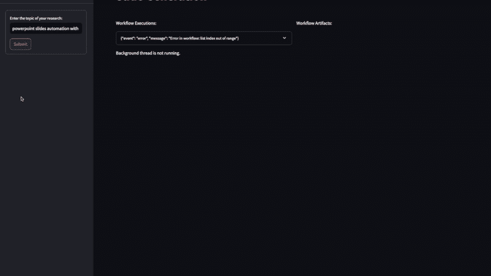
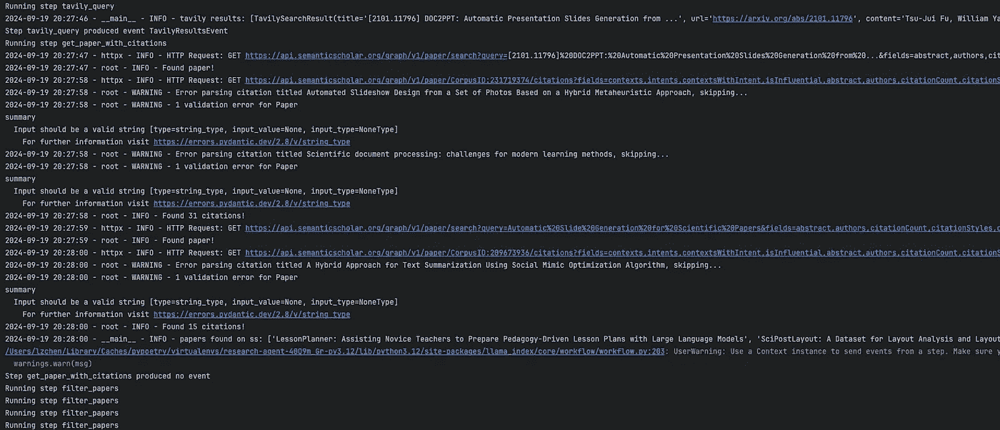
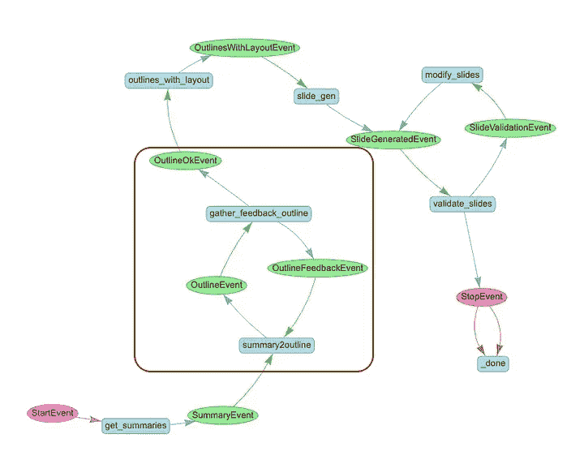

# 为 Llamaindex 工作流构建交互式 UI

> 原文：[`towardsdatascience.com/building-an-interactive-ui-for-llamaindex-workflows-842dd7abedde?source=collection_archive---------3-----------------------#2024-09-24`](https://towardsdatascience.com/building-an-interactive-ui-for-llamaindex-workflows-842dd7abedde?source=collection_archive---------3-----------------------#2024-09-24)

## 使用 Llamaindex、FastAPI 和 Streamlit 集成人机互动的指南

[](https://medium.com/@lzchen.cs?source=post_page---byline--842dd7abedde--------------------------------)[](https://towardsdatascience.com/?source=post_page---byline--842dd7abedde--------------------------------) [Lingzhen Chen](https://medium.com/@lzchen.cs?source=post_page---byline--842dd7abedde--------------------------------)

·发表于[Towards Data Science](https://towardsdatascience.com/?source=post_page---byline--842dd7abedde--------------------------------) ·阅读时间：10 分钟·2024 年 9 月 24 日

--

在上一篇文章中，我展示了如何使用 LlamaIndex 工作流来简化我的研究和展示过程。我构建了一个工作流，该工作流获取研究主题，在 arxiv.org 上查找相关文章，创建论文摘要，并生成一个 PowerPoint 幻灯片展示这些论文。你可以在这里阅读完整的操作步骤：

[](/how-i-streamline-my-research-and-presentation-with-llamaindex-workflows-3d75a9a10564?source=post_page-----842dd7abedde--------------------------------) ## 我如何通过 LlamaIndex 工作流简化我的研究和展示

### 一个协调 AI 工作流的示例，具有鲁棒性、灵活性和可控性

towardsdatascience.com

为了继续构建工作流并使其更具用户友好性，我使用 Streamlit 实现了一个 UI，以增强用户体验。该 UI 显示工作流执行的进度更新，集成用户输入，支持实时用户反馈，并呈现最终生成的幻灯片。



Streamlit UI（作者录屏）

你可以在我的[Github](https://github.com/lz-chen/research-agent)上查看完整代码。在本文中，我将介绍 UI 实现的一些关键点，以及前端和后端之间的集成：

**后端增强：**

+   更新工作流以支持发送流式事件

+   更新工作流以暂停执行并等待用户输入

+   使用 FastAPI 托管多个端点以运行工作流，接受用户输入和下载文件，支持异步处理和流式消息

**前端 UI 功能：**

+   向后台发送请求并在扩展框中显示从后台流式传输的事件数据

+   在容器中显示相关信息并收集用户输入（如果需要用户输入）

+   渲染最终生成的幻灯片

+   提供一个按钮供用户下载最终文件

**将所有内容整合在一起：**

+   将前端和后端依赖项分开，并通过使用不同的`pyproject.toml`和`Dockerfile`进行构建

+   使用`docker-compose`构建并启动所有服务

从终端启动工作流时，可以很直观地看到当前正在执行的步骤以及我们在这些步骤中添加的日志信息。



工作流执行的终端日志（截图来自作者）

我们还可以通过简单地在工作流中使用`user_feedback = input()`来启用人机互动。这将暂停工作流并等待用户输入（请参见此官方 Llamaindex[笔记本](https://docs.llamaindex.ai/en/stable/examples/workflow/human_in_the_loop_story_crafting/)中的人机互动示例）。然而，为了在用户友好的界面中实现相同的功能，我们需要对原始工作流做出额外的修改。

# 从工作流发送流式事件

工作流执行可能需要很长时间，因此为了提供更好的用户体验，Llamaindex 提供了一种方法，通过发送流式事件来指示工作流的进度，如笔记本[这里](https://docs.llamaindex.ai/en/stable/understanding/workflows/stream/)所示。在我的工作流中，我定义了一个`WorkflowStreamingEvent`类，包含有关事件消息的有用信息，如事件类型，以及它是从哪个步骤发送的：

```py
class WorkflowStreamingEvent(BaseModel):
    event_type: Literal["server_message", "request_user_input"] = Field(
        ..., description="Type of the event"
    )
    event_sender: str = Field(
        ..., description="Sender (workflow step name) of the event"
    )
    event_content: Dict[str, Any] = Field(..., description="Content of the event")
```

为了启用发送流式事件，工作流步骤需要访问共享上下文，这通过在步骤定义中添加`@step(pass_context=True)`装饰器来实现。然后，在步骤定义中，我们可以通过上下文发送关于进度的事件消息。例如，在`tavily_query()`步骤中：

```py
@step(pass_context=True)
async def tavily_query(self, ctx: Context, ev: StartEvent) -> TavilyResultsEvent:
    ctx.data["research_topic"] = ev.user_query
    query = f"arxiv papers about the state of the art of {ev.user_query}"
    ctx.write_event_to_stream(
        Event(
            msg=WorkflowStreamingEvent(
                event_type="server_message",
                event_sender=inspect.currentframe().f_code.co_name,
                event_content={"message": f"Querying Tavily with: '{query}'"},
            ).model_dump()
        )
    )
```

在这个示例中，我们将`event_type`设置为`“server_message”`，意味着这是一个更新消息，不需要用户操作。我们还有另一种事件类型`"request_user_input"`，表示需要用户输入。例如，在工作流中的`gather_feedback_outline()`步骤中，在从原始论文摘要生成幻灯片文本大纲后，会发送一条消息，提示用户提供对大纲文本的批准和反馈：

```py
@step(pass_context=True)
    async def gather_feedback_outline(
        self, ctx: Context, ev: OutlineEvent
    ) -> OutlineFeedbackEvent | OutlineOkEvent:
        """Present user the original paper summary and the outlines generated, gather feedback from user"""
        ...

        # Send a special event indicating that user input is needed
        ctx.write_event_to_stream(
            Event(
                msg=json.dumps(
                    {
                        "event_type": "request_user_input",
                        "event_sender": inspect.currentframe().f_code.co_name,
                        "event_content": {
                            "summary": ev.summary,
                            "outline": ev.outline.dict(),
                            "message": "Do you approve this outline? If not, please provide feedback.",
                        },
                    }
                )
            )
        )

        ...
```

这些事件在后台 API 和前端逻辑中有不同的处理方式，我将在本文后续部分详细描述。

# 暂停工作流以等待用户输入



需要用户反馈的工作流步骤（图像来自作者）

当向用户发送 `"request_user_input"` 事件时，我们只希望在**收到**用户输入后才继续执行下一步。如上面的工作流图所示，如果用户批准了大纲，它会进入 `outlines_with_layout()` 步骤；如果用户没有批准，则会再次进入 `summary2outline()` 步骤。

这是通过使用 Python 的 `asyncio` 库中的 `Future()` 对象来实现的。在 `SlideGenerationWorkflow` 类中，我们设置了一个属性 `self.user_input_future = asyncio.Future()`，这个属性可以在 `gather_feedback_outline()` 步骤中等待。工作流的后续执行取决于用户反馈的内容：

```py
@step(pass_context=True)
async def gather_feedback_outline(
    self, ctx: Context, ev: OutlineEvent
) -> OutlineFeedbackEvent | OutlineOkEvent:
    ...

    # Wait for user input
    if not self.user_input_future.done():
        user_response = await self.user_input_future
        logger.info(f"gather_feedback_outline: Got user response: {user_response}")

        # Process user_response, which should be a JSON string
        try:
            response_data = json.loads(user_response)
            approval = response_data.get("approval", "").lower().strip()
            feedback = response_data.get("feedback", "").strip()
        except json.JSONDecodeError:
            # Handle invalid JSON
            logger.error("Invalid user response format")
            raise Exception("Invalid user response format")

        if approval == ":material/thumb_up:":
            return OutlineOkEvent(summary=ev.summary, outline=ev.outline)
        else:
            return OutlineFeedbackEvent(
                summary=ev.summary, outline=ev.outline, feedback=feedback
            )
```

# FastAPI 后端

我们使用 FastAPI 设置后端，暴露一个 POST 端点来处理请求，并启动工作流运行。异步函数 `run_workflow_endpoint()` 接受 `ResearchTopic` 作为输入。在该函数中，定义了一个异步生成器 `event_generator()`，它创建一个任务来运行工作流，并在工作流进展时将事件流传输给客户端。当工作流完成时，它还会将最终的文件结果流传输给客户端。

```py
 class ResearchTopic(BaseModel):
    query: str = Field(..., example="example query")

@app.post("/run-slide-gen")
async def run_workflow_endpoint(topic: ResearchTopic):
    workflow_id = str(uuid.uuid4())

    wf = SummaryAndSlideGenerationWorkflow(wid=workflow_id, timeout=2000, verbose=True)
    wf.add_workflows(
        summary_gen_wf=SummaryGenerationWorkflow(
            wid=workflow_id, timeout=800, verbose=True
        )
    )
    wf.add_workflows(
        slide_gen_wf=SlideGenerationWorkflow(
            wid=workflow_id, timeout=1200, verbose=True
        )
    )

    async def event_generator():
        loop = asyncio.get_running_loop()
        logger.debug(f"event_generator: loop id {id(loop)}")
        yield f"{json.dumps({'workflow_id': workflow_id})}\n\n"

        task = asyncio.create_task(wf.run(user_query=topic.query))
        logger.debug(f"event_generator: Created task {task}")
        try:
            async for ev in wf.stream_events():
                logger.info(f"Sending message to frontend: {ev.msg}")
                yield f"{ev.msg}\n\n"
                await asyncio.sleep(0.1)  # Small sleep to ensure proper chunking
            final_result = await task

            # Construct the download URL
            download_pptx_url = f"http://backend:80/download_pptx/{workflow_id}"
            download_pdf_url = f"http://backend:80/download_pdf/{workflow_id}"

            final_result_with_url = {
                "result": final_result,
                "download_pptx_url": download_pptx_url,
                "download_pdf_url": download_pdf_url,
            }

            yield f"{json.dumps({'final_result': final_result_with_url})}\n\n"
        except Exception as e:
            error_message = f"Error in workflow: {str(e)}"
            logger.error(error_message)
            yield f"{json.dumps({'event': 'error', 'message': error_message})}\n\n"
        finally:
            # Clean up
            workflows.pop(workflow_id, None)

    return StreamingResponse(event_generator(), media_type="text/event-stream")
```

除了这个端点外，还有接收来自客户端的用户输入和处理文件下载请求的端点。由于每个工作流都分配了一个唯一的工作流 ID，我们可以将从客户端接收到的用户输入映射到正确的工作流。通过调用等待中的 `Future` 对象的 `set_result()`，挂起的工作流可以恢复执行。

```py
@app.post("/submit_user_input")
async def submit_user_input(data: dict = Body(...)):
    workflow_id = data.get("workflow_id")
    user_input = data.get("user_input")
    wf = workflows.get(workflow_id)
    if wf and wf.user_input_future:
        loop = wf.user_input_future.get_loop()  # Get the loop from the future
        logger.info(f"submit_user_input: wf.user_input_future loop id {id(loop)}")
        if not wf.user_input_future.done():
            loop.call_soon_threadsafe(wf.user_input_future.set_result, user_input)
            logger.info("submit_user_input: set_result called")
        else:
            logger.info("submit_user_input: future already done")
        return {"status": "input received"}
    else:
        raise HTTPException(
            status_code=404, detail="Workflow not found or future not initialized"
        )
```

下载端点还会根据工作流 ID 确定最终文件的位置。

```py
@app.get("/download_pptx/{workflow_id}")
async def download_pptx(workflow_id: str):
    file_path = (
        Path(settings.WORKFLOW_ARTIFACTS_PATH)
        / "SlideGenerationWorkflow"
        / workflow_id
        / "final.pptx"
    )
    if file_path.exists():
        return FileResponse(
            path=file_path,
            media_type="application/vnd.openxmlformats-officedocument.presentationml.presentation",
            filename=f"final.pptx",
        )
    else:
        raise HTTPException(status_code=404, detail="File not found")
```

# Streamlit 前端

在前端页面中，在用户通过 `st.text_input()` 提交研究主题后，一个长时间运行的进程将在后台线程中启动，并在一个新的事件循环中接收来自后端的流式事件，而不会干扰页面的其他部分：

```py
def start_long_running_task(url, payload, message_queue, user_input_event):
    try:
        loop = asyncio.new_event_loop()
        asyncio.set_event_loop(loop)
        loop.run_until_complete(
            get_stream_data(url, payload, message_queue, user_input_event)
        )
        loop.close()
    except Exception as e:
        message_queue.put(("error", f"Exception in background thread: {str(e)}"))

...

def main():

  ...

  with st.sidebar:
      with st.form(key="slide_gen_form"):
          query = st.text_input(
              "Enter the topic of your research:",
          )
          submit_button = st.form_submit_button(label="Submit")

  if submit_button:
      # Reset the workflow_complete flag for a new workflow
      st.session_state.workflow_complete = False
      # Start the long-running task in a separate thread
      if (
          st.session_state.workflow_thread is None
          or not st.session_state.workflow_thread.is_alive()
      ):
          st.write("Starting the background thread...")

          st.session_state.workflow_thread = threading.Thread(
              target=start_long_running_task,
              args=(
                  "http://backend:80/run-slide-gen",
                  {"query": query},
                  st.session_state.message_queue,
                  st.session_state.user_input_event,
              ),
          )
          st.session_state.workflow_thread.start()
          st.session_state.received_lines = []
      else:
          st.write("Background thread is already running.")
```

从后端流式传输的事件数据由 `httpx.AsyncClient` 获取，并放入消息队列以供进一步处理。根据事件类型提取不同的信息。对于事件类型 `"request_user_input"`，线程也会暂停，直到提供用户输入。

```py
async def fetch_streaming_data(url: str, payload: dict = None):
    async with httpx.AsyncClient(timeout=1200.0) as client:
        async with client.stream("POST", url=url, json=payload) as response:
            async for line in response.aiter_lines():
                if line:
                    yield line

async def get_stream_data(url, payload, message_queue, user_input_event):
    # message_queue.put(("message", "Starting to fetch streaming data..."))
    data_json = None
    async for data in fetch_streaming_data(url, payload):
        if data:
            try:
                data_json = json.loads(data)
                if "workflow_id" in data_json:
                    # Send workflow_id to main thread
                    message_queue.put(("workflow_id", data_json["workflow_id"]))
                    continue
                elif "final_result" in data_json:
                    # Send final_result to main thread
                    message_queue.put(("final_result", data_json["final_result"]))
                    continue
                event_type = data_json.get("event_type")
                event_sender = data_json.get("event_sender")
                event_content = data_json.get("event_content")
                if event_type in ["request_user_input"]:
                    # Send the message to the main thread
                    message_queue.put(("user_input_required", data_json))
                    # Wait until user input is provided
                    user_input_event.wait()
                    user_input_event.clear()
                    continue
                else:
                    # Send the line to the main thread
                    message_queue.put(("message", format_workflow_info(data_json)))
            except json.JSONDecodeError:  # todo: is this necessary?
                message_queue.put(("message", data))
        if data_json and "final_result" in data_json or "final_result" in str(data):
            break  # Stop processing after receiving the final result
```

我们将消息存储在 `st.session_state` 中，并使用 `st.expander()` 来显示和更新这些流式数据。

```py
if st.session_state.received_lines:
    with expander_placeholder.container():
        # Create or update the expander with the latest truncated line
        expander = st.expander(st.session_state.expander_label)
        for line in st.session_state.received_lines:
            expander.write(line)
            expander.divider()
```

为了确保 UI 保持响应，并在后台线程处理事件消息时显示这些消息，我们使用自定义的 [autorefresh](https://github.com/kmcgrady/streamlit-autorefresh) 组件，在设定的时间间隔内刷新页面：

```py
if not st.session_state.workflow_complete:
    st_autorefresh(interval=2000, limit=None, key="data_refresh")
```

当流式事件的类型为 `"request_user_input"` 时，我们将在一个单独的容器中显示相关信息并收集用户反馈。由于一个工作流运行过程中可能会有多个需要用户输入的事件，我们将它们放入消息队列，并确保为与每个事件关联的 `st.feedback()`、`st.text_area()` 和 `st.button()` 分配一个唯一的键，以确保这些小部件互不干扰：

```py
def gather_outline_feedback(placeholder):
    container = placeholder.container()
    with container:
        if st.session_state.user_input_required:
            data = st.session_state.user_input_prompt
            event_type = data.get("event_type")
            if event_type == "request_user_input":
                summary = data.get("event_content").get("summary")
                outline = data.get("event_content").get("outline")
                prompt_message = data.get("event_content").get(
                    "message", "Please review the outline."
                )

                # display the content for user input
                st.markdown("## Original Summary:")
                st.text_area("Summary", summary, disabled=True, height=400)
                st.divider()
                st.markdown("## Generated Slide Outline:")
                st.json(outline)
                st.write(prompt_message)

                # Define unique keys for widgets
                current_prompt = st.session_state.prompt_counter
                approval_key = f"approval_state_{current_prompt}"
                feedback_key = f"user_feedback_{current_prompt}"

                # Display the approval feedback widget
                approval = st.feedback("thumbs", key=approval_key)
                st.write(f"Current Approval state is: {approval}")
                logging.info(f"Current Approval state is: {approval}")

                # Display the feedback text area
                feedback = st.text_area(
                    "Please provide feedback if you have any:", key=feedback_key
                )

                # Handle the submission of user response
                if st.button(
                    "Submit Feedback", key=f"submit_response_{current_prompt}"
                ):
                    if not st.session_state.user_response_submitted:
                        # Retrieve approval and feedback using unique keys
                        approval_state = st.session_state.get(approval_key)
                        user_feedback = st.session_state.get(feedback_key, "")

                        # Ensure approval_state is valid
                        if approval_state not in [0, 1]:
                            st.error("Please select an approval option.")
                            return

                        user_response = {
                            "approval": (
                                ":material/thumb_down:"
                                if approval_state == 0
                                else ":material/thumb_up:"
                            ),
                            "feedback": user_feedback,
                        }
                        # Send the user's response to the backend

                        try:
                            response = requests.post(
                                "http://backend:80/submit_user_input",
                                json={
                                    "workflow_id": st.session_state.workflow_id,
                                    "user_input": json.dumps(user_response),
                                },
                            )
                            response.raise_for_status()
                            logging.info(
                                f"Backend response for submitting approval: {response.status_code}"
                            )
                        except requests.RequestException as e:
                            st.error(f"Failed to submit user input: {str(e)}")
                            return

     ...
```

最后，当工作流运行结束时，前端客户端将收到一个响应，其中包含最终生成文件的路径（相同的幻灯片文件，pdf 格式用于 UI 渲染，pptx 格式用于下载作为最终结果）。我们展示 pdf 文件，并创建一个按钮供用户下载 pptx 文件：

```py
 if "download_url_pdf" in st.session_state and st.session_state.download_url_pdf:
      download_url_pdf = st.session_state.download_url_pdf
      try:
          # Fetch the PDF content
          pdf_response = requests.get(download_url_pdf)
          pdf_response.raise_for_status()
          st.session_state.pdf_data = pdf_response.content

          st.markdown("### Generated Slide Deck:")
          # Display the PDF using an iframe
          st.markdown(
              f'<iframe src="data:application/pdf;base64,{base64.b64encode(st.session_state.pdf_data).decode()}" width="100%" height="600px" type="application/pdf"></iframe>',
              unsafe_allow_html=True,
          )
      except Exception as e:
          st.error(f"Failed to load the PDF file: {str(e)}")

  # Provide the download button for PPTX if available
  if (
      "download_url_pptx" in st.session_state
      and st.session_state.download_url_pptx
  ):
      download_url_pptx = st.session_state.download_url_pptx
      try:
          # Fetch the PPTX content
          pptx_response = requests.get(download_url_pptx)
          pptx_response.raise_for_status()
          pptx_data = pptx_response.content

          st.download_button(
              label="Download Generated PPTX",
              data=pptx_data,
              file_name="generated_slides.pptx",
              mime="application/vnd.openxmlformats-officedocument.presentationml.presentation",
          )
      except Exception as e:
          st.error(f"Failed to load the PPTX file: {str(e)}")
```

# 使用`docker-compose`将一切组合起来

我们将使用`docker-compose`创建一个多服务的 Docker 应用程序，来运行前端和后端应用程序。

```py
version: '3.8'

services:
  backend:
    build:
      context: ./backend
      args:
        - --no-cache
    ports:
      - "8000:80"
    networks:
      - app-network
    volumes:
      - .env:/app/.env
      - ./data:/app/data
      - ./workflow_artifacts:/app/workflow_artifacts
      - ~/.azure:/root/.azure

  frontend:
    build:
      context: ./frontend
      args:
        - --no-cache
    ports:
      - "8501:8501"
    networks:
      - app-network

networks:
  app-network:
```

就这样！只需运行`docker-compose up`，我们现在有一个应用程序，可以根据用户输入的查询运行研究工作流，在执行过程中提示用户提供反馈，并向用户显示最终结果。

感谢阅读！查看我的[GitHub](https://github.com/lz-chen/research-agent)获取完整实现。我期待听到您的想法、建议和反馈。我目前在[Inmeta](https://inmeta.no/)担任数据科学顾问，Inmeta 是[Crayon Group](https://www.crayon.com/no/)的一部分。欢迎在[LinkedIn](https://www.linkedin.com/in/lingzhen-chen-76720680/)与我联系。😊
