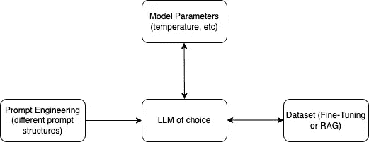

# 构建 LLMOPs 管道

> 原文：[`towardsdatascience.com/building-an-llmops-pipeline-08d367b36d64?source=collection_archive---------4-----------------------#2024-01-18`](https://towardsdatascience.com/building-an-llmops-pipeline-08d367b36d64?source=collection_archive---------4-----------------------#2024-01-18)

## 使用 SageMaker 管道、JumpStart 和 Clarify 微调和评估 Llama 7B 模型

 [Ram Vegiraju](https://ram-vegiraju.medium.com/?source=post_page---byline--08d367b36d64--------------------------------)

·发表于[数据科学前沿](https://towardsdatascience.com/?source=post_page---byline--08d367b36d64--------------------------------) ·10 分钟阅读·2024 年 1 月 18 日

--

图片来自[Unsplash](https://unsplash.com/photos/black-and-gray-metal-pipe-4CNNH2KEjhc) 由[Sigmund](https://unsplash.com/@sigmund)提供

2023 年是各种大型语言模型（LLMs）在生成式 AI 领域崛起的一年。LLM 具有强大的能力和潜力，但将其投入生产一直是用户面临的持续挑战。一个特别普遍的问题是，应该使用哪个 LLM？更具体地说，如何评估一个 LLM 的准确性？当可以选择的模型数量众多，存在不同的用于微调/RAG 的数据集，并且需要考虑多种提示工程/调优技术时，这个问题尤为具有挑战性。

为了解决这个问题，我们需要为 LLM 建立[DevOps](https://aws.amazon.com/devops/what-is-devops/#:~:text=DevOps%20is%20the%20combination%20of,development%20and%20infrastructure%20management%20processes.)最佳实践。建立一个可以帮助评估不同模型、数据集和提示的工作流或管道。这个领域开始被称为[LLMOPs/FMOPs](https://aws.amazon.com/blogs/machine-learning/fmops-llmops-operationalize-generative-ai-and-differences-with-mlops/)。以下是 LLMOPs 中可以考虑的一些参数，展示了一个（极度）简化的流程：

LLM 评估考虑因素（作者）

在本文中，我们将尝试通过构建一个管道来解决这个问题，该管道可以微调、部署并评估一个[Llama 7B 模型](https://huggingface.co/meta-llama/Llama-2-7b)。你还可以通过…来扩展这个示例。
