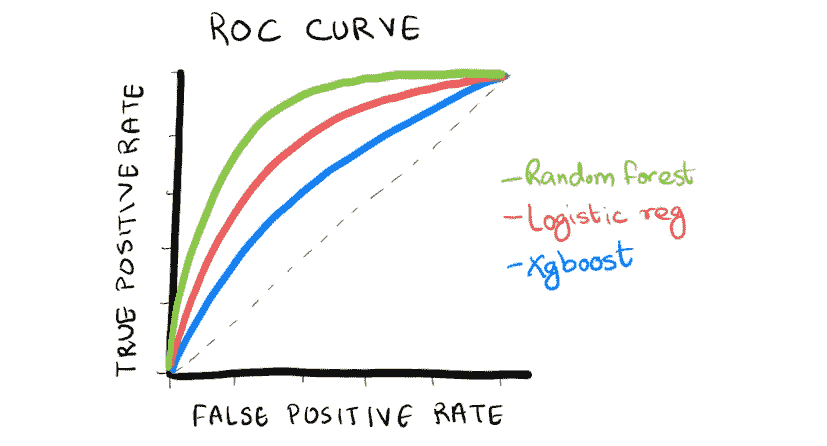

# 使用 Tidymodels 构建与评估客户流失分类模型

> 原文：[`towardsdatascience.com/building-and-evaluating-classification-models-to-predict-customer-churn-with-tidymodels-de282075fc7b?source=collection_archive---------10-----------------------#2024-05-15`](https://towardsdatascience.com/building-and-evaluating-classification-models-to-predict-customer-churn-with-tidymodels-de282075fc7b?source=collection_archive---------10-----------------------#2024-05-15)

## 使用 Tidymodels 中的标准化语法来构建和比较各种模型与指标的指南

 [Deepsha Menghani](https://medium.com/@menghani.deepsha?source=post_page---byline--de282075fc7b--------------------------------)

·发布于[Towards Data Science](https://towardsdatascience.com/?source=post_page---byline--de282075fc7b--------------------------------) ·8 分钟阅读·2024 年 5 月 15 日

--

当我最初学习如何构建模型时，那是很久以前的事了，不同的软件包采用了不同的参数名称，有许多种构建模型的方法。然后，当我开始使用`tidymodels`时，我惊讶地发现，它让我能够以一致的方式高效地编写模型构建代码，适应各种场景和引擎。这意味着我不再需要记住一百种不同的格式和参数，比较输出变得更加容易。

在本文中，我将以一个非常常见的客户流失预测场景为例，带您通过标准化的方式构建模型，并进行结果比较。

# 代码

本文中所有的代码都可以在我的[GitHub Repo](https://github.com/deepshamenghani/tidymodels-customer-churn-classification)中找到。

# 让我们开始建模吧

## 第 0 步：设置环境

通过运行单个命令（例如`install.packages("package_name")`）来安装所需的软件包，或者加载…
