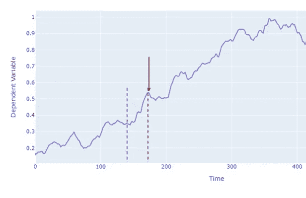
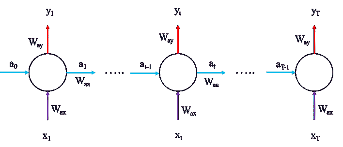
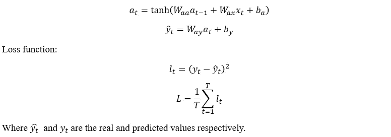
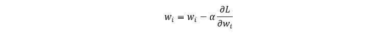
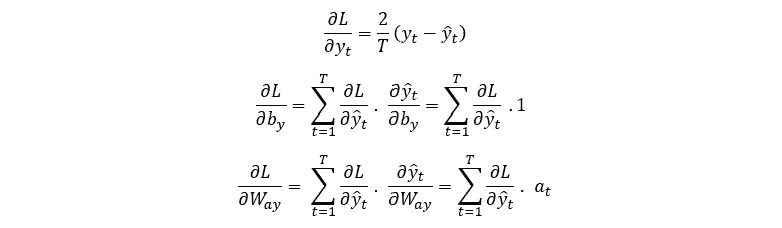
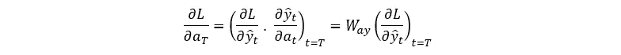
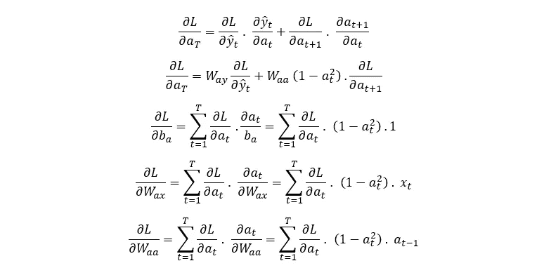
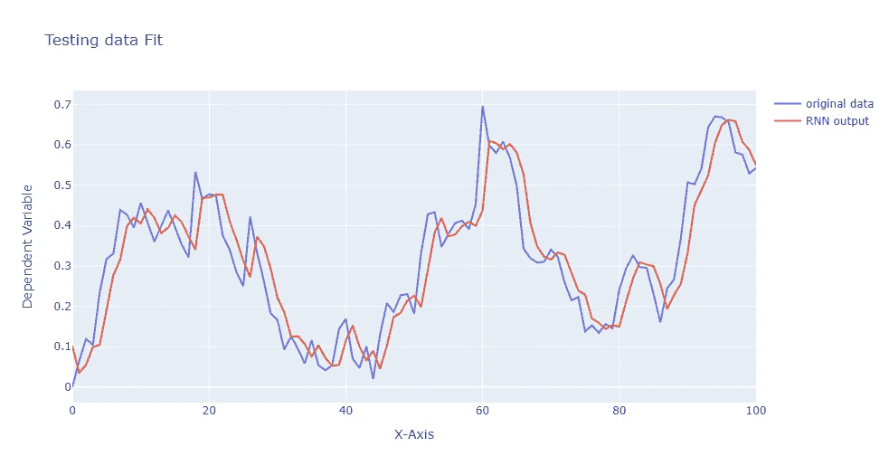

# 时间的构建模块：RNN 的数学基础与 Python 实现

> 原文：[`towardsdatascience.com/building-blocks-of-time-the-mathematical-foundation-and-python-implementation-of-rnns-55f5ef9b108c?source=collection_archive---------3-----------------------#2024-01-20`](https://towardsdatascience.com/building-blocks-of-time-the-mathematical-foundation-and-python-implementation-of-rnns-55f5ef9b108c?source=collection_archive---------3-----------------------#2024-01-20)

[](https://medium.com/@ns650?source=post_page---byline--55f5ef9b108c--------------------------------)[](https://towardsdatascience.com/?source=post_page---byline--55f5ef9b108c--------------------------------) [Najib Sharifi, Ph.D.](https://medium.com/@ns650?source=post_page---byline--55f5ef9b108c--------------------------------)

·发表于[Towards Data Science](https://towardsdatascience.com/?source=post_page---byline--55f5ef9b108c--------------------------------) ·阅读时间：7 分钟·2024 年 1 月 20 日

--

仅仅能够使用流行库构建和训练机器学习模型，对于机器学习用户来说足够吗？可能不久后就不够了。随着像 AutoAI 这样的工具崛起，许多传统的机器学习技能，如使用常见库如 Pytorch 构建模型架构，可能会变得不那么重要。

可能会持续存在的是对具备深厚机器学习（ML）基本原理理解的熟练用户的需求，特别是在那些需要新颖挑战、定制和优化的任务中。为了更具创新性和新颖性，深入理解这些算法的数学基础至关重要。在本文中，我们将研究一个重要模型——循环神经网络（RNN）的数学描述。

时间序列数据（或任何顺序数据，如语言）具有时间依赖性，并广泛应用于各个领域，从天气预测到医学应用。RNN 是一个强大的工具，用于捕捉此类数据中的顺序模式。在本文中，我们将深入探讨 RNN 的数学基础，并使用 Python 从零实现这些方程。

**理解 RNN：数学描述**

序列数据的一个重要元素是时间依赖性，其中过去的值决定了当前和未来的值（就像我们生活在一个预定的世界中，但我们不谈哲学，继续讨论 RNN 模型）。时间序列预测利用了序列数据的这一特性，重点在于根据前 n 个值预测下一个值。根据模型的不同，这包括对过去值的映射或回归。



图 1. 时间序列数据示例

考虑黑箭所指示的点 y 和 y 前面的点（位于红色虚线之间），记作 *X = {x1 , x2 , ….xt …..xT}*，其中 T 是总时间步数。RNN 通过将每个输入传递到隐状态（有时称为记忆状态）来处理输入序列（X），并输出 y。这些隐状态使得模型能够捕捉并记住序列中早期点的模式。



图 2. RNN 模型的示意图，展示了输入、隐状态和输出

现在让我们来看一下 RNN 模型中的数学运算，首先考虑前向传播，模型优化问题稍后再处理。

**前向传播**

前向传播相当直接，如下所示：



**时间反向传播**

在机器学习中，优化（变量更新）是通过梯度下降法进行的：



因此，所有在训练过程中需要更新的参数都需要它们的偏导数。这里我们将推导损失函数对前向传播方程中每个变量的偏导数：



通过注意前向传播方程和图 2 中的网络示意图，我们可以看到，在时间 T 时，L 仅通过 y_T 依赖于 a_T，即：



然而，对于 t < T，L 通过 y_T 和 a_(T+1) 依赖于 a_T，因此我们使用链式法则对两者进行处理：



现在我们得到了损失函数对前向传播方程中所有参数的梯度方程。这种算法称为时间反向传播。需要澄清的是，对于时间序列数据，通常只有最后一个值对损失函数有贡献，即所有其他输出会被忽略，其对损失函数的贡献为 0。数学描述与上述相同。现在让我们用 Python 编写这些方程，并将其应用于一个示例数据集。

**编码实现**

在实现上述方程之前，我们需要导入必要的数据集，进行预处理并准备模型训练。所有这些工作在任何时间序列分析中都是非常标准的。

```py
import numpy as np
import pandas as pd
import matplotlib.pyplot as plt
import plotly.graph_objs as go
from plotly.offline import iplot
import yfinance as yf
import datetime as dt
import math

#### Data Processing
start_date = dt.datetime(2020,4,1)
end_date = dt.datetime(2023,4,1)

#loading from yahoo finance
data = yf.download("GOOGL",start_date, end_date)

pd.set_option('display.max_rows', 4)
pd.set_option('display.max_columns',5)
display(data)

# #Splitting the dataset
training_data_len = math.ceil(len(data) * .8)
train_data = data[:training_data_len].iloc[:,:1]
test_data = data[training_data_len:].iloc[:,:1]

dataset_train = train_data.Open.values
# Reshaping 1D to 2D array
dataset_train = np.reshape(dataset_train, (-1,1))
dataset_train.shape
scaler = MinMaxScaler(feature_range=(0,1))
# scaling dataset
scaled_train = scaler.fit_transform(dataset_train)

dataset_test = test_data.Open.values
dataset_test = np.reshape(dataset_test, (-1,1))
scaled_test = scaler.fit_transform(dataset_test)

X_train = []
y_train = []
for i in range(50, len(scaled_train)):
    X_train.append(scaled_train[i-50:i, 0])
    y_train.append(scaled_train[i, 0])

X_test = []
y_test = []
for i in range(50, len(scaled_test)):
    X_test.append(scaled_test[i-50:i, 0])
    y_test.append(scaled_test[i, 0])

# The data is converted to Numpy array
X_train, y_train = np.array(X_train), np.array(y_train)

#Reshaping
X_train = np.reshape(X_train, (X_train.shape[0], X_train.shape[1],1))
y_train = np.reshape(y_train, (y_train.shape[0],1))
print("X_train :",X_train.shape,"y_train :",y_train.shape)

# The data is converted to numpy array
X_test, y_test = np.array(X_test), np.array(y_test)

#Reshaping
X_test = np.reshape(X_test, (X_test.shape[0], X_test.shape[1],1))
y_test = np.reshape(y_test, (y_test.shape[0],1))
```

**模型** 现在我们实现数学方程式。仔细阅读代码是绝对值得的，注意所有变量和相应导数的维度，以帮助你更好地理解这些方程式。

```py
class SimpleRNN:
    def __init__(self,input_dim,output_dim, hidden_dim):
        self.input_dim = input_dim
        self.output_dim = output_dim
        self.hidden_dim = hidden_dim
        self.Waa = np.random.randn(hidden_dim, hidden_dim) * 0.01 # we initialise as non-zero to help with training later
        self.Wax = np.random.randn(hidden_dim, input_dim) * 0.01
        self.Way = np.random.randn(output_dim, hidden_dim) * 0.01
        self.ba = np.zeros((hidden_dim, 1))
        self.by = 0 # a single value shared over all outputs #np.zeros((hidden_dim, 1))

    def FeedForward(self, x):
        # let's calculate the hidden states
        a = [np.zeros((self.hidden_dim,1))]
        y = []
        for ii in range(len(x)):

            a_next = np.tanh(np.dot(self.Waa, a[ii])+np.dot(self.Wax,x[ii].reshape(-1,1))+self.ba)
            a.append(a_next)
            y_local = np.dot(self.Way,a_next)+self.by
            y.append(np.dot(self.Way,a_next)+self.by)

        # remove the first a and y values used for initialisation
        #a = a[1:]
        return y, a

    def ComputeLossFunction(self, y_pred, y_actual):
        # for a normal many to many model:
        #loss = np.sum((y_pred - y_actual) ** 2)
        # in our case, we are only using the last value so we expect scalar values here rather than a vector
        loss = (y_pred[-1] - y_actual) ** 2
        return loss

    def ComputeGradients(self, a, x, y_pred, y_actual):
        # Backpropagation through time
        dLdy = []
        dLdby = np.zeros((self.output_dim, 1))
        dLdWay = np.random.randn(self.output_dim, self.hidden_dim)/5.0
        dLdWax = np.random.randn(self.hidden_dim, self.input_dim)/5.0
        dLdWaa = np.zeros((self.hidden_dim, self.hidden_dim))
        dLda = np.zeros_like(a)
        dLdba = np.zeros((self.hidden_dim, 1))

        for t in range(self.hidden_dim-1, 0, -1):
            if t == self.hidden_dim-1:
                dldy = 2*(y_pred[t] - y_actual)
            else:
                dldy = 0
            dLdy.append(dldy)
            #dLdby.append(dldy)
            dLdby += dldy
            #print(dldy.shape)
            dLdWay += np.dot(np.array(dldy).reshape(-1,1), a[t].T)

            # Calculate gradient of loss with respect to a[t]
            if t == self.hidden_dim-1:
                dlda_t= np.dot(self.Way.T, np.array(dldy).reshape(-1,1))

            else:
                dlda_t = np.dot(self.Way.T, np.array(dldy).reshape(-1,1)) + np.dot(self.Waa, dLda[t+1]) * (1 - a[t]**2)
            dLda[t] = dlda_t
            #print(dlda_t.shape)

            rec_term = (1-a[t]*a[t])

            dLdWax += np.dot(dlda_t, x[t].reshape(-1,1))*rec_term
            dLdWaa += np.dot(dlda_t, a[t-1].T)*rec_term
            dLdba += dlda_t*rec_term

        return dLdy[::-1], dLdby[::-1], dLdWay, dLdWax, dLdWaa, dLdba

    def UpdateParameters(self,dLdby, dLdWay, dLdWax, dLdWaa, dLdba,learning_rate):
        self.Waa -= learning_rate * dLdWaa
        self.Wax -= learning_rate * dLdWax
        self.Way -= learning_rate * dLdWay
        self.ba -= learning_rate * dLdba
        self.by -= learning_rate * dLdby    

    def predict(self, x, n, a_training):
        # let's calculate the hidden states
        a_future = a_training
        y_predict = []

        # Predict the next n terms
        for ii in range(n):
            a_next = np.tanh(np.dot(self.Waa, a_future[-1]) + np.dot(self.Wax, x[ii]) + self.ba)
            a.append(a_next)
            y_predict.append(np.dot(self.Way, a_next) + self.by)

        return y_predict
```

训练与测试模型

```py
input_dim = 1
output_dim = 1
hidden_dim = 50

learning_rate = 1e-3

# Initialize The RNN model
rnn_model = SimpleRNN(input_dim, output_dim, hidden_dim)

# train the model for 200 epochs

for epoch in range(200):
    for ii in range(len(X_train)):
        y_pred, a = rnn_model.FeedForward(X_train[ii])
        loss = rnn_model.ComputeLossFunction(y_pred, y_train[ii])
        dLdy, dLdby, dLdWay, dLdWax, dLdWaa, dLdba = rnn_model.ComputeGradients(a, X_train[ii], y_pred, y_train[ii])
        rnn_model.UpdateParameters(dLdby, dLdWay, dLdWax, dLdWaa, dLdba, learning_rate)
        print(f'Loss: {loss}')

y_test_predicted = []
for jj in range(len(X_test)):
    forecasted_values, _ = rnn_model.FeedForward(X_test[jj])
    y_test_predicted.append(forecasted_values[-1])

y_test_predicted_flat = np.array([val[0, 0] for val in y_test_predicted])
trace1 = go.Scatter(y = y_test.ravel(), mode ="lines", name = "original data")
trace2 = go.Scatter(y=y_test_predicted_flat, mode = "lines", name = "RNN output")
layout = go.Layout(title='Testing data Fit', xaxis=dict(title='X-Axis'), yaxis=dict(title='Dependent Variable'))
figure = go.Figure(data = [trace1,trace2], layout = layout)

iplot(figure)
```



这就带我们结束了本次演示，但希望这只是你深入阅读这些强大模型的开始。你可以通过尝试在前向传递中使用不同的激活函数来测试你的理解。或者进一步阅读像 LSTM 和 Transformer 这样的顺序模型，它们是非常强大的工具，特别是在与语言相关的任务中。探索这些模型可以加深你对处理时间依赖关系的更复杂机制的理解。最后，感谢你花时间阅读本文，希望它对你理解 RNN 及其数学背景有所帮助。

*除非另有说明，所有图片均由作者提供*
