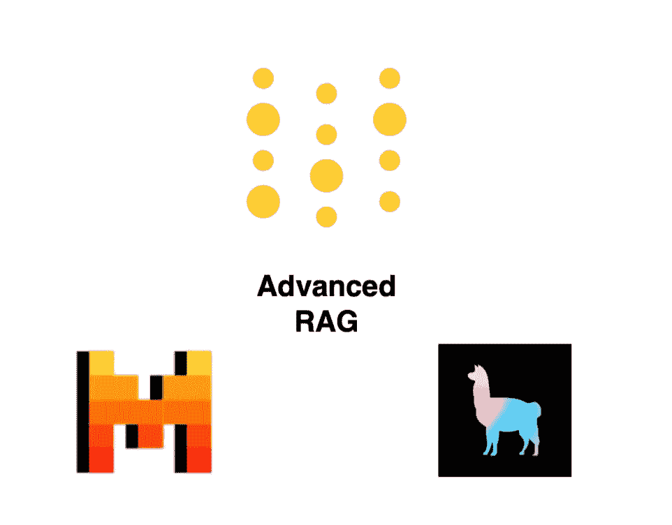

# 构建、评估和跟踪本地高级 RAG 系统 | Mistral 7b + LlamaIndex + W&B

> 原文：[`towardsdatascience.com/building-evaluating-and-tracking-a-local-advanced-rag-system-mistral-7b-llamaindex-w-b-5c9c69059f92?source=collection_archive---------1-----------------------#2024-01-19`](https://towardsdatascience.com/building-evaluating-and-tracking-a-local-advanced-rag-system-mistral-7b-llamaindex-w-b-5c9c69059f92?source=collection_archive---------1-----------------------#2024-01-19)

## 探索如何在计算机上构建高级 RAG 系统。提供完整的、逐步的指南和代码。

 [Nikita Kiselov](https://medium.com/@nikita_kiselov?source=post_page---byline--5c9c69059f92--------------------------------)

·发表于 [Towards Data Science](https://towardsdatascience.com/?source=post_page---byline--5c9c69059f92--------------------------------) ·9 分钟阅读·2024 年 1 月 19 日

--

作者提供的图片 | Mistral + LlamaIndex + W&B

**检索增强生成（RAG）**是一种强大的自然语言处理技术，结合了大语言模型与对知识的选择性访问。它通过提供来自文档的相关上下文片段，帮助减少大语言模型的幻觉。本文的目的是展示如何使用本地运行的大语言模型构建 RAG 系统，介绍哪些技术可以用于改进它，以及如何在 W&B 中跟踪实验并比较结果。

# 引言

我们将涵盖以下关键方面：

1.  使用 Mistral-7b 和 LlamaIndex 构建基准本地 RAG 系统。

1.  **评估**其在*忠实性*和*相关性*方面的表现。

1.  **跟踪**使用 Weights & Biases (W&B)的端到端实验。

1.  实施**高级 RAG**技术，如层次节点和重新排序。

完整的笔记本，包括详细的注释和完整的代码，可以在[GitHub 上查看](https://github.com/kinivi/AlchemyLab/blob/main/Advanced_RAG/Encahnced.ipynb)。

# **🏠 构建本地 RAG 系统**
