# 使用 LLM 图变换器构建知识图谱

> 原文：[`towardsdatascience.com/building-knowledge-graphs-with-llm-graph-transformer-a91045c49b59?source=collection_archive---------0-----------------------#2024-11-05`](https://towardsdatascience.com/building-knowledge-graphs-with-llm-graph-transformer-a91045c49b59?source=collection_archive---------0-----------------------#2024-11-05)

## 深入探讨 LangChain 在使用 LLM 构建图谱方面的实现

[](https://bratanic-tomaz.medium.com/?source=post_page---byline--a91045c49b59--------------------------------)[](https://towardsdatascience.com/?source=post_page---byline--a91045c49b59--------------------------------) [Tomaz Bratanic](https://bratanic-tomaz.medium.com/?source=post_page---byline--a91045c49b59--------------------------------)

·发表于 [Towards Data Science](https://towardsdatascience.com/?source=post_page---byline--a91045c49b59--------------------------------) ·阅读时长 17 分钟·2024 年 11 月 5 日

--


构建知识图谱。图像来自 ChatGPT。

从文本创建图谱令人非常兴奋，但无疑也充满挑战。本质上，这就是将非结构化文本转化为结构化数据。虽然这种方法已经存在一段时间，但随着大型语言模型（LLMs）的出现，它获得了显著的关注，逐渐走向主流。

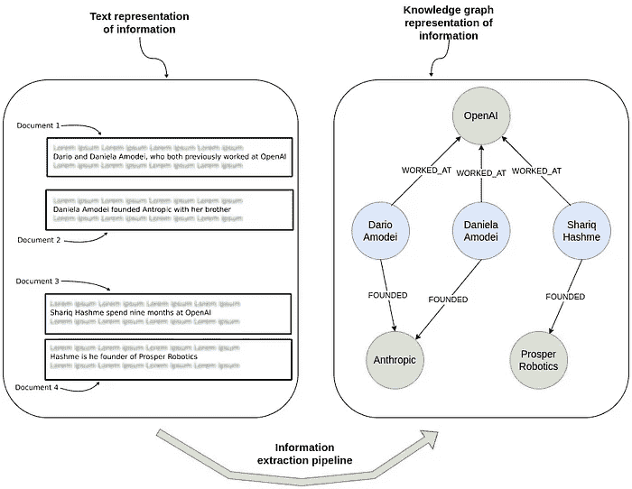

从文本中提取实体和关系来构建知识图谱。图像来自作者。

在上图中，您可以看到信息提取如何将原始文本转换为知识图谱。在左侧，多个文档展示了关于个人及其与公司之间关系的非结构化句子。在右侧，这些相同的信息以图形的形式展示，图中展示了谁曾在或创办了不同的组织。

那么，为什么你想从文本中提取结构化信息并将其表示为图形呢？一个关键原因是为检索增强生成（RAG）应用程序提供支持。虽然在非结构化文本上使用文本嵌入模型是一种有用的方法，但当涉及到回答[复杂的多跳问题](https://medium.com/neo4j/knowledge-graphs-llms-multi-hop-question-answering-322113f53f51)时，它可能不够有效，因为这些问题需要理解多个实体之间的连接，或者问题要求进行[如过滤、排序和聚合](https://medium.com/neo4j/limitations-of-text-embeddings-in-rag-applications-b060020b543b)等结构化操作。通过从文本中提取结构化信息并构建知识图谱，你不仅能更有效地组织数据，还能为理解实体之间的复杂关系创建一个强大的框架。这种结构化的方法使得检索和利用特定信息变得更加容易，从而扩展了你能够回答的问题类型，同时提供更高的准确性。

大约一年前，我开始了[使用 LLM 构建图形的实验](https://medium.com/@bratanic-tomaz/constructing-knowledge-graphs-from-text-using-openai-functions-096a6d010c17)，由于越来越多的兴趣，我们决定将这一功能集成到 LangChain 中，成为[LLM 图形转换器](https://python.langchain.com/docs/how_to/graph_constructing/)。在过去的一年里，我们获得了宝贵的见解并引入了新功能，我们将在这篇博客文章中展示这些内容。

代码可以在[GitHub](https://github.com/tomasonjo/blogs/blob/master/llm/llm_graph_transformer_in_depth.ipynb)上找到。

# 设置 Neo4j 环境

我们将使用 Neo4j 作为底层图形存储，它提供开箱即用的图形可视化。最简单的开始方式是使用免费的[Neo4j Aura](https://neo4j.com/cloud/platform/aura-graph-database/)实例，它提供云实例的 Neo4j 数据库。或者，你也可以通过下载[Neo4j Desktop](https://neo4j.com/download/)应用程序并创建本地数据库实例来设置 Neo4j 数据库的本地实例。

```py
from langchain_community.graphs import Neo4jGraph

graph = Neo4jGraph(
    url="bolt://54.87.130.140:7687",
    username="neo4j",
    password="cables-anchors-directories",
    refresh_schema=False
)
```

# LLM 图形转换器

LLM 图形转换器被设计为提供一个灵活的框架，用于使用任何 LLM 构建图形。由于有如此多不同的提供商和模型可用，这个任务远非简单。幸运的是，LangChain 介入处理了大部分标准化过程。至于 LLM 图形转换器本身，它就像是两只猫堆叠在一件外套里——具有在两种完全独立的模式下操作的能力。

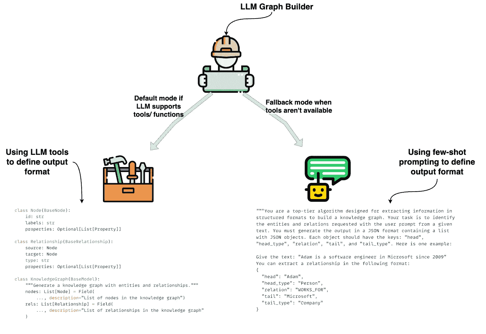

LLM 图形转换器由两种不同的模式组成，用于从文本中提取图形。图片由用户提供。

LLM 图形转换器在两种不同的模式下操作，每种模式都旨在在不同场景下使用 LLM 从文档中生成图形。

1.  **基于工具的模式（默认）：** 当 LLM 支持结构化输出或函数调用时，这种模式利用[LLM 内建的](https://python.langchain.com/docs/how_to/structured_output/)`[with_structured_output](https://python.langchain.com/docs/how_to/structured_output/)`[来使用工具](https://python.langchain.com/docs/how_to/structured_output/)。工具规范定义了输出格式，确保实体和关系以结构化、预定义的方式被提取。这在图像的左侧显示，其中展示了`Node`和`Relationship`类的代码。

1.  **基于提示的模式（回退模式）：** 当 LLM 不支持工具或函数调用时，LLM 图形转换器会回退到纯粹由提示驱动的方法。这种模式使用少量提示来定义输出格式，引导 LLM 以基于文本的方式提取实体和关系。然后，结果会通过一个自定义函数进行解析，该函数将 LLM 的输出转换为 JSON 格式。这个 JSON 会用来填充节点和关系，就像在基于工具的模式中一样，但在这里 LLM 完全由提示引导，而不是通过结构化工具。这在图像的右侧显示，其中提供了一个示例提示和相应的 JSON 输出。

这两种模式确保 LLM 图形转换器可以适应不同的 LLM，使其能够通过工具直接构建图形，或者通过解析基于文本的提示输出构建图形。

*请注意，即使是支持工具/函数的模型，你也可以通过设置属性`*ignore_tools_usage=True*`来使用基于提示的提取。*

## 基于工具的提取

我们最初选择了基于工具的提取方法，因为它减少了大量提示工程和自定义解析函数的需求。在 LangChain 中，`with_structured_output`方法允许你使用工具或函数提取信息，输出可以通过 JSON 结构或 Pydantic 对象来定义。就个人而言，我发现 Pydantic 对象更清晰，因此我们选择了这种方式。

我们首先定义一个`Node`类。

```py
class Node(BaseNode):
    id: str = Field(..., description="Name or human-readable unique identifier")
    label: str = Field(..., description=f"Available options are {enum_values}")
    properties: Optional[List[Property]]
```

每个节点都有一个`id`、一个`label`和可选的`properties`。为了简洁起见，我在这里没有包含详细的描述。描述 ID 作为人类可读的唯一标识符很重要，因为一些大型语言模型（LLMs）往往以更传统的方式理解 ID 属性，例如随机字符串或递增的整数。而我们希望实体的名称作为 ID 属性来使用。我们还通过在`label`描述中简单列出可用的标签类型来限制可用的标签类型。此外，像 OpenAI 这样的 LLM 支持`enum`参数，我们也在使用这个参数。

接下来，我们来看一下`Relationship`类。

```py
class Relationship(BaseRelationship):
    source_node_id: str
    source_node_label: str = Field(..., description=f"Available options are {enum_values}")
    target_node_id: str
    target_node_label: str = Field(..., description=f"Available options are {enum_values}")
    type: str = Field(..., description=f"Available options are {enum_values}")
    properties: Optional[List[Property]]
```

这是`Relationship`类的第二次迭代。最初，我们使用嵌套的`Node`对象表示源节点和目标节点，但我们很快发现嵌套对象降低了提取过程的准确性和质量。因此，我们决定将源节点和目标节点平铺为独立的字段——例如，`source_node_id`和`source_node_label`，以及`target_node_id`和`target_node_label`。此外，我们在节点标签和关系类型的描述中定义了允许的值，以确保 LLM 遵守指定的图形模式。

基于工具的提取方法使我们能够为节点和关系定义属性。以下是我们用来定义这些属性的类。

```py
class Property(BaseModel):
    """A single property consisting of key and value"""
    key: str = Field(..., description=f"Available options are {enum_values}")
    value: str
```

每个`Property`都被定义为一个键值对。虽然这种方法很灵活，但也有其局限性。例如，我们不能为每个属性提供独特的描述，也不能指定某些属性为必填项而其他为可选项，因此所有属性都被定义为可选。此外，属性并不是为每种节点或关系类型单独定义的，而是共享的。

我们还实现了一个[详细的系统提示](https://github.com/langchain-ai/langchain-experimental/blob/main/libs/experimental/langchain_experimental/graph_transformers/llm.py#L72)，帮助指导提取过程。不过根据我的经验，功能和参数描述往往比系统消息更具影响力。

不幸的是，目前没有简单的方法来定制 LLM 图形变换器中的功能或参数描述。

## 基于提示的提取

由于只有少数商业化的 LLM 和 LLaMA 3 支持本地工具，我们为不支持工具的模型实现了回退机制。即使使用支持工具的模型，你也可以设置`ignore_tool_usage=True`来切换到基于提示的方法。

大部分基于提示方法的提示工程和示例由[Geraldus Wilsen](https://www.linkedin.com/in/geraldus-wilsen/)贡献。

在基于提示的方法中，我们必须直接在提示中定义输出结构。你可以在[这里找到完整的提示](https://github.com/langchain-ai/langchain-experimental/blob/main/libs/experimental/langchain_experimental/graph_transformers/llm.py#L206)。在这篇博客文章中，我们将做一个高层次的概述。我们从定义系统提示开始。

```py
You are a top-tier algorithm designed for extracting information in structured formats to build a knowledge graph. Your task is to identify the entities and relations specified in the user prompt from a given text and produce the output in JSON format. This output should be a list of JSON objects, with each object containing the following keys:

- **"head"**: The text of the extracted entity, which must match one of the types specified in the user prompt.
- **"head_type"**: The type of the extracted head entity, selected from the specified list of types.
- **"relation"**: The type of relation between the "head" and the "tail," chosen from the list of allowed relations.
- **"tail"**: The text of the entity representing the tail of the relation.
- **"tail_type"**: The type of the tail entity, also selected from the provided list of types.

Extract as many entities and relationships as possible. 

**Entity Consistency**: Ensure consistency in entity representation. If an entity, like "John Doe," appears multiple times in the text under different names or pronouns (e.g., "Joe," "he"), use the most complete identifier consistently. This consistency is essential for creating a coherent and easily understandable knowledge graph.

**Important Notes**:
- Do not add any extra explanations or text.
```

在基于提示的方法中，一个关键区别是我们要求 LLM 仅提取关系，而不是单独的节点。这意味着我们不会有任何*孤立节点*，与基于工具的方法不同。此外，由于缺乏本地工具支持的模型通常表现较差，我们不允许提取任何属性——无论是节点还是关系，以保持提取结果的简洁性。

接下来，我们向模型添加了一些少量示例。

```py
examples = [
    {
        "text": (
            "Adam is a software engineer in Microsoft since 2009, "
            "and last year he got an award as the Best Talent"
        ),
        "head": "Adam",
        "head_type": "Person",
        "relation": "WORKS_FOR",
        "tail": "Microsoft",
        "tail_type": "Company",
    },
    {
        "text": (
            "Adam is a software engineer in Microsoft since 2009, "
            "and last year he got an award as the Best Talent"
        ),
        "head": "Adam",
        "head_type": "Person",
        "relation": "HAS_AWARD",
        "tail": "Best Talent",
        "tail_type": "Award",
    },
...
]
```

在这种方法中，目前不支持添加自定义的少量示例或额外指令。唯一的定制方式是通过 `prompt` 属性修改整个提示。扩展定制选项是我们正在积极考虑的事项。

接下来，我们将看看如何定义图谱架构。

# 定义图谱架构

在使用 LLM 图谱转换器进行信息提取时，定义图谱架构对于指导模型构建有意义且结构化的知识表示至关重要。一个明确定义的图谱架构指定了要提取的节点和关系的类型，以及与每个节点或关系相关的任何属性。这个架构作为蓝图，确保 LLM 始终以符合预期知识图谱结构的方式提取相关信息。

在这篇博文中，我们将使用[玛丽·居里维基百科页面](https://en.wikipedia.org/wiki/Marie_Curie)的开头段落进行测试，并在末尾添加一段关于罗宾·威廉姆斯的句子。

```py
from langchain_core.documents import Document

text = """
Marie Curie, 7 November 1867 – 4 July 1934, was a Polish and naturalised-French physicist and chemist who conducted pioneering research on radioactivity.
She was the first woman to win a Nobel Prize, the first person to win a Nobel Prize twice, and the only person to win a Nobel Prize in two scientific fields.
Her husband, Pierre Curie, was a co-winner of her first Nobel Prize, making them the first-ever married couple to win the Nobel Prize and launching the Curie family legacy of five Nobel Prizes.
She was, in 1906, the first woman to become a professor at the University of Paris.
Also, Robin Williams.
"""
documents = [Document(page_content=text)]
```

在所有示例中，我们还将使用 GPT-4o。

```py
from langchain_openai import ChatOpenAI
import getpass
import os

os.environ["OPENAI_API_KEY"] = getpass.getpass("OpenAI api key")

llm = ChatOpenAI(model='gpt-4o')
```

首先，让我们看看在没有定义任何图谱架构的情况下，提取过程是如何工作的。

```py
from langchain_experimental.graph_transformers import LLMGraphTransformer

no_schema = LLMGraphTransformer(llm=llm)
```

现在我们可以使用 `aconvert_to_graph_documents` 函数处理文档，该函数是异步的。推荐在 LLM 提取中使用异步方式，因为它允许并行处理多个文档。这种方法可以显著减少等待时间并提高吞吐量，尤其是在处理多个文档时。

```py
data = await no_schema.aconvert_to_graph_documents(documents)
```

LLM 图谱转换器的响应将是一个图谱文档，其结构如下：

```py
[
    GraphDocument(
        nodes=[
            Node(id="Marie Curie", type="Person", properties={}),
            Node(id="Pierre Curie", type="Person", properties={}),
            Node(id="Nobel Prize", type="Award", properties={}),
            Node(id="University Of Paris", type="Organization", properties={}),
            Node(id="Robin Williams", type="Person", properties={}),
        ],
        relationships=[
            Relationship(
                source=Node(id="Marie Curie", type="Person", properties={}),
                target=Node(id="Nobel Prize", type="Award", properties={}),
                type="WON",
                properties={},
            ),
            Relationship(
                source=Node(id="Marie Curie", type="Person", properties={}),
                target=Node(id="Nobel Prize", type="Award", properties={}),
                type="WON",
                properties={},
            ),
            Relationship(
                source=Node(id="Marie Curie", type="Person", properties={}),
                target=Node(
                    id="University Of Paris", type="Organization", properties={}
                ),
                type="PROFESSOR",
                properties={},
            ),
            Relationship(
                source=Node(id="Pierre Curie", type="Person", properties={}),
                target=Node(id="Nobel Prize", type="Award", properties={}),
                type="WON",
                properties={},
            ),
        ],
        source=Document(
            metadata={"id": "de3c93515e135ac0e47ca82a4f9b82d8"},
            page_content="\nMarie Curie, 7 November 1867 – 4 July 1934, was a Polish and naturalised-French physicist and chemist who conducted pioneering research on radioactivity.\nShe was the first woman to win a Nobel Prize, the first person to win a Nobel Prize twice, and the only person to win a Nobel Prize in two scientific fields.\nHer husband, Pierre Curie, was a co-winner of her first Nobel Prize, making them the first-ever married couple to win the Nobel Prize and launching the Curie family legacy of five Nobel Prizes.\nShe was, in 1906, the first woman to become a professor at the University of Paris.\nAlso, Robin Williams!\n",
        ),
    )
]
```

图谱文档描述了提取的 `节点` 和 `关系`。此外，提取的源文档会添加在 `source` 键下。

我们可以使用 Neo4j 浏览器来可视化输出，从而更清晰、更直观地理解数据。

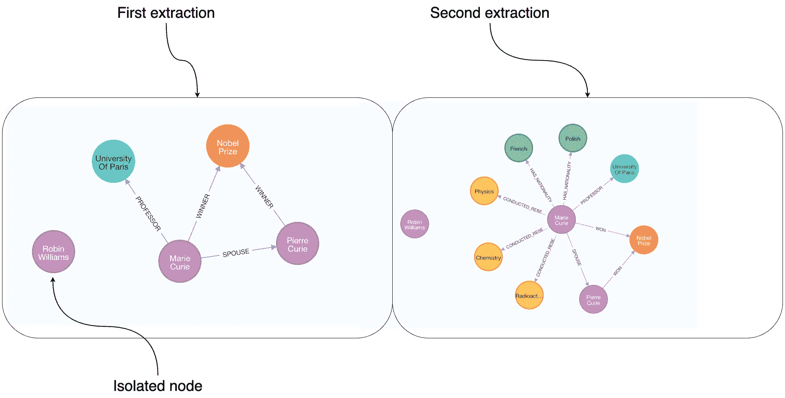

没有定义图谱架构的情况下，对同一数据集进行两次提取的可视化。图片来自作者。

上面的图片显示了两次提取同一段关于玛丽·居里的段落。在这种情况下，我们使用了 GPT-4 和基于工具的提取方法，这也允许存在孤立的节点，如图中所示。由于没有定义图谱架构，LLM 在运行时决定提取哪些信息，这可能导致输出的变化，即使是同一段落。因此，有些提取比其他的更详细，结构也可能有所不同，即使是相同的信息。例如，在左侧，玛丽被表示为诺贝尔奖的`获奖者`，而在右侧，她被表示为`赢得`了诺贝尔奖。

现在，让我们尝试使用基于提示的方法进行相同的提取。对于支持工具的模型，可以通过设置 `ignore_tool_usage` 参数来启用基于提示的提取。

```py
no_schema_prompt = LLMGraphTransformer(llm=llm, ignore_tool_usage=True)
data = await no_schema.aconvert_to_graph_documents(documents)
```

同样，我们可以在 Neo4j 浏览器中可视化两次独立的执行。

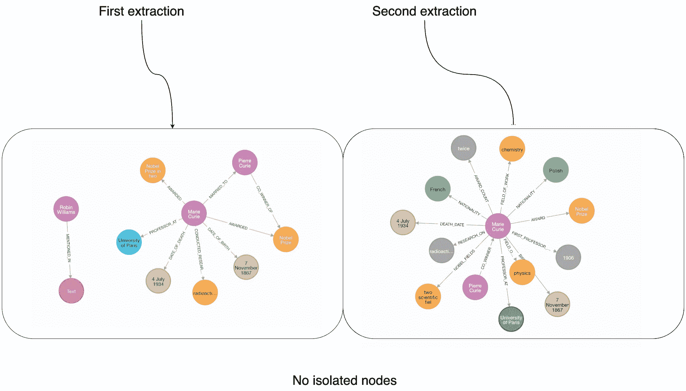

使用基于提示的方法，在没有定义图模式的情况下对相同数据集进行两次提取的可视化。图像来源：作者。

采用基于提示的方法，我们不会看到任何孤立的节点。然而，与之前的提取一样，模式在每次运行之间可能会有所不同，导致相同输入的输出结果不同。

接下来，让我们逐步了解如何通过定义图模式来帮助产生更一致的输出。

## 定义允许的节点

限制提取的图结构可以非常有益，因为它指导模型聚焦于特定的相关实体和关系。通过定义一个明确的模式，你可以提高提取的一致性，使输出结果更加可预测，并与实际需要的信息对齐。这减少了不同运行之间的变异性，确保提取的数据遵循标准化结构，捕捉预期的信息。通过一个明确的模式，模型不太可能忽视关键细节或引入意外元素，从而生成更清晰、更易用的图。

我们将从使用`allowed_nodes`参数定义预期的节点类型开始。

```py
allowed_nodes = ["Person", "Organization", "Location", "Award", "ResearchField"]
nodes_defined = LLMGraphTransformer(llm=llm, allowed_nodes=allowed_nodes)
data = await allowed_nodes.aconvert_to_graph_documents(documents)
```

在这里，我们定义了 LLM 应提取五种类型的节点，如*人*、*组织*、*地点*等。我们在 Neo4j 浏览器中可视化了两次独立的执行结果以进行比较。

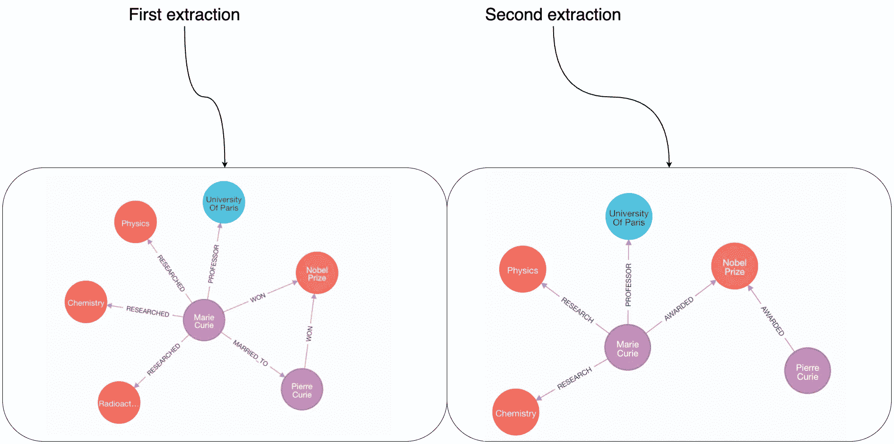

使用预定义的节点类型进行两次提取的可视化。图像来源：作者。

通过指定预期的节点类型，我们实现了更一致的节点提取。然而，仍然可能会出现一些变化。例如，在第一次运行中，“放射性”被提取为研究领域，而在第二次运行中则没有。

由于我们没有定义关系，因此它们的类型也可能在不同的运行中有所不同。此外，一些提取可能比其他提取捕获更多的信息。例如，Marie 和 Pierre 之间的`MARRIED_TO`关系在两次提取中都没有出现。

现在，让我们探索如何通过定义关系类型来进一步提高一致性。

## 定义允许的关系

正如我们所观察到的，仅定义节点类型仍然会导致关系提取的变化。为了解决这个问题，让我们探讨如何定义关系。第一种方法是通过列出可用类型来指定允许的关系。

```py
allowed_nodes = ["Person", "Organization", "Location", "Award", "ResearchField"]
allowed_relationships = ["SPOUSE", "AWARD", "FIELD_OF_RESEARCH", "WORKS_AT", "IN_LOCATION"]
rels_defined = LLMGraphTransformer(
  llm=llm, 
  allowed_nodes=allowed_nodes,
  allowed_relationships=allowed_relationships
)
data = await rels_defined.aconvert_to_graph_documents(documents)
```

让我们再次检查两次独立的提取。

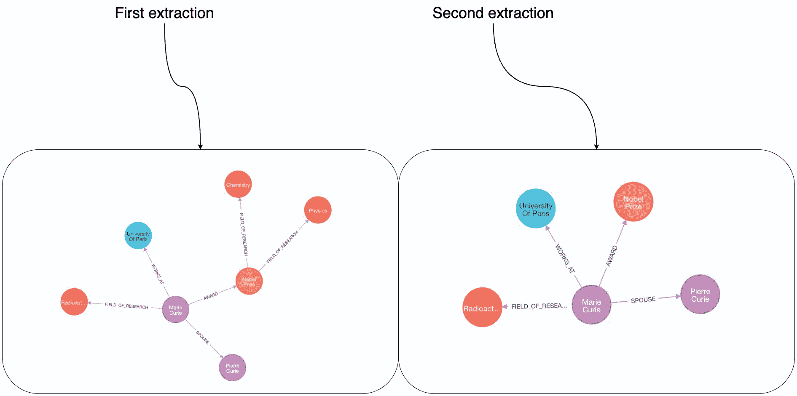

使用预定义的节点和关系类型进行两次提取的可视化。图像来源：作者。

在定义了节点和关系后，我们的输出变得更加一致。例如，玛丽总是被显示为获奖者、皮埃尔的配偶，以及巴黎大学的工作人员。然而，由于关系被指定为一般列表，并未限制可以连接的节点，因此仍然会出现一些变化。例如，`FIELD_OF_RESEARCH`关系可能出现在`Person`和`ResearchField`之间，但有时它也会将`Award`与`ResearchField`连接。此外，由于关系的方向尚未定义，方向一致性可能会有所不同。

为了解决无法指定关系可以连接哪些节点以及强制关系方向的问题，我们最近引入了一个新的选项来定义关系，如下所示。

```py
allowed_nodes = ["Person", "Organization", "Location", "Award", "ResearchField"]
allowed_relationships = [
    ("Person", "SPOUSE", "Person"),
    ("Person", "AWARD", "Award"),
    ("Person", "WORKS_AT", "Organization"),
    ("Organization", "IN_LOCATION", "Location"),
    ("Person", "FIELD_OF_RESEARCH", "ResearchField")
]
rels_defined = LLMGraphTransformer(
  llm=llm, 
  allowed_nodes=allowed_nodes,
  allowed_relationships=allowed_relationships
)
data = await rels_defined.aconvert_to_graph_documents(documents)
```

我们现在不再将关系定义为简单的字符串列表，而是使用三元素元组格式，其中元素分别代表源节点、关系类型和目标节点。

让我们再次可视化结果。

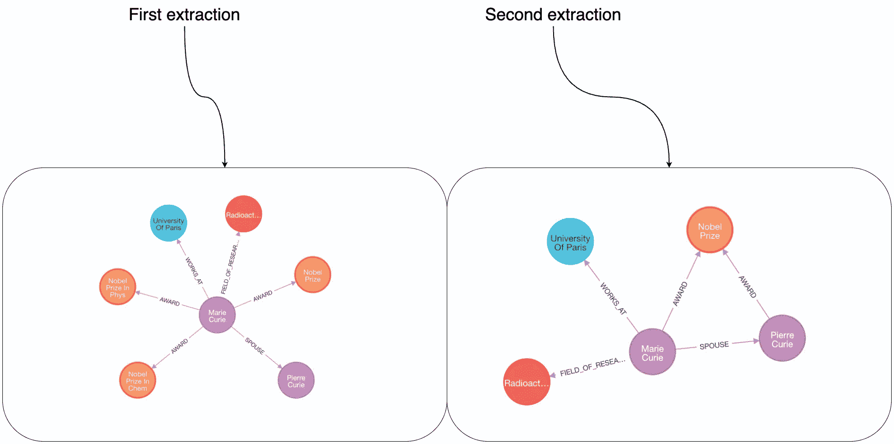

使用预定义节点和高级关系类型的两次提取过程的可视化。图像来自作者。

使用三元组方法提供了一个更加一致的图谱模式，适用于多次执行的提取。然而，由于 LLM 的特性，提取的细节层次仍可能存在一些差异。例如，在右侧，皮埃尔被显示为获奖，而左侧则缺少这条信息。

## 定义属性

我们可以对图谱模式做的最后一个增强是为节点和关系定义属性。在这里，我们有两个选择。第一个是设置`node_properties`或`relationship_properties`为`true`，允许 LLM 自主决定提取哪些属性。

```py
allowed_nodes = ["Person", "Organization", "Location", "Award", "ResearchField"]
allowed_relationships = [
    ("Person", "SPOUSE", "Person"),
    ("Person", "AWARD", "Award"),
    ("Person", "WORKS_AT", "Organization"),
    ("Organization", "IN_LOCATION", "Location"),
    ("Person", "FIELD_OF_RESEARCH", "ResearchField")
]
node_properties=True
relationship_properties=True
props_defined = LLMGraphTransformer(
  llm=llm, 
  allowed_nodes=allowed_nodes,
  allowed_relationships=allowed_relationships,
  node_properties=node_properties,
  relationship_properties=relationship_properties
)
data = await props_defined.aconvert_to_graph_documents(documents)
graph.add_graph_documents(data)
```

让我们检查一下结果。

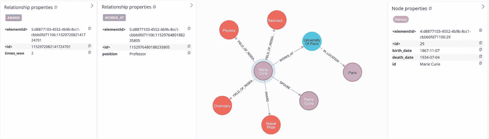

提取的节点和关系属性。图像来自作者。

我们已经允许 LLM 添加它认为相关的任何节点或关系属性。例如，它选择包括玛丽·居里的出生和死亡日期、她在巴黎大学担任教授的身份，以及她两次获得诺贝尔奖的事实。这些附加属性显著丰富了提取的信息。

我们的第二个选择是定义我们想要提取的节点和关系属性。

```py
allowed_nodes = ["Person", "Organization", "Location", "Award", "ResearchField"]
allowed_relationships = [
    ("Person", "SPOUSE", "Person"),
    ("Person", "AWARD", "Award"),
    ("Person", "WORKS_AT", "Organization"),
    ("Organization", "IN_LOCATION", "Location"),
    ("Person", "FIELD_OF_RESEARCH", "ResearchField")
]
node_properties=["birth_date", "death_date"]
relationship_properties=["start_date"]
props_defined = LLMGraphTransformer(
  llm=llm, 
  allowed_nodes=allowed_nodes,
  allowed_relationships=allowed_relationships,
  node_properties=node_properties,
  relationship_properties=relationship_properties
)
data = await props_defined.aconvert_to_graph_documents(documents)
graph.add_graph_documents(data)
```

属性仅仅是通过两个列表来定义的。让我们看看 LLM 提取了什么。

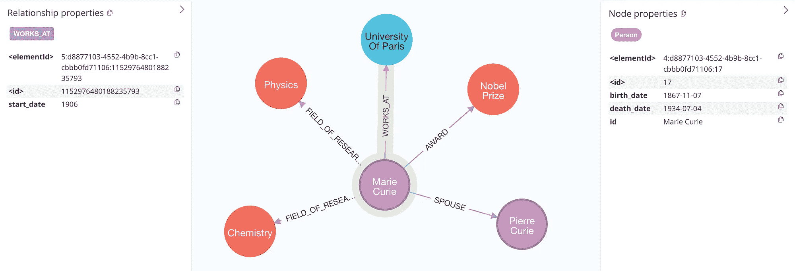

提取的预定义节点和关系属性。图像来自作者。

出生和死亡日期与先前的提取结果一致。然而，这一次，LLM 还提取了玛丽在巴黎大学担任教授的起始日期。

属性确实为提取的信息增加了有价值的深度，尽管目前这种实现存在一些限制：

+   属性只能通过基于工具的方法进行提取。

+   所有属性都作为字符串提取。

+   属性只能全局定义，而不能按节点标签或关系类型定义。

+   没有选项可以自定义属性描述，以指导 LLM 进行更精确的提取。

## 严格模式

如果您认为我们已经完善了一种方法，让 LLM 完美遵循定义的模式，我必须澄清一下。尽管我们在提示工程上投入了相当多的努力，但要让 LLM，尤其是性能较差的 LLM，完全准确地遵循指令是具有挑战性的。为了解决这个问题，我们引入了一个后处理步骤，称为`strict_mode`，它会去除任何不符合定义图模式的信息，从而确保更清洁、更一致的结果。

默认情况下，`strict_mode`设置为`True`，但您可以使用以下代码禁用它：

```py
LLMGraphTransformer(
  llm=llm, 
  allowed_nodes=allowed_nodes,
  allowed_relationships=allowed_relationships,
  strict_mode=False
)
```

在关闭严格模式的情况下，您可能会遇到图模式之外的节点或关系类型，因为 LLM 有时会在输出结构上采取创造性自由。

# 将图文档导入图数据库

从 LLM 图转换器中提取的图文档可以使用`add_graph_documents`方法导入到像 Neo4j 这样的图数据库中，以便进行进一步的分析和应用。我们将探讨不同的导入选项，以适应不同的使用场景。

## **默认导入**

您可以使用以下代码将节点和关系导入到 Neo4j 中。

```py
graph.add_graph_documents(graph_documents)
```

该方法直接将所有节点和关系从提供的图文档导入。我们在整篇博客中使用了这种方法，以回顾不同 LLM 和模式配置的结果。

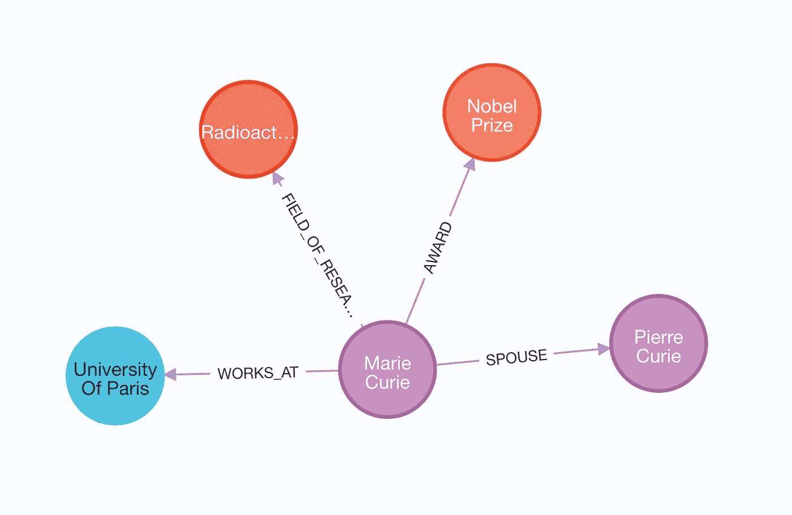

默认导入设置。图片由作者提供。

## 基础实体标签

大多数图数据库支持索引，以优化数据的导入和检索。在 Neo4j 中，索引只能为特定的节点标签设置。由于我们可能无法提前知道所有的节点标签，我们可以通过使用`baseEntityLabel`参数为每个节点添加一个次级基础标签来处理这个问题。这样，我们仍然可以利用索引来实现高效的导入和检索，而不需要为图中每个可能的节点标签设置索引。

```py
graph.add_graph_documents(graph_documents, baseEntityLabel=True)
```

如前所述，使用`baseEntityLabel`参数会导致每个节点拥有额外的`__Entity__`标签。

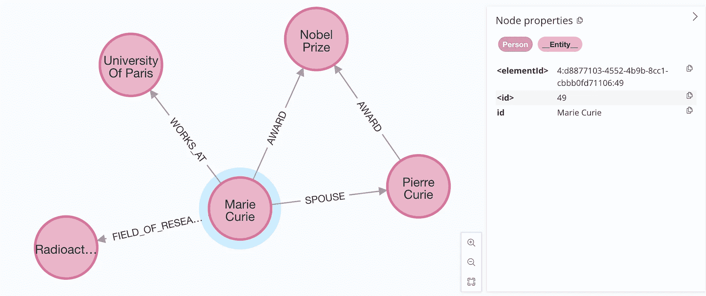

每个节点都使用`baseEntityLabel`参数获得一个次级标签。图片由作者提供。

## 包含源文档

最后的选项是同时导入提取节点和关系的源文档。这种方法让我们能够追踪每个实体出现在哪些文档中。您可以使用`include_source`参数导入源文档。

```py
graph.add_graph_documents(graph_documents, include_source=True)
```

在检查导入的图时，我们应该看到类似以下的结果。

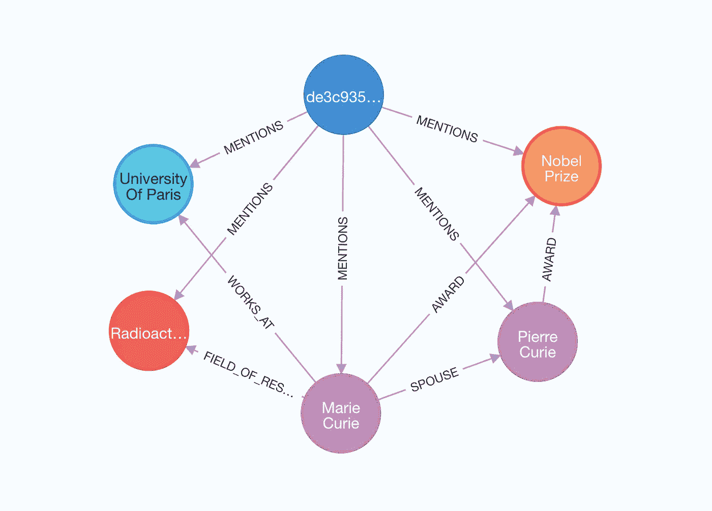

导入的源文档。图片由作者提供。

在这个可视化中，源文档被蓝色高亮显示，所有从中提取的实体通过 `MENTIONS` 关系连接。这种模式允许你构建[利用结构化和非结构化搜索方法的检索器](https://medium.com/neo4j/enhancing-the-accuracy-of-rag-applications-with-knowledge-graphs-ad5e2ffab663)。

# 总结

在这篇文章中，我们探讨了 LangChain 的 LLM 图谱转换器及其两种构建知识图谱的模式。基于工具的模式是我们主要的方法，它利用结构化输出和函数调用，减少了提示词工程，并允许提取属性。与此同时，当没有工具可用时，基于提示的模式通过少量示例来引导 LLM，尽管基于提示的提取不支持属性提取，也不会生成孤立节点。

我们观察到，定义一个清晰的图谱模式，包括允许的节点和关系类型，有助于提高提取的一致性和性能。受限的模式有助于确保输出符合我们期望的结构，使其更加可预测、可靠和适用。无论是使用工具还是提示，LLM 图谱转换器都能实现对非结构化数据的更有组织、结构化的表示，从而促进更好的 RAG 应用和多跳查询处理。

代码可以在 [GitHub](https://github.com/tomasonjo/blogs/blob/master/llm/llm_graph_transformer_in_depth.ipynb) 上找到。你还可以在一个无代码环境中尝试使用 Neo4j 提供的**LLM 图谱构建器**应用程序。

[## Neo4j 图谱构建器

### 无代码

llm-graph-builder.neo4jlabs.com](https://llm-graph-builder.neo4jlabs.com/?source=post_page-----a91045c49b59--------------------------------)
