# 使用 Python 进行商业规划 — 库存与现金流管理

> 原文：[`towardsdatascience.com/business-planning-with-python-inventory-and-cash-flow-management-4f9beb7ecbec?source=collection_archive---------1-----------------------#2024-06-05`](https://towardsdatascience.com/business-planning-with-python-inventory-and-cash-flow-management-4f9beb7ecbec?source=collection_archive---------1-----------------------#2024-06-05)

## 小型企业的商业规划，利用数据管理库存、预测流动性需求并最大化盈利。

[](https://s-saci95.medium.com/?source=post_page---byline--4f9beb7ecbec--------------------------------)[](https://towardsdatascience.com/?source=post_page---byline--4f9beb7ecbec--------------------------------) [Samir Saci](https://s-saci95.medium.com/?source=post_page---byline--4f9beb7ecbec--------------------------------)

·发布于 [Towards Data Science](https://towardsdatascience.com/?source=post_page---byline--4f9beb7ecbec--------------------------------) ·阅读时间 13 分钟·2024 年 6 月 5 日

--

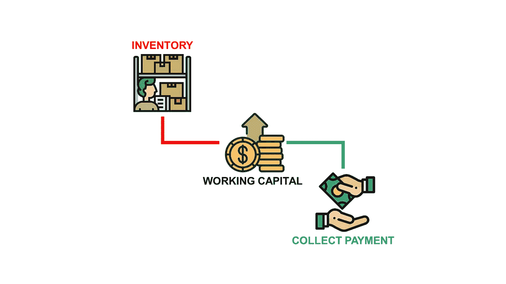

使用 Python 进行商业规划 — （图像由作者提供）

现金流管理可以定义为监控和优化现金收入减去现金支出的净额的过程。

在与一位管理中型企业的朋友交谈后，我发现现金可能是增长的最大瓶颈。

> “我们必须拒绝订单，因为我们没有足够的现金支付供应商的库存补充款项。”

作为一名供应链数据科学家，我迅速将这个问题与采购、库存管理和分销规划联系起来。

> 我们能否开发一个 Python 模型来模拟财务和商品流，以支持商业规划？

在本文中，我将分享使用 Python 构建这个问题简单商业建模的方法和工具。

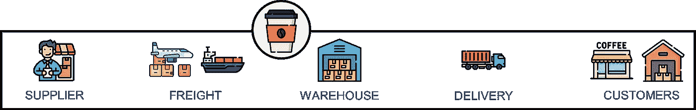

我朋友的商业模型 — （图像由作者提供）

我们将以我朋友的小企业为例。他们将由可再生材料制成的杯子销售给咖啡店和经销商。

```py
Summary

I. Problem Statement: Business Planning
How to use business analytics to help a company selling renewable coffee cups?
  1\. Inventory Management Simulation
Implement an inventory management rule to meet customers' demand.
  2\. Financial Analysis: Costs & Revenue
Map all the financial flows covering costs and revenue along the year.
  3\. Cash Flow Simulation
How much cash on hand you have on a weekly basis to run your business?
II. Business Planning Optimization
What can we do to solve liquidity and profitability issues?
  1\. Scenario 1: Order Quantity Optimization
What if we reduce the order quantity from 8 weeks to 6 weeks coverage.
  2\. Scenario 2: Air Freight for Inbound Logistics
What if we cut the replenishment leadtime by using air freight?
  3\. Scenario 3: Sales Channel Optimization
What if we overpass sales representive by selling to distributors?
  4\. The Optimal Scenario
Let's combine the two best options.
III. Conclusion
  1\. Improve the model
Let's see the potential improvements we can bring in the model
  2\. Revenue optimization
Next step is to focus on the pricing strategy to maximize revenue.
  3\. Sustainable Business with Data Analytics
What about the environmental impact of this business?
```

# 问题陈述：商业规划

本部分将简要介绍我收集的元素，帮助你理解我朋友的商业模型。

这些要点包括

+   **库存管理**：订单、接收、存储和交付产品

    *❓ 我们什么时候需要下订单以满足客户需求？*

+   **财务**：成本和收入流

    *💡 利润与亏损分析，每周分析。*

+   **商业**：销售渠道、服务水平协议和佣金

    *❔ 如果我们销售给 XXX，会赚多少利润？*

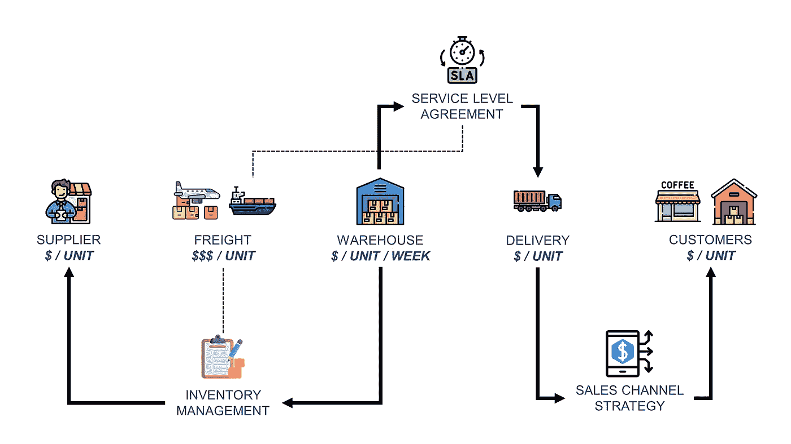

整体商业模型——（图片由作者提供）

我们将对这些元素进行建模，了解**它们之间的互动关系**，并**优化整体价值链**。

## 库存管理模拟

首先，我们将在模型核心实施一个**库存管理规则**，以最低的成本满足客户需求。

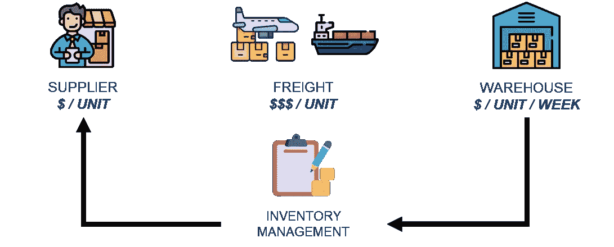

库存管理模块——（图片由作者提供）

库存管理规则是机器中的一个关键环节，因为

+   库存可能成为**商业增长的瓶颈** *你无法发货如果你没有现货。*

+   补货能力**受限于你的财务状况** *你需要**现有现金来支付订单。*

+   *战略决策会影响你管理库存的方式。*

    例如，运输（空运、海运）交货时间会影响库存的安全性。*

本模块基于客户需求、交货时间和安全库存参数生成补货订单。

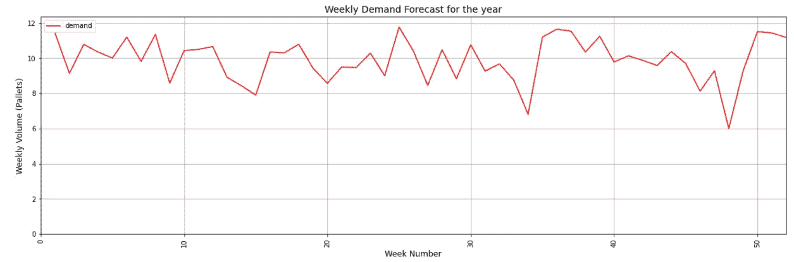

2023 年托盘的历史销售——（图片由作者提供）

在这个练习中，我使用了**2023 年的历史销售数据**来模拟最优库存管理的情况。

> “我们会持续检查库存，并希望每个订单至少覆盖 8 周。”

为了回答这个问题，我们引入一个**持续审查政策（s, Q）**

+   **持续审查**意味着库存团队将每天检查库存水平。

+   （s, Q）如果库存水平低于某一水平 s **（托盘）**，则必须订购 **Q（托盘）**。

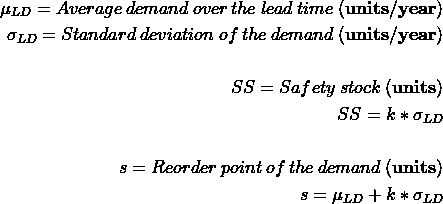

基于安全库存定义再订货点——（图片由作者提供）

再订货**点是**你需要的库存水平，以满足客户的需求，直到你收到货物。

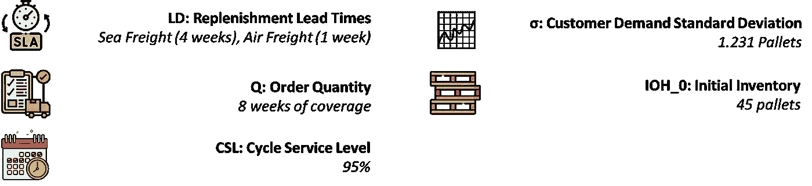

库存管理参数——（图片由作者提供）

我们通过**补货提前期**、**目标周期服务水平**和**客户需求的标准差**来定义它。

> 我不会详细讨论这部分内容，因为它不是文章的重点。
> 
> 如需更多详细信息，请查看下面链接的文章 👇，

[](/inventory-management-for-retail-stochastic-demand-3020a43d1c14?source=post_page-----4f9beb7ecbec--------------------------------) ## 零售库存管理 — 随机需求

### 模拟安全库存水平对库存管理绩效指标的影响，假设其符合正态分布…

[towardsdatascience.com

结果如下图所示。

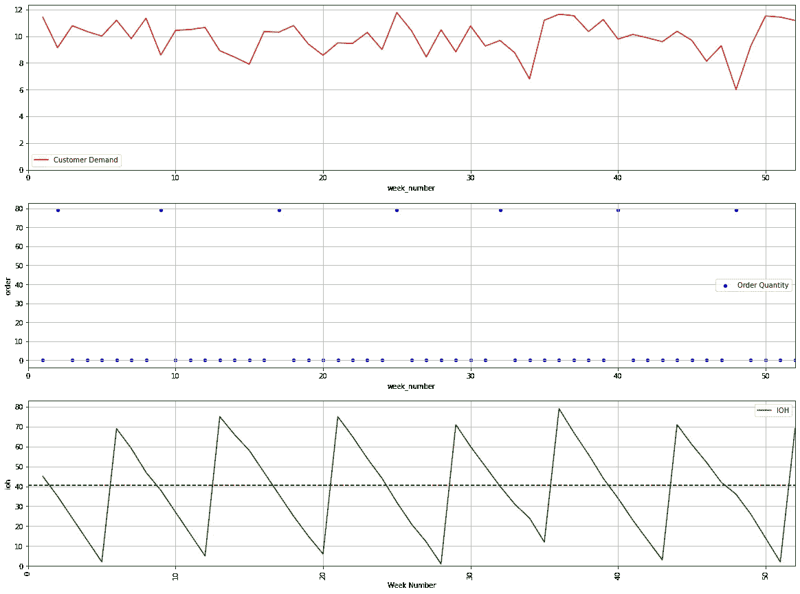

**库存管理规则**——（图片由作者提供）

**📈 图例**

+   蓝色散点图代表**最佳订货政策**。

+   绿色图表是**现有库存**（ioh），即仓库中存储的托盘数量。

+   第三个图表中的虚线表示**重新订购点 s**。

你可以观察到，当手头库存穿过虚线时，你就有了**补货订单**。

**💡 观察**

+   我不确定这个政策是否最优。

    *我们只是将我朋友的标准操作模型转化为算法。*

+   我们记得，订单数量和补货提前期可以调节，以最小化库存。

既然我们知道了何时重新订购，我们可以加入财务流动来可视化**手头现金**。

## 财务分析：成本与收入

上一节从物流角度描述了业务，而没有考虑财务流动。

但我朋友的主要问题是**可用流动资金有限**，无法订购商品以补充库存。

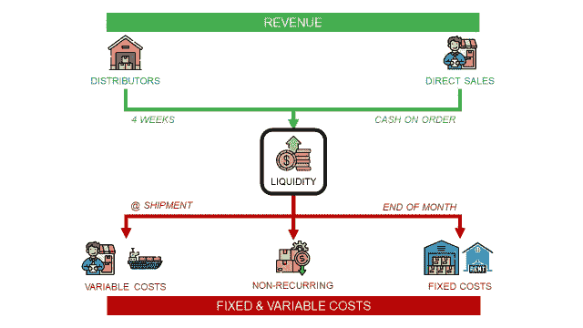

因此，我们将**映射财务流动**，以计算每周可用的现金。

**收入** 历史销售按销售渠道进行分配

+   **分销商在发货后 4 周付款。**

    *每笔销售后的 4 周，他们会收到开具发票的金额（单价 x 数量）*

+   **咖啡店在下订单时付款。**

    *在每周结束时，他们会收到开具发票的金额（单价 x 数量）*

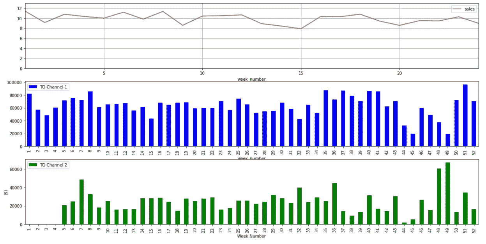

按渠道的收入流（蓝色：咖啡店 / 绿色：分销商） — （图片由作者提供）

**💡 观察**

由于我们没有考虑上一年的销售数据，分销渠道在前四周没有收入是正常的。

**固定与变动成本**

+   **采购与入库物流成本**

    供应商和货运代理在发货离开工厂时必须付款。

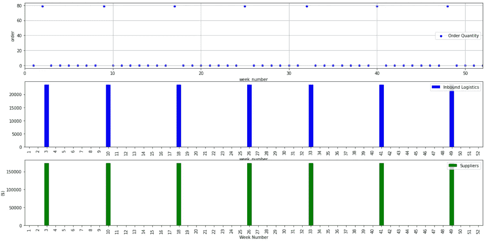

采购与入库物流成本 — （图片由作者提供）

**💡 观察** 订单在创建后的一周内准备发货。

+   **仓储与结构成本**

    它们包括托盘的存储费用*（使用每个托盘/天的单价）*以及其他经常性成本，如人力成本和设备费用。


**仓储与结构成本** — （图片由作者提供）

**💡 观察** 我朋友很幸运，没有为其托盘在仓库中的存储支付最低费用。

+   **非经常性成本**

    这些一次性支付的成本可能包括采购营销材料、特别的员工奖金或分销商处罚。

+   **佣金成本**

    我朋友与**独立销售代表**合作，销售到咖啡店时他们收取**30%的佣金**。

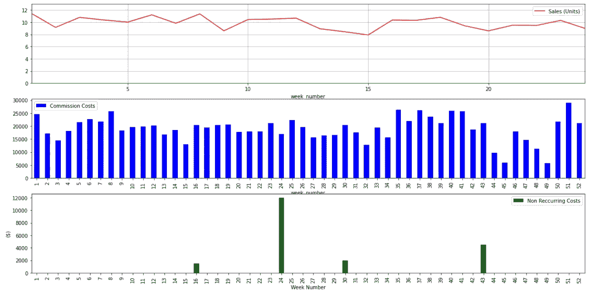

**非经常性与佣金成本** — （图片由作者提供）

如果我们总结一下，我们有：

+   收入流包括来自两个渠道的销售。

    **营业额 = （分销商营业额 + 咖啡店营业额）**

+   总成本包括固定成本、变动成本和非经常性成本。**总成本 = （变动成本 + 固定成本 + 非经常性成本）**

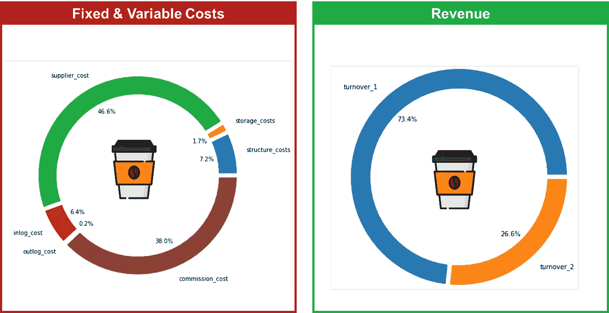

该活动的损益明细 — （作者提供的图片）

**💡 观察**

+   我们的结构成本非常低，固定成本不到 10%。

+   提成是第二大成本类别。

> 现在我们已经有了财务流的可视化，接下来我们来看每周的流动性平衡。

## 现金流模拟

计算每周现金流可以帮助我们了解维持此活动直到年末需要多少现金。

+   **现金流 = 营业额 — 成本**

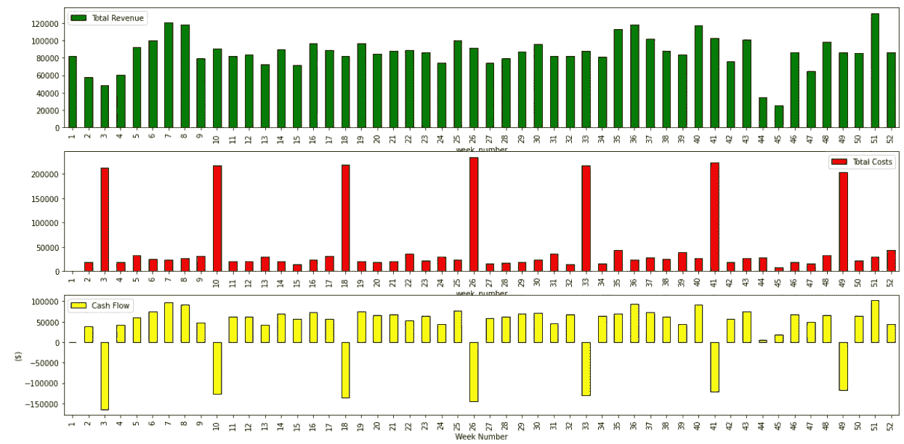

现金流可视化 — （作者提供的图片）

**💡 观察**

+   现金流始终为正，除了支付供应商和货运代理时。

> 我们手头有多少现金？

如果我们假设年初时没有现金（这个主意不好），

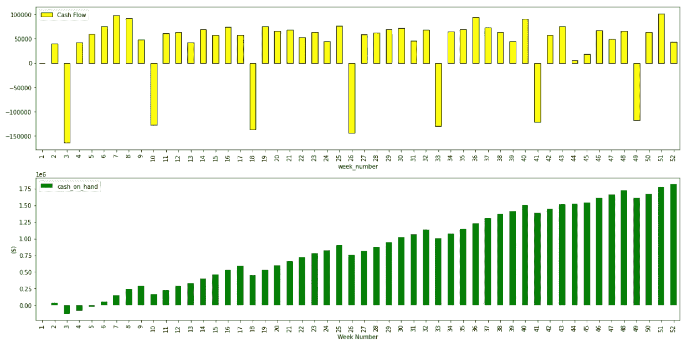

现金流和现金余额 — （作者提供的图片）

+   现金余额的最低值为 -**124,733 $**

+   第 3 周和第 4 周的现金余额为负。

**💡 结论**

他们需要**至少 125k $ 在年初**才能顺利运营活动并按时支付供应商。

下一部分将定义几个**绩效指标**并模拟场景，以提供数据驱动的业务洞察。

# 业务规划优化

现在我们的模型已经建立，我们可以调整参数并模拟不同的场景。

每个场景将使用四个指标进行评估。

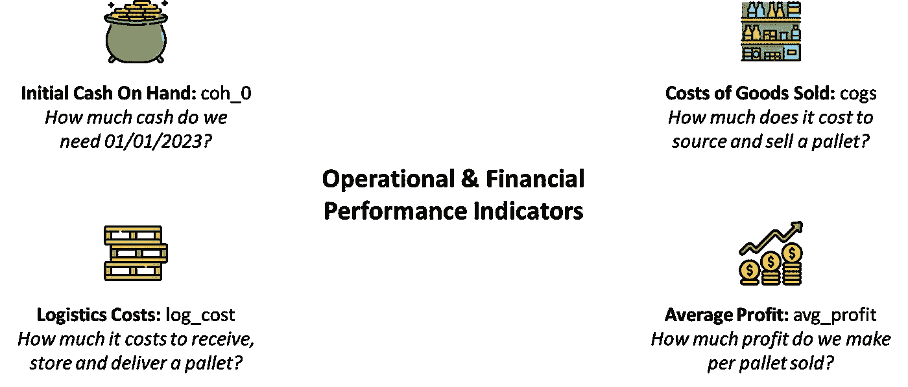

使用四个指标来评估每个场景 — （作者提供的图片）

+   年初所需的初始现金：**coh_0 ($)** *初始场景：* ***coh_0 = 124,733 ($)***

+   平均销售成本（COGS）：**cogs ($/Pallet)** *初始场景：* ***cogs *= 5,057 ($/Pallet)***

+   每托盘的平均物流成本：**log_cost ($/Pallet)** *初始场景：* ***log_cost= 417 ($/Pallet)***

+   每托盘的平均利润：**avg_profit ($/Year)** *初始场景：* ***avg_profit = 3,686 ($/Year)***

这个想法是衡量整个价值链中业务和运营的表现，并与初始场景进行对比。

## **场景 1：** 订货量优化

作为一名供应链工程师，我会从检查物流流和库存管理规则开始。

> 如果我们减少订货量会怎样？

当我的朋友向我解释他的流动性问题时，我的第一反应是质疑订货量。

> 你真的需要订购 8 周的库存吗？

平均订购 8 周是他确保有足够库存的方式，以避免担心缺货*(即因库存不足而取消订单)*。

现在我们有了一个带安全库存的优化库存管理规则，我们可以尝试将订货量减少到 **Q = 6 周的库存**。

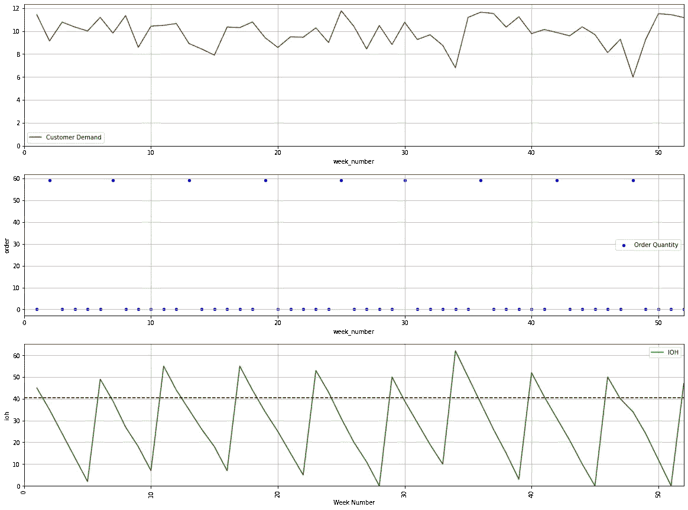

**库存管理规则** — （作者提供的图片）

从预计的库存来看，我们避免了缺货，且**对盈利能力的影响不可忽视**。

+   在练习开始时，你需要的现金较少。

    情景 1：**coh_0 = 74,733 ($) | -41%**

+   销售商品成本（COGS）大幅减少。

    情景 1：**cogs *=* 4,928 *($/托盘) |* -2.6%**

+   每个托盘的盈利能力更好。

    情景 1：***avg_profit =* 3,815 *($/托盘) |* +3%**

💡 **结论**

这一快速胜利为流动性需求提供了更多缓冲，并带来了额外的利润。

这一反馈促使我们对该业务价值链的战略愿景进行了深刻反思。

+   **🙋‍♂️ 为什么不将空运用于入库物流？**

    空运费用昂贵，但提供更多灵活性，即更低的平均库存。

+   **🙋‍♀️ 我们是否只向经销商销售？**

    经销商的付款期限较长（4 周），但我们无需支付销售佣金，且出库物流成本较低。

这些问题是合理的，但回答这些问题需要复杂的计算，我们的模型可以完全自动化这些计算。

## 情景 2：空运用于入库物流

我体验到，空运主要用于高价值产品，需要快速交付（*奢侈品或汽车零部件*）。

然而，我建议我的朋友做一下这个练习。

+   货代提议的空运费用是**原来的三倍**

+   交货时间从**4 周减少到 1 周**。

我们现在可以将订单数量从**8 周**的库存覆盖减少到**3 周**。

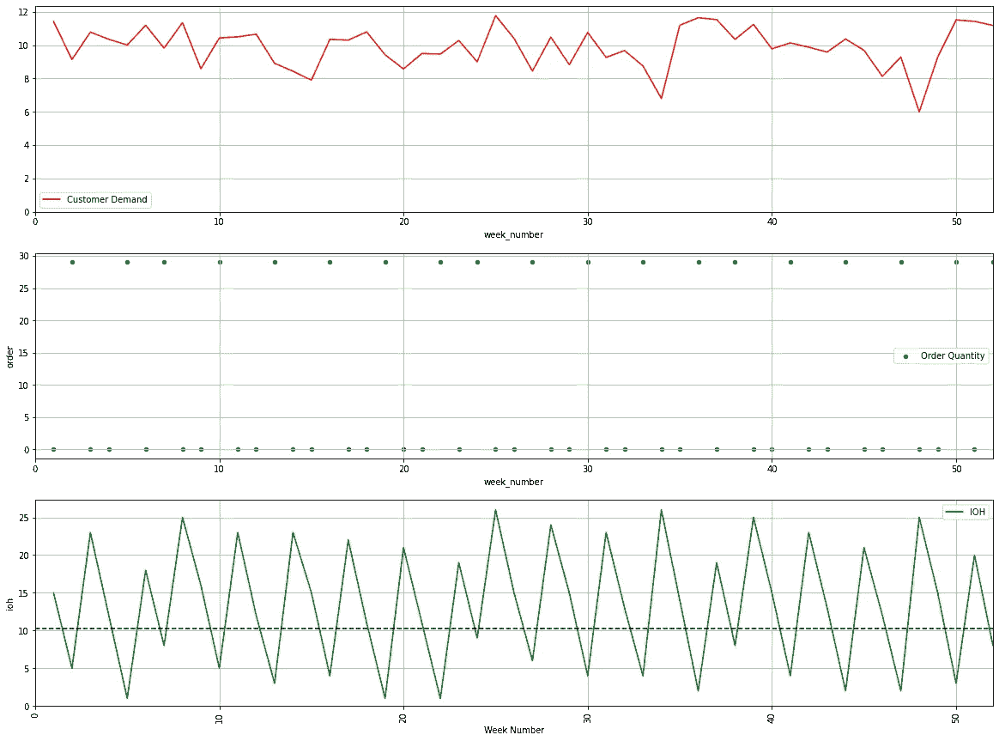

1 周交货期的库存管理 — （作者图片）

**💡 观察**

+   平均库存水平低于之前，这可能导致储存成本降低。

+   我们现在订货更频繁，数量较少。

不幸的是，这并不足以弥补高昂的空运费用。

+   这导致销售商品成本（COGS）的增加。

    情景 2：**cogs *=* 5,511 ($/托盘) *| +8 %***

+   这导致每个托盘的盈利能力较低。

    情景 2：**avg_profit = 3,232 ($/托盘) | -12%**

+   幸运的是，你在年初所需的现金较少。

    情景 2：**coh_0 = 17,288 ($) | -86 %**

总结来说，这并不是一个好主意，因为它**会降低长期盈利能力**。

## 情景 3：销售渠道优化

对于最后这一情景，我们将重点关注销售渠道策略。

> 我们将我们的杯子卖给谁，以及如何销售？

在当前的情景下，我们有直接销售给咖啡馆和与经销商合作的混合模式。

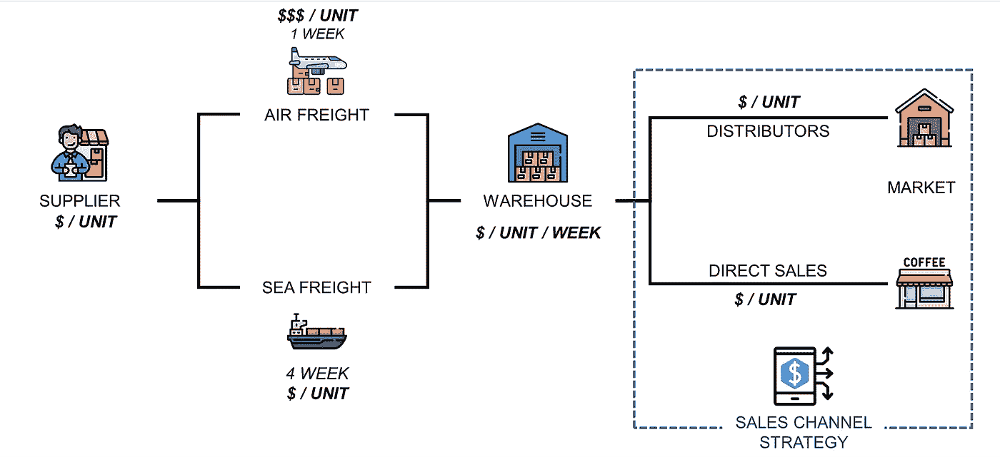

关注销售渠道策略 — （作者图片）

如果我们仅转向经销商，

+   **付款将在发货后 4 周收到**

+   **我们不需要支付销售佣金。**

    *销售佣金为 0% vs. 直销佣金 30%*

+   **我们可以通过合并发货来优化交付。**

    *出库物流成本减少 50% vs. 直销*

第一个影响是我们必须等待四周才能收到首笔付款，这会影响流动性需求。

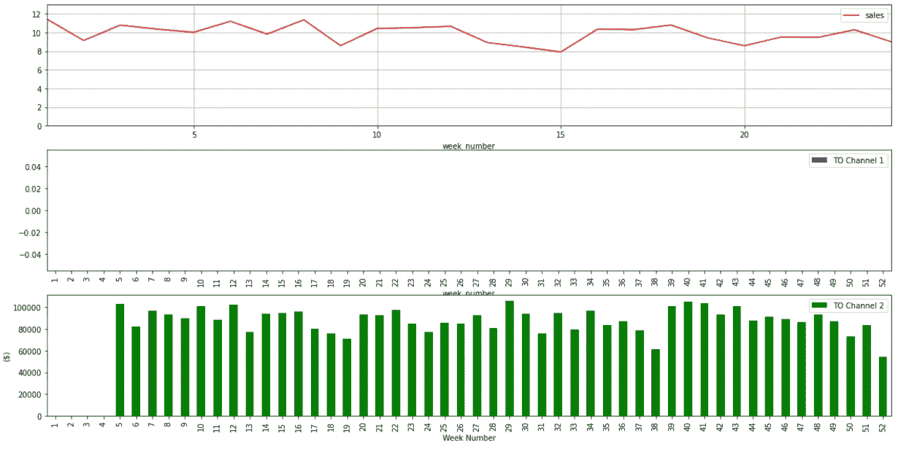

收入流 — （图片由作者提供）

+   在开始这项工作时，你需要更多的现金。

    场景 3: **coh_0 = 197,602 ($) | -58 %**

然而，你正在**削减佣金成本**，这提高了盈利能力。

+   对销售商品成本（COGS）有很大的影响。

    *新场景：* ***cogs *=* 3,172 *($/托盘) | -38 %***

+   每托盘销售的盈利能力更强。

    *新场景：* ***avg_profit =* 5,068 *($/托盘) | +37 %***

## 最优场景

这个小练习提供了更好的可视性和见解，能够在**不影响业务的情况下最大化盈利能力**。

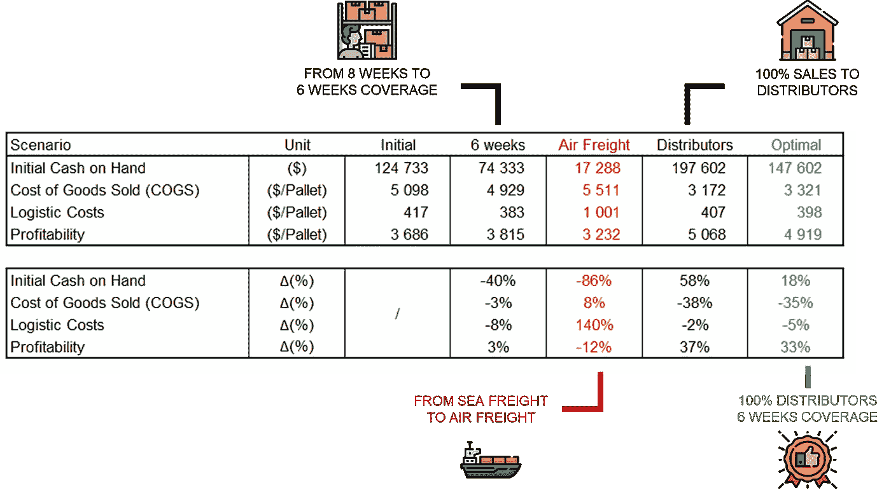

所有场景的总结 — （图片由作者提供）

如果我的朋友想要最大化他的业务盈利能力，他需要

+   获取更多来自分销商的订单，并停止直接销售。

+   在从供应商下单时，改为六周的覆盖期。

如果他遵循这个计划，数据显示他可能**将利润提高 33%**。

# 结论

这种方法使得不透明的操作流程和商业实践可以转化为一个简单的模型。

## 改进模型？

这个模型使我们能够理解价值链的每个组成部分是如何相互作用的。

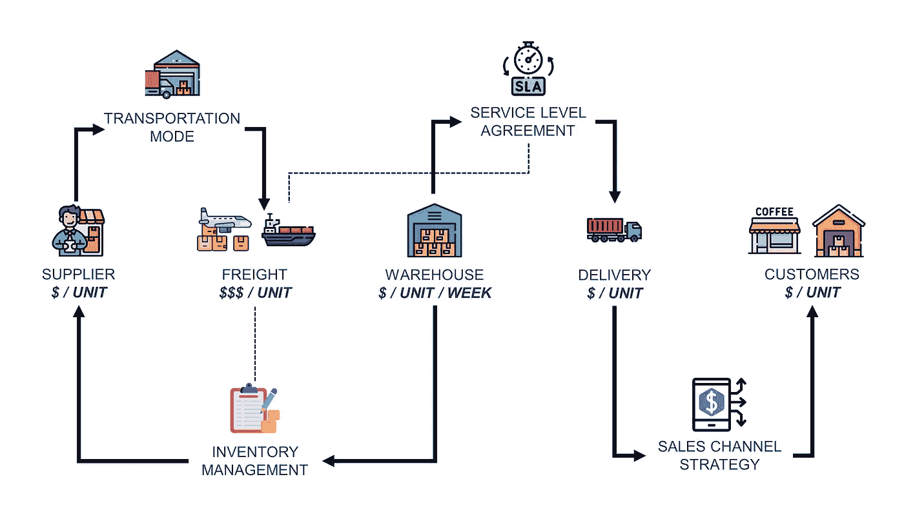

企业的价值链及其关键组成部分 — （图片由作者提供）

这个想法是通过一次点击回答类似的问题：

+   如果我将海运改为空运，会有什么影响？

+   最佳销售渠道是什么？

+   物流成本对整体利润的影响是什么？

> 接下来是什么？更细粒度和额外的成本结构。

尽管这个简单模型已经提供了关键的战略见解，但它也有局限性。

+   采购成本结构应包括**MOQ**和**递减定价**。

基于这个结构，你可以找到最优的订单量，以最小化订单和接收产品的成本。

更多详情请参见本文，

[](/procurement-process-optimization-with-python-a4c7a2e3ba76?source=post_page-----4f9beb7ecbec--------------------------------) ## 使用 Python 进行采购流程优化

### 使用非线性编程来找到最优的订货政策，最小化资本、运输和仓储成本。

towardsdatascience.com

+   转运公司和运输公司**根据** **体积**和**服务水平协议**开具发票。

如果我们为物流服务提供商提供**灵活性**，他们将有更多的**机会优化**路线并**降低价格**。

作为供应链解决方案经理，这是一个常见的练习。

这个例子可以在本文中找到。

[](/transportation-network-analysis-with-graph-theory-55eceb7e4de4?source=post_page-----4f9beb7ecbec--------------------------------) ## 使用图论分析交通网络

### 使用图论优化零售公司道路交通网络

[towardsdatascience.com

+   固定**成本必须按类别详细列出**：资本支出、人力资源、公共事业等……

我在我的 YouTube 频道上分享了仓储运营成本分解的示例，

+   销售定价可以包括**较短付款期限的折扣**或**根据订单量的递减金额**。

+   我们可以**扩大范围**，包括**多个商品**进行销售，并考虑产品组合来优化成本和收入。

我们可以利用线性规划和 Python 帮助我的朋友通过销售合适的商品，同时考虑流动性、库存和供应商能力的约束，最大化盈利。

您可以在本文中了解更多关于这种方法的内容，

[](/maximize-your-business-profitability-with-python-fbefebbdf802?source=post_page-----4f9beb7ecbec--------------------------------) ## 使用 Python 最大化您的商业盈利能力

### 使用线性规划帮助您的本地面包店通过选择合适的商品来提高商业盈利能力……

[towardsdatascience.com

## 下一步：收入优化

在下面的文章中，我将探讨收入增长和盈利能力的话题。

**收入优化**是实施策略以最大化公司收入，同时保持盈利能力。

> 如果我们实施递减定价来促进销售会怎样？

我的朋友与一位在食品和饮料行业拥有超过 25 年经验的高级主管合作。

> 我的朋友：“我如何评估她的定价策略，以确保我们保持盈利？”

本文使用模型来评估五种增长情境下的定价策略。

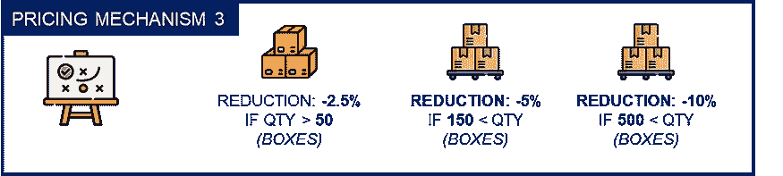

企业提出的定价策略——（图像由作者提供）

在实施递减定价机制后，目标是估算为了保持每托盘销售的相同盈利水平所需的最小增长。

欲了解更多细节，请查看本文。

[](/business-planning-with-python-revenue-optimization-83387074826d?source=post_page-----4f9beb7ecbec--------------------------------) ## 使用 Python 进行商业规划——收入优化

### 如何利用数据分析帮助小型企业在保持或提高盈利能力的同时最大化收入……

[towardsdatascience.com

> 那么这个业务的环境影响如何呢？

## 盈利能力 x 可持续性

我们可以基于**盈利能力**或**可持续性**限制来优化**供应商选择**。

这个初步模型考虑了我们的咖啡杯的单一供应商。

> 我们希望减少制造杯子时使用的水量。

然而，我的朋友正在通过在世界各地选择合格供应商来多元化他的采购来源。

在收集了来自这些不同供应商的数据后，我们可以使用我开发的简单网络应用，帮助我们设计最优的供应链网络。


供应链网络设计目标——（作者提供的图片）

该算法根据一个目标（例如最小化成本或特定的环境指标）自动选择最佳供应商。

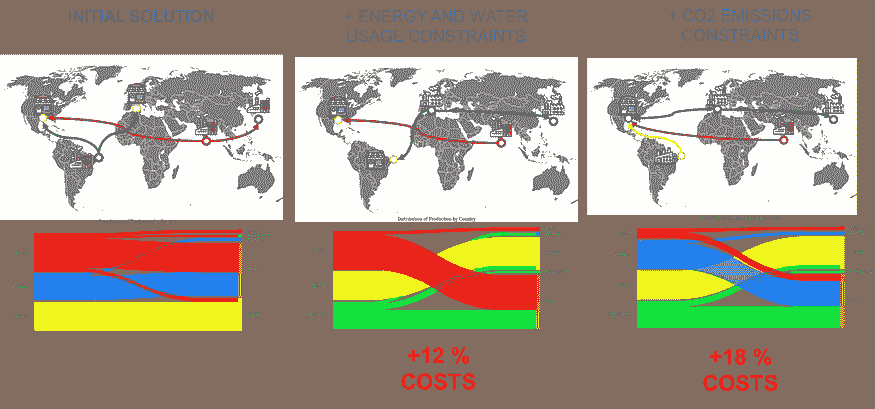

解决方案示例及其影响——（作者提供的图片）

它创建了供应链流程，将商品生产并交付给您的客户。

欲了解更多详情，请查阅这篇文章。

[](/create-a-sustainable-supply-chain-optimization-web-app-20599b98cab6?source=post_page-----4f9beb7ecbec--------------------------------) ## 创建可持续供应链优化网络应用

### 帮助您的组织将可持续采购与供应链优化相结合，以降低成本并减少环境影响……

towardsdatascience.com

# 关于我

让我们在[Linkedin](https://www.linkedin.com/in/samir-saci/)和[Twitter](https://twitter.com/Samir_Saci_)上联系。我是一个[供应链工程师](https://www.samirsaci.com/blog/)，利用数据分析改善物流运营并降低成本。

如果您需要关于供应链转型的咨询或建议，请通过[Logigreen Consulting](https://www.logi-green.com/)与我联系。

如果您对数据分析和供应链感兴趣，请访问我的网站。

[](https://samirsaci.com/?source=post_page-----4f9beb7ecbec--------------------------------) [## Samir Saci | 数据科学与生产力

### 专注于数据科学、个人生产力、自动化、运筹学和可持续发展的技术博客……

samirsaci.com](https://samirsaci.com/?source=post_page-----4f9beb7ecbec--------------------------------)

💌 免费将最新文章直接发送到您的邮箱：[Newsletter](https://www.samirsaci.com/#/portal/signup)

📘 您的供应链分析完全指南：[Analytics Cheat Sheet](https://bit.ly/supply-chain-cheat)
