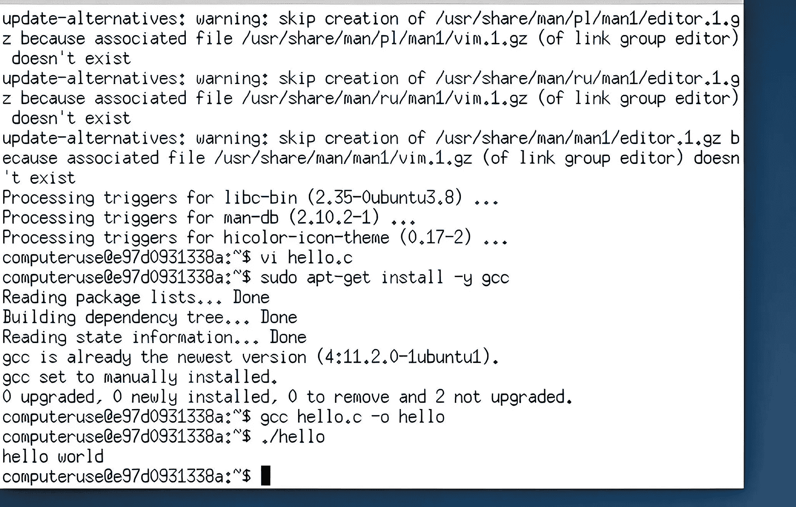

# 使用 Claude 的新计算机使用模型进行 C 编程

> 原文：[`towardsdatascience.com/c-programming-using-claudes-new-computer-use-model-feaad7e3e8db?source=collection_archive---------7-----------------------#2024-10-25`](https://towardsdatascience.com/c-programming-using-claudes-new-computer-use-model-feaad7e3e8db?source=collection_archive---------7-----------------------#2024-10-25)

图片由作者提供

## Sonnet 在为你编写和运行代码方面表现如何？

 [Thomas Reid](https://medium.com/@thomas_reid?source=post_page---byline--feaad7e3e8db--------------------------------)

·发布于[Towards Data Science](https://towardsdatascience.com/?source=post_page---byline--feaad7e3e8db--------------------------------) ·11 分钟阅读·2024 年 10 月 25 日

--

正如你现在可能已经听说的那样，Claude 在几天前发布了几条重大新闻。

其中一条新闻是关于一款新的 3.5 Haiku 模型，它承诺模拟当前 3.0 Opus 模型的能力，但应该更快、更便宜。这是一个“即将发布”的公告，因为新模型实际发布的时间要到 11 月某个时候。

第二个重大讨论点，也是使 AI 界陷入一阵疯狂的新闻是，升级版的 Sonnet 3.5 模型也拥有了一项新能力。

被称为“计算机使用”模型，该模型现在可以控制 PC 桌面。

它以一种非常自然、类人化的方式实现这一点。

我的意思是，它可以打开窗口和应用程序，使用鼠标进行点击和指向，输入文本，使用 Google 进行网页搜索等…

在这个阶段，计算机使用功能仍处于实验阶段，容易出错，但依然是一个令人兴奋的前景。

现在，你不需要是火箭科学家也能认识到，赋予 AI 这种能力***可能***会稍微令人担忧。Claude 通过确保目前的新模型…
