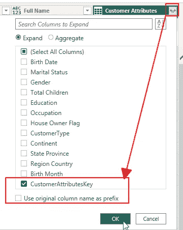

# 在 Power BI 中使用行级安全计算总百分比

> 原文：[`towardsdatascience.com/calculate-the-percentage-of-the-total-with-rls-in-place-in-power-bi-1ea5c3ab1fac?source=collection_archive---------13-----------------------#2024-02-05`](https://towardsdatascience.com/calculate-the-percentage-of-the-total-with-rls-in-place-in-power-bi-1ea5c3ab1fac?source=collection_archive---------13-----------------------#2024-02-05)

## *大多数数据模型都有行级安全（RLS）机制，某些用户只能看到整个数据集的部分内容。但当他们必须看到与总体结果进行比较的结果时，情况就不那么简单了。*

[](https://medium.com/@salvatorecagliari?source=post_page---byline--1ea5c3ab1fac--------------------------------)[](https://towardsdatascience.com/?source=post_page---byline--1ea5c3ab1fac--------------------------------) [Salvatore Cagliari](https://medium.com/@salvatorecagliari?source=post_page---byline--1ea5c3ab1fac--------------------------------)

·发表于 [Towards Data Science](https://towardsdatascience.com/?source=post_page---byline--1ea5c3ab1fac--------------------------------) ·阅读时间 11 分钟·2024 年 2 月 5 日

--


图片来自 [Wim van 't Einde](https://unsplash.com/@wimvanteinde?utm_source=medium&utm_medium=referral) 在 [Unsplash](https://unsplash.com/?utm_source=medium&utm_medium=referral)

# 介绍

让我们看一下以下场景：

我的销售人员只能看到其指定地理区域的结果。

在这种情况下，它是大洲。

为了进行基准测试，他们必须能够将自己的结果与其他大陆的结果以及总体结果进行比较。

当启用行级安全（RLS）时，这是不可能的，因为用户无法查看其他大洲的结果。

必须对数据模型进行更改才能实现这一点。

那么，让我们来看看如何实现这样的变化。

# 由 SQLBI 提供的解决方案

SQLBI 已经在此主题上撰写了文章并制作了视频：

[](https://www.sqlbi.com/articles/computing-accurate-percentages-with-row-level-security-in-power-bi/?source=post_page-----1ea5c3ab1fac--------------------------------) [## 在 Power BI 中使用行级安全计算准确的百分比 - SQLBI

### 本文展示了当行级安全隐藏部分数据时，如何计算比例。如果百分比也……

www.sqlbi.com](https://www.sqlbi.com/articles/computing-accurate-percentages-with-row-level-security-in-power-bi/?source=post_page-----1ea5c3ab1fac--------------------------------)

从理论上讲，我们可以到此为止：阅读文章或观看视频。都没问题，不是吗？

不要那么快，我的小马。

虽然 Alberto 已经使用 DAX 构建了解决方案，但我更愿意在数据模型之前尽早创建附加表，最好是在源（数据库）或 Power Query 中创建。

由于并非每个人都将数据存储在数据库中，我不想深入 SQL 代码来构建必要的表，尽管在 SQL 中创建解决方案是相当直接的。

所以，我去 Power Query 中创建解决方案。

就像我之前的文章一样：

[](/converting-a-flat-table-to-a-good-data-model-in-power-query-46208215f17a?source=post_page-----1ea5c3ab1fac--------------------------------) ## 在 Power Query 中将扁平表转换为良好的数据模型

### 当将一个宽表的 Excel 文件加载到 Power BI 中时，我们最终会得到一个不理想的数据模型。我们可以做些什么来创建一个好的...

[towardsdatascience.com

好的，我们开始吧。

# 第一步 — 创建没有客户的事实表

我将采用上述 SQLBI 文章中描述的相同场景和方法。

由于 RLS 规则已设置在客户表上，我创建了一个“在线销售”事实表的副本，但没有引用客户表。

如果没有这个参考，客户表上的 RLS 规则将不适用，我可以根据需要计算结果。

打开 Power Query 后，我创建了在线销售表的引用：


图 1 — 从在线销售表创建引用（图由作者提供）

通过创建引用，我不会在 Power Query 中重新读取源数据，而是重用原始在线销售表的结果。

我将表重命名为“在线销售（无客户）”。

第二步是分析数据，决定我必须按哪些列对数据进行分组，以及哪些列可以进行聚合。

这一步是必要的，因为我正在改变数据的粒度。

通过移除客户信息，我可以减少表的大小，因为我拥有的详细信息较少。

我可以按表中的所有维度键对数据进行分组。但不能包含客户键。而且，由于我不能确定哪个客户下了哪个订单，因此我还必须删除订单号和订单行详细信息。

但我必须花些时间弄清楚可以聚合哪些列。

让我们看一个例子：

当我取销售数量时，我可以毫无问题地对这个列进行求和，因为结果可以重用。

但是，当我查看单价时，情况就不再那么简单了。

我必须查看我可以如何处理这个列。

当我对这个列进行聚合时，会发生什么呢？

这个价格可能会随着时间的推移而变化。

当通过将单价与销售数量相乘来计算销售金额时，这会带来危险。这样可能导致错误的结果。

因此，我不能聚合单价。

最后，我按以下列对表进行了分组：

+   订单日期

+   门店键

+   产品键

+   促销键

+   货币键

+   日期键年份

+   到期日期

+   发货日期

然后，我汇总（求和）这些列：

+   销售数量

+   销售金额

+   返回数量

+   返回金额

+   折扣金额

+   总成本

+   单位成本

此外，我还可以通过客户键添加不同的计数，以分析数据中的客户数量。


图 2 — 新表的分组和汇总（作者制作的图）

我必须点击“添加分组”以添加用于分组数据的列。

然后，我必须向下滚动，点击“添加聚合”以添加需要聚合的列。

对于每一列，我必须设置操作（聚合函数，如求和），并且可以设置一个新名称。

下一步是将所有关系添加到新创建的表中：


图 3 — 新表的数据模型（作者制作的图）

现在，让我们看看没有和有附加表的结果：

这是没有 RLS 时原始数据的起点：


图 4 — 没有 RLS 时的初始结果（作者制作的图）

现在，让我们为亚洲和澳大利亚应用 RLS 角色：


图 5 — 应用 RLS 角色后的初始结果（作者制作的图）

如您所见，结果在数学上是正确的，但它并没有满足我们的要求。

百分比仅计算在剩余的两个大陆上，而不是所有大陆。

现在，我可以通过将大陆移到切片器，并将产品品牌添加到矩阵中来更改报告：


图 6 — 更改后的报告，带有大陆切片器和品牌（作者制作的图）

由于这一变化，我可以看到值在有 RLS 和没有 RLS 时仍然会变化。

现在的问题是，激活 RLS 角色后的结果是错误的：


图 7 — 应用 RLS 后按品牌错误的结果（作者制作的图）

原因是，按品牌计算的“所有”大陆的销售百分比是基于可用的大洲（亚洲和澳大利亚）来计算的。因此，结果是错误的。

然而，当我添加一个新的度量值，它指向新表时，结果有所不同。

该度量值如下：

```py
% over All Continents (No Customers) =
DIVIDE([Online Sales (By Order Date)]
  ,SUM('Online Sales (No Customers)'[Sales Amount]))
```

而结果（带有 RLS）是这样的：


图 8 — 在新表和 RLS 下的新度量值结果（作者制作的图）

请注意：如果您没有选择任何大陆，并且没有激活 RLS 角色，则新度量值的结果看起来会错误。

在构建和测试解决方案时，您必须考虑这一点。

根据报告，您可以使用这两个度量值中的一个，因为根据情况，它们都可能提供正确的结果。

例如，销售总监可能可以访问所有大洲的销售结果。对于他来说，原始度量的结果是正确的，因为它考虑了客户的所在大洲。

为了简化这个过程，我们可以添加一个新的客户属性表。

# 步骤 2 — 基于客户属性的报告

正如 SQL 文章中所描述的那样，可能存在一种情况，需要基于某些客户属性（如性别、教育或其他属性）创建报告。

在这种情况下，我必须为这些属性创建一个表，并使用这个表扩展我们的数据模型。

要构建这样的表格，我必须首先定义需求，然后是创建表格的过程。

例如：

1.  我必须有一个不包含客户数据的表（例如，由于数据保护规则）。

1.  我必须无法重建客户的数据。

1.  我必须能够过滤新的和原始的在线销售表。

接下来，我定义完成要求所需的步骤：

1.  复制客户表（命名为“客户属性”）。

1.  移除不必要的列。

1.  移除所有重复项。

1.  添加索引（键 / ID）列。

1.  将新表与原始客户表合并，以添加新创建的键列。

1.  将键列合并到“在线销售”表中。

1.  在“在线销售（无客户）”表中添加新的键列。

这应该可以工作。我们开始吧：

一条简短的说明：由于我必须将不包含不需要的客户属性的表合并到原始客户表中，因此无法创建引用，因为这会引入循环依赖。因此，我必须复制客户表：


图 9 — 复制客户表（图源自作者）

我将重复的表重命名为“客户属性”。

现在，我移除所有包含个人数据的列（除性别、教育和其他统计相关列外）。但我必须确保保留所有必要的列，以确保合并操作不会在后续合并步骤中导致行的乘法。

例如，在结果中我得到了没有出生日期的重复项。原因是有很多客户共享相同的属性，但没有出生日期。但是，包含出生日期可以确保行之间可以匹配。

你需要仔细检查这一步，因为这可能会因情况而异。

接下来，我添加索引列：


图 10 — 添加索引列（图源自作者）

索引列被重命名为“CustomerAttributesKey”。

我使用合并功能将新键传输到原始客户表中：


图 11 — 将新的客户属性表合并到原始客户表中（图源自作者）

我必须选择所有匹配的列，同时按住 Ctrl 键，确保所有列被合并，以合并正确的行。

存在不匹配的行问题。

如上所示，十三行无法匹配。不幸的是，我未能找到这种不匹配的原因。Power Query 并没有提供工具来查找并解决此类问题。

我在 Excel 中创建了一个 CustomerAttributes_Dummy 表，CustomerAttributesKey = -1，以解决此问题。然后，我使用“输入数据”功能添加了一个包含此行的表，并将该行附加到 CustomerAttributes 表中。

另附说明：我添加了虚拟行来简化本文的解决方案。在实际情况下，我会尝试找出原因，检查数据，并找到正确的解决方案，而不是使用这种变通方法。

现在，我可以扩展合并后的表以提取 CustomerAttributesKey：



图 12 — 扩展新的 Key 列（图示作者提供）

可以通过“替换值”功能，将 Key 列中不匹配的值填充为虚拟 Key -1：


图 13 — 用虚拟 Key “-1” 替换不匹配的 Key（图示作者提供）

下一步是将 CustomerAttributesKey 添加到“在线销售”表中，并因此添加到“无客户在线销售”表中。

我再次使用合并和扩展功能将列添加到“在线销售”表中：


图 14 — 将在线销售表与客户表合并（图示作者提供）

CustomerAttributeyKey 列的扩展方式与之前展示的相同。

最后，我需要将新的 CustomerAttributeKey 作为分组列添加到“无客户在线销售”表中：


图 15 — 将 CustomerAttributeKey 添加为分组列（图示作者提供）

通过这一步，我完成了数据准备任务。

# 修改数据模型

到此为止，我有两种数据模型的选择。

无论如何，我将向“无客户在线销售”表添加关系，因为这将满足一个核心需求。

但我可以向客户表或在线销售表添加关系：

1.  将新的 CustomerAttributes 表链接到客户表，客户表与原始的在线销售表相关联。

1.  向在线销售表直接添加关系，而不向客户表添加关系。

这里是两种选项并排显示：


图 16 — 客户属性表的数据模型变体（图示作者提供）

1.  变体 1 使用客户表作为中介表。

    这样会产生以下后果：

+   可以删除客户表中的重复属性。

+   因此，属性将具有唯一的分配。

+   客户表上的 RLS 始终适用。

2\. 变体 2 使用来自在线销售表到每个客户表的两个关系：

+   重复的属性。

+   有两种可能性可以按相同属性过滤数据。

+   客户属性表不受客户表上 RLS（行级安全性）的影响。

+   是否有清晰的星型架构（Star Schema）？

我会选择变体 2，因为我希望消除在某些特定计算中 RLS 规则的影响，这样可以开启更多的可能性。

但这是针对每种情况的决策。

# 结果与结论

结果会根据数据模型和你如何使用每个表中的属性而有所不同。

例如，当我将两个表中的性别字段添加到一开始展示的矩阵中时，结果如下：


图 17 — 各表格中按性别分类的结果比较（图由作者提供）

虽然右侧按性别分类的结果可以总结为上面的品牌，但左侧的结果无法如此总结。

这些结果是非视觉总计（Non-Visual-Totals），如上文 SQLBI 文章中所述，可能会引起混淆且难以理解，尽管它们在数学上是正确的。

我强烈建议阅读本文，以更好地理解这个复杂的话题。

主要问题是：使用 DAX 还是 Power Query 来准备数据，哪个更好？

严格从数据工程师的角度来看，我会说，在源头或 Power Query 中进行转换，避免在 Power BI 中使用 DAX 进行数据处理。

这将遵循[Roche 的准则](https://ssbipolar.com/2021/05/31/roches-maxim/)：

*尽早进行数据转换，并尽可能晚地进行必要的转换。*

使用 Power Query 的另一个理由是效率。

当数据在源头或 Power Query 中准备好时，Power BI 会比使用 DAX 表时更有效地压缩和优化数据存储。

这段非常技术性的视频详细解释了这一点：

然而，进行这种转换的复杂性大于 SQLBI 文章中展示的方法。

在为我的客户开发解决方案时，我会问以下问题：

+   谁将维护这个解决方案？

+   那个人的技能是什么？

+   那个人是否愿意在保持现有解决方案的同时学习更多？

这些问题的答案将决定解决方案的方法。

我曾经遇到过这样的情况：当客户无法或不愿学习我首次方法中使用的技术时，我不得不以不同的方法重建解决方案。

所以，像往常一样，问题“使用 Power Query 还是 DAX”的答案是：这取决于……

本文的目标是向你展示一种替代的解决方案构建方式，这种方式可以在你决定哪个方法最适合你的时候提供更多的灵活性。

我希望我能够实现这一点，并且你学到了新的东西。


图片由[Brett Jordan](https://unsplash.com/@brett_jordan?utm_source=medium&utm_medium=referral)提供，来源于[Unsplash](https://unsplash.com/?utm_source=medium&utm_medium=referral)

# 参考文献

我写了一篇关于如何使用 Power Query 将平面表转换为星型架构的文章，并在其中使用了一些这里描述的技术。你可以在这里找到它：

[](/converting-a-flat-table-to-a-good-data-model-in-power-query-46208215f17a?source=post_page-----1ea5c3ab1fac--------------------------------) ## 在 Power Query 中将平面表转换为良好的数据模型

### 当将一个宽的 Excel 表格加载到 Power BI 时，我们最终会得到一个次优的数据模型。我们能做些什么来创建一个好的模型呢……

towardsdatascience.com

我使用的是 Contoso 示例数据集，像我之前的文章中一样。你可以从微软[这里](https://www.microsoft.com/en-us/download/details.aspx?id=18279)免费下载 ContosoRetailDW 数据集。

Contoso 数据可以在 MIT 许可证下自由使用，详情请见[这里](https://github.com/microsoft/Power-BI-Embedded-Contoso-Sales-Demo)。

你可以通过以下方式支持我的工作，这是我在空闲时间进行的工作：

[`buymeacoffee.com/salvatorecagliari`](https://buymeacoffee.com/salvatorecagliari)

或扫描此二维码：


任何支持都将不胜感激，并帮助我腾出更多时间为您创作更多内容。

非常感谢。
