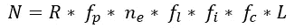
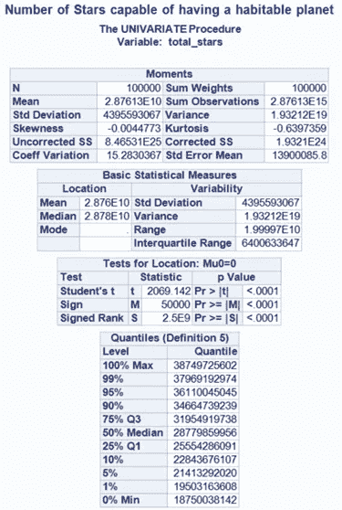
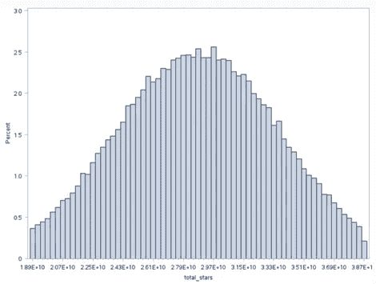
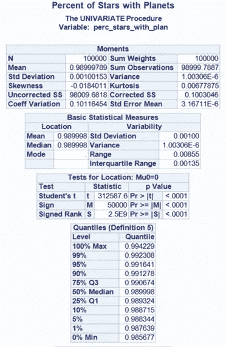
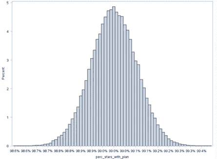

# 计算接触

> 原文：[`towardsdatascience.com/calculating-contact-a-data-driven-look-at-alien-civilizations-2435267bd4ac?source=collection_archive---------5-----------------------#2024-09-07`](https://towardsdatascience.com/calculating-contact-a-data-driven-look-at-alien-civilizations-2435267bd4ac?source=collection_archive---------5-----------------------#2024-09-07)

## 通过数据驱动的方式探讨外星文明（德雷克方程系列第一部分）

[](https://medium.com/@james.r.gearheart?source=post_page---byline--2435267bd4ac--------------------------------)[](https://towardsdatascience.com/?source=post_page---byline--2435267bd4ac--------------------------------) [James Gearheart](https://medium.com/@james.r.gearheart?source=post_page---byline--2435267bd4ac--------------------------------)

·发表于[Towards Data Science](https://towardsdatascience.com/?source=post_page---byline--2435267bd4ac--------------------------------) ·8 分钟阅读·2024 年 9 月 7 日

--

如果我告诉你，银河系中可能有超过 2000 个外星文明，你会怎么想？听起来像是你最喜欢的科幻剧中的情节转折，对吧？但是如果我说我们可以利用数据科学来接近答案呢？这正是我们在本系列中要做的，使用真实数据来估算可能存在多少外星文明，它们可能离我们有多近，以及我们是否有任何机会与它们联系。

在这个系列中，我们将研究**德雷克方程**，自 1960 年代以来，科学家们一直使用它来估算宇宙中可能存在的高级外星文明数量。我们还将通过现代数据科学技术，如**蒙特卡洛模拟**，为这一过程增添趣味，简单来说，就是“我们将反复计算数千次，看看会发生什么。”


所有图片均由作者使用 Midjourney 开发。

# 大问题：大家都去哪儿了？

1950 年，物理学家**恩里科·费米**著名地提出了一个问题：“**大家都去哪儿了？**”宇宙的广袤无垠，我们的银河系中就有**数十亿颗恒星**，每颗恒星很可能都有行星。那么，为什么我们至今没有遇到外星人呢？这就是**费米悖论**——外星生命的高概率与缺乏任何外星文明证据或接触之间的矛盾。

为了解决这个难题，**弗兰克·德雷克**在 1961 年提出了**德雷克方程式**。它是将问题分解为更小的步骤的一种方式，提出了类似“有多少颗恒星？有多少颗恒星拥有行星？这些行星中有多少颗能支持生命？”这样的问题。每一个问题都在缩小搜索范围，最终我们得到一个数字，告诉我们宇宙中可能存在多少个文明，它们正在向外太空发送信号。

# 德雷克方程式的分解

方程式如下所示：



方程式的每一部分都代表着一个关键因素，用于计算宇宙中可能存在多少个文明：

+   **R**：我们银河系中新恒星形成的速率。

+   **f_p**：拥有行星的恒星比例。

+   **n_e**：每颗恒星上可以支持生命的行星的平均数量。

+   **f_l**：那些星球上实际出现生命的比例。

+   **f_i**：生命星球中进化出智慧生命的比例。

+   **f_c**：发展出跨越太空通信技术的文明比例。

+   **L**：这些文明广播信号的持续时间。

# 德雷克方程式中的步骤 1：银河系中的恒星数量

德雷克方程式中的第一个变量通常是**R**，即我们银河系中新恒星的形成速率。然而，在这项特定分析中，我们将关注**目前银河系中存在的恒星总数**。我们的目标是弄清楚现在有多少颗恒星可能支持适宜生命的行星。

我们不是在问有多少新恒星正在诞生——我们估计的是银河系中**目前存在的恒星总数**，这些恒星可能拥有能够孕育生命的行星。

# 恒星类型信息：G 型、K 型和 M 型恒星

虽然银河系中可能有**1000 亿到 4000 亿颗恒星**，但并非所有恒星都适合支持生命。我们将重点关注那些与我们的太阳相似，或者寿命足够长，能够给生命发展提供机会的恒星。具体来说，我们关注三种主要类型的恒星：

+   **G 型恒星**：这些恒星与我们的太阳相似。银河系中大约有**25 亿到 62.5 亿**颗 G 型恒星。

+   **K 型恒星**：比太阳略凉且暗淡，但依然寿命长且稳定。大约有**75 亿到 125 亿**颗 K 型恒星。

+   **M 型恒星**：这些是小型红矮星，比 G 型和 K 型恒星更为常见。M 型恒星的数量约为**87.5 亿到 200 亿**颗。

因此，总的来说，我们估计**187.5 亿到 387.5 亿颗恒星**可能是支持生命的行星的候选恒星。

# 步骤 1 的代码：计算银河系中的恒星总数

为了估算能够支持适宜生命的行星的恒星总数，我们使用**蒙特卡罗模拟**随机生成数字，基于这些恒星类型的可能分布。以下是模拟这些恒星数量的**SAS 代码**：

```py
data total_stars(keep=total_stars);
  do i = 1 to 100000;
    do while (1);
      total_stars = rand("normal", 28750000000, 5000000000);
      /* Check if the value is within the desired range */
      if total_stars >= 18750000000 and total_stars <= 38750000000 then leave;
    end;
    output;
  end;
  drop i;
run;
```



# 第 1 步的输出和解释：恒星数量

在运行蒙特卡罗模拟后，使用我们指定的范围和假设，我们得到了关于银河系中可能能够容纳适居行星的恒星数量的一些大数字：

+   **恒星的平均数量**：**287.5 亿**

+   **范围**：**187.5 亿到 387.5 亿**

## 这些结果意味着什么？

这些结果为我们提供了一个相当可靠的估算，说明可能有多少颗恒星拥有能够存在生命的行星。恒星的平均数量约为**287.5 亿**，这意味着我们正在看着相当多的潜在外星生命家园。这个估算并非凭空得出——我们是根据现有的天文学研究定义了这个范围，并假设分布呈钟形，以反映数据中的自然不确定性。

## 为什么分布的形状很重要？

+   **大多数模拟集中在平均值附近**：钟形曲线并非随机选择——我们选择它是为了反映大多数恒星应该集中在**287.5 亿**这一均值附近。这让我们有信心，认为我们没有处理极端的异常值。

+   **范围和变异性**：**187.5 亿到 387.5 亿**恒星的范围是我们基于专家推理设定的。我们知道在处理这些巨大的数字时存在一些不确定性，但分布帮助我们更有信心地看待中间的数值。我们不太可能大幅偏离正确轨道。

## 这对德雷克方程意味着什么？

这一步为德雷克方程的其余部分提供了坚实的基础。我们现在对银河系中可能能够容纳适居行星的恒星数量有了一个清晰的概念。但仅仅因为一颗恒星可能拥有行星，并不意味着它确实有。下一步是弄清楚这些恒星中有多少颗实际上拥有行星系统——这就是**第 2 步**的作用。

# 德雷克方程中的第 2 步：拥有行星的恒星的比例（f_p）

现在我们已经有了恒星数量的估算，**德雷克方程**的下一步是**f_p**，即拥有行星系统的恒星的比例。

得益于**开普勒**和**TESS**等任务，最近的天文学发现表明几乎每颗恒星至少都有一颗行星。在这项分析中，我们将估算约**98%到 100%**的恒星拥有行星，留有少许不确定的余地。

# 第 2 步的代码：计算拥有行星的恒星的比例

为了模拟拥有行星的恒星的比例，我们将运行另一个**蒙特卡罗模拟**。以下是用来模拟拥有行星的恒星比例的**SAS 代码**：

```py
/*Percent of Stars with Planets*/

data perc_stars_with_plan(keep=perc_stars_with_plan);
  do i = 1 to 100000;
    do while (1);
      perc_stars_with_plan = rand("normal", 0.99, 0.001);
      /* Check if the value is within the desired range */
      if perc_stars_with_plan >= 0.98 and perc_stars_with_plan <= 1 then leave;
    end;
    output;
  end;
  drop i;

  format perc_stars_with_plan percent7.4;
run;
```



# 第 2 步的输出和解释：拥有行星的恒星的比例（f_p）

一旦我们确定了恒星的数量，接下来的问题是：这些恒星中有多少实际上拥有行星？利用像**开普勒**等任务的最新数据，我们对这一步骤进行了建模，设定了一个非常狭窄的范围，假设**98%到 100%**的恒星都有行星。下面是模拟结果：

+   **拥有行星的恒星的平均比例**：**99%**

+   **范围**：**98%到 100%**

## 结果解析

结果很清楚：几乎每颗恒星都有行星。我们根据强有力的证据设定了这个范围，模拟结果确认了我们预期的结果——大约**99%**的银河系恒星可能拥有行星。**98%到 100%**的几乎完美的范围反映了大多数恒星是行星系统的压倒性可能性。

## 为什么这很重要？

+   **几乎每颗恒星都有行星**：由于我们已经预期几乎所有的恒星都有行星，这个紧密的结果令人放心。这对我们寻找外星生命是个好消息——外面有数十亿个潜在的行星。

+   **不确定性空间很小**：因为我们指定的范围非常窄，所以我们对这一步非常有信心。小的变化意味着我们可以继续前进，而不用太担心这个因素。我们已经掌握了这一点。

## 这对德雷克方程意味着什么？

这一步很好地缩小了范围。由于几乎每颗恒星都有行星，我们可以自信地集中精力解决下一个更具挑战性的问题：这些行星中有多少处于**适居带**？有数十亿颗恒星，而且几乎所有恒星都有行星，接下来的重点将是这些行星中有多少能够支持生命。这就是我们在方程的下一步中将要探讨的问题。

# 第一部分总结

我们现在估计，银河系中大约有**287.6 亿颗**恒星拥有行星。但是，并不是所有的行星都一样——有些行星太热、太冷，或者根本不适合我们所知的生命。

接下来，我们将深入探讨**到底有多少行星可能适合居住**，重点关注所谓的**“黄金锁区”**——这是围绕恒星的区域，条件刚好适合液态水的存在。敬请关注第二部分，我们将探讨寻找维持生命的行星的可能性。

系列下篇：[从恒星到生命：基于数据的探索之旅（德雷克方程系列第二部分）](https://medium.com/@james.r.gearheart/calculating-contact-moving-from-stars-to-life-part-2-of-the-drake-equation-series-c110c018f174)

除非另有说明，所有图片均为作者提供
