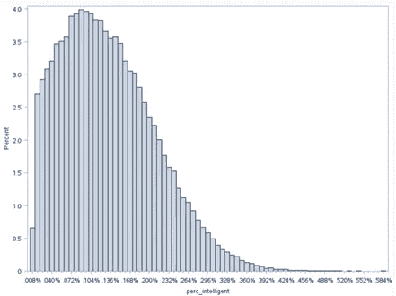

# 从恒星到生命

> 原文：[`towardsdatascience.com/calculating-contact-moving-from-stars-to-life-part-2-of-the-drake-equation-series-c110c018f174?source=collection_archive---------9-----------------------#2024-09-07`](https://towardsdatascience.com/calculating-contact-moving-from-stars-to-life-part-2-of-the-drake-equation-series-c110c018f174?source=collection_archive---------9-----------------------#2024-09-07)

## 一次数据驱动的旅程（《德雷克方程式》系列第二部分）

[](https://medium.com/@james.r.gearheart?source=post_page---byline--c110c018f174--------------------------------)[](https://towardsdatascience.com/?source=post_page---byline--c110c018f174--------------------------------) [James Gearheart](https://medium.com/@james.r.gearheart?source=post_page---byline--c110c018f174--------------------------------)

·发表于[Towards Data Science](https://towardsdatascience.com/?source=post_page---byline--c110c018f174--------------------------------) ·阅读时间 11 分钟·2024 年 9 月 7 日

--

在**第一部分**中，我们探讨了银河系中有多少颗恒星可能拥有行星，并使用数据估算了银河系中拥有行星的恒星总数。现在我们已经处理了恒星的问题，让我们更深入地了解这些行星本身。在**第二部分**中，我们将深入探讨有多少颗行星实际上能够支持生命，生命是多么频繁地出现，以及生命进化成智能文明——像我们一样——的可能性有多大。

随着我们继续探索**德雷克方程式**，事情变得有些推测性。但不用担心，我们将使用数据科学、蒙特卡洛模拟以及基于当前研究的合理假设来确保内容的严谨性。


所有图片由作者使用 Midjourney 开发。

**快速提醒：德雷克方程式**

为了帮助你回忆，德雷克方程式分解了估算活跃且能进行通讯的外星文明数量的步骤。以下是完整的方程式：


# 第三步：有多少颗行星位于适居带内？（n_e）

并非所有行星都相同——有些太热，有些太冷，只有少数几颗刚好适宜。这些“金发姑娘”行星位于其恒星的宜居带内，在那里条件刚好适合液态水的存在。液态水至关重要，因为它是我们所知的生命的关键成分。离恒星太近的行星可能过于炽热，水分会被蒸发掉，并可能遭受有害辐射的轰击。相反，离恒星太远的行星很可能是寒冷的冰冻世界，无法存在液态水。

那么，这些宜居带行星到底有多少呢？

## 为什么我们选择这个范围

最近对外行星系统的发现，如**TRAPPIST-1**，表明有几颗行星可能处于其恒星的宜居带内。根据这一发现和当前的研究，我们估计任何给定星系中**1%到 20%**的行星属于此类，平均大约是**10%**。我们为这一步选择了**正态分布**，假设宜居行星在这一范围的中间部分更为常见，但两端存在不确定性。

在我们深入分析结果之前，让我们通过一些 SAS 代码来设置舞台，计算这一估算值。

```py
/*Percent of Habitable Planets*/

data habitable_planets(keep=habitable_planets);
  do i = 1 to 100000;
    do while (1);
      habitable_planets = rand("normal", 0.10, 0.025);
      /* Check if the value is within the desired range */
      if habitable_planets >= 0.01 and habitable_planets <= 0.2 then leave;
    end;
    output;
  end;
  drop i;

  format habitable_planets percent7.4;
run;
```


# 第 3 步的输出与解释：宜居行星

通过模拟计算后，宜居带中行星的平均百分比为**10%**，其值在**1%到 20%**之间。

## 这些结果意味着什么？

+   **平衡估算**：大多数结果聚集在**10%**附近，这意味着，平均来说，每 10 颗行星中就有 1 颗可能位于其恒星的宜居带。

+   **不确定性余地**：我们选择的范围承认了某些行星系统可能没有任何宜居行星，而其他系统可能有多个行星位于宜居带，从而为我们的估算提供了灵活性。

# 第 4 步：生命实际上发展多频繁？（f_l）

并非所有行星都相同——有些太热，有些太冷，只有少数几颗刚好适宜。这些“金发姑娘”行星位于其恒星的宜居带内，在那里条件完美适合液态水的存在。液态水至关重要，因为据我们所知，它是生命的关键成分。然而，我们必须承认，我们对于能承载生命的环境的样本量极其有限——实际上，只有一个样本：地球。

我们对生命所需条件的理解完全基于碳基生命形式，正如我们在地球上所见的那样。离恒星太近的行星可能过于炽热，蒸发掉任何可能的水分，并遭受高辐射水平的影响。另一方面，离恒星太远的行星可能是寒冷的冰冻世界，液态水无法存在。虽然我们知道生命在地球上仅在狭窄的条件范围内繁荣，但在地球之外的猜测仍然是未知的。

对于本次分析，我们只关注我们已知的生命形式——基于碳的生物，需要水，不考虑如基于硅的生命体或跨维度生物等更为奇特的生命形式。

## 为什么选择这个范围

我们估计生命在**1%到 25%**的宜居行星上发展，平均约为**17%**。为了反映生命在条件适宜时可能出现的更高机会，我们采用了**左偏分布**。这意味着，虽然生命可能并不总是出现，但一旦出现，它就有很大机会繁荣发展。

让我们进入代码，看看模拟告诉我们什么。

```py
/*Percent of Habitable Planets where Life Develops*/

data perc_life_develop;
  mean_pct = 0.15; /* Mean percentage */
  skewness = -6; /* Control the left skewness */
  sigma = (log((1 + (skewness ** 2)) ** 0.5)) / skewness; /* Calculate sigma for Lognormal distribution */

  /* Generate random values from a left-skewed Lognormal distribution */
  do i = 1 to 100000;
    u = rand("uniform"); /* Uniform random variable */
    perc_life_develop = 0.001 + (0.25 - 0.001) * exp(sigma * rand("lognormal", 0, 1));
    output;
  end;

  format perc_life_develop percent7.4;
run;
```


# 第四步输出及解释：生命发展行星

经过模拟后，我们发现生命在宜居行星上发展的平均比例为**17.08%**，值范围在**1%到 25%**之间。让我们分析这对整体分析意味着什么。

## 分析结果

+   **“生命总能找到出路”**：正如斯皮尔伯格的名言所言，我们的模拟反映出，当条件适宜时，生命很可能会出现。平均值为 17.08%，这表明几乎**1/6**的宜居行星可能会发展生命。考虑到生命的出现需要多个因素完美对接，这是一个乐观的结果。

+   **分布形状和偏度**：直方图显示了一个**左偏分布**。这种偏度表明，虽然模拟中的大多数行星发展生命的概率较低，但**许多行星集中在**20%到 24%**的高端范围。正偏度表明，在条件有利时，生命更有可能出现。换句话说，**一旦具备了正确的条件，生命往往会找到出路**。

+   **分位数和范围**：**四分位范围**（从 13.97%到 21.47%）表明，在大多数模拟中，生命发展的概率落在这个中高范围内。**第 95 百分位数**为**24.24%**，这告诉我们，尽管生命出现的可能性有些不确定，但模型预测，在合适的条件下，生命将在相当数量的宜居行星上出现。

## 为什么这些结果重要

这是德雷克方程中的一个关键步骤，因为它为潜在的“含生命”行星的数量设定了基调。如果大部分宜居行星能够发展生命，那么我们找到外星生命的机会就会相应增加。

**在范围上端的概率较高集中度**表明，一旦条件适宜，生命很可能会发展。这一见解对后续步骤至关重要，因为**在我们谈论智能或通信技术之前，首先需要有生命**。

然而，区间下端（1–5%）的轻微不确定性提醒我们，即使条件似乎合适，生命也可能并不总是会出现。这为讨论增添了细微的差别——一些星球可能具备所有正确的条件，但仍然保持荒凉。

## 德雷克方程的影响

这对我们更广泛的分析意味着什么？

1.  **生命的出现比不出现更可能**：根据这些结果，合理的假设是**生命将在相当一部分宜居星球上发展**。这为我们对最终能够孕育智能文明的星球数量的整体估算提供了支持。

1.  **为智能奠定基础**：既然我们知道生命很可能在大约**17%**的宜居星球上出现，我们可以继续探讨下一个重要问题：这些生命有多大可能进化成智能的形式，能够构建技术和文明？

# 步骤 5：智能生命出现的频率有多高？（f_i）

现在来看看最关键的问题——有多少这些宜居星球会进化出像我们一样的智能文明？这是德雷克方程中最具猜测性的步骤之一。智能的进化需要克服一些重大障碍，或者说从简单生命到高级生命体的“硬步骤”。

我们估计智能生命出现在**0.01%到 1%**的宜居星球上，平均为**0.13%**。换句话说，尽管生命可能相对频繁地出现，但智能的出现却是一个遥不可及的目标。

这里列出了一些生命必须克服的**主要难关**，以便变得智能，以及为什么这些难关使得这一过程如此罕见：

+   **从简单细胞（原核生物）到复杂细胞（真核生物）的飞跃：**

    这是生命从“仅仅生存”到进化成更复杂形态的转折点。像人类一样复杂细胞的发展是一个巨大的步骤，需要特定的条件，这就是为什么它如此罕见。

+   **多细胞生命的进化：**

    作为单细胞生物是一回事，但形成复杂的多细胞生物则完全是另一回事。多细胞性为专门化细胞（如脑细胞）提供了可能，但要达到这一点需要数百万，甚至数十亿年的时间。

+   **复杂大脑的发展：**

    智能需要一个能够进行高阶思维的大脑。这不仅仅是为了生存，更是为了问题解决、交流和工具开发——这些飞跃只有地球上少数物种达成。高级脑结构的进化是一项巨大的挑战。

+   **克服灭绝事件：**

    地球上的生命经历了一系列灭绝级事件，比如小行星撞击和火山爆发。智能生命能够幸存并继续进化，简直是奇迹。因为这些事件会消灭大量物种，因此能够幸存下来对于任何进化出智能的机会都是至关重要的。

+   **社会与技术进化：**

    即使一个物种发展出智能，它还必须进化出能够保证生存和发展的社会结构和技术。物种需要协作、沟通，并发明能够塑造其环境的技术。这最后一步就是文明开始出现的地方。

每一个“艰难的步骤”都带来了一个新的挑战，这使得生命发展成为智能的、能够建立文明的存在的可能性更小。这就是我们认为智能生命如此稀有的原因。现在，让我们看看模拟结果是怎么说的。

## 为什么我们选择这个范围

我们估计，智能生命在**0.01%到 1%**的宜居行星上出现，平均值约为**0.13%**。我们使用了一个**正态分布**，其偏向较低端，因为智能生命非常稀有。需要一系列进化飞跃才能从简单的生命形式过渡到能够建立先进文明的智能生物。

这是计算此步骤的代码。

```py
/*Percent of Planets where Intelligent Life Develops*/

data perc_intelligent(keep=perc_intelligent);
  do i = 1 to 100000;
    do while (1);
      perc_intelligent = rand("normal", 0.001, 0.001);
      /* Check if the value is within the desired range */
      if perc_intelligent >= 0.0001 and perc_intelligent <= 0.01 then leave;
    end;
    output;
  end;
  drop i;

  format perc_intelligent percent7.4;
run;
```



# 步骤 5 的输出与解释：智能生命出现的行星

在运行模拟后，我们发现智能生命出现的星球的平均百分比约为**0.13%**，数值在**0.01%**到**1%**之间。乍一看，这似乎是一个极小的数字——但当我们考虑到其中的复杂性时，它就显得十分合理。

## 稀有，但触手可及

结果加强了一个广泛持有的信念：智能生命的出现是稀有的。大多数模拟结果集中在较低的范围，**75%**的模拟预测智能生命仅在不到**0.18%**的宜居行星上发展。这意味着智能文明的出现并不是一种频繁发生的事件。然而，值得注意的是，分布有轻微的偏向较高端，这意味着在某些行星上，智能生命可能出现得更频繁。它是稀有的，但并非不可能。

## 智能的复杂进化路径

当我们考虑一个星球从简单生命形式进化到能够开发先进技术的智能生物所需的进化步骤时，很容易理解为什么这一比例如此之低。生命必须克服许多进化障碍——我们称之为“艰难的步骤”——从复杂的多细胞生物的出现，到高级大脑和认知能力的演化，每一步都代表着一次关键的、往往是不太可能的飞跃。

在这种背景下，智能生命的稀有性似乎并不令人惊讶。它不仅需要合适的生命条件，还需要漫长且不可预测的进化路径才能发展出智能。

## 缩小范围

让我们回顾一下我们在德雷克方程中的位置。在第 4 步中，我们估计大约**17%**的适居带行星可能会发展出生命。现在，由于只有**0.13%**的这些拥有生命的行星可能演化为智能文明，我们大幅缩小了可能存在的外星智能生命候选者的范围。虽然这些数字看起来很小，但请记住，我们在面对的是天文数字级别的恒星和行星。即便是极小的比例，在如此庞大的数量面前，仍然为智能文明的可能性留下了空间。

## 这对德雷克方程的意义

这一步代表了我们搜索范围的关键缩小。虽然我们已经看到，处于适居带内的有生命的行星可能相对常见，但智能生命的出现则远不如此。尽管如此，即便这种几率较低，银河系的庞大规模意味着我们仍然可能在寻找多个智能文明，尽管它们的数量比我们最初设想的要小得多。

**接下来是什么？**

在这次分析中，我们进一步缩小了关注范围，明确了智能生命在浩瀚宇宙中的稀有性。但搜索仍未结束。在第三部分中，我们将探讨这些智能文明是否能发展出跨银河系通信的技术。因此，尽管我们现在知道智能生命的出现几率很小，但问题依然存在：它们是否在试图与我们沟通？

系列下一部分：[与宇宙沟通：估算外星文明（德雷克方程系列第三部分）](https://medium.com/@james.r.gearheart/calculating-contact-can-alien-civilizations-communicate-part-3-of-the-drake-equation-series-d339e1f6558b)。或者，如果你错过了之前的部分，可以点击[这里](https://medium.com/@james.r.gearheart/calculating-contact-a-data-driven-look-at-alien-civilizations-2435267bd4ac)回顾。

除非另有说明，所有图片均来自作者
