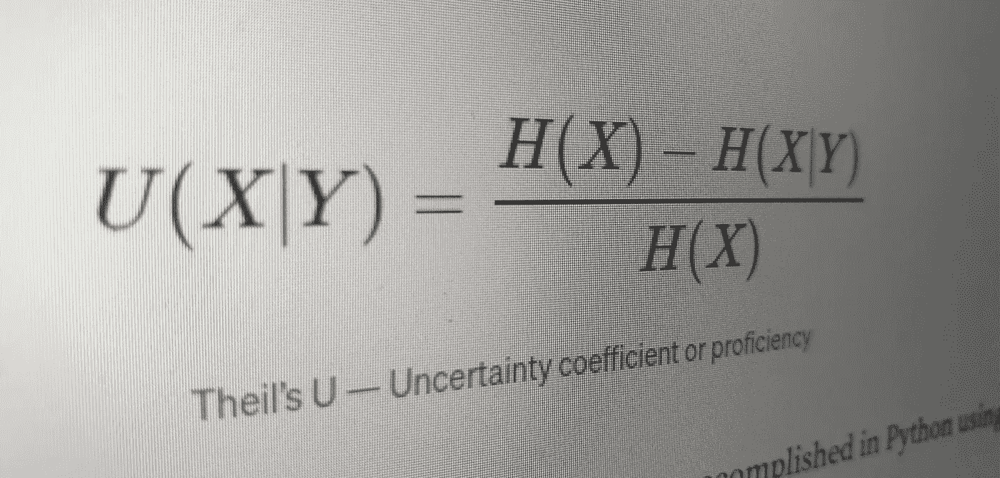
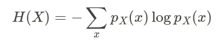
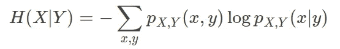
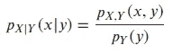
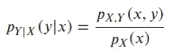
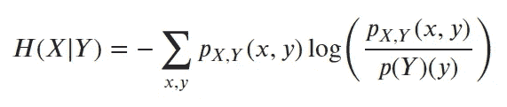
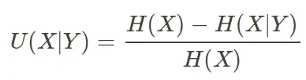
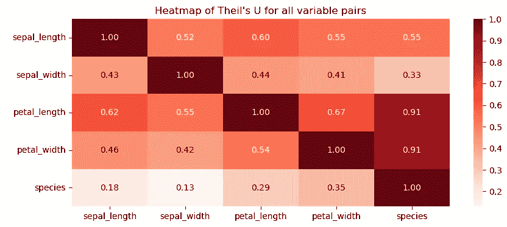

# 使用 Python 计算不确定性系数（Theil's U）

> 原文：[`towardsdatascience.com/calculating-the-uncertainty-coefficient-thiels-u-in-python-fce72a02431b?source=collection_archive---------6-----------------------#2024-10-18`](https://towardsdatascience.com/calculating-the-uncertainty-coefficient-thiels-u-in-python-fce72a02431b?source=collection_archive---------6-----------------------#2024-10-18)



## **离散（分类）变量之间的相关度量**

[](https://medium.com/@marclinder?source=post_page---byline--fce72a02431b--------------------------------)[](https://towardsdatascience.com/?source=post_page---byline--fce72a02431b--------------------------------) [Marc Linder](https://medium.com/@marclinder?source=post_page---byline--fce72a02431b--------------------------------)

·发表于 [Towards Data Science](https://towardsdatascience.com/?source=post_page---byline--fce72a02431b--------------------------------) ·6 分钟阅读·2024 年 10 月 18 日

--

## 引言

Theil's U，也称为不确定性系数或熵系数，量化了两个名义变量之间的关联强度。它评估了知道一个变量的值在多大程度上减少了对另一个变量的不确定性，提供了一个从 0 到 1 的关联度量值。较高的值表示更强的关系，使得 Theil's U 在统计学和数据科学等领域中非常有用，特别是用于探索分类数据之间的关系。

## 理论

Theil's U 是基于信息熵概念的名义关联度量。假设我们有来自两个离散随机变量 X 和 Y 的样本。

然后，**X 的熵** 定义为：



单一分布 X 的熵

并且 **给定 Y 的 X 的条件熵** 定义为：



给定 Y 的 X 的条件熵

然后，我们可以使用联合分布（分子）与 X 或 Y 的边际概率结合，分别计算条件分布：给定 Y 的 X 的条件分布（分母）或给定 X 的 Y 的条件分布，如下所示：



给定 y 的 x 的条件分布



给定 x 的 y 的条件分布

结果捕捉了一个变量在给定另一个变量值时的概率变化。我们可以通过使用 X 和 Y 的联合概率——即 X 和 Y 的不同组合的概率——以及 Y 的边际概率来计算给定 Y 的 X 的概率。然后，我们将它们的商代入 H(X)公式，得到：



给定 Y 的 X 的条件熵

理论讲解到此为止；接下来我们展示如何在 Python 中计算给定 Y 的 X 的条件熵。

```py
from typing import List, Union
from collections import Counter
import math

def conditional_entropy(
    x: List[Union[int, float]], 
    y: List[Union[int, float]]
) -> float:
    """ Calculates conditional entropy """

    # Count unique values
    y_counter = Counter(y)  # Counts of unique values in y
    xy_counter = Counter(list(zip(x, y)))  # Counts of unique pairs from (x, y)
    # Calculate sum of y values
    total_occurrences = sum(y_counter.values())
    # (Re-)set entropy to 0
    entropy = 0

    # For every unique value pair of x and y
    for xy in xy_counter.keys():
        # Joint probability of x AND y
        p_xy = xy_counter[xy] / total_occurrences
        # Marginal probability of y
        p_y = y_counter[xy[1]] / total_occurrences
        # Conditional probability of x given y
        p_x_given_y = p_xy / p_y
        # Calculate the conditional entropy H(X|Y)
        entropy += p_xy * math.log(p_x_given_y, 2)  # Use base 2 instead of natural (base e)

    return -entropy
```

一旦我们计算出给定 Y 的 X 的条件熵，我们就可以计算 Theil’s U。最后一步是计算 X 的熵，这是我们在本文开始时定义的。然后，不确定系数或熟练度可以按如下方式计算：



Theil’s U — 不确定系数或熟练度

从理论到实践，这可以通过以下 Python 代码来实现：

```py
import scipy.stats as ss

def theil_u(
    x: List[Union[int, float]], 
    y: List[Union[int, float]]
) -> float:
    """ Calculate Theil U """

    # Calculate conditional entropy of x and y
    H_xy = conditional_entropy(x,y)

    # Count unique values
    x_counter = Counter(x)

    # Calculate sum of x values
    total_occurrences = sum(x_counter.values())

    # Convert all absolute counts of x values in x_counter to probabilities
    p_x = list(map(lambda count: count/total_occurrences, x_counter.values()))

    # Calculate entropy of single distribution x
    H_x = ss.entropy(p_x)

    return (H_x - H_xy) / H_x if H_x != 0 else 0
```

最后，我们可以定义一个函数，计算给定数据集中每个特征组合的 Theil 值。我们可以使用以下 Python 代码来实现：

```py
import itertools
import pandas as pd

def get_theils_u_for_df(df: pd.DataFrame) -> pd.DataFrame:
    """ Compute Theil's U for every feature combination in the input df """

    # Create an empty dataframe to fill
    theilu = pd.DataFrame(index=df.columns, columns=df.columns)

    # Insert Theil U values into empty dataframe
    for var1, var2 in itertools.combinations(df, 2):
        u = theil_u(df[var1],df[var2])
        theilu[var1][var2] = round(u, 2) # fill lower diagonal

        u = theil_u(df[var2],df[var1])   
        theilu[var2][var1] = round(u, 2) # fill upper diagonal

    # Set 1s to diagonal where row index + column index == n - 1
    for i in range(0, len(theilu.columns)):
        for j in range(0, len(theilu.columns)):
            if i == j:
                theilu.iloc[i, j] = 1

    # Convert all values in the DataFrame to float
    return theilu.map(float)
```

## 代码示例

我们将使用著名的**鸢尾花数据集**演示代码的功能。除了数字变量外，该数据集还包含一个分类变量“物种”。传统的相关性度量方法，如皮尔逊相关性，限制了在捕捉分类和数值特征之间的关系方面的应用。然而，Theil’s U 可以有效地衡量“物种”与其他数值特征之间的关联。

```py
import pandas as pd
import seaborn as sns
import itertools
import matplotlib.pyplot as plt

# Load the Iris dataset from seaborn
df = sns.load_dataset('iris')

# Compute Theil's U for every feature combination in the input df
theilu = get_theils_u_for_df(df)

# Create a heatmap of the Theil's V values
plt.figure(figsize=(10, 4))
sns.heatmap(theilu, annot=True, cmap='Reds', fmt='.2f')
plt.title('Heatmap of Theil\'s U for all variable pairs') 
plt.show()
```

结果是所有变量对的 Theil’s U 热图。请注意，这个度量的优点在于它是非对称的，这意味着两个变量之间的关系可能因分析方向不同而有所不同。例如，Theil’s U 可以量化 X 提供多少关于 Y 的信息，而这可能与 Y 提供多少关于 X 的信息不同。



所有变量对的 Theil’s U 值热图

结果的解释相对直接：花瓣长度和花瓣宽度与分类变量“物种”的关联最强，两者的值均为 0.91。这表明，知道花瓣的尺寸能够提供关于花卉物种的高度信息。萼片长度与物种的关系也适中，值为 0.55，这意味着它提供了一些物种信息，尽管不如花瓣尺寸信息丰富。萼片宽度与物种的关联最弱，值为 0.33，表明它提供的关于花卉类型的信息相对较少。萼片尺寸与物种之间较低的值突显了花瓣尺寸在预测物种时提供的信息更多，这与著名的鸢尾花数据集的已知特性一致。

## 结论

在本文中，我们展示了如何计算 Theil’s U 来评估分类变量和数值变量之间的关联。通过将这一度量应用于 Iris 数据集，我们展示了花瓣尺寸在预测花卉物种中的重要性，突显了 Theil’s U 相比传统相关方法的有效性。

*来源*

+   Theil, H. (1958): *经济预测与政策*. 阿姆斯特丹: North Holland.

+   Theil, H. (1966): *应用经济预测*. 芝加哥: Rand McNally.

+   Bliemel, F. (1973): Theil 的预测准确度系数：澄清，*市场研究杂志* 10(4)，第 444-446 页

注：除非另有说明，所有图片均由作者提供。
