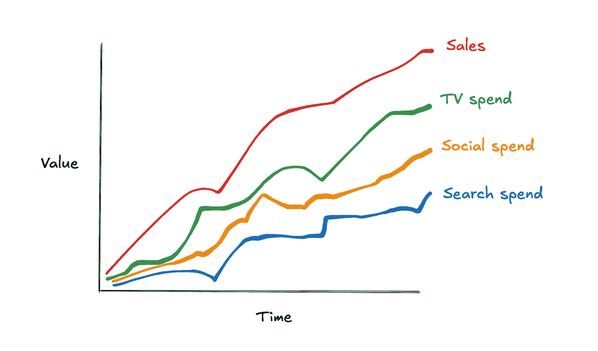
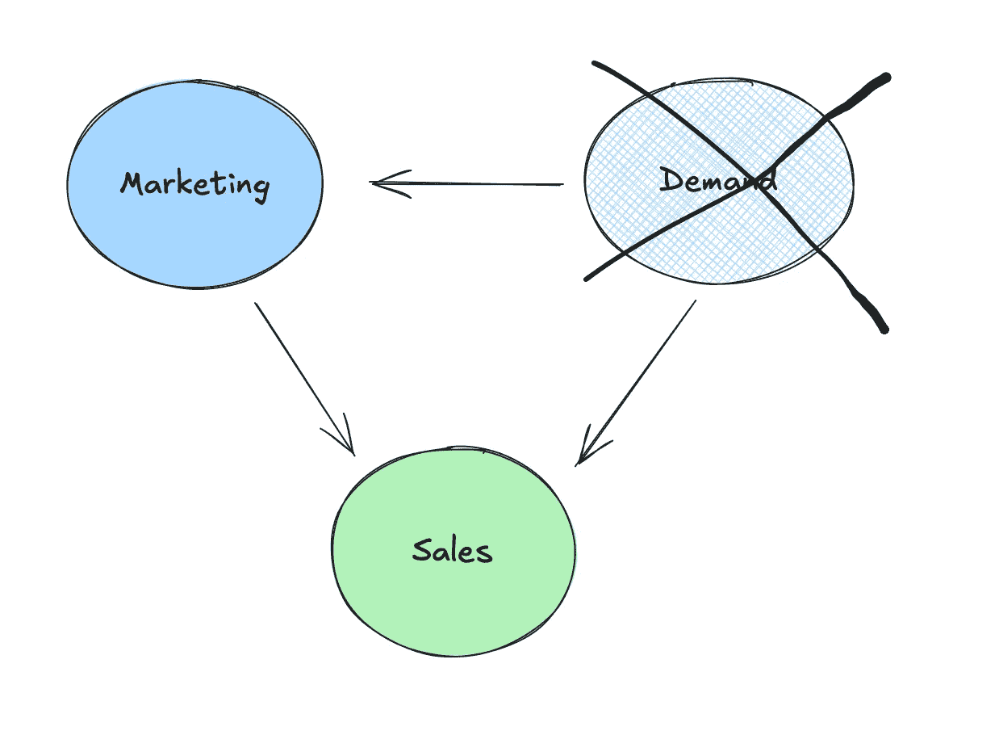
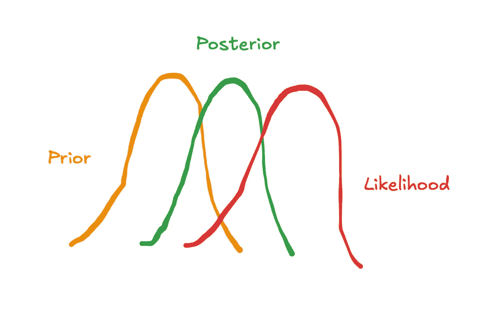
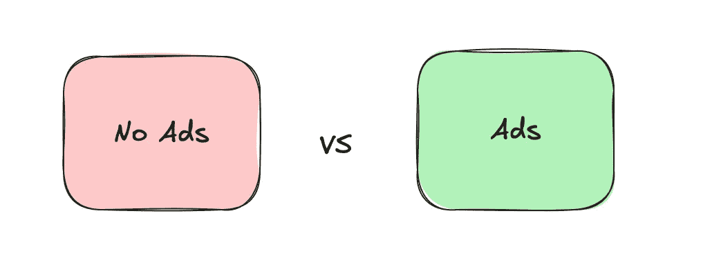
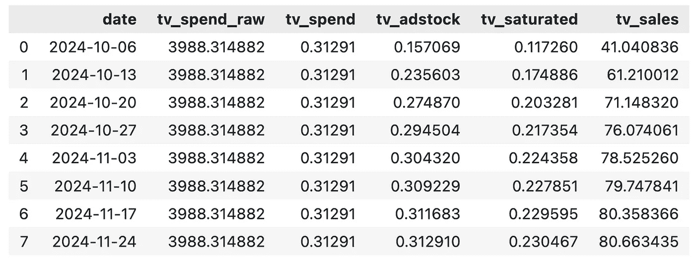
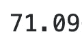
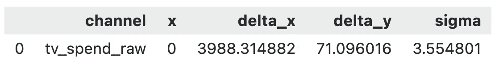
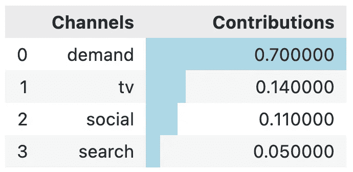
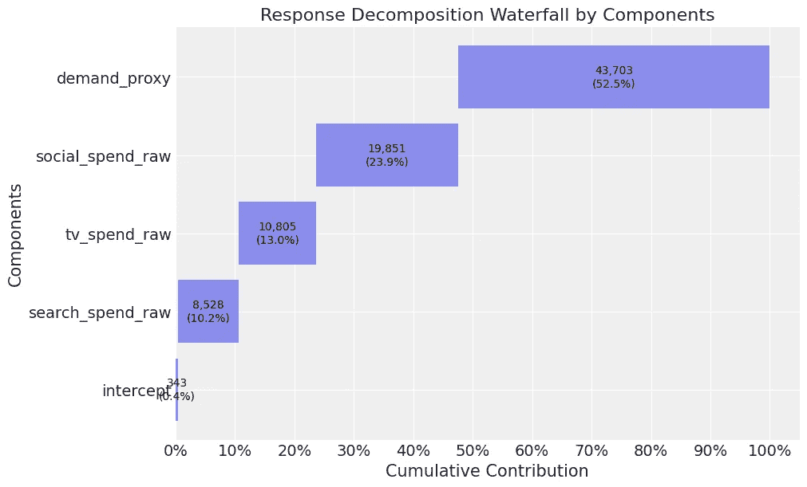

# 校准 Python 中的市场营销组合模型

> 原文：[`towardsdatascience.com/calibrating-marketing-mix-models-in-python-49dce1a5b33d?source=collection_archive---------3-----------------------#2024-11-11`](https://towardsdatascience.com/calibrating-marketing-mix-models-in-python-49dce1a5b33d?source=collection_archive---------3-----------------------#2024-11-11)

## 本系列教程的第二部分，帮助你掌握如何在 pymc 中应用市场营销组合模型（MMM）

[](https://medium.com/@raz1470?source=post_page---byline--49dce1a5b33d--------------------------------)[](https://towardsdatascience.com/?source=post_page---byline--49dce1a5b33d--------------------------------) [Ryan O'Sullivan](https://medium.com/@raz1470?source=post_page---byline--49dce1a5b33d--------------------------------)

·发布于[Towards Data Science](https://towardsdatascience.com/?source=post_page---byline--49dce1a5b33d--------------------------------) ·阅读时间：11 分钟·2024 年 11 月 11 日

--



用户生成的图像

# 本系列内容是什么？

欢迎来到我的市场营销组合建模（MMM）系列教程的第二部分，这是一个实践指南，帮助你掌握 MMM。在本系列中，我们将覆盖模型训练、验证、校准和预算优化等关键主题，所有这些都使用强大的**pymc-marketing** Python 包。无论你是 MMM 的新手，还是希望提升技能的用户，本系列将为你提供实践工具和见解，以改进你的市场营销策略。

如果你错过了第一部分，请在这里查看：

[](/mastering-marketing-mix-modelling-in-python-7bbfe31360f9?source=post_page-----49dce1a5b33d--------------------------------) ## 掌握 Python 中的市场营销组合建模

### 本系列教程的第一部分，帮助你掌握如何在 pymc 中应用市场营销组合模型（MMM）

towardsdatascience.com

# 介绍

在本系列的第二部分，我们将重点介绍如何使用来自实验的信息先验来校准模型：

+   为什么校准市场营销组合模型如此重要？

+   我们如何使用贝叶斯先验来校准我们的模型？

+   我们可以进行哪些实验来为我们的贝叶斯先验提供信息？

然后，我们将通过使用**pymc-marketing**包在 Python 中进行操作，来完成我们在第一篇文章中构建的模型的校准。

完整的笔记本可以在这里找到：

[](https://github.com/raz1470/pymc_marketing/blob/main/notebooks/2.%20calibrating%20marketing%20mix%20models%20%28MMM%29%20in%20python.ipynb?source=post_page-----49dce1a5b33d--------------------------------) [## pymc_marketing/notebooks/2\. calibrating marketing mix models (MMM) in python.ipynb at main ·…

### MMM 包的演示：pymc_marketing。通过在…创建帐户来贡献 raz1470/pymc_marketing 的开发。

[github.com](https://github.com/raz1470/pymc_marketing/blob/main/notebooks/2.%20calibrating%20marketing%20mix%20models%20%28MMM%29%20in%20python.ipynb?source=post_page-----49dce1a5b33d--------------------------------)

# 1.0 校准营销组合模型

营销组合建模（MMM）是一种统计技术，用于估算各种营销渠道（如电视、社交媒体、付费搜索）对销售的影响。MMM 的目标是了解每个渠道的投资回报率（ROI），并优化未来的营销支出。

我们需要校准模型的原因有很多。在开始 Python 操作之前，让我们先稍微探讨一下这些原因！

## 1.1 为什么校准营销组合模型很重要？

校准 MMM 至关重要，因为虽然它们提供了有价值的洞察，但常常受限于几个因素：

+   **多重共线性：**当不同的营销渠道高度相关时，就会发生这种情况，这使得很难区分它们各自的影响。例如，电视和社交媒体可能同时运行，导致它们的影响重叠。校准通过结合额外的数据或约束来帮助解开这些渠道的影响。

+   **未观察到的混杂因素：**MMM 模型依赖于观察到的数据，但可能会忽略一些也影响营销和销售的重要变量，例如季节性或市场需求的变化。校准可以帮助调整这些未观察到的混杂因素。



用户生成的图像（excalidraw）

+   **再定向偏差：**你是否曾访问过一个产品的网站，然后发现所有社交媒体平台突然“巧合地”向你展示该产品的广告？这并非巧合，这就是我们所说的再定向，它可以有效。然而，许多受到再定向的潜在客户，原本无论如何也会购买该产品！

如果没有适当的校准，这些问题可能导致对营销渠道表现的估算不准确，从而导致在营销支出和策略上的决策失误。

## 1.2 我们如何使用贝叶斯先验来校准我们的模型？

在上一篇文章中，我们讨论了贝叶斯先验如何表示我们对模型中参数的初步信念，例如电视支出对销售的影响。我们还讨论了**pymc-marketing**中的默认参数是合理的选择，但信息量较弱。根据实验提供有信息的先验可以帮助校准我们的模型，并解决上一节中提出的问题。



用户生成的图像（excalidraw）

我们可以通过几种方式在**pymc-marketing**中提供先验信息：

+   直接修改默认的`saturation_beta`先验，如下例所示，使用截断正态分布来强制使用正值：

```py
model_config = {
    'intercept': Prior("Normal", mu=0, sigma=2),
    'likelihood': Prior("Normal", sigma=Prior("HalfNormal", sigma=2)),
    'gamma_control': Prior("Normal", mu=0, sigma=2, dims="control"),
    'gamma_fourier': Prior("Laplace", mu=0, b=1, dims="fourier_mode"),
    'adstock_alpha': Prior("Beta", alpha=1, beta=3, dims="channel"),
    'saturation_lam': Prior("Gamma", alpha=3, beta=1, dims="channel"),
    'saturation_beta': Prior("TruncatedNormal", mu=[0.02, 0.04, 0.01], lower=0, sigma=0.1, dims=("channel"))
}

mmm_with_priors = MMM(
    model_config=model_config,    
    adstock=GeometricAdstock(l_max=8),
    saturation=LogisticSaturation(),
    date_column=date_col,
    channel_columns=channel_cols,
    control_columns=control_cols,
)
```

+   使用`add_lift_test_measurements`方法，该方法为模型添加一个新的似然项，帮助校准饱和度曲线（不用担心，我们将在 Python 教程中详细讲解）：

[## lift_test - 开源营销分析解决方案

### 将提升测试作为饱和函数的观察值。这提供了…

[www.pymc-marketing.io](https://www.pymc-marketing.io/en/stable/api/generated/pymc_marketing.mmm.lift_test.html?source=post_page-----49dce1a5b33d--------------------------------)

如果你不熟悉贝叶斯分析怎么办？你可以选择使用像 cvxpy 这样的包运行约束回归。以下是如何通过为变量的系数设置上下限来实现的示例：

```py
import cvxpy as cp

def train_model(X, y, reg_alpha, lower_bounds, upper_bounds):
    """
    Trains a linear regression model with L2 regularization (ridge regression) and bounded constraints on coefficients.

    Parameters:
    -----------
    X : numpy.ndarray or similar
        Feature matrix where each row represents an observation and each column a feature.
    y : numpy.ndarray or similar
        Target vector for regression.
    reg_alpha : float
        Regularization strength for the ridge penalty term. Higher values enforce more penalty on large coefficients.
    lower_bounds : list of floats or None
        Lower bounds for each coefficient in the model. If a coefficient has no lower bound, specify as None.
    upper_bounds : list of floats or None
        Upper bounds for each coefficient in the model. If a coefficient has no upper bound, specify as None.

    Returns:
    --------
    numpy.ndarray
        Array of fitted coefficients for the regression model.

    Example:
    --------
    >>> coef = train_model(X, y, reg_alpha=1.0, lower_bounds=[0.2, 0.4], upper_bounds=[0.5, 1.0])

    """

    coef = cp.Variable(X.shape[1])
    ridge_penalty = cp.norm(coef, 2)
    objective = cp.Minimize(cp.sum_squares(X @ coef - y) + reg_alpha * ridge_penalty)

    # Create constraints based on provided bounds
    constraints = (
        [coef[i] >= lower_bounds[i] for i in range(X.shape[1]) if lower_bounds[i] is not None] +
        [coef[i] <= upper_bounds[i] for i in range(X.shape[1]) if upper_bounds[i] is not None]
    )

    # Define and solve the problem
    problem = cp.Problem(objective, constraints)
    problem.solve()

    # Print the optimization status
    print(problem.status)

    return coef.value
```

## 1.3 我们可以进行哪些实验来为我们的贝叶斯先验提供依据？

实验可以提供强有力的证据，帮助确定 MMM 中使用的先验。一些常见的实验包括：



用户生成的图像（excalidraw）

+   **转化提升测试 —** 这些测试通常在 Facebook、YouTube、Snapchat、TikTok 和 DV360 等平台上进行，用户被随机分为测试组和控制组。测试组会接触到营销活动，而控制组则没有。两组之间的转化率差异可以揭示渠道实际带来的提升效果。

+   **Geo-Lift 测试 —** 在 Geo-Lift 测试中，某些地理区域的营销活动会被关闭，而其他区域则继续进行。通过比较测试区和控制区的表现，你可以衡量每个区域营销活动的增量影响。CausalPy Python 包提供了一个易于使用的实现，值得一试：

[](https://causalpy.readthedocs.io/en/stable/notebooks/geolift1.html?source=post_page-----49dce1a5b33d--------------------------------) [## 使用 CausalPy 进行贝叶斯 GeoLift - CausalPy 0.4.0 文档

### 本笔记本介绍了如何使用贝叶斯合成控制功能来评估“GeoLift”。我们的假设…

[causalpy.readthedocs.io](https://causalpy.readthedocs.io/en/stable/notebooks/geolift1.html?source=post_page-----49dce1a5b33d--------------------------------)

+   **回退测试 —** 这种方法涉及在短时间间隔内快速开启和关闭营销活动，以观察消费者行为的变化。它最适用于对即刻产生影响的渠道，比如付费搜索。

通过这些实验，你可以收集强有力的实证数据来为你的贝叶斯先验提供依据，并进一步提高营销组合模型的准确性和校准度。

# 2.0 Python 教程

现在我们理解了为什么需要校准我们的模型，接下来我们就来校准第一篇文章中的模型！在本次操作指南中，我们将涵盖：

+   模拟数据

+   模拟实验结果

+   对实验结果进行预处理

+   校准模型

+   验证模型

## 2.1 模拟数据

我们将从模拟第一篇文章中使用的数据开始。如果你想了解更多关于数据生成过程的内容，请查看第一篇文章，我们在那里进行了详细的操作演示：

[](/mastering-marketing-mix-modelling-in-python-7bbfe31360f9?source=post_page-----49dce1a5b33d--------------------------------) ## 在 Python 中掌握市场营销组合建模

### 一本帮助你掌握 pymc 中 MMM 的实践指南 第一部分

towardsdatascience.com

当我们在第一篇文章中训练模型时，电视、社交和搜索的贡献都被高估了。这似乎是由于需求代理没有像真实需求那样做出贡献。因此，让我们从停下的地方继续，考虑运行实验来解决这个问题！

## 2.2 模拟实验结果

为了模拟一些实验结果，我们编写了一个函数，该函数接收渠道的已知参数并输出该渠道的真实贡献。记住，实际上我们并不知道这些参数，但这个练习将帮助我们理解并测试 **pymc-marketing** 中的校准方法。

```py
def exp_generator(start_date, periods, channel, adstock_alpha, saturation_lamda, beta, weekly_spend, max_abs_spend, freq="W"):
    """
    Generate a time series of experiment results, incorporating adstock and saturation effects.

    Parameters:
    ----------
    start_date : str or datetime
        The start date for the time series.
    periods : int
        The number of time periods (e.g. weeks) to generate in the time series.
    channel : str
        The name of the marketing channel.
    adstock_alpha : float
        The adstock decay rate, between 0 and 1..
    saturation_lamda : float
        The parameter for logistic saturation.
    beta : float
        The beta coefficient.
    weekly_spend : float
        The weekly raw spend amount for the channel.
    max_abs_spend : float
        The maximum absolute spend value for scaling the spend data, allowing the series to normalize between 0 and 1.
    freq : str, optional
        The frequency of the time series, default is 'W' for weekly. Follows pandas offset aliases
    Returns:
    -------
    df_exp : pd.DataFrame
        A DataFrame containing the generated time series with the following columns:
        - date : The date for each time period in the series.
        - {channel}_spend_raw : The unscaled, raw weekly spend for the channel.
        - {channel}_spend : The scaled channel spend, normalized by `max_abs_spend`.
        - {channel}_adstock : The adstock-transformed spend, incorporating decay over time based on `adstock_alpha`.
        - {channel}_saturated : The adstock-transformed spend after applying logistic saturation based on `saturation_lamda`.
        - {channel}_sales : The final sales contribution calculated as the saturated spend times `beta`.

    Example:
    --------
    >>> df = exp_generator(
    ...     start_date="2023-01-01",
    ...     periods=52,
    ...     channel="TV",
    ...     adstock_alpha=0.7,
    ...     saturation_lamda=1.5,
    ...     beta=0.03,
    ...     weekly_spend=50000,
    ...     max_abs_spend=1000000
    ... )

    """
    # 0\. Create time dimension
    date_range = pd.date_range(start=start_date, periods=periods, freq=freq)
    df_exp = pd.DataFrame({'date': date_range})

    # 1\. Create raw channel spend
    df_exp[f"{channel}_spend_raw"] = weekly_spend

    # 2\. Scale channel spend
    df_exp[f"{channel}_spend"] = df_exp[f"{channel}_spend_raw"] / max_abs_spend

    # 3\. Apply adstock transformation
    df_exp[f"{channel}_adstock"] = geometric_adstock(
        x=df_exp[f"{channel}_spend"].to_numpy(),
        alpha=adstock_alpha,
        l_max=8, normalize=True
    ).eval().flatten()

    # 4\. Apply saturation transformation
    df_exp[f"{channel}_saturated"] = logistic_saturation(
        x=df_exp[f"{channel}_adstock"].to_numpy(),
        lam=saturation_lamda
    ).eval()

    # 5\. Calculate contribution to sales
    df_exp[f"{channel}_sales"] = df_exp[f"{channel}_saturated"] * beta

    return df_exp
```

以下我们使用该函数为电视上的 8 周提升测试创建结果：

```py
# Set parameters for experiment generator
start_date = "2024-10-01"
periods = 8
channel = "tv"
adstock_alpha = adstock_alphas[0]
saturation_lamda = saturation_lamdas[0]
beta = betas[0]
weekly_spend = df["tv_spend_raw"].mean()
max_abs_spend = df["tv_spend_raw"].max()

df_exp_tv = exp_generator(start_date, periods, channel, adstock_alpha, saturation_lamda, beta, weekly_spend, max_abs_spend)

df_exp_tv
```



用户生成的图像

即使我们每周在电视上花费相同的金额，电视的贡献每周也会有所不同。这是由于广告效应的影响，我们在这里的最佳选择是取每周贡献的平均值。

```py
weekly_sales = df_exp_tv["tv_sales"].mean()

weekly_sales
```



用户生成的图像

## 2.3 对实验结果进行预处理

现在我们已经收集了实验结果，需要对其进行预处理，以便将其转换为模型所需的格式。我们需要为模型提供一个数据框，每个实验占一行，格式如下：

+   `channel`：被测试的渠道

+   `x`：测试前的渠道支出

+   `delta_x`：对 `x` 的变动

+   `delta_y`：由于 `delta_x` 产生的推断销售变化

+   `sigma`：`delta_y` 的标准偏差

我们没有使用不确定性度量来模拟实验结果，因此为了简化处理，我们将 sigma 设置为提升的 5%。

```py
df_lift_test = pd.DataFrame({
    "channel": ["tv_spend_raw"],
    "x": [0],
    "delta_x": weekly_spend,
    "delta_y": weekly_sales,
    "sigma": [weekly_sales * 0.05],
    }
)

df_lift_test
```



用户生成的图像

在 sigma 方面，理想情况下，你应该有一个结果的不确定性度量（你可以从大多数转换提升或地理提升测试中获得）。

## 2.4 校准模型

我们现在将重新训练第一篇文章中的模型。我们将以与上次相同的方式准备训练数据，具体步骤如下：

+   将数据分割为特征和目标。

+   为训练和“超时”切片创建索引——“超时”切片将帮助我们验证模型。

```py
# set date column
date_col = "date"

# set outcome column
y_col = "sales"

# set marketing variables
channel_cols = ["tv_spend_raw",
                "social_spend_raw",
                "search_spend_raw"]

# set control variables
control_cols = ["demand_proxy"]

# create arrays
X = df[[date_col] + channel_cols + control_cols]
y = df[y_col]

# set test (out-of-sample) length
test_len = 8

# create train and test indexs
train_idx = slice(0, len(df) - test_len)
out_of_time_idx = slice(len(df) - test_len, len(df))
```

然后我们加载从第一篇文章保存的模型，并在加入实验结果后重新训练模型：

```py
mmm_default = MMM.load("./mmm_default.nc")
mmm_default.add_lift_test_measurements(df_lift_test)
mmm_default.fit(X[train_idx], y[train_idx])
```

我们这次不会重点关注模型诊断，但如果你愿意，可以查看笔记本，自己深入了解。

## 2.5 验证模型

现在让我们评估新模型与真实贡献的比较。下面我们将检查真实的贡献：

```py
channels = np.array(["tv", "social", "search", "demand"])

true_contributions = pd.DataFrame({'Channels': channels, 'Contributions': contributions})
true_contributions= true_contributions.sort_values(by='Contributions', ascending=False).reset_index(drop=True)
true_contributions = true_contributions.style.bar(subset=['Contributions'], color='lightblue')

true_contributions
```



用户生成的图片

当我们比较新模型的真实贡献时，我们看到电视的贡献现在非常接近（比我们第一篇文章中的模型更接近，那时电视贡献为 24%！）。

```py
mmm_default.plot_waterfall_components_decomposition(figsize=(10,6));
```



用户生成的图片

搜索和社交的贡献仍然被高估了，但我们也可以在这里进行实验来解决这个问题。

# 结语

今天，我们向你展示了如何通过实验结果来整合先验知识。**pymc-marketing**包使得运行模型的分析师工作变得简单。如果你想深入了解其工作原理，可以查看他们的教程：

[## 提升测试校准 - 开源营销分析解决方案](https://www.pymc-marketing.io/en/stable/notebooks/mmm/mmm_lift_test.html?source=post_page-----49dce1a5b33d--------------------------------)

### 你可能听说过这句话：“所有模型都是错误的，但有些是有用的。”这在许多领域都是正确的，而……

[www.pymc-marketing.io](https://www.pymc-marketing.io/en/stable/notebooks/mmm/mmm_lift_test.html?source=post_page-----49dce1a5b33d--------------------------------)

然而，不要被误导……在你通向一个精确校准模型的道路上，仍然存在一些重大挑战！

在地理区域与渠道的约束方面，或者在说服营销团队接受实验的过程中遇到的困难，都是其中的一些挑战。

值得考虑的一件事是进行一次完整的营销暂停，并将结果作为先验信息来指导需求/基础销售。这有助于解决后勤挑战，同时也提升了实验的效力（因为效应大小增加）。

希望你喜欢第二篇文章！如果你想继续朝着掌握 MMM 的方向前进，可以关注我——在下一篇文章中，我们将开始思考如何优化营销预算！
