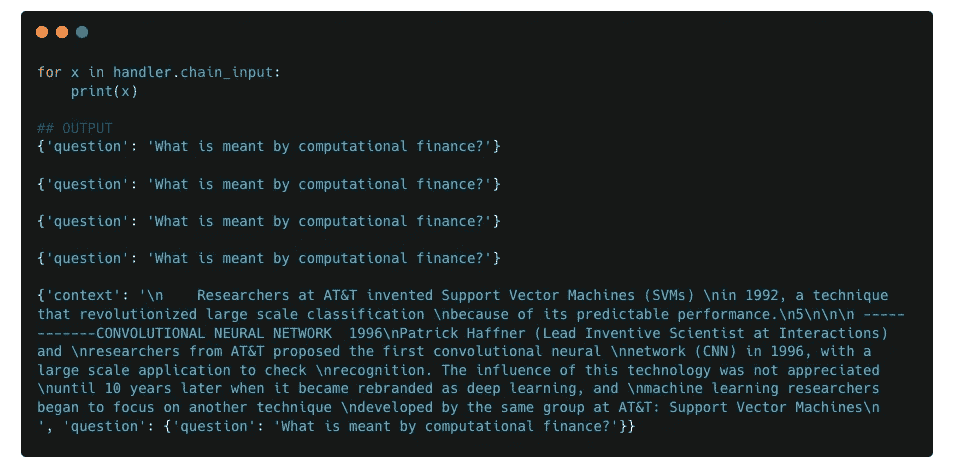

# LangChain 中的回调函数和管道结构

> 原文：[`towardsdatascience.com/callbacks-and-pipeline-structures-in-langchain-925aa077227e?source=collection_archive---------6-----------------------#2024-04-16`](https://towardsdatascience.com/callbacks-and-pipeline-structures-in-langchain-925aa077227e?source=collection_archive---------6-----------------------#2024-04-16)

## 了解 LangChain 管道的结构、回调函数的工作原理、如何创建自定义回调函数并将其集成到管道中，以便更好地进行监控。

 [Roshan Santhosh](https://medium.com/@RSK2327?source=post_page---byline--925aa077227e--------------------------------)

·发布于[Towards Data Science](https://towardsdatascience.com/?source=post_page---byline--925aa077227e--------------------------------) ·11 分钟阅读·2024 年 4 月 16 日

--

回调函数是一个重要的功能，帮助你监控和调试管道。在本笔记中，我们将介绍回调函数的基础知识，以及如何为你的使用场景创建自定义回调函数。更重要的是，通过示例，我们还将深入理解 LangChain 管道的结构/组件化，并探讨这些如何影响自定义回调函数的设计。

本笔记假设读者已具备对 LangChain 及其工作流程的基本了解。

# 回调函数的基本结构

要了解 LangChain 中回调函数的基础知识，我们从[官方文档](https://python.langchain.com/docs/modules/callbacks/)开始，在这里我们可以找到**BaseCallbackHandler**类的定义。

图片摘自官方[LangChain 文档](https://python.langchain.com/docs/modules/callbacks/)

[BaseCallbackManager 代码](https://github.com/langchain-ai/langchain/blob/master/libs/core/langchain_core/callbacks/base.py)

如你所见，这是一个抽象类，定义了许多方法，以涵盖 LangChain 管道中的各种事件。这些方法可以分为以下几个部分：

1.  LLM [开始, 结束, 错误, 新令牌]

1.  Chain [开始, 结束, 错误]

1.  Tool [开始, 结束, 错误]

1.  Agent [动作, 完成]

如果你之前使用过 LangChain 管道，方法及其提供的描述应该是自解释的。例如，***on_llm_start***回调是在 LangChain 管道将输入传递给 LLM 时触发的事件。随后，***on_llm_end***在 LLM 提供最终输出时被触发。

> *注意：除了上面显示的内容外，还有一些事件触发器可以使用。这些可以在* [*这里*](https://api.python.langchain.com/en/latest/runnables/langchain_core.runnables.base.RunnableSequence.html)*找到。这些触发器涵盖了与检索器、提示、聊天模型等相关的内容。*

# 理解回调的工作原理

回调是一个非常常见的编程概念，已经广泛使用了一段时间，因此回调的工作原理在高层次上是众所周知的。因此，在这篇文章中，我们专注于回调在 LangChain 中的特定细节，以及如何利用它满足我们的特定用例。

记住我们在上一节看到的基本 Callback 类，我们通过一系列越来越复杂的示例来探索 LangChain 中的回调，并在此过程中更好地理解 LangChain 管道的结构。这将是一种自上而下的学习方法，我们首先从示例开始，之后再讲解实际的定义，因为我发现这种方法对这个特定主题更为有用。

# 示例 1

我们从一个简单的虚拟链开始，它有三个组件：2 个提示和一个自定义函数来连接它们。我称之为虚拟示例，因为你不太可能需要两个单独的提示来相互交互，但它为理解回调和 LangChain 管道提供了一个更易于开始的例子。

示例 1：LangChain 管道的基本结构

用代码实现这一点会是这样的：

示例 1 的管道实现

上面的代码是非常基础的内容。唯一可能复杂的部分是***retrieve_text***和这里使用的***RunnableLambda***函数。之所以需要这样做，是因为***qa_prompt1***的输出格式与***qa_prompt2***所需的输出格式不兼容。

**定义自定义回调**

对于我们的自定义回调，我们定义了一个名为 CustomCallback1 的新子类，它继承自 BaseCallbackHandler，并定义了***on_chain_start***方法。该方法的定义非常简单，因为它只是接受传递给它的输入值，并将其保存在两个特定的变量中：***chain_input***和***serialized_input***。

**调用自定义回调**

示例 1：使用自定义回调调用管道

上面的代码展示了将自定义回调传递给管道的几种可能方式之一：将回调对象的列表作为'callbacks'对应键的值传递。这也使得很容易猜测*你可以将多个回调传递给你的 LangChain 管道。*

## 解码回调/管道结构

现在进入有趣的部分。在我们定义回调函数并将其传递给管道后，我们将深入探讨回调输出。

我们首先查看存储在***chain_input***中的值。

示例 1：回调处理程序的 chain_input 变量内容

**观察结果：**

1.  尽管**我们链中有 3 个组件，但*chain_input***中有 4 个值。这与***on_chain_start***方法被触发 4 次而不是 3 次相对应。

1.  对于前两个***chain_input***值/on_chain_start 触发器，输入与用户提供的输入相同。

接下来我们查看***serialized_input***的输出。

**观察结果：**

1.  第一个组件是一个***RunnableSequence***，这是一个用户没有添加但 LangChain 自动添加的组件。其余组件直接对应管道中用户定义的组件。

1.  ***serialized_input***的完整内容非常庞大！尽管该内容有明确的结构，但它确实超出了本文的范围，而且可能对最终用户没有太大实际意义。

## 我们如何解读这些结果？

在大多数情况下，***chain_input***和***serialized_input***中看到的输出是有意义的。无论是输入值还是组件的名称/ID。唯一不太明了的部分是***RunnableSequence***组件，因此我们对此进行了更详细的查看。

正如我之前提到的，***serialized_input***的完整内容庞大且难以消化。因此，为了简化问题，我们只查看***serialized_input***中描述的高级属性，并通过这些属性来尝试解读结果。为此，我们使用了一个名为***getChainBreakdown***的自定义调试函数（代码见笔记本）。

我们在所有***serialized_input***的值上调用***getChainBreakdown***并观察输出。特别是对于第一个***RunnableSequence***元素，我们查看 kwargs 字典的键：first，middle，last，name。

经过仔细检查 kwargs 参数及其值后，我们发现它们的结构与之前的管道组件完全一致。事实上，**第一个、中间和最后的组件正好对应管道中用户定义的组件。**

更仔细地检查 RunnableSequence 的 kwargs 值。

上述细节构成了我们得出最终结论的基础。即管道的结构如下所示：

示例 1 : LangChain 管道结构

> 我们在这里稍微做了一个跳跃，因为在通过一系列示例并观察 LangChain 内部创建这些组件的格式后，确认了上述流程图。所以请耐心等待，我们将通过这些其他示例来巩固我们在这里得出的结论。

根据上述定义的结构，其他部分的拼图也能很好的组合在一起。专注于 chain_input 值，下面我们将它们映射到上述定义的组件（包括它们的顺序）。

示例 1 : 将 chain_input 值映射到管道组件

**观察结果：**

1.  对于 RunnableSequence，它作为整个管道的包装器，用户的输入也作为 RunnableSequence 组件的输入。

1.  对于第一个 ChatPromptTemplate（qa_prompt1），作为管道中的第一个“真正的”组件，它直接接收用户的输入。

1.  对于 RunnableLambda（retrieve_text），它接收来自 qa_prompt1 的输出作为输入，qa_prompt1 是一个 Message 对象。

1.  对于最后一个 ChatPromptTemplate（qa_prompt2），它接收来自 retrieve_text 的输出作为输入，retrieve_text 是一个字典，其中 'prompt' 是唯一的键。

上述细分显示了如何将上述描述的管道结构与 ***serialized_input*** 和 ***chain_input*** 中看到的数据完美地契合。

# **示例 2**

对于下一个示例，我们通过在最后一步添加 LLM 来扩展示例 1。

示例 2 : 管道定义

对于回调，由于我们现在已经将 LLM 加入其中，我们定义了一个新的自定义回调，其中额外定义了 ***on_llm_start*** 方法。它的功能与 on_chain_start 相同，输入参数被保存在回调对象变量中：***chain_input*** 和 ***serialized_input***。

示例 2 : 新的自定义回调，添加了 on_llm_start 方法

## 提议管道结构

在此阶段，我们不再评估回调变量，而是提出管道的潜在结构。根据我们从第一个示例中学到的内容，以下应该是管道的潜在结构。

示例 2 : 提议的管道结构

因此，我们将有一个 ***RunnableSequence*** 组件作为管道的包装器。并且在 ***RunnableSequence*** 组件中嵌套一个新的 ***ChatOpenAI*** 对象。

## **验证提议的结构使用数据**

现在我们查看回调对象中的值，以验证上述提议的结构。

我们首先查看存储在 ***chain_input*** 中的值。

示例 2 : chain_input 值

然后是 ***serialized_input*** 值：

示例 2：serialized_input 值

以及对 RunnableSequence 组件的更深入检查

示例 2：仔细检查 RunnableSequence 的 kwargs 值

**观察：**

1.  ***serialized_input***的值验证了在管道结构中提出的激活/触发序列：RunnableSequence -> ChatPromptTemplate(qa_prompt1) -> RunnableLambda(retrieve_text) -> ChatPromptTemplate(qa_prompt2) -> ChatOpenAI。

1.  ***chain_input***的值也正确映射到提议的结构中。唯一的新增加项是第五个条目，它对应于来自***qa_prompt2***的输出，这个输出作为输入传递给 ChatOpenAI 对象。

1.  RunnableSequence 的组件 kwargs 也验证了提议的结构，因为新的“最后”元素是 ChatOpenAI 对象。

到此阶段，你应该对 LangChain 管道的结构和不同回调事件的触发时机有了直观的理解。

> 虽然到目前为止我们只关注了链和 LLM 事件，但这些事件同样适用于其他工具和代理触发器。

# 示例 3

对于下一个示例，我们将处理一个更复杂的链，涉及并行实现（RunnableParallel）。

## 链/回调实现

该链的第一个模块实现了并行功能，它计算出两个值：上下文和问题，这两个值随后被传递到一个提示模板中，以生成最终的提示。需要并行功能是因为我们需要同时将上下文和问题传递给提示模板，其中上下文从不同的源获取，而问题则由用户提供。

对于上下文值，我们使用一个静态函数***get_data***，它返回相同的文本片段（这是一个用于 RAG 应用的实际检索器的虚拟版本）。

示例 3：链的实现

对于回调实现，我们使用与第一个示例相同的回调，即 CustomCallback1。

## 解码回调/管道结构

与前面的示例类似，我们首先查看***chain_input***和***serialized_input***的输出。

示例 3：chain_input 值

示例 3：serialized_input 值

我们还将深入研究***RunnableSequence***（索引 0）和***RunnableParallel***（索引 1）组件。

**观察：**

1.  与前面的示例一致，RunnableSequence 作为整个管道的包装器。它的第一个组件是***RunnableParallel***组件，最后一个组件是***ChatPromptTemplate***组件。

1.  RunnableParallel 包含两个组件：***RunnablePassthrough***和***RunnableLambda***（***get_data***）。

1.  前四个组件的输入：***RunnableSequence***、***RunnableParallel***、***RunnablePassthrough*** 和 ***RunnableLambda***（***get_data***）是相同的：提供的用户输入。只有最终的***ChatPromptTemplate***组件的输入不同，这是一个包含问题和上下文键的字典。

基于这些观察，我们可以推断出管道的最终结构如下：

示例 3：LangChain 管道结构

# 示例 4

与示例 3 相同，但增加了一个用于检索上下文的处理函数。

## Chain/Callback 实现

示例 4：链实现

## 解码回调/管道结构

与之前的示例类似，我们再次查看常见的数据点。

示例 4：chain_input 值

示例 4：serialized_input 值

我们观察到现在管道中有 2 个 RunnableSequence 组件。因此，下一步我们将深入探讨这两个 RunnableSequence 组件，查看其内部组成部分。

**观察：**

1.  对于第一个***RunnableSequence***组件，它的组成部分与之前的示例相同。以***RunnableParallel***开始，以***ChatPromptTemplate***结束。

1.  对于第二个***RunnableSequence***，它的第一个组件是***RunnableLambda (get_data)***组件，最后一个组件是***RunnableLambda (format_docs)***组件。这基本上是管道中负责生成‘context’值的部分。因此，一个 LangChain 管道可以有多个 RunnableSequence 组件，特别是当你创建‘子管道’时。

> 在这种情况下，‘context’值的创建可以被视为一个独立的管道，因为它涉及到两个不同的组件连接在一起。所以在你的主管道中，任何这样的子管道都会被一个 RunnableSequence 组件包装。

3. chain_input 中的值也与管道组件及其顺序很好地匹配（这里不再逐一分析每个组件的输入，因为现在应该很容易理解了）。

基于上述观察，以下是该管道的已识别结构。

示例 4：LangChain 管道结构

# 结论

本文的目标是帮助培养对 LangChain 管道结构及回调触发器如何与管道关联的（直观）理解。

通过逐步分析越来越复杂的链式实现，我们能够理解 LangChain 管道的一般结构以及如何使用回调函数来检索有用的信息。了解 LangChain 管道的结构还将有助于在遇到错误时促进调试过程。

回调函数的一个非常常见的用例是检索中间步骤，通过这些示例，我们看到了如何实现自定义回调函数，跟踪管道中每个阶段的输入。结合我们对 LangChain 管道结构的理解，现在我们可以轻松地定位每个组件的输入并相应地检索它。

# 资源

[包含代码/示例的笔记本](https://github.com/rsk2327/AI-Workbook/blob/3c92744030b79f849867b15fc19ee1e738b83eab/LangChain/Callback%20Deep%20Dive.ipynb)：包含一些本笔记中未覆盖的附加示例。

除非另有说明，所有图片均由作者创作。

*除了 Medium，我还在* [*Linkedin*](https://www.linkedin.com/in/roshan-santhosh/)*分享我的想法、创意和其他更新。*
