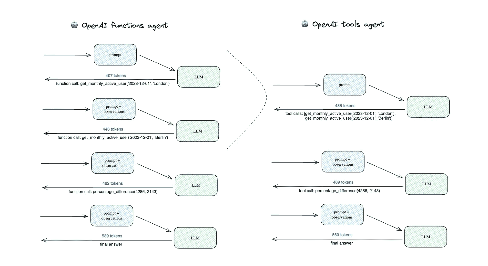
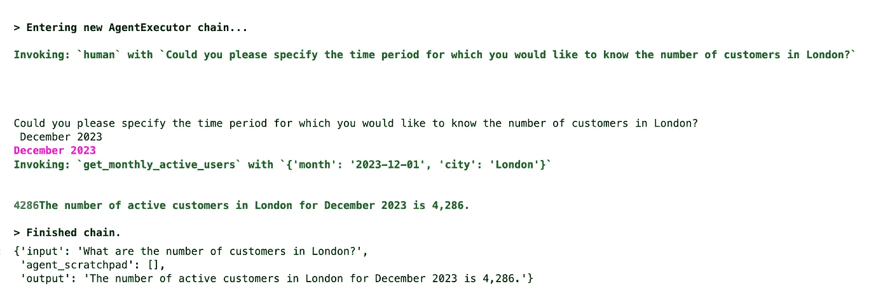
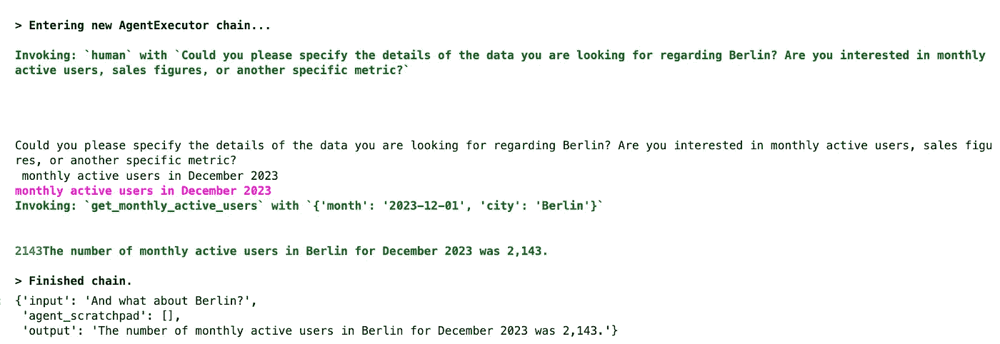

# LLM 能替代数据分析师吗？学会如何合作

> 原文：[`towardsdatascience.com/can-llms-replace-data-analysts-learning-to-collaborate-9d42488dc327?source=collection_archive---------2-----------------------#2024-01-09`](https://towardsdatascience.com/can-llms-replace-data-analysts-learning-to-collaborate-9d42488dc327?source=collection_archive---------2-----------------------#2024-01-09)

## 第三部分：教导 LLM 代理提出和处理澄清性问题

[](https://miptgirl.medium.com/?source=post_page---byline--9d42488dc327--------------------------------)[](https://towardsdatascience.com/?source=post_page---byline--9d42488dc327--------------------------------) [Mariya Mansurova](https://miptgirl.medium.com/?source=post_page---byline--9d42488dc327--------------------------------)

·发表于 [Towards Data Science](https://towardsdatascience.com/?source=post_page---byline--9d42488dc327--------------------------------) ·20 分钟阅读·2024 年 1 月 9 日

--


图片由 DALL-E 3 提供

**合作**是分析师日常工作中的核心方面。我们经常会遇到一些高层次的请求，比如，“新特性会带来什么影响？”或者“用户留存情况如何？”。在跳入写查询和提取数据之前，我们通常需要更清晰地定义任务：与相关方沟通，彻底了解他们的需求，并确定如何提供最好的帮助。

因此，对于一个 LLM 驱动的分析师来说，掌握提问和处理后续问题的技巧至关重要，因为我无法想象一个分析师在孤立的情况下工作。

在本文中，我们将教导我们的 LLM 分析师如何提问澄清性问题，并跟进长期对话。我们还将详细讨论 LangChain 中不同的记忆实现方式。

我们在前几篇文章中已经讨论了许多 LLM 代理的相关方面。所以，让我快速总结一下这些内容。此外，自从我们上次的实现以来，LangChain 已经进行了更新，现在是时候跟进了。

# LLM 代理总结

让我们快速回顾一下我们已经学到的关于 LLM 代理的内容。

+   我们已经讨论过如何通过外部工具赋能 LLM。这有助于它们克服局限性（例如，在数学任务中的表现较差），并能够接触到更广阔的世界（例如，你的数据库或互联网）。

+   LLM 代理的核心思想是将 LLM 作为推理引擎来定义执行的动作集合，并利用工具。因此，在这种方法中，你不需要硬编码逻辑，而是让 LLM 决定接下来的步骤，以实现最终目标。

+   我们已经实现了一个 LLM 驱动的代理，能够与 SQL 数据库配合使用并回答用户请求。

自我们上次迭代以来，LangChain 已从 0.0.350 更新至 0.1.0 版本。LLM 代理的文档和最佳实践发生了变化。这个领域发展迅速，因此工具也在不断演变，这并不令人惊讶。让我们快速回顾一下。

首先，LangChain 大幅改进了[文档](https://python.langchain.com/docs/modules/agents/agent_types/)，现在你可以清楚地、结构化地查看支持的代理类型及其之间的差异。

模型处理只有一个输入参数的工具更为简单，因此一些代理有这样的限制。然而，在大多数现实案例中，工具有多个参数。因此，让我们关注那些能够处理多个输入的代理。这样我们只剩下三个可能的选项。

1.  [**OpenAI 工具**](https://python.langchain.com/docs/modules/agents/agent_types/openai_tools)

+   它是最前沿的代理类型，因为它支持聊天历史、具有多个输入的工具，甚至并行函数调用。

+   你可以与最近的 OpenAI 模型（`1106`之后的版本）一起使用它，因为这些模型已经过针对工具调用的微调。

2. [**OpenAI 函数**](https://python.langchain.com/docs/modules/agents/agent_types/openai_functions_agent)

+   OpenAI 函数代理接近 OpenAI 工具，但在底层有些许不同。

+   这种代理不支持并行函数调用。

+   你可以使用经过微调以与函数一起使用的最新 OpenAI 模型（完整列表请见[这里](https://platform.openai.com/docs/guides/function-calling/supported-models)），或兼容的开源 LLM。

3.[**结构化聊天**](https://python.langchain.com/docs/modules/agents/agent_types/structured_chat)

+   这种方法类似于 ReAct。它指示代理遵循“思考 -> 行动 -> 观察”框架。

+   它不支持并行函数调用，就像 OpenAI 函数方法一样。

+   你可以与任何模型一起使用它。

> 此外，你还会注意到我们在上一篇文章中尝试过的实验性代理类型，如 BabyAGI、Plan-and-execute 和 AutoGPT，仍然不是推荐的选项之一。它们可能会在以后被纳入（我希望如此），但目前我不建议在生产环境中使用它们。

阅读完新的文档后，我终于意识到 OpenAI 工具和 OpenAI 函数代理之间的区别。使用 OpenAI 工具方法时，代理可以在同一迭代中调用多个工具，而其他代理类型不支持这种功能。让我们看看它是如何工作的，以及为什么这很重要。

让我们创建两个代理——OpenAI 工具和 OpenAI 函数。我们将为它们配备两种工具：

+   `get_monthly_active_users`返回某个城市和月份的活跃客户数量。为了简化调试，我们将使用一个虚拟函数来代替。在实际操作中，我们会去数据库获取这些数据。

+   `percentage_difference`计算两个度量值之间的差异。

让我们从 Python 函数创建工具，并使用 Pydantic 指定架构。如果您想回顾一下这个话题，可以在本系列的第一篇文章中找到详细的解释。

```py
from pydantic import BaseModel, Field
from typing import Optional
from langchain.agents import tool

# define tools

class Filters(BaseModel):
    month: str = Field(description="Month of the customer's activity in the format %Y-%m-%d")
    city: Optional[str] = Field(description="The city of residence for customers (by default no filter)", 
                    enum = ["London", "Berlin", "Amsterdam", "Paris"])

@tool(args_schema=Filters)
def get_monthly_active_users(month: str, city: str = None) -> int:
    """Returns the number of active customers for the specified month. 
    Pass month in format %Y-%m-01.
    """

    coefs = {
        'London': 2,
        'Berlin': 1,
        'Amsterdam': 0.5,
        'Paris': 0.25
    }

    dt = datetime.datetime.strptime(month, '%Y-%m-%d')
    total = dt.year + 10*dt.month

    if city is None:
        return total
    else:
        return int(round(coefs[city]*total))

class Metrics(BaseModel):
    metric1: float = Field(description="Base metric value to calculate the difference")
    metric2: float = Field(description="New metric value that we compare with the baseline")

@tool(args_schema=Metrics)
def percentage_difference(metric1: float, metric2: float) -> float:
    """Calculates the percentage difference between metrics"""
    return (metric2 - metric1)/metric1*100

# save them into a list for future use

tools = [get_monthly_active_users, percentage_difference]
```

要测试一个工具，您可以使用以下命令来执行它。

```py
get_monthly_active_users.run({"month": "2023-12-01", "city": "London"})
# 4286

get_monthly_active_users.run({"month": "2023-12-01", "city": "Berlin"})
# 2183
```

让我们创建一个提示模板，供代理使用。它将包括一个系统消息、用户请求以及工具观察结果的占位符。我们的提示有两个变量 — `input` 和 `agent_scratchpad`。

```py
from langchain.prompts import ChatPromptTemplate, MessagesPlaceholder

# defining prompt

system_message = '''
You are working as a product analyst for a e-commerce company. 
Your work is very important, since your product team makes decisions based on the data you provide. So, you are extremely accurate with the numbers you provided. 
If you're not sure about the details of the request, you don't provide the answer and ask follow-up questions to have a clear understanding.
You are very helpful and try your best to answer the questions.
'''

prompt = ChatPromptTemplate.from_messages([
    ("system", system_message),
    ("user", "{input}"),
    MessagesPlaceholder(variable_name="agent_scratchpad")
])
```

让我们使用新的 LangChain 函数来创建代理 — `create_openai_functions_agent` 和 `create_openai_tools_agent`。要创建一个代理，我们需要指定一些参数 — LLM 模型、工具列表和提示模板。除了代理之外，我们还需要创建代理执行器。

```py
 from langchain.agents import create_openai_tools_agent, create_openai_functions_agent, AgentExecutor
from langchain_community.chat_models import ChatOpenAI

# OpenAI tools agent
agent_tools = create_openai_tools_agent(
    llm = ChatOpenAI(temperature=0.1, model = 'gpt-4-1106-preview'),
    tools = tools, 
    prompt = prompt
)

agent_tools_executor = AgentExecutor(
    agent = agent_tools, tools = tools, 
    verbose = True, max_iterations = 10, 
    early_stopping_method = 'generate')

# OpenAI functions agent
agent_funcs = create_openai_functions_agent(
    llm = ChatOpenAI(temperature=0.1, model = 'gpt-4-1106-preview'),
    tools = tools, 
    prompt = prompt
)

agent_funcs_executor = AgentExecutor(
    agent = agent_funcs, tools = tools, 
    verbose = True, max_iterations = 10, 
    early_stopping_method = 'generate')
```

我使用了 ChatGPT 4 Turbo 模型，因为它能够与 OpenAI 工具协同工作。由于我们需要进行一些复杂的推理，ChatGPT 3.5 可能不足以满足我们的使用需求。

我们已经创建了两个代理执行器，现在是时候在实践中测试它们并比较结果了。

```py
user_question = 'What are the absolute numbers and the percentage difference between the number of customers in London and Berlin in December 2023?'

agent_funcs_executor.invoke(
    {'input': user_question, 
     'agent_scratchpad': []})

agent_tools_executor.invoke(
    {'input': user_question, 
     'agent_scratchpad': []})

# In December 2023, the number of customers in London was 4,286, and in Berlin,
# it was 2,143\. The percentage difference between the number of customers 
# in London and Berlin is -50.0%, indicating that London had twice 
# as many customers as Berlin.
```

有趣的是，两个代理返回了相同的正确结果。这并不奇怪，因为我们使用了低温度设置。

两个代理都表现良好，但让我们比较一下它们在幕后是如何工作的。我们可以开启调试模式（执行`langchain.debug = True`）来查看 LLM 调用次数和使用的 tokens 数量。

您可以看到下方展示两个代理调用的架构。



作者设计的架构

OpenAI 函数代理进行了 4 次 LLM 调用，而 OpenAI 工具代理只进行了 3 次调用，因为它可以在一次迭代中获取伦敦和柏林的 MAU 数据。总体而言，这导致了使用的 tokens 数量较少，从而降低了成本：

+   OpenAI 工具代理 — 1,537 个 tokens

+   OpenAI 函数代理 — 1,874 个 tokens（*+21.9%*）。

因此，我建议您考虑使用 OpenAI 工具代理。它可以与 ChatGPT 4 Turbo 和 ChatGPT 3.5 Turbo 都一起使用。

我们已经修订了之前的基于 LLM 的分析师实现。所以，现在是时候让我们的代理提问后续问题了。

# 提出澄清性问题

我们希望教会代理向用户提出澄清性问题。教导 LLM 代理新知识的最合理方法是为它们提供一个工具。所以，LangChain 提供了一个方便的工具——[Human](https://python.langchain.com/docs/integrations/tools/human_tools)。

> 这并不是什么高深的技术。您可以在[这里](https://api.python.langchain.com/en/latest/_modules/langchain_community/tools/human/tool.html#)查看实现。我们可以轻松地自己实现它，但使用框架提供的工具是一种良好的实践。

让我们启动这个工具。除非我们想自定义某些内容，例如工具的描述或输入函数，否则我们不需要指定任何参数。有关更多细节，请参见[文档](https://api.python.langchain.com/en/latest/tools/langchain_community.tools.human.tool.HumanInputRun.html#)。

```py
from langchain.tools import HumanInputRun
human_tool = HumanInputRun()
```

我们可以查看默认工具的描述和参数。

```py
print(human_tool.description)
# You can ask a human for guidance when you think you got stuck or 
# you are not sure what to do next. The input should be a question 
# for the human. 

print(human_tool.args)
# {'query': {'title': 'Query', 'type': 'string'}}
```

让我们将这个新工具添加到我们代理的工具包中，并重新初始化代理。我还调整了系统消息，以鼓励模型在信息不足时提出后续问题。

```py
# tweaking the system message
system_message = '''
You are working as a product analyst for the e-commerce company. 
Your work is very important, since your product team makes decisions based on the data you provide. So, you are extremely accurate with the numbers you provided. 
If you're not sure about the details of the request, you don't provide the answer and ask follow-up questions to have a clear understanding.
You are very helpful and try your best to answer the questions.

If you don't have enough context to answer question, you should ask user the follow-up question to get needed info. 
You don't make any assumptions about data requests. For example, if dates are not specified, you ask follow up questions. 
Always use tool if you have follow-up questions to the request.
'''
prompt = ChatPromptTemplate.from_messages([
    ("system", system_message),
    ("user", "{input}"),
    MessagesPlaceholder(variable_name="agent_scratchpad")
])

# updated list of tools 
tools = [get_monthly_active_users, percentage_difference, human_tool]

# reinitialising the agent
human_input_agent = create_openai_tools_agent(
    llm = ChatOpenAI(temperature=0.1, model = 'gpt-4-1106-preview'),
    tools = tools, 
    prompt = prompt
)

human_input_agent_executor = AgentExecutor(
    agent = human_input_agent, tools = tools, 
    verbose = True, max_iterations = 10, # early stopping criteria
    early_stopping_method = 'generate')
```

现在，是时候尝试一下了。代理刚刚返回了输出，要求一个特定的时间段。它并没有按照我们预期的方式工作。

```py
human_input_agent_executor.invoke(
    {'input': 'What are the number of customers in London?', 
     'agent_scratchpad': []})

# {'input': 'What are the number of customers in London?',
#  'agent_scratchpad': [],
#  'output': 'To provide you with the number of customers in London, 
#             I need to know the specific time period you are interested in. 
#             Are you looking for the number of monthly active users in London 
#             for a particular month, or do you need a different metric? 
#             Please provide the time frame or specify the metric you need.'}
```

代理没有理解它需要使用这个工具。让我们尝试修复它并修改 Human 工具的描述，使代理在需要使用该工具时能够更清楚地识别。

```py
human_tool_desc = '''
You can use this tool to ask the user for the details related to the request. 
Always use this tool if you have follow-up questions. 
The input should be a question for the user. 
Be concise, polite and professional when asking the questions.
'''

human_tool = HumanInputRun(
    description = human_tool_desc
)
```

更改后，代理使用了 Human 工具并请求了一个特定的时间段。我提供了答案，我们得到了正确的结果——2023 年 12 月伦敦有 4,286 名活跃客户。



作者截图

所以，像往常一样，调整提示帮助了我们。现在，它工作得相当不错。记住，创建一个好的提示是一个迭代过程，值得尝试多个选项并评估结果。

我们已经教会了我们的 LLM 代理在处理数据请求时，要求提供更多细节并加以考虑。

然而，这只是协作的一部分。在现实中，分析师在提供任何研究后，经常会收到后续问题。现在，我们的代理无法继续对话并回答用户的新问题，因为它没有记忆。是时候了解一下我们可以用来在 LangChain 中实现记忆的工具了。

> 事实上，我们在当前的代理实现中已经有了记忆的概念。我们的代理将与工具的交互记录存储在`agent_scratchpad`变量中。我们不仅需要记住与工具的交互，还需要记住与用户的对话。

# LangChain 中的记忆

默认情况下，LLM 是无状态的，并且不会记住先前的对话。如果我们希望我们的代理能够进行长时间的对话，我们需要以某种方式存储聊天历史。LangChain 提供了多种不同的记忆实现。让我们进一步了解它。

`ConversationBufferMemory`是最简单的方法。它只会保存你推送给它的所有上下文。让我们试试：初始化一个内存对象并添加几次对话交换。

```py
from langchain.memory import ConversationBufferMemory
memory = ConversationBufferMemory()
memory.save_context(
    {"input": "Hey, how are you? How was your weekend?"}, 
    {"output": "Good morning, I had a wonderful time off and spent the whole day learning about LLM agents. It works like magic."}
)
print(memory.buffer)

# Human: Hey, how are you? How was your weekend?
# AI: Good morning, I had a wonderful time off and spent the whole day learning about LLM agents. It works like magic.

memory.save_context(
    {"input": "Could you please help me with the urgent request from our CEO. What are the absolute numbers and the percentage difference between the number of customers in London and Berlin in December 2023?"}, 
    {"output": "In December 2023, the number of customers in London was 4,286, and in Berlin, it was 2,143\. The percentage difference between the number of customers in London and Berlin is -50.0%, indicating that London had twice as many customers as Berlin."}
)
print(memory.buffer)

# Human: Hey, how are you? How was your weekend?
# AI: Good morning, I had a wonderful time off and spent the whole day learning about LLM agents. It works like magic.
# Human: Could you please help me with the urgent request from our CEO. What are the absolute numbers and the percentage difference between the number of customers in London and Berlin in December 2023?
# AI: In December 2023, the number of customers in London was 4,286, and in Berlin, it was 2,143\. The percentage difference between the number of customers in London and Berlin is -50.0%, indicating that London had twice as many customers as Berlin.
```

这种方法效果很好。然而，在许多情况下，将整个先前的对话传递给 LLM 进行每次迭代是不切实际的，因为：

+   我们可能会遇到上下文长度的限制，

+   LLM 对于处理长文本并不擅长，

+   我们正在支付代币，而这种方法可能会变得相当昂贵。

所以，还有另一个实现——`ConversationBufferWindowMemory`，它可以存储有限数量的对话交换。因此，它将只存储最后的 k 次迭代。

```py
from langchain.memory import ConversationBufferWindowMemory

memory = ConversationBufferWindowMemory(k = 1) 

memory.save_context(
    {"input": "Hey, how are you? How was your weekend?"}, 
    {"output": "Good morning, I had a wonderful time off and spent the whole day learning about LLM agents. It works like magic."}
)
print(memory.buffer)

# Human: Hey, how are you? How was your weekend?
# AI: Good morning, I had a wonderful time off and spent the whole day learning about LLM agents. It works like magic.

memory.save_context(
    {"input": "Could you please help me with the urgent request from our CEO. What are the absolute numbers and the percentage difference between the number of customers in London and Berlin in December 2023?"}, 
    {"output": "In December 2023, the number of customers in London was 4,286, and in Berlin, it was 2,143\. The percentage difference between the number of customers in London and Berlin is -50.0%, indicating that London had twice as many customers as Berlin."}
)
print(memory.buffer)

# Human: Could you please help me with the urgent request from our CEO. What are the absolute numbers and the percentage difference between the number of customers in London and Berlin in December 2023?
# AI: In December 2023, the number of customers in London was 4,286, and in Berlin, it was 2,143\. The percentage difference between the number of customers in London and Berlin is -50.0%, indicating that London had twice as many customers as Berlin.
```

> 我们使用了`k = 1`只是为了展示它是如何工作的。在实际使用中，你可能会使用更高的阈值。

这种方法可以帮助你保持聊天历史的大小可管理。然而，它也有一个缺点：你仍然可能会达到上下文大小的限制，因为你无法控制聊天历史的令牌大小。

为了应对这一挑战，我们可以使用`ConversationTokenBufferMemory`。它不会分割语句，因此无需担心上下文中的不完整句子。

```py
from langchain.memory import ConversationTokenBufferMemory

memory = ConversationTokenBufferMemory(
    llm = ChatOpenAI(temperature=0.1, model = 'gpt-4-1106-preview'), 
    max_token_limit=100)

memory.save_context(
    {"input": "Hey, how are you? How was your weekend?"}, 
    {"output": "Good morning, I had a wonderful time off and spent the whole day learning about LLM agents. It works like magic."}
)
print(memory.buffer)

# Human: Hey, how are you? How was your weekend?
# AI: Good morning, I had a wonderful time off and spent the whole day learning about LLM agents. It works like magic.

# <Comment from the author>: the whole info since it fits the memory size 

memory.save_context(
    {"input": "Could you please help me with the urgent request from our CEO. What are the absolute numbers and the percentage difference between the number of customers in London and Berlin in December 2023?"}, 
    {"output": "In December 2023, the number of customers in London was 4,286, and in Berlin, it was 2,143\. The percentage difference between the number of customers in London and Berlin is -50.0%, indicating that London had twice as many customers as Berlin."}
)
print(memory.buffer)

# AI: In December 2023, the number of customers in London was 4,286, and in Berlin, it was 2,143\. The percentage difference between the number of customers in London and Berlin is -50.0%, indicating that London had twice as many customers as Berlin.

# <Comment from the author>: only the last response from the LLM fit the memory size 
```

在这种情况下，我们需要传递一个 LLM 模型来初始化内存对象，因为 LangChain 需要知道模型来计算令牌数。

在我们上面讨论的所有方法中，我们存储了整个对话或至少是部分内容。然而，我们不需要这样做。例如，人们通常不会完全记得他们的对话。我不能逐字复述昨天会议的内容，但我记得主要的想法和行动项目——一个摘要。由于人类是 GI（通用智能），因此将这种策略应用于 LLM 似乎是合理的。LangChain 在`ConversationSummaryBufferMemory`中实现了这一点。

让我们在实践中试试看：初始化内存并保存第一次对话交换。我们得到了整个对话，因为我们当前的上下文还没有超过阈值。

```py
from langchain.memory import ConversationSummaryBufferMemory

memory = ConversationSummaryBufferMemory(
    llm = ChatOpenAI(temperature=0.1, model = 'gpt-4-1106-preview'), 
    max_token_limit=100)

memory.save_context(
    {"input": "Hey, how are you? How was your weekend?"}, 
    {"output": "Good morning, I had a wonderful time off and spent the whole day learning about LLM agents. It works like magic."}
)
print(memory.load_memory_variables({})['history'])

# Human: Hey, how are you? How was your weekend?
# AI: Good morning, I had a wonderful time off and spent the whole day learning about LLM agents. It works like magic.
```

让我们再添加一次对话交换。现在，我们达到了限制：整个聊天历史超过了 100 个令牌，这是设定的阈值。因此，只有最后的 AI 回应被存储（它在 100 个令牌限制之内）。对于早期的消息，已经生成了摘要。

摘要是以`System:`前缀存储的。

```py
 memory.save_context(
    {"input": "Could you please help me with the urgent request from our CEO. What are the absolute numbers and the percentage difference between the number of customers in London and Berlin in December 2023?"}, 
    {"output": "In December 2023, the number of customers in London was 4,286, and in Berlin, it was 2,143\. The percentage difference between the number of customers in London and Berlin is -50.0%, indicating that London had twice as many customers as Berlin."}
)
print(memory.load_memory_variables({})['history'])

# System: The AI had a good weekend learning about LLM agents and describes it as magical. The human requests assistance with an urgent task from the CEO, asking for the absolute numbers and percentage difference of customers in London and Berlin in December 2023.
# AI: In December 2023, the number of customers in London was 4,286, and in Berlin, it was 2,143\. The percentage difference between the number of customers in London and Berlin is -50.0%, indicating that London had twice as many customers as Berlin.
```

像往常一样，看看它是如何在幕后工作的很有趣，我们可以通过调试模式来理解它。当对话超出内存大小限制时，LLM 调用使用了以下提示：

```py
Human: Progressively summarize the lines of conversation provided, 
adding onto the previous summary returning a new summary.

EXAMPLE
Current summary:
The human asks what the AI thinks of artificial intelligence. The AI 
thinks artificial intelligence is a force for good.

New lines of conversation:
Human: Why do you think artificial intelligence is a force for good?
AI: Because artificial intelligence will help humans reach their full 
potential.

New summary:
The human asks what the AI thinks of artificial intelligence. The AI thinks 
artificial intelligence is a force for good because it will help humans reach 
their full potential.
END OF EXAMPLE

Current summary:

New lines of conversation:
Human: Hey, how are you? How was your weekend?
AI: Good morning, I had a wonder time off and spent the whole day learning 
about LLM agents. It works like magic.
Human: Could you please help me with the urgent request from our CEO. 
What are the absolute numbers and the percentage difference between 
the number of customers in London and Berlin in December 2023?

New summary:
```

它实现了摘要的渐进式更新。因此，它使用更少的令牌，而不是每次都传递整个聊天历史来获取更新的摘要。这是合理的。

此外，LangChain 还具有更多先进的内存类型：

+   向量数据内存——将文本的嵌入存储在向量存储中（类似于我们在 RAG——检索增强生成中所做的），然后我们可以检索出最相关的信息并将其纳入对话中。这种内存类型对于长期对话最为有用。

+   实体内存，用于记住关于特定实体（如人）的详细信息。

你甚至可以结合使用不同的内存类型。例如，你可以使用对话内存+实体内存来保存数据库中表格的详细信息。要了解更多关于组合内存的信息，请参阅[文档](https://python.langchain.com/docs/modules/memory/multiple_memory)。

我们不会在本文中讨论这些更先进的方法。

我们已经了解了如何在 LangChain 中实现记忆。现在，是时候将这些知识应用到我们的代理中了。

## 为代理添加记忆

让我们尝试看看当前的代理实现如何处理来自用户的后续问题。

```py
human_input_agent_executor.invoke(
    {'input': 'What are the number of customers in London in December 2023?', 
     'agent_scratchpad': []})
```

对于这个调用，代理执行了一个工具并返回了正确的答案：`2023 年 12 月伦敦的活跃客户数量为 4,286`。

我们知道伦敦的用户数量了。现在了解柏林的情况也很有趣。让我们问问我们的代理。

```py
human_input_agent_executor.invoke(
    {'input': 'And what about Berlin?', 
     'agent_scratchpad': []})
```

令人惊讶的是，代理能够正确地处理这个问题。然而，它必须使用“人工工具”来澄清问题，并且用户需要提供相同的信息（这不是最好的客户体验）。



截图由作者提供

现在，让我们开始为代理保存聊天历史。我将使用一个简单的缓冲区来存储完整的前置对话，但你也可以使用更复杂的策略。

首先，我们需要在提示模板中为聊天历史添加一个占位符。我已将其标记为可选。

```py
prompt = ChatPromptTemplate.from_messages([
    ("system", system_message),
    MessagesPlaceholder(variable_name="chat_history", optional=True),
    ("user", "{input}"),
    MessagesPlaceholder(variable_name="agent_scratchpad")
])
```

接下来，让我们初始化一个记忆并保存闲聊（你知道，没有闲聊就没有对话）。请注意，我们在提示模板中指定了相同的`memory_key = 'chat_history'`。

```py
memory = ConversationBufferMemory(
    return_messages=True, memory_key="chat_history")

memory.save_context(
    {"input": "Hey, how are you? How was your weekend?"}, 
    {"output": "Good morning, I had a wonderful time off and spent the whole day learning about LLM agents. It works like magic."}
)
print(memory.buffer)
```

让我们再次尝试之前的用例，并询问 LLM 分析师关于伦敦的用户数量。

```py
human_input_agent_executor.invoke(
    {'input': 'What is the number of customers in London?'})

# {'input': 'What is the number of customers in London?',
# 'chat_history': [
#   HumanMessage(content='Hey, how are you? How was your weekend?'),
#   AIMessage(content='Good morning, I had a wonderful time off and spent the whole day learning about LLM agents. It works like magic.'),
#   HumanMessage(content='What is the number of customers in London?'),
#   AIMessage(content='The number of active customers in London for December 2023 is 4,286.')],
# 'output': 'The number of active customers in London for December 2023 is 4,286.'}
```

在回答问题：“‘请指定你希望了解伦敦用户数量的时间段？’”后，我们得到了正确的答案，并且代理和用户之间的对话历史（包括之前的闲聊）也被保存了下来。

如果我们现在问关于柏林的后续问题，代理将直接返回 2023 年 12 月的数字，而无需再次询问详细信息，因为它已经在上下文中有了这些信息。

```py
human_input_agent_executor.invoke(
    {'input': 'What is the number for Berlin?'})

# {'input': 'What is the number for Berlin?',
#  'chat_history': [HumanMessage(content='Hey, how are you? How was your weekend?'),
#    AIMessage(content='Good morning, I had a wonderful time off and spent the whole day learning about LLM agents. It works like magic.'),
#    HumanMessage(content='What is the number of customers in London?'),
#    AIMessage(content='The number of active customers in London for December 2023 is 4,286.'),
#    HumanMessage(content='What is the number for Berlin?'),
#    AIMessage(content='The number of active customers in Berlin for December 2023 is 2,143.')],
#  'output': 'The number of active customers in Berlin for December 2023 is 2,143.'}
```

让我们看看第一次 LLM 调用的提示。我们可以看到，所有的聊天历史实际上都传递给了模型。

```py
System: 
You are working as a product analyst for the e-commerce company. 
Your work is very important, since your product team makes decisions 
based on the data you provide. So, you are extremely accurate 
with the numbers you provided. 
If you're not sure about the details of the request, you don't provide 
the answer and ask follow-up questions to have a clear understanding.
You are very helpful and try your best to answer the questions.

If you don't have enough context to answer question, you should ask user 
the follow-up question to get needed info. 
You don't make any assumptions about data requests. For example, 
if dates are not specified, you ask follow up questions. 
Always use tool if you have follow-up questions to the request.

Human: Hey, how are you? How was your weekend?
AI: Good morning, I had a wonderful time off and spent the whole day 
learning about LLM agents. It works like magic.
Human: What is the number of customers in London?
AI: The number of active customers in London for December 2023 is 4,286.
Human: What is the number for Berlin?
```

因此，我们已将聊天历史添加到我们的 LLM 驱动分析师中，现在它能够处理较长的对话并回答后续问题。这是一个重大的进步。

> 你可以在[GitHub](https://github.com/miptgirl/miptgirl_medium/blob/main/analyst_agent/agent_prototype_collaboration.ipynb)上找到完整的代码。

# 摘要

在本文中，我们教会了我们的 LLM 驱动分析师如何与用户协作。现在，它可以在初始请求中信息不足时提问澄清问题，甚至可以回答用户的后续问题。

我们已经取得了如此显著的改进：

+   通过添加一个工具——人工输入，允许向用户提问，

+   通过为代理添加记忆功能，可以存储聊天历史。

我们的智能体现在已经掌握了协作技能。在接下来的文章中，我们将尝试迈出下一步，将 LLM 智能体与 RAG（检索增强生成）结合起来。我们已经了解了如何查询数据库并与用户进行沟通。下一步是开始使用知识库。敬请期待！

> 非常感谢您阅读本文。希望它对您有所启发。如果您有任何后续问题或评论，请在评论区留言。
