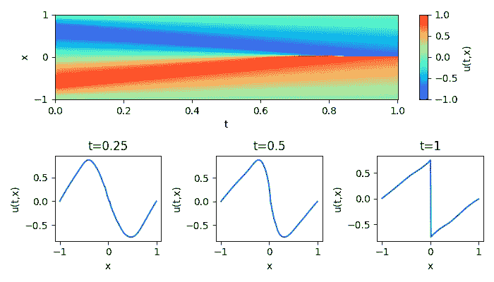

# 神经网络能否形成冲击波？

> 原文：[`towardsdatascience.com/can-neural-networks-formulate-shock-wave-147bb75d0715?source=collection_archive---------4-----------------------#2024-04-04`](https://towardsdatascience.com/can-neural-networks-formulate-shock-wave-147bb75d0715?source=collection_archive---------4-----------------------#2024-04-04)

## 我们如何构建一个具有冲击波形成的无粘性 Burgers 方程的 PINN

[](https://medium.com/@vanillaxiangshuyang?source=post_page---byline--147bb75d0715--------------------------------)[](https://towardsdatascience.com/?source=post_page---byline--147bb75d0715--------------------------------) [Shuyang Xiang](https://medium.com/@vanillaxiangshuyang?source=post_page---byline--147bb75d0715--------------------------------)

·发表于[Towards Data Science](https://towardsdatascience.com/?source=post_page---byline--147bb75d0715--------------------------------) ·6 分钟阅读·2024 年 4 月 4 日

--

# 冲击波上的 PINN

**物理信息神经网络**（**PINNs**）是一种特殊类型的神经网络。它们通过将给定数据集的物理定律纳入学习过程，从而估计偏微分方程的解。

这种方程的一个例子是无粘性 Burgers 方程，它是一个守恒定律的原型，可以形成冲击波。


图片来源：[维基百科](https://en.wikipedia.org/wiki/Burgers%27_equation)：无粘性 Burgers 方程，在冲击波形成时的二维空间变量。

目前的文献难以有效解决这个问题。由于冲击波不是连续解，它们仅在弱意义上满足方程。**连续时间模型**，如依赖于训练样本的算法微分方法，无法捕捉冲击波。这些方法仅适用于函数正则性的情况。

一种方法是尝试使用**离散时间模型**，其中神经网络和时间离散化共同作用，帮助模型形成冲击波。然而，这种方法在一定程度上削弱了物理信息神经网络（PINNs）的优势，并回归到传统的数值方法。这对于那些理解方程但不熟悉数值解法的人来说可能是一个挑战。

在本文中，我将讨论现有连续时间模型（PINN 方法）在 Burgers 方程中的局限性。我将介绍基于算法微分的间断和弱解的计算方法，从而使方程能够捕捉到激波现象。本文可能会激发那些对神经网络与基于物理的建模交叉领域感兴趣的人，特别是在涉及守恒定律的领域。

然而，值得注意的是，该方法仅在最简单的一维双曲方程中显示出有希望的结果。是否能扩展到更高维度或更复杂的方程是作者尚未探索的一个方面，我邀请读者就此话题贡献自己的想法和资源。

# PINN: Burgers 方程的连续时间模型

根据原始[论文](https://arxiv.org/pdf/1711.10561.pdf)：“物理信息神经网络（PINNs）被训练来解决监督学习任务，同时遵守由一般非线性偏微分方程（PDEs）描述的物理规律。”

这些 PDE 通常采用以下形式 [1]：

ut + N [u] = 0, x ∈ Ω, t ∈ [0, T]，

其中 u(t, x) 代表解，N [·] 是一个非线性微分算子，Ω 是 d 维空间的子集。

设

L(u) = ut + N [u]。

立刻可以看出，如果 u 是方程的解，那么 f=0。我们将构造解 u 作为一个神经网络。

u = neural_net(t,x;weights)

其中输入是时间和空间变量。我们通过最小化 f 的均方误差来确定权重（如前所述，如果 u 是方程的解，L(u) 应接近 0），并满足一定的初始条件和边界条件。更多细节，请参阅原始论文。

现在，考虑一维无粘性 Burgers 方程：


无粘性 Burgers 方程

方程的解在满足初始条件的情况下，可以通过[特征法](https://en.wikipedia.org/wiki/Method_of_characteristics)隐式构造，即 u=f(x-ut)，特征曲线为 x(t)= x0+f(x0)t。根据公式可以看出，特征 x(t) 是斜率不同的直线，因此如果存在两个点 x1, x2，使得在有限时间 t 内 x1+f(x1)t= x2+f(x2)t，我们将看到两个特征的交点，波将发生破裂 [2]。

以下代码灵感来自 git 仓库 [pinn-burgers](https://github.com/okada39/pinn_burgers)。在这里，考虑一个粘性 Burgers 方程，𝜈>0。已证明在初始条件为平滑函数并且在无穷大处增长如 o(|x|) 的情况下，方程具有全局定义的平滑解 [3]。


粘性 Burgers 方程

我们将 u(t,x)表示为 neural_net(t,x;weights)，目的是最小化 L(u)（在本例中是 ut + uux）以及初始条件和边界条件的均方误差。如果方程的解是平滑的，可以自然地使用 TensorFlow 编写以下代码来计算所需的未知数：

```py
with tf.GradientTape() as g:
    g.watch(x)
    u = neural_net(x)
du_dtx = g.batch_jacobian(u, x)
du_dt = du_dtx[..., 0]
du_dx = du_dtx[..., 1]
```

L(u)（在代码中，我们将其称为 u_eqn）将简单地定义为：

```py
u_eqn = du_dt+ u*du_dt # (1)
```

问题在于方程 ut + uux 仅在弱意义下成立。这意味着，在冲击波形成时，考虑 ut 和 ux 的值可能没有用，因为它们会爆炸。该方程仅适用于积分形式。像 TensorFlow 或 PyTorch 这样的常见 Python 包提供了神经网络和微分算法的 API，但不提供弱意义的解。因此，我们需要重新配置 L(u)的公式，以强制神经网络形成冲击波。

# 冲击波引入

我们引入了 Rankine–Hugoniot 条件，也叫 Rankine–Hugoniot 跳跃条件或关系。这些条件描述了冲击波两侧状态之间的关系。对于 Burgers 方程，Rankine–Hugoniot 条件表示为：1/2[[𝑢²]]=𝑠[[𝑢]]。方括号[[ ]]表示右侧和左侧值之间的差异，而‘s’是冲击传播速度。

考虑一个特定的空间变量‘x’，我们旨在仔细检查左侧或右侧的极限，即在不连续情况下的 u(x±)。以下是相关的代码：

```py
delta = 1e-3
xl = x - delta
xr= x  + delta
with tf.GradientTape() as g:
   g.watch(x)
    u = neural_net(x)
    ul = neural_net(xl)
    ur = neural_net(xr)

du_dtx = g.batch_jacobian(u, x)
du_dt = du_dtx[..., 0]
du_dx = du_dtx[..., 1]
```

我们定义一个小的 delta，并计算空间变量 x 左右两侧解的值，直到 delta。

接下来，我们重新定义函数 L(u)为：

```py
 term1 = du_dt + u * du_dx
   term2 = (ul + ur) / 2
   condition = tf.less(du_dt, 1e3)
   u_eqn = tf.where(condition, term1, term2) # (2)
```

当 du_dt 的值是有限的（具体来说，小于足够大的值）时，我们使用方程的常规形式；当 du_dt 的值是无限时，我们使用 Rankine–Hugoniot 条件。

# 实验

假设 Burgers 方程的初始条件为 sin(πx)，定义区间为[-1, 1]。解可以表示为 u=sin(π(x-ut))，并且在 t=1 时形成冲击波。使用公式（1），我们得出以下解：


作者图像：使用公式（1）求解 Burgers 方程

模型在没有了解冲击波的情况下，努力找出正确的答案。然而，如果我们切换到公式（2），则可以得到以下解：



作者图像：使用公式（2）求解 Burgers 方程

你可以看到，模型在 t=1 时成功捕捉到了冲击波。

# 结论

物理信息神经网络（PINNs）通过将物理定律融入学习过程，可以估算偏微分方程的解。然而，它们通常在处理如激波等不连续解时遇到困难。我提出了一种计算弱解的方法，允许 Burgers 方程捕捉激波。需要注意的是，尽管一维 Burgers 方程是一个简单的应用案例，但如果没有更深的考虑，这种方法可能不适用于更复杂的方程。

# 参考文献

[1] M. Raissi, P. Perdikaris, G.E. Karniadakis，

物理信息神经网络：一种用于求解涉及非线性偏微分方程的正向和反向问题的深度学习框架，《计算物理学杂志》，2019 年，第 378 卷，第 686–707 页。

[2] A. Salih, 无粘 Burgers 方程。讲义笔记。印度太空科学与技术研究所航空航天工程系。

[3] J. Unterberger, 粘性 Burgers 方程强解的全局存在性。2015 年 3 月。《控制与控制论》46(2)。
