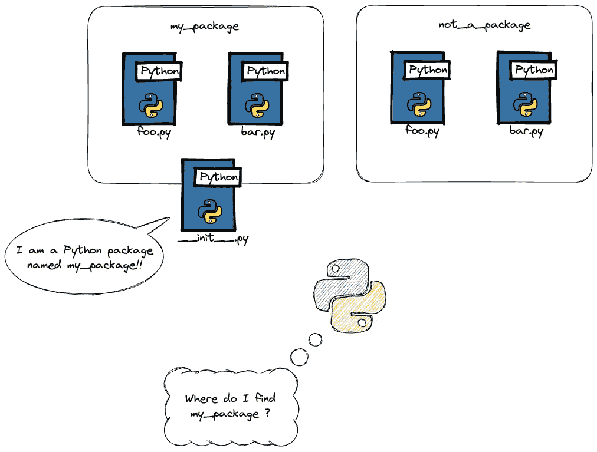

# 你真的了解`__init__.py`吗？

> 原文：[`towardsdatascience.com/can-you-even-init-py-a682d1adf4e8?source=collection_archive---------0-----------------------#2024-02-29`](https://towardsdatascience.com/can-you-even-init-py-a682d1adf4e8?source=collection_archive---------0-----------------------#2024-02-29)

图片由作者通过 MidJourney 生成，并已购买版权

## 使用`__init__.py`施展魔法

 [Louis Chan](https://louis-chan.medium.com/?source=post_page---byline--a682d1adf4e8--------------------------------)

·发布于[Towards Data Science](https://towardsdatascience.com/?source=post_page---byline--a682d1adf4e8--------------------------------) ·6 分钟阅读·2024 年 2 月 29 日

--

每当你尝试从不同的文件夹导入代码时，你都会放入一个空的`__init__.py`文件。这几乎已经成为大多数 Python 开发者——无论是初学者还是高手——的肌肉记忆。但我们真的了解`__init__.py`吗？

在这篇博客文章中，让我们深入探讨`__init__.py`是如何工作的，以及一个非空的`__init__.py`如何帮助我们作为 Python 开发者。

## 什么是`__init__.py`？

`__init__.py`是一个 Python 文件，告诉 Python 解释器该文件夹应被视为一个包。

与 C 和 C++等编译型语言不同，后者的依赖项必须在使用前预先编译，Python 的解释器会动态地获取你的依赖项。通过`__init__.py`来告诉 Python 一个文件夹包含将在其他地方使用的代码。

所以，可以把`__init__.py`看作是一个门卫。它将你的文件夹转变为一个可导入的 Python 包。

图片由作者创建

但是`__init__.py`不仅仅是这样。当你在 Python 中创建一个类时，你通常也需要创建一个`__init__`函数。这将定义对象如何构造，且是…
