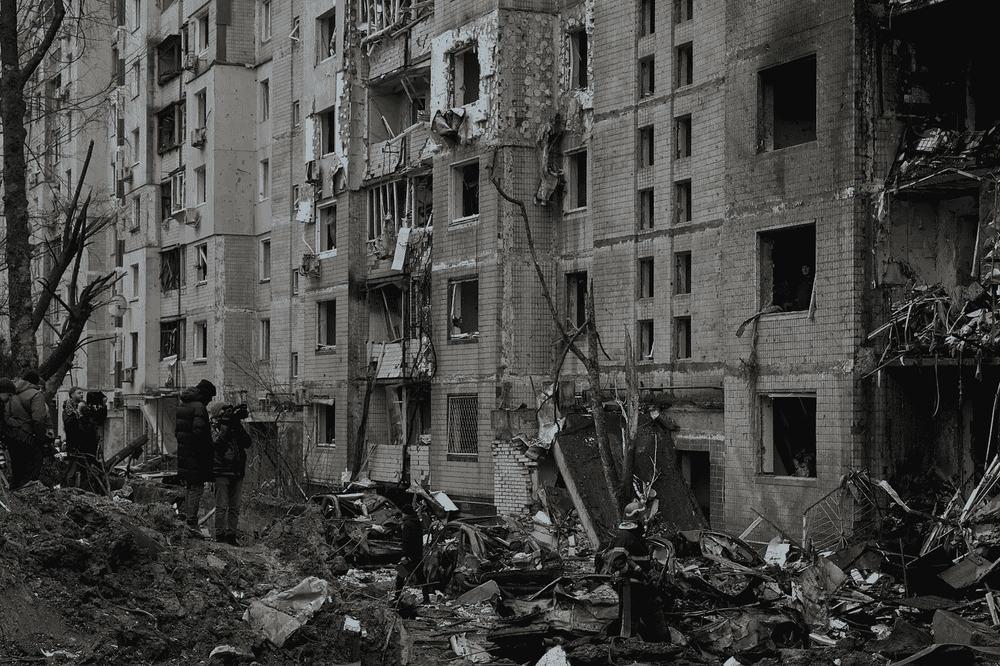
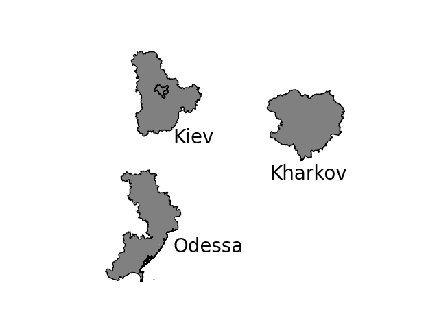
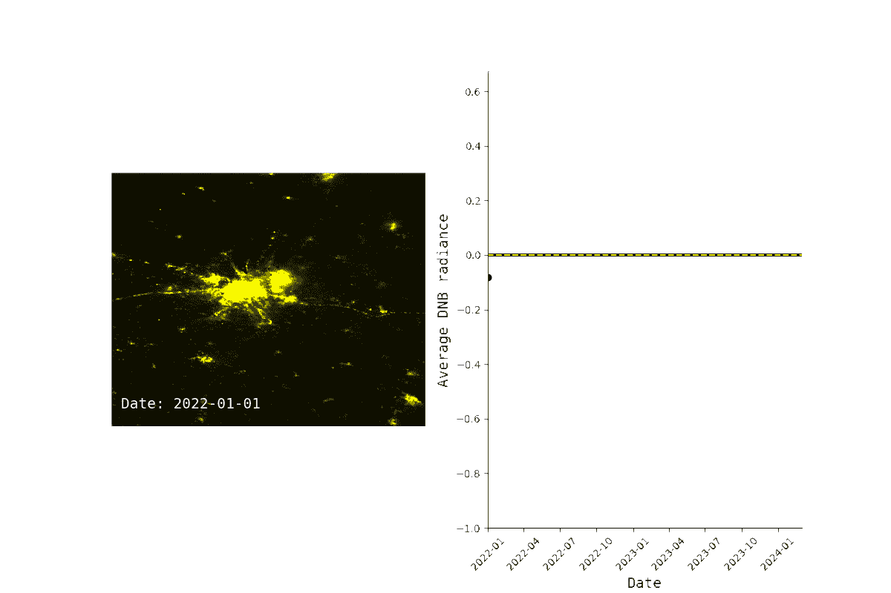
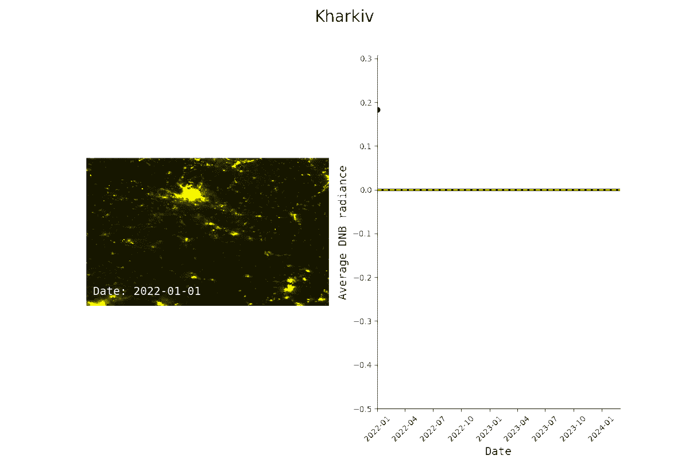

# 你能从太空看到战争吗？

> 原文：[`towardsdatascience.com/can-you-see-the-war-from-space-6d847d755edf?source=collection_archive---------6-----------------------#2024-09-12`](https://towardsdatascience.com/can-you-see-the-war-from-space-6d847d755edf?source=collection_archive---------6-----------------------#2024-09-12)

## 俄罗斯-乌克兰战争案例研究

[](https://medium.com/@alexroz?source=post_page---byline--6d847d755edf--------------------------------)[](https://towardsdatascience.com/?source=post_page---byline--6d847d755edf--------------------------------) [Aleksei Rozanov](https://medium.com/@alexroz?source=post_page---byline--6d847d755edf--------------------------------)

·发表于[Towards Data Science](https://towardsdatascience.com/?source=post_page---byline--6d847d755edf--------------------------------) ·阅读时间：7 分钟·2024 年 9 月 12 日

--



图片来源：[Dmytro Tolokonov](https://unsplash.com/@dtolokonov?utm_source=medium&utm_medium=referral) 于[Unsplash](https://unsplash.com/?utm_source=medium&utm_medium=referral)

自 2024 年 2 月 24 日俄罗斯入侵乌克兰以来，已近三年。这场血腥的战争摧毁或以某种方式影响了成千上万的家庭，双方都未能幸免。互联网上有大量证据揭示了这场战争带来的人类苦难和痛苦，其中一个主要数据来源就是空中和太空影像。

许多私营和军事高分辨率的太空传感器正在监控该地区，实时获取关于军队动向、基础设施和环境的重要信息。不幸的是，这类数据通常不对普通用户开放，像我们这样的人无法获取，但每天有大量其他卫星飞越乌克兰，所以我们可以尝试从免费访问的数据集中提取一些有意义的信息，看看那里到底发生了什么。

在这篇文章中，我们将尝试找出战争开始后，***夜间光辐射***是否发生了变化，并查看在战争开始前后，这一数值是否有所下降。这个简短的调查将集中在乌克兰的三个主要城市：**基辅**、**哈尔科夫**和**敖德萨**。

> NASA 的可见光红外成像辐射仪（VIIRS）搭载有昼夜带（DNB），这对于我们的目的非常合适。该数据以每日时间分辨率和约 500 米空间分辨率发布。但由于我们不想处理至少 365*3 个文件来进行分析，因此我们将研究带有大气修正的*月平均合成图像*。[这个数据产品](https://developers.google.com/earth-engine/datasets/catalog/NOAA_VIIRS_DNB_MONTHLY_V1_VCMSLCFG#description)由 Google Earth Engine（GEE）免费提供访问，因此不需要下载数据。

文章的内容分为以下几个部分：

+   **数据获取与预处理**

+   **异常计算**

+   **制图和创建 GIF**

+   **与攻击的关联**

> 一如既往，本文的代码可以在我的[GitHub](https://github.com/alexxxroz/Medium/blob/main/WarFromSpace.ipynb)上找到。

# **数据获取与预处理**

首先，为了开始分析，我们需要手头上有这些城市的实际区域。要获取这些数据，你可以使用名为[FAO GAUL: Global Administrative Unit Layers 2015](https://developers.google.com/earth-engine/datasets/catalog/FAO_GAUL_2015_level2)的 Google Earth Engine 数据集，或者使用[GADM 网站](https://gadm.org/data.html)。最终，我们应该得到一系列每个代表乌克兰区域的多边形。



图片来源：[作者](https://medium.com/@alexroz)。

为了创建这样的可视化，你需要下载前述的边界数据，并使用*geopandas*库进行读取：

```py
shape = gpd.read_file('YOUR_FILE.shp')
shape = shape[(shape['NAME_1']=='Kiev') | (shape['NAME_1']=='Kiev City') | (shape['NAME_1']=='?') | (shape['NAME_1']=='Kharkiv')|\
              (shape['NAME_1']=='Odessa')]
shape.plot(color='grey', edgecolor='black')

plt.axis('off')
plt.text(35,48, 'Kharkov', fontsize=20)
plt.text(31,46, 'Odessa', fontsize=20)
plt.text(31,49, 'Kiev', fontsize=20)
plt.savefig('UKR_shape.png')
plt.show()
```

我们的第二步将是通过 GEE 获取 VIIRS 数据。如果你从互联网上下载了乌克兰区域的形状文件，你需要将其封装成 GEE 几何对象。否则，您已经准备好使用它。

```py
import json
import ee

js = json.loads(shape.to_json())
roi = ee.Geometry(ee.FeatureCollection(js).geometry())
```

现在让我们定义研究的时间线。从概念上讲，为了了解战争开始后夜间光辐射是否异常，我们需要知道之前的数据。因此，我们将使用可用的整个时间范围：从**2012-01-01**到**2024-04-01**。2022-02-01 之前的数据将被视为**“常规”**，之后的数据将从该常规中减去，因此，表示为**偏差（异常）**。

```py
startDate = pd.to_datetime('2012-01-01')
endDate = pd.to_datetime('2024-04-01')
data = ee.ImageCollection("NOAA/VIIRS/DNB/MONTHLY_V1/VCMSLCFG")\
                  .filterBounds(roi)\
                  .filterDate(start = startDate, end=endDate)
```

我们的最终结果将包括地图和异常图。为了执行这个可视化，我们需要收集**2022-02-01 到 2024-04-01 期间的月度夜间光辐射图**和每个区域的**月度平均夜间光辐射**（*以时间序列的形式*）。最好的方法是遍历 GEE 图像列表，并将结果保存为*.csv*和*.npy*文件。

> **重要！** VIIRS 数据集包含一个非常有价值的变量**cf_cvg**，它描述了每个像素（无云像素）所包含的总观测次数。从本质上讲，这是一个质量标志。这个数字越大，表示质量越高。在这次分析中，在计算标准化时，我们将过滤掉所有***cf_cvg≤1****的像素。

```py
arrays, dates, rads = [], [], []
  if data.size().getInfo()!=0:
      data_list = data.toList(data.size())
      for i in range(data_list.size().getInfo()):
          array, date = to_array(data_list,i, roi)

          rads.append(array['avg_rad'][np.where(array['cf_cvg']>1)].mean())
          dates.append(date)
          if date>=pd.to_datetime('2022-01-01'):
            arrays.append(array['avg_rad'])
          print(f'Index: {i+1}/{data_list.size().getInfo()+1}')
  df = pd.DataFrame({'date': dates, 'avg_rad':rads})
  np.save(f'{city}.npy', arrays, allow_pickle=True)
  df.to_csv(f'{city}.csv', index=None)
```

# **异常计算**

生成的格式为*city.csv*的文件，其中包含***avg_rad***时间序列，非常适合异常计算。这个过程非常简单：

1.  过滤掉 2022 年 2 月 1 日之前的观测数据；

1.  按月分组所有观测（总共—12 组）；

1.  取均值；

1.  从 2022 年 2 月 1 日之后的观测数据中**分别减去每个月的均值**。

```py
df = pd.read_csv(f'{city}.csv')
df.date = pd.to_datetime(df.date)
ts_lon = df[df.date<pd.to_datetime('2022-01-01')].set_index('date')
means = ts_lon.groupby(ts_lon.index.month).mean()

ts_short = df[df.date>=pd.to_datetime('2022-01-01')].set_index('date')
ts_short['month'] = ts_short.index.month
anomaly = ts_short['avg_rad']-ts_short['month'].map(means['avg_rad'])
```

# **映射和创建 GIF**

我们的最后一步，实际上是看到第一个结果，就是构建两个子图：地图 + 异常时间序列。今天我们不做静态地图。为了实现 GIF，让我们构建一个嵌套函数来绘制我们的子图：

```py
def plot(city, arrays, dates, rads):
  def update(frame):
    im1.set_data(arrays[frame])

    info_text = (
        f"Date: {pd.to_datetime(dates[frame]).strftime(format='%Y-%m-%d')}\n"
    )
    text.set_text(info_text)
    ax[0].axis('off')

    im2.set_data(dates[0:frame+1], rads[0:frame+1])

    ax[1].relim()
    return [im1, im2]

  colors = [(0, 0, 0), (1, 1, 0)]
  cmap_name = 'black_yellow'
  black_yellow_cmap = LinearSegmentedColormap.from_list(cmap_name, colors)

  llim = -1 

  fig, ax = plt.subplots(1,2,figsize=(12,8), frameon=False)
  im1 = ax[0].imshow(arrays[0], vmax=10, cmap=black_yellow_cmap)
  text = ax[0].text(20, 520, "", ha='left', fontsize=14, fontname='monospace', color='white')

  im2, = ax[1].plot(dates[0], rads[0], marker='o',color='black', lw=2)
  plt.xticks(rotation=45)
  ax[1].axhline(0, lw=3, color='black')
  ax[1].axhline(0, lw=1.5, ls='--', color='yellow')
  ax[1].grid(False)
  ax[1].spines[['right', 'top']].set_visible(False)
  ax[1].set_xlabel('Date', fontsize=14, fontname='monospace')
  ax[1].set_ylabel('Average DNB radiance', fontsize=14, fontname='monospace')
  ax[1].set_ylim(llim, max(rads)+0.1)
  ax[1].set_xlim(min(dates), max(dates))

  ani = animation.FuncAnimation(fig, update, frames=27, interval=40)
  ani.save(f'{city}.gif', fps=0.5, savefig_kwargs={'pad_inches':0, 'bbox_inches': 'tight'})
  plt.show()
```

上面的代码可能一开始看起来有些难以理解，但实际上非常简单：

1.  **定义更新函数。** 这个函数由 matplotlib 的*FuncAnimation*函数使用。其思路是它将新的数据（增加的数据）传递给现有的图表，并返回一个新的图形（帧）。然后，将一系列帧转换为 GIF 文件。

1.  **创建自定义颜色映射。** 这是最简单的。我只是觉得内置的 matplotlib 色图不适合这个项目。由于我们在当前分析中处理的是光线，让我们使用黑色和黄色。

1.  **构建和格式化图表。** 其他的只是常规的地图 + 带标签、限制和刻度格式化的折线图。没什么特别的。

让我们来看一下我们得到了什么：

## 1\. 基辅



图片由[作者](https://medium.com/@alexroz)提供。

## 2\. 哈尔科夫



图片由[作者](https://medium.com/@alexroz)提供。

## 3\. 敖德萨


图片由[作者](https://medium.com/@alexroz)提供。

我不知道你怎么看，但这些图像真的让我感到害怕。像基辅和哈尔科夫这样的发达大城市，在 2024 年 2 月之后显然被“关闭”了。

让我们单独比较这些折线图。


图片由[作者](https://medium.com/@alexroz)提供。

没有任何统计分析的情况下，这三条时间序列之间显然存在相关性。通过分析异常（而非实际时间序列），我们试图排除季节性成分（由雪导致的夜间灯光辐射变化）。所以可以说，我们看到的所有负面异常应该都与无人机/导弹攻击有关。

图表清楚地表明，基辅和哈尔科夫在 2023 年和 2024 年 1 月经历了非常相似的停电，而敖德萨几乎没有出现任何负面异常。

总结来说，本文**不是一项科学研究**。要成为一项科学研究，它肯定需要更多的高分辨率数据、统计分析和不确定性估计。

然而，作为一次简要的地理空间调查，它为我们提供了一个良好的视角，展示了这场流血事件如何影响了乌克兰三大城市及其居民。希望这能激发你深入挖掘这个话题，并进行你自己的全面分析。

> 让我们做爱与数据科学，而非战争
> 
> 和平🕊️

===========================================

*我在 Medium 上的所有出版物都是免费的，且开放访问的，所以如果你能在这里关注我，我将非常感激！*

附言：我对（地理）数据科学、机器学习/人工智能和气候变化充满热情。如果你想共同合作某个项目，请通过[LinkedIn](https://www.linkedin.com/in/alexxxroz/)与我联系。

🛰️关注更多内容🛰️
