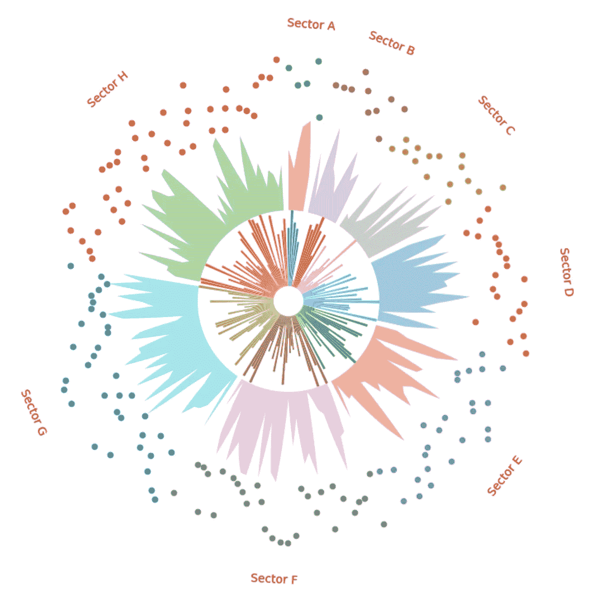

# 让你的 Python 数据可视化图表更“圆润”

> 原文：[`towardsdatascience.com/cant-believe-how-easy-it-is-to-plot-such-a-data-visualisation-in-python-5bcd612e0277?source=collection_archive---------2-----------------------#2024-03-10`](https://towardsdatascience.com/cant-believe-how-easy-it-is-to-plot-such-a-data-visualisation-in-python-5bcd612e0277?source=collection_archive---------2-----------------------#2024-03-10)



作者生成的图表

## PyCirclize 库的基本用法——Circos 图

[](https://christophertao.medium.com/?source=post_page---byline--5bcd612e0277--------------------------------)[](https://towardsdatascience.com/?source=post_page---byline--5bcd612e0277--------------------------------) [Christopher Tao](https://christophertao.medium.com/?source=post_page---byline--5bcd612e0277--------------------------------)

·发表于[Towards Data Science](https://towardsdatascience.com/?source=post_page---byline--5bcd612e0277--------------------------------) ·7 分钟阅读·2024 年 3 月 10 日

--

如果你的工作包括将数据绘制到图表中以展示洞察力，你可能会听说过 Circos 图表，因为它的外观非常吸引人。事实上，除了好看，它在可视化复杂关系方面也非常出色，比如基因组研究中基因之间的连接。当然，在一般的数据可视化应用中，它也有一些优点，例如更高效地利用空间、通过循环突出模式等。

你可能认为绘制 Circos 图表会很难，但我想说不，使用一个叫做`PyCirclize`的惊人可视化工具，你可以在 Python 中轻松完成。

在这篇文章中，我将一步一步地向你展示如何绘制一个非常基础的 Circos 图。下一篇文章中，我会使用这个库展示一些实际应用案例和更复杂的图表。

我们不浪费太多时间讨论如何安装这个库。你可以通过`pip`轻松将其添加到你的 Python 环境中。

```py
$ pip install pycirclize
```

# 1\. 快速开始
