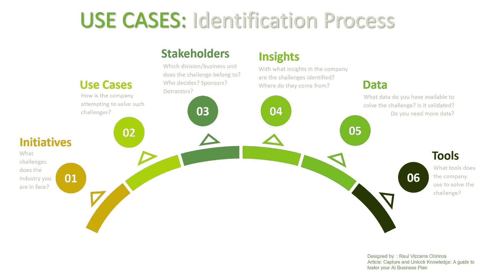
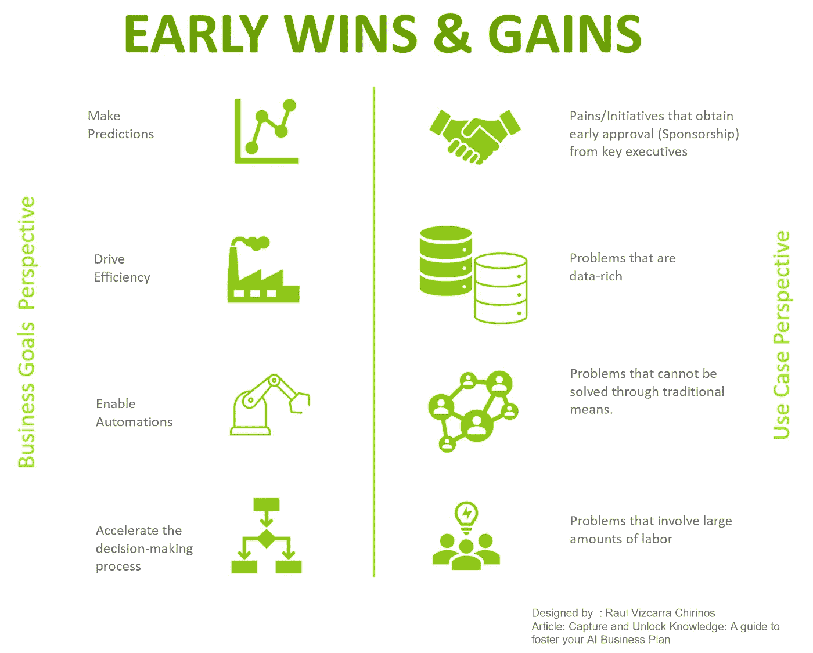
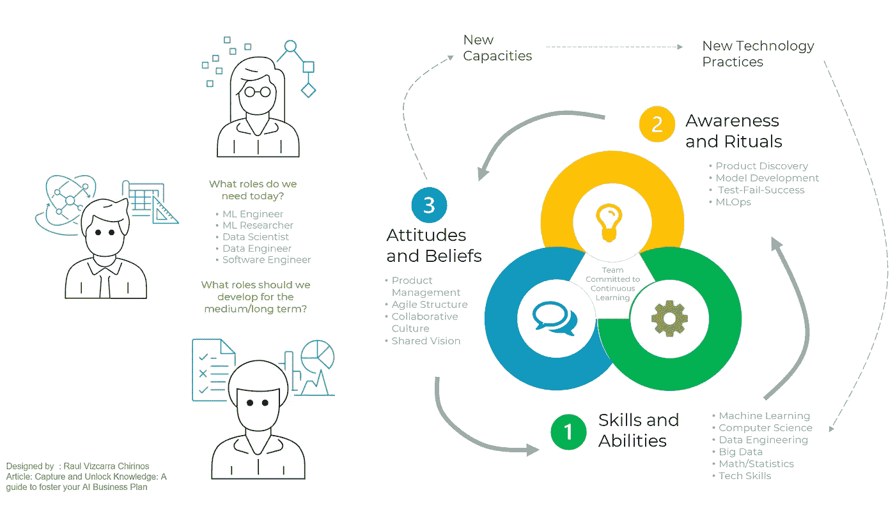
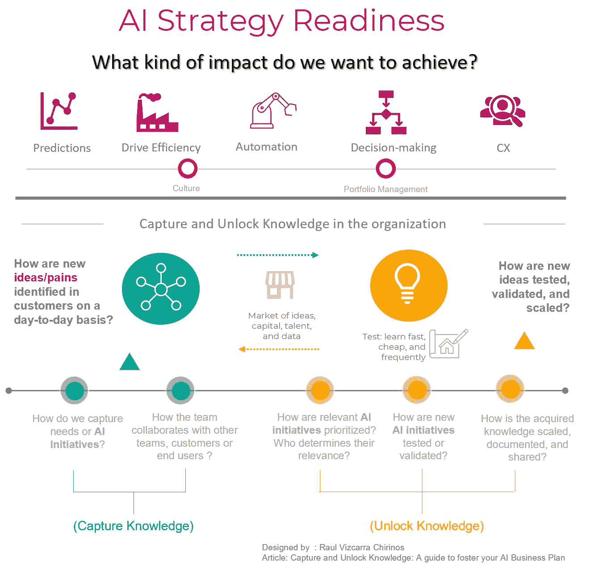
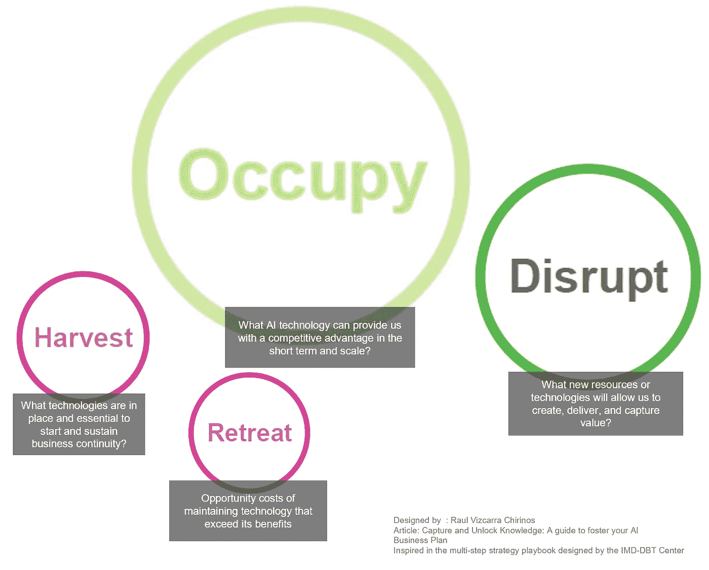
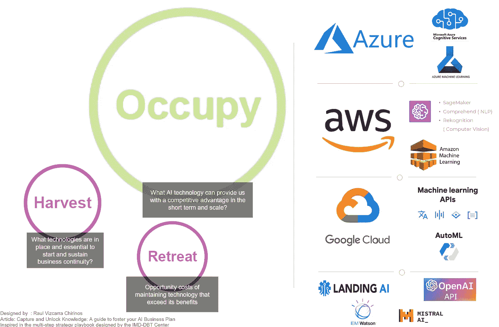
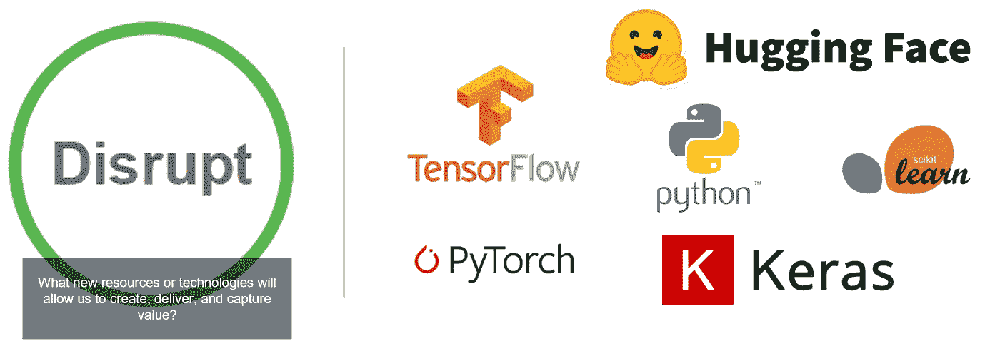
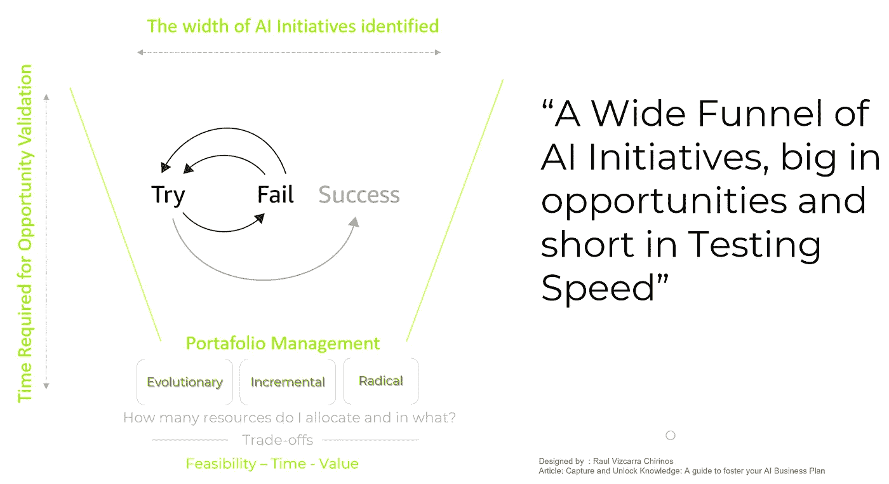
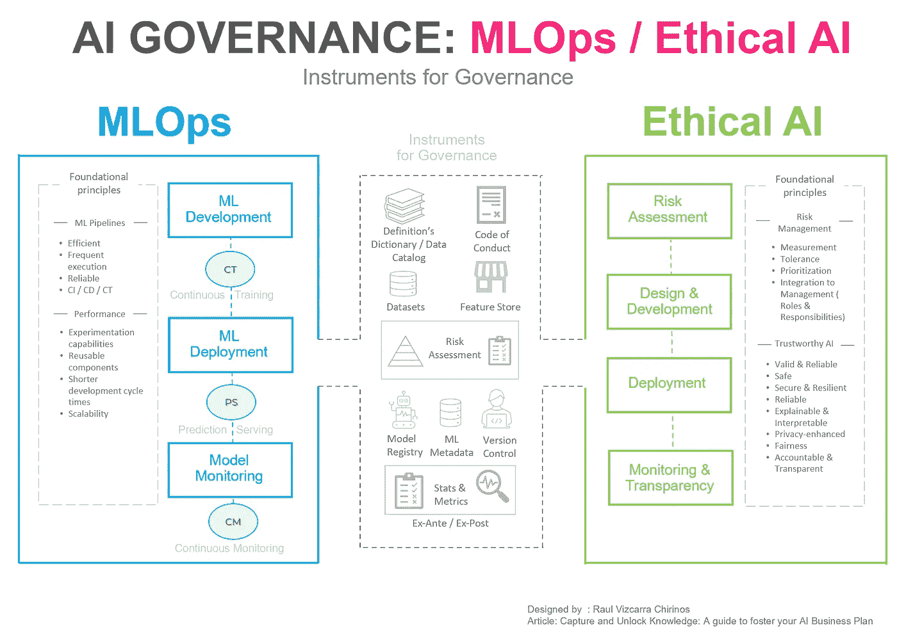

# 捕获并释放知识：促进你的 AI 商业计划的指南

> 原文：[`towardsdatascience.com/capture-and-unlock-knowledge-a-guide-to-foster-your-ai-business-plan-b8054c1ee29a?source=collection_archive---------3-----------------------#2024-04-28`](https://towardsdatascience.com/capture-and-unlock-knowledge-a-guide-to-foster-your-ai-business-plan-b8054c1ee29a?source=collection_archive---------3-----------------------#2024-04-28)

图片来源：[Pawel Czerwinski](https://unsplash.com/@pawel_czerwinski?utm_source=medium&utm_medium=referral)于[Unsplash](https://unsplash.com/?utm_source=medium&utm_medium=referral)

## AI 解决方案不仅仅是一种工具方法；它涉及到充分理解的使用案例以及衡量其影响的方式

 [Raul Vizcarra Chirinos](https://medium.com/@raul.vizcarrach?source=post_page---byline--b8054c1ee29a--------------------------------)

·发表于[Towards Data Science](https://towardsdatascience.com/?source=post_page---byline--b8054c1ee29a--------------------------------) ·阅读时间 12 分钟·2024 年 4 月 28 日

--

我们正在围绕 AI 塑造的世界包括不同类型的组织：那些构建先进 AI 技术的，其他开发基于 AI 的解决方案的，以及最终，旨在利用 AI 带来积极影响或支持其业务的组织。当最后一类组织部署 AI 的举措发生时，能力建设和培训主要集中在技术基础设施、数据生态系统或技术技能方面；尽管其重要性无可争议，但我们未能意识到，在大多数情况下，AI 解决方案不仅仅是一种工具方法；它涉及到充分理解的使用案例以及衡量其影响的方式。本指南旨在为领导 AI 项目的任何人提供帮助，并补充任何旨在通过 AI 提升创新能力的策略。

> “AI 不仅关乎它的能力和承诺，更关乎它如何被使用……”（[AI 的时代](https://www.amazon.com/Age-I-Our-Human-Future/dp/0316273805): 以及我们的人类未来 -基辛格，施密特，胡滕洛赫）

通过人工智能的每一个创新过程都包含两个部分：**捕获知识**和**利用知识**。本指南旨在展示这两者之间的紧密关系，以及构成它们的**五个维度**（**应用场景、早期成功、人员、技术和治理**）。虽然它们可以独立存在，但合起来，它们可以显著提高识别和部署基于 AI 的解决方案的机会，从而产生实质性影响。

**我想澄清一下本指南的目标范围**。在这个话题上，咨询公司（如 [德勤](https://www2.deloitte.com/us/en/pages/technology/articles/effective-ai-strategy.html)、[麦肯锡](https://www.mckinsey.com/capabilities/quantumblack/our-insights/the-executives-ai-playbook?page=industries%2F)、[波士顿咨询](https://www.bcg.com/publications/2017/technology-digital-strategy-putting-artificial-intelligence-work)、[高德纳](https://www.gartner.com/en/information-technology/topics/ai-strategy-for-business) 等）和私营部门公司或独立研究（如 [Catalyst Fund](https://bfaglobal.com/catalyst-fund/insights/six-steps-to-an-intelligent-ai-strategy-the-ai-readiness-toolkit/)、[Profit.co](https://www.profit.co/blog/okr-university/a-guide-to-deploy-ai-for-strategy-implementation/)、Dorien Herremans 等）已经做了很多很好的工作。因此，我并不打算提出另一个定制的概念框架或重新发明轮子。事实上，一些展示的步骤可能对任何在 B2B 技术咨询公司领导 AI 实践的人来说都听起来非常熟悉。我的目的是远离抽象的概念框架，并尝试将一套步骤操作化，配合一些工具，帮助公司显著提高识别和部署基于 AI 的解决方案的机会，从而产生实质性影响。

# **01: 关键在于应用场景**

这并不是一种 AI 工具的方式；这完全是关于应用场景的。这意味着，为了提高我们的 AI 项目成功率，我们必须识别出影响最终用户或我们合作的公司的实际问题。这其实并不是什么新鲜事，因为大多数 AI 战略框架都强调以识别好的商业案例作为起点的重要性。

这一部分是我所称的**“捕获知识”**，虽然每个人都认识到这是一个重要的步骤，但关于如何做到这一点的信息却很少。对于本指南，我将这一捕获知识的步骤分为两个维度：**识别过程**和**优先排序过程**，这指定了帮助选择哪些应用场景可能更相关、值得参与的参数，并实现***早期成功***。

图 01 来源：作者自创

## 如何识别部署 AI 的好机会？

01) **倡议：** *您所在行业面临哪些挑战？*

02) **用例：** *公司如何尝试解决这些挑战？*

03) **利益相关者：** *这个挑战属于哪个部门/业务单位？谁来决定？赞助人？反对者？*

04) **洞察：** *公司是通过哪些洞察识别出这些挑战的？这些洞察来自哪里？*

05) **数据：** *您可以用来解决挑战的数据是什么？这些数据经过验证了吗？您需要更多数据吗？*

06) **工具：** *公司使用什么工具（技术）来解决挑战？*

# 02: 早期成功与收益

每个发展都遵循一个采纳曲线；技术进步的速度快于人类的接受能力，也快于公司适应这种新客户行为的速度。这就是“[科林里奇困境](https://demoshelsinki.fi/2022/02/15/what-is-the-collingridge-dilemma-tech-policy/)”的本质，但它同样对于理解人工智能项目的成功至关重要。

不同公司之间的轨迹有所不同；大型公司在初期可能更能容忍研究、测试和失败，以便在人工智能领域取得显著成果或激进创新。然而，正如前面提到的，许多组织愿意利用人工智能支持他们的业务，但面临不同的动态，例如预算有限且不耐烦等待结果。但早期的成功不仅仅关乎利润或快速成功，从[**科特尔变革管理框架**](https://www.kotterinc.com/methodology/8-steps/)中提取的一些概念是，**建立势头**，激励人们追求共同的愿景，做以前从未做过的事，并激发发现的灵感。

图 02 来源：作者自创

早期的成功和收益可以从两个不同的角度来看。从**商业目标的角度**来看，公司的基本思路随着时间推移保持不变，任何能够**增加销售**或**降低成本**的项目始终是一个不错的选择。因此，任何能够展示（意味着有可衡量数据的证据）提高效率、实现自动化或做出预测以加速决策过程的人工智能项目，都是一个好的起点。从**用例的角度**来看，重要的是要考虑到**并非所有问题都需要用人工智能来解决**，那些无法通过传统手段解决、数据丰富或涉及大量劳动的项目更容易受到欢迎。最后，不要忘记**高层管理人员的早期支持很重要**；一个**强有力的背书**可能是成功部署阶段与停滞不前之间的关键因素。

> **“成功是结果的分子。它们必须被识别、收集并传播——早期且经常——以追踪进展并激励志愿者坚持下去。”**（变革领导的 8 个步骤——约翰·科特尔）

# 03: 致力于持续学习的团队

虽然这听起来可能像一个陈词滥调，但人和技能是非常重要的，几乎每个框架都强调这一点。然而，虽然团队的规模和专业技能将取决于公司的规模或预算，但团队识别潜在 AI 倡议并将其部署的速度将完全取决于我所称之为**“持续学习”**的概念，这个概念灵感来自 DevOps 或 MLOps 等实践背后的连续性理念，以及彼得·圣吉的《[学习型组织](https://www.amazon.com/Fifth-Discipline-Practice-Learning-Organization/dp/0385517254)》。让我们来解构一下这个概念：

图 03 来源：作者自创

**你拥有的技能与你需要的技能：** 人工智能领域涵盖了各种各样的技能和角色。当你开始识别良好的 AI 倡议时，可能会发现你的团队缺乏执行它们所需的必要技能。在制定 AI 商业计划的初期，专注于利用那些使你能够设计、验证和部署“早期胜利”的技能。然后，随着这些早期胜利的部署，团队获得了信誉，AI 倡议变得更具挑战性，因此可以过渡到获取或培养更复杂的技能。

**意识和仪式：** AI 倡议既不是一锤子买卖，也不是个人秀。这是一个持续为团队提供评估和追求的创意的过程；有些会成功，有些可能失败，但你需要一个**持续流动的**创意管道。主要来说，你应该让 AI 倡议流经三个阶段：**播种**（研究阶段，讨论可以通过 AI 解决的公司痛点/收益），**成长**（批准继续进行设计、测试或验证的倡议），以及**收获**（已部署的倡议，准备扩展或复制）。

为了建立一个**持续流动**的 AI 倡议漏斗，请在你的 AI 商业计划中包括评估，以识别：

***01)*** *团队是如何捕捉 AI 倡议的？* ***02)*** *团队是如何与公司内的其他团队、客户或最终用户合作，以识别 AI 倡议的？* ***03)*** *相关倡议如何优先排序？谁来决定它们的相关性？* ***04)*** *新 AI 倡议如何进行测试或验证？如何记录和分享获得的知识？*

图 04 来源：作者自创

传达的信息是**走出大楼！** 在团队内组织每日会议，并与其他业务单元进行工作坊，安排与客户和最终用户的拜访（*不是为了推销，而是为了理解他们的业务痛点*），并与他们进行工作坊。

**记住，AI 项目的漏斗就像一块肌肉；持续的学习文化不是一天就能建立起来的。** 话虽如此，实践不应该只是做一次，而应该经常进行，这样才能将意识和仪式转化为态度和信念。从长远来看，正是态度和信念激发了探索，推动你开发新能力，探索尚未应用 AI 的新领域。有一点是肯定的，**如果不经常锻炼这块肌肉，创意就会停滞不前**。

# 04: 技术

在技术方面，预算会是一个限制因素，但不是约束。幸运的是，我们正处于 AI 发展激动人心的时代，因此在计算、建模、测试和部署方面，你可以受益于围绕 AI 构建的开源生态系统，或者一些服务提供商提供的免费层（*Google, AWS, Azure, IBM cloud, Oracle cloud*）。虽然这些免费层有一些限制，但它们可以帮助加速研究、设计和测试阶段，从而验证适合部署的优秀用例。

因此，我们的目标是实现**便利性**；要么从零开始构建，完全掌控架构，要么利用预先开发好的用例并将其作为服务消费，不管是完全使用还是作为混合架构的一部分。受 IMD 数字商业转型中心开发的[应对数字颠覆的多步骤战略手册](https://www.imd.org/research-knowledge/strategy/articles/strategies-for-responding-to-digital-disruption2/)的启发，以下几个维度可以帮助你选择最适合的技术起步，并了解如何进行规模化：

图 05 来源：作者原创

如果你领导一个小型的 AI 业务单元，或者正在建立一个需要迅速实现“早期成功”（Erly Wins）的团队，也许你最好的选择是利用开源生态系统、预构建的模型或预制解决方案。与其追求 AI 的激进性颠覆，不如通过使用已经经过验证和测试的东西来实现**渐进性的收益**。这种方法更快地验证创意，并设计、测试和部署 AI 项目，这在初期阶段对于建立利益相关者的信心非常关键，以便在后期面对更具颠覆性的挑战时能够顺利推进。

图 06 来源：作者原创

如果在等待早期成功（E*arly Wins*）方面有一定的灵活性，你的最佳选择可能是从零开始，而不是使用现有的解决方案。尽管这种方法从长远来看可能带来显著的回报，但它也**在可行性、时间限制和价值管理方面带来了挑战**。结果可以等待，但当时机来临时，它们必须是可见的。

图 07 来源：作者原创

请记住，当从零开始构建 AI 项目时，您也可以实现**“早期胜利”**（这完全取决于用例）。例如，Python 有许多资源可以用来开发监督学习模型，如预测时间序列或预测客户购买、账单支付或客户保持模型等事件的概率（*需要注意的是，实施这些模型要求您的团队在统计推理和建模方面要比技术方面更强*）。如果您的 AI 项目涉及非结构化数据，如文本或视频，像 PyTorch 或 Hugging Face 社区等工具提供了适用于文本处理或视频与图像识别的开源模型（*如果您有兴趣，这里有一些示例：* [*这个*](https://medium.com/towards-data-science/decoding-the-us-senate-hearing-on-oversight-of-ai-nlp-analysis-in-python-2a1e50a1fd0c) *涉及使用 Python 进行文本处理和情感分析，而* [*这个*](https://medium.com/latinxinai/heres-to-the-crazy-ones-the-misfits-45f2132623c7) *则利用 Hugging Face 资源进行视频分析）*

最后，在进行 AI 商业计划的技术评估时，您必须考虑两个要素：

**01) 技能与技术之间的平衡：** 您的团队目前具备的技术技能，以及正在培养的技能，必须与短期内实现早期胜利所需的技术以及未来使用的技术保持一致。这是双向的，如果您打算使用某种特定技术，确保您的团队具备管理该技术所需的适当技能，或者能够迅速学习这些技能。技术技能可以在劳动力市场中找到（*根据所需的技术技能，可能需要付出代价*）或在内部培养，但这需要时间，而时间是追求早期胜利时的限制因素。

**02) 宽广的漏斗——快速测试：** 在验证过的 AI 项目、人员和技术之间找到平衡，应该能产生一个宽广的 AI 项目漏斗，既有大机会，也能有效地进行测试。项目组合应该持续包括多种类型的 AI 项目：**渐进式 AI 项目**用于早期胜利和稳定的收入流，**进化型 AI 项目**用于将成功的部署复制到其他市场，以及**颠覆性 AI 项目**用于保持领先地位并预测未来趋势。项目组合的混合取决于等待早期胜利的容忍度。AI 不是单一的工作，它涉及管理一个 AI 项目组合。关键是不断扩展漏斗并缩短测试过程，使得 AI 项目能够快速、低成本地进行测试和部署。（*有关如何管理创新组合的更多见解，请考虑阅读* [*这篇文章*](https://metacool.typepad.com/metacool/2009/04/7-develop-a-taste-for-the-many-flavors-of-innovation.html)）*

图 08 来源：作者原创

# 05：治理

有句著名的名言，*“正常是一个幻觉；对蜘蛛来说正常是混乱，而对苍蝇来说正常是死亡”*。近年来的变化凸显了我们所生活的商业环境充满不确定性和动态变化，在这种环境中，韧性和快速适应的能力是至关重要的资产。应用于人工智能（AI）计划，这意味着为了实现快速部署和扩展，我们需要高效的机器学习流水线，支持频繁执行并且具有可靠性。在数据管理方面，像[DAMA-DMBOK](https://www.dama.org/cpages/dmbok-images)和 DataOps 等框架做了大量工作，对于 AI，我们有 MLOps。

图 09 来源：作者原创

**MLOps：** 部署面临着一些挑战，比如数据科学家和 IT 团队之间交接的潜在问题、开发阶段的跟踪问题，以及数据或模型漂移带来的影响。有了 MLOps，我们可以获得若干好处。首先，在**开发阶段**，重点是**“实验”**（数据探索、特征工程、模型原型和验证），并且保持这个过程的记录和知识。其次，在**版本控制**中，我们回答像**谁？为什么？如何？**这样的问题，以确保未来的合规性和可重用组件（例如数据特征库）。最后，在**监控**中，我们关注数据或模型偏差的变化，确保模型的公平性。你可以在[谷歌的 MLOps 实践者指南](https://services.google.com/fh/files/misc/practitioners_guide_to_mlops_whitepaper.pdf)中找到一个有用的指南。

**伦理 AI 治理：** 与 AI 治理相关的另一个问题是**合规性**。尽管有关监管框架的辩论仍在继续（一些框架已经进入实施的最后阶段），但公司可以从自我监管框架开始，进行风险评估、控制测试环境、开发协议以及持续监控，以实现伦理和负责任的 AI 部署。在[这篇文章](https://medium.com/latinxinai/navigating-muddy-waters-a-framework-for-ethical-ai-governance-inspired-by-the-eu-ai-act-3d6339ba364)中，我分享了一个基于欧盟 AI 法案的自我监管框架的想法，这对于你的 AI 商业计划可能非常有用。另一个有价值且必读的资源是来自美国国家标准与技术研究院（NIST）的[人工智能风险管理框架](https://nvlpubs.nist.gov/nistpubs/ai/NIST.AI.100-1.pdf)。

# 最终思考

人类似机器的想法一直以来都吸引着人类的关注，正如斯坦福大学 Erik Brynjolfsson 在[2022 年发表的文章](https://digitaleconomy.stanford.edu/news/the-turing-trap-the-promise-peril-of-human-like-artificial-intelligence/)中所描述的，他还讨论了这一技术的经济影响，强调了增强人类能力相较于单纯自动化的好处。**自动化**和**增强**都能促进生产力；不同之处在于，后者推动人类做一些以前无法做到的事情，激发了发现并提升了生活水平。

我们可以肯定的是，我们将继续寻找能够复制人类行为的技术。关键在于我们如何看待像**自动化**和**人工智能**这样的概念。仅仅专注于模仿现有的世界，忽视了我们利用**人工智能**创造新事物的潜力，以塑造更美好的明天。

感谢阅读！,*我漏掉什么了吗？* 欢迎提供建议，继续推动对话。
