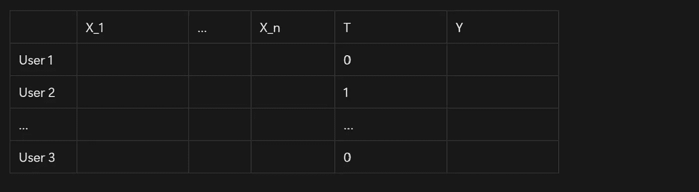
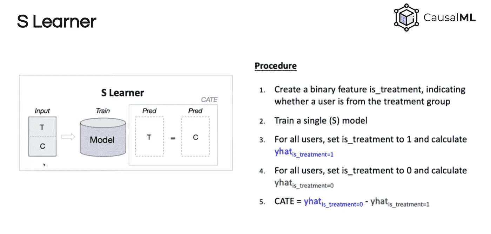
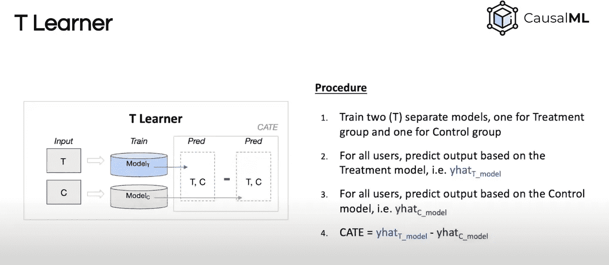
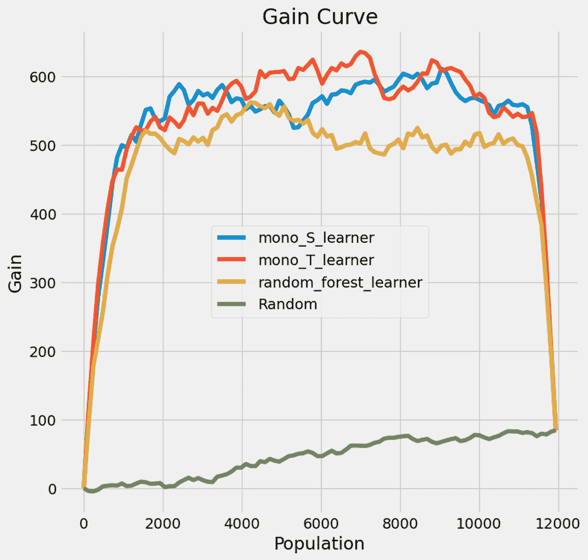
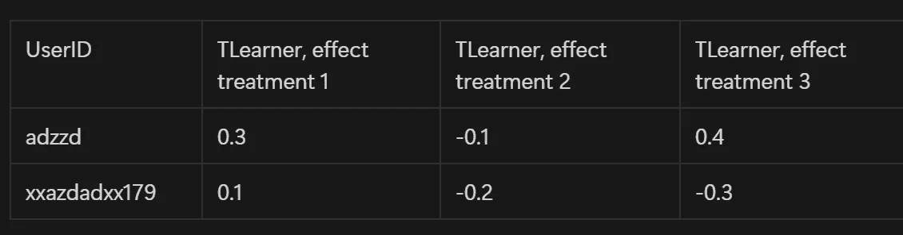
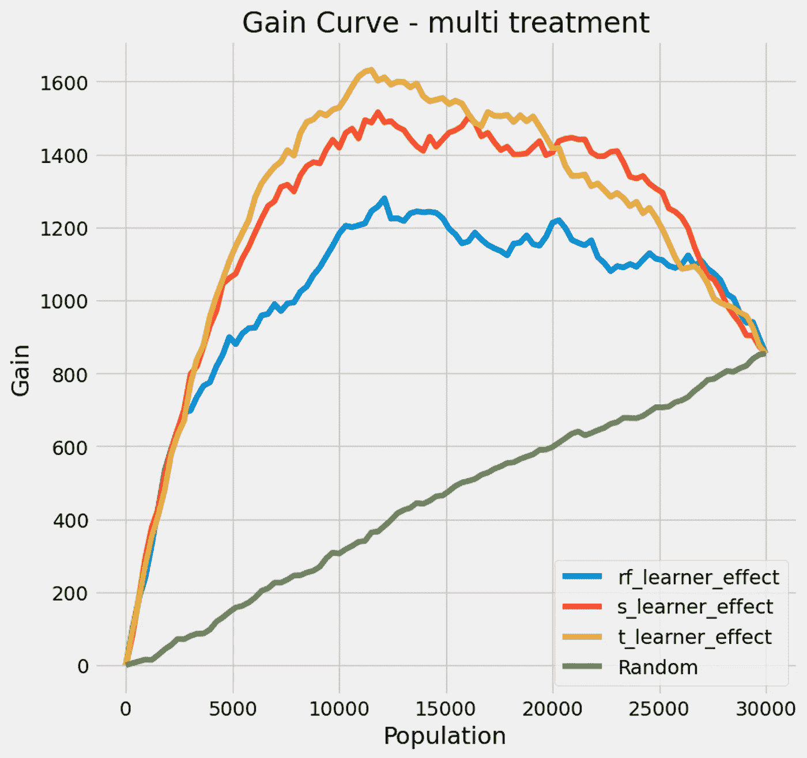

# 因果机器学习在客户保持中的应用：一份使用 Python 的实用指南

> 原文：[`towardsdatascience.com/causal-machine-learning-for-customer-retention-a-practical-guide-with-python-6bd959b25741?source=collection_archive---------1-----------------------#2024-08-30`](https://towardsdatascience.com/causal-machine-learning-for-customer-retention-a-practical-guide-with-python-6bd959b25741?source=collection_archive---------1-----------------------#2024-08-30)


图片来源：[Claudio Schwarz](https://unsplash.com/@purzlbaum?utm_source=medium&utm_medium=referral) 在 [Unsplash](https://unsplash.com/?utm_source=medium&utm_medium=referral)

## 一本关于利用因果机器学习优化客户保持策略的通俗易懂指南

[](https://medium.com/@arthur.cruiziat?source=post_page---byline--6bd959b25741--------------------------------)[](https://towardsdatascience.com/?source=post_page---byline--6bd959b25741--------------------------------) [Arthur Cruiziat](https://medium.com/@arthur.cruiziat?source=post_page---byline--6bd959b25741--------------------------------)

·发布于 [Towards Data Science](https://towardsdatascience.com/?source=post_page---byline--6bd959b25741--------------------------------) ·阅读时长：20 分钟·2024 年 8 月 30 日

--

# 本系列详情

本文是关于提升建模和因果机器学习系列中的第二篇。我们的目的是从商业和技术两个角度深入探讨这些方法论。

在深入了解这一部分之前，我强烈建议先阅读前一篇文章，该文解释了什么是提升建模，以及它如何整体帮助您的公司。

链接见下文。

[](/from-insights-to-impact-leveraging-data-science-to-maximize-customer-value-9c9af354e192?source=post_page-----6bd959b25741--------------------------------) ## 从洞察到影响：利用数据科学最大化客户价值

### 提升建模：因果机器学习如何改变客户关系和收入

towardsdatascience.com

# 介绍

想象一下：你是某家银行的客户已经有几年了。然而，过去一两个月，你一直在考虑是否离开，因为他们的应用程序变得越来越复杂。突然，银行的一名员工打电话给你。他询问了你的体验，并很快向你解释了如何使用该应用。与此同时，你的女儿也是这家银行的客户，她也因为交易费用太高而考虑离开她们。在快要取消服务时，突然，她收到了一张优惠券，允许她一个月内免费交易！这怎么可能？

在我之前的文章中，我介绍了这一层次个性化背后的神秘技术：提升建模。当传统方法通常预测一个结果——例如客户流失的概率——时，提升建模预测的是对客户采取某个行动后的潜在结果。例如，预测如果给客户打电话或提供优惠券，客户留下来的可能性！

这种方法使我们能够针对正确的客户——因为我们将剔除那些对我们的方法反应不佳的客户——同时通过根据每个客户的特点量身定制我们的策略，增加成功的机会。得益于提升建模（uplift modeling），我们不仅能够将资源集中在合适的群体上，还能够最大化其影响！

听起来很有意思，不是吗？嗯，今天是你的幸运日，因为在这篇文章中，我们将通过解决一个具体的例子——提升客户留存率，深入探讨这种方法的实施。我们将逐步走过每一步，从定义精确的用例到评估模型结果。我们今天的目标是为你提供正确的知识和工具，使你能够在自己的组织中应用这项技术，当然，这需要根据你自己的数据和用例进行调整。

# 以下是我们将要涵盖的内容：

1.  我们将从**清晰定义我们的用例**开始。什么是客户流失？我们将目标客户定位在哪里？我们将采取哪些行动来试图留住客户？

1.  然后，**我们将讨论获取适合的工作数据**。为了实施提升建模，我们需要哪些数据，如何获得这些数据？

1.  接下来，我们将深入了解实际的建模，专注于**理解提升建模背后的各种模型**。

1.  接下来，我们将运用新学到的知识来解决**第一个案例，涉及单一的留存行动：一场电子邮件活动**。

1.  最后，我们将深入探讨一个**更复杂的实施案例，涉及多个处理方法，接近用户级别的个性化**。

# 我们的用例：提升客户留存率

在我们能够应用提升建模来提升客户留存率之前，我们需要清晰地定义背景。在我们的业务环境中，什么构成了“流失”？我们是否希望定位特定的用户？如果是，为什么？我们计划采取哪些行动来留住他们？我们有预算限制吗？让我们尝试回答这些问题。

## 定义客户流失

这是我们的第一步。通过精确和定量地定义流失，我们将能够定义留存，并了解我们目前的状况、其变化情况以及在需要时采取措施。你选择的流失定义将 100%取决于你的商业模式和行业。以下是一些需要考虑的因素：

+   如果你所在的公司是基于交易的公司，你可以查看交易频率，或者交易量的变化。你还可以关注自上次交易以来的时间，或账户活动的下降。

+   如果你所在的公司是基于订阅的公司，可能只需要查看那些已取消订阅的用户，或者那些已订阅但停止使用产品的用户。

如果你在一家基于交易的科技公司工作，流失可以定义为“*90 天内没有进行交易的客户*”，而如果你在一家移动应用公司工作，你可能更倾向于将其定义为*“30 天内没有登录的客户*”。流失的时间框架和性质必须提前定义，因为标记流失用户将是我们的第一步。

你的定义复杂度将取决于公司特点以及你希望考虑的度量标准数量。然而，目标是设定提供易于理解的阈值的定义，并能够帮助我们识别流失用户。

## 流失预测窗口

现在我们知道了流失的定义，我们需要明确我们想要避免的是什么。我指的是，我们是想防止客户在接下来的 15 天内流失，还是 30 天内流失？根据这里的答案，你将不得不以特定的方式组织数据，并定义不同的留存行动。我建议在这里不要过于乐观，原因有两个：

+   时间跨度越长，模型的表现越难保持良好。

+   我们在采取措施后等待的时间越长，捕捉其效果就越困难。

所以，让我们在这里保持合理。如果我们将流失定义为 30 天的时间框架，那么我们就选择 30 天的预测期，并尝试限制未来 30 天内的流失。

> 关键是，我们的时间框架必须为我们实施留存策略并观察其对用户行为的影响提供足够的时间，同时保持模型的性能。

## 选择目标用户 [可选]

另一个需要回答的问题是：我们是否针对特定人群进行留存行动？可能有多种原因促使这样一个想法。

+   我们注意到某一特定细分市场中的流失率上升。

+   我们希望锁定高价值的客户，以便通过这些行动最大化我们的投资回报率。

+   我们希望锁定新客户，以确保持久的激活。

+   我们想要锁定那些可能很快流失的客户。

根据你的具体使用案例，你可能只希望选择一部分客户。

在我们的案例中，我们将选择锁定那些流失概率较高的客户，以便我们能优先关注那些最需要我们的客户。

## 定义留存行动

最后，我们必须选择要对客户采取的实际留存行动。这并不容易，与业务相关方一起工作可能是个好主意。在我们的案例中，我们将选择四种不同的行动：

1.  个性化邮件

1.  应用内通知，突出新功能或机会

1.  直接联系我们的客户

1.  特别优惠或折扣 —— *另一个提升模型可能帮助我们确定最佳优惠金额，我们下一步应该探索这个吗？*

我们的提升模型将帮助我们确定哪些行动（如果有的话）最有可能对每个用户有效。

我们准备好了！我们定义了流失，选择了预测窗口，并选择了我们希望用来留存客户的行动。现在，有趣的部分开始了，让我们收集一些数据并构建一个因果机器学习模型！

# 数据收集：我们的提升模型的基础

构建一个有效的提升模型需要一个良好的数据集，结合现有用户信息和实验数据。

## 利用现有的用户数据

首先，让我们看看可用的数据。科技公司通常能访问到这些数据！在我们的案例中，我们需要客户层级的数据，如：

1.  客户信息（如年龄、地域、性别、获取渠道等）

1.  产品具体信息（创建或订阅日期、订阅层级等）

1.  交易信息（交易频率、平均交易金额、总消费、购买的产品/服务类型、上次交易以来的时间等）

1.  参与度（例如，登录频率、在平台上花费的时间、功能使用统计等）

我们可以查看这些原始数据，但更有价值的是理解它们随时间的变化。这使我们能够识别可能改善模型表现的行为模式。幸运的是，这相当简单，我们只需从不同的角度来看待数据；以下是一些可以帮助我们的转化方法：

+   对我们主要的使用指标（例如交易量）进行移动平均（7 天、30 天等）。

+   查看一段时间内的百分比变化。

+   在不同时间尺度上聚合我们的数据，比如每天、每周等。

+   或者甚至可以添加季节性指标，比如星期几或一年中的第几周。

这些功能带来了“动态信息”，在检测未来变化时可能非常有价值！更精确地了解我们应该选择哪些特征超出了本文的范围，然而这些方法是处理时间数据时的最佳实践。

> 记住，我们的目标是创建一个随时间演变的全面用户画像。这些时间数据将作为我们提升模型的基础，**使我们能够预测的不是谁可能流失，而是哪些用户最有可能对我们的留存措施做出积极响应。**

## 收集实验数据以进行提升建模

我们数据收集旅程的第二部分是关于收集与我们留存行动相关的数据。现在，提升建模并不要求必须有实验数据。如果你有过去事件的历史数据——比如你可能已经向客户发送了邮件或提供了优惠券——你可以利用这些数据。然而，数据越新且越不偏，结果会越好。去偏化观察性或非随机数据需要额外的步骤，这里我们不做讨论。

那么我们到底需要什么呢？嗯，我们需要了解你计划采取的行动的影响。我们需要设置一个随机化实验来测试这些行动。很多非常优秀的文章已经讨论了如何设置这些实验，我在这里就不详细展开了。我只想补充一点，设置越好，训练集越大，对我们越有利！

实验之后，我们显然会分析结果。虽然这些结果不会直接帮助我们达成目标，但它们将为我们提供有关治疗预期影响的额外理解，以及我们将尝试超越的良好效果基准。为了避免让你感到无聊，定义和缩写我们就不再展开了，但随机化实验的结果称为“平均处理效应”或 ATE。在我们这边，我们希望估计**条件平均处理效应**（CATE），也称为**个体处理效应**（ITE）。

> *虽然实验数据是理想的，但如果实验不可行，提升建模仍然可以通过观察性数据提供洞察。如果不是随机化的，存在多种技术来去偏我们的数据集，例如倾向得分匹配。关键是要有一个丰富的数据集，能够捕捉用户特征、行为和与我们的留存努力相关的结果。*

## 生成合成数据

在这个例子中，我们将使用**Uber 的 causalml 包**生成合成数据。Uber 已经在提升建模方面做了大量的工作，甚至创建了一个易于使用且文档完善的 Python 包。

如果你对生成合成数据感兴趣，这里是我们如何生成它的方法。

```py
import pandas as pd
from causalml.dataset import make_uplift_classification

# Dictionary specifying the number of features that will have a positive effect on retention for each treatment
n_uplift_increase_dict = {
    "email_campaign": 2,
    "in_app_notification": 3,
    "call_campaign": 3,
    "voucher": 4
}

# Dictionary specifying the number of features that will have a negative effect on retention for each treatment
n_uplift_decrease_dict = {
    "email_campaign": 1,
    "in_app_notification": 1,
    "call_campaign": 2,
    "voucher": 1
}

# Dictionary specifying the magnitude of positive effect on retention for each treatment
delta_uplift_increase_dict = {
    "email_campaign": 0.05,  # Email campaign increases retention by 5 percentage points
    "in_app_notification": 0.03,  # In-app notifications have a smaller but still positive effect
    "call_campaign": 0.08,  # Direct calls have a strong positive effect
    "voucher": 0.10  # Vouchers have the strongest positive effect
}

# Dictionary specifying the magnitude of negative effect on retention for each treatment
delta_uplift_decrease_dict = {
    "email_campaign": 0.02,  # Email campaign might slightly decrease retention for some customers
    "in_app_notification": 0.01,  # In-app notifications have minimal negative effect
    "call_campaign": 0.03,  # Calls might annoy some customers more
    "voucher": 0.02  # Vouchers might make some customers think the product is overpriced
}

# Dictionary specifying the number of mixed features (combination of informative and positive uplift) for each treatment
n_uplift_increase_mix_informative_dict = {
    "email_campaign": 1,
    "in_app_notification": 2,
    "call_campaign": 1,
    "voucher": 2
}

# Dictionary specifying the number of mixed features (combination of informative and negative uplift) for each treatment
n_uplift_decrease_mix_informative_dict = {
    "email_campaign": 1,
    "in_app_notification": 1,
    "call_campaign": 1,
    "voucher": 1
}

positive_class_proportion = 0.7  # Baseline retention rate

# Generate the dataset
df, feature_names = make_uplift_classification(
    n_samples=20000,  # Increased sample size for more robust results
    treatment_name=['email_campaign', 'in_app_notification', 'call_campaign', 'voucher'],
    y_name='retention',
    n_classification_features=20,  # Increased number of features
    n_classification_informative=10,
    n_uplift_increase_dict=n_uplift_increase_dict,
    n_uplift_decrease_dict=n_uplift_decrease_dict,
    delta_uplift_increase_dict=delta_uplift_increase_dict,
    delta_uplift_decrease_dict=delta_uplift_decrease_dict,
    n_uplift_increase_mix_informative_dict=n_uplift_increase_mix_informative_dict,
    n_uplift_decrease_mix_informative_dict=n_uplift_decrease_mix_informative_dict,
    positive_class_proportion=positive_class_proportion,
    random_seed=42
)

#Encoding treatments variables
encoding_dict = {
    'call_campaign': 3,
    'email_campaign': 1,
    'voucher': 4,
    'in_app_notification':2,
    'control': 0
}

# Create a new column with encoded values
df['treatment_group_numeric'] = df['treatment_group_key'].map(encoding_dict)
```

我们最终的数据应组织如下：



数据集描述

在“实际使用案例”中，这些数据通常会按时间进行汇总，例如，针对每个用户，我们会在接触他们之前，对收集到的数据进行每日或每周的汇总。

+   X_1 到 X_n 将是我们的用户级特征

+   T 将是实际的处理（1 或 0，处理或控制，处理 1，处理 2，控制，具体取决于你的使用案例）

+   Y 是实际的结果：用户是留了下来还是没有？

## 数据准备

在我们的案例中，为了分析两个使用案例，我们需要进一步的准备。让我们为每个使用案例创建两个不同的数据集——一个训练集和一个测试集：

+   第一个使用案例：单一处理案例，我们将专注于单一的留存策略：向客户发送电子邮件。

+   第二个使用案例：多治疗案例，我们将比较不同治疗方法的有效性，最重要的是为每个客户找到最合适的治疗方法。

```py
from sklearn.model_selection import train_test_split

def prepare_data(df, feature_names, y_name, test_size=0.3, random_state=42):
    """
    Prepare data for uplift modeling, including splitting into train and test sets,
    and creating mono-treatment subsets.
    """
    # Create binary treatment column
    df['treatment_col'] = np.where(df['treatment_group_key'] == 'control', 0, 1)

    # Split data into train and test sets
    df_train, df_test = train_test_split(df, test_size=test_size, random_state=random_state)

    # Create mono-treatment subsets
    df_train_mono = df_train[df_train['treatment_group_key'].isin(['email_campaign', 'control'])]
    df_test_mono = df_test[df_test['treatment_group_key'].isin(['email_campaign', 'control'])]

    # Prepare features, treatment, and target variables for full dataset
    X_train = df_train[feature_names].values
    X_test = df_test[feature_names].values
    treatment_train = df_train['treatment_group_key'].values
    treatment_test = df_test['treatment_group_key'].values
    y_train = df_train[y_name].values
    y_test = df_test[y_name].values

    # Prepare features, treatment, and target variables for mono-treatment dataset
    X_train_mono = df_train_mono[feature_names].values
    X_test_mono = df_test_mono[feature_names].values
    treatment_train_mono = df_train_mono['treatment_group_key'].values
    treatment_test_mono = df_test_mono['treatment_group_key'].values
    y_train_mono = df_train_mono[y_name].values
    y_test_mono = df_test_mono[y_name].values

    return {
        'df_train': df_train, 'df_test': df_test,
        'df_train_mono': df_train_mono, 'df_test_mono': df_test_mono,
        'X_train': X_train, 'X_test': X_test,
        'X_train_mono': X_train_mono, 'X_test_mono': X_test_mono,
        'treatment_train': treatment_train, 'treatment_test': treatment_test,
        'treatment_train_mono': treatment_train_mono, 'treatment_test_mono': treatment_test_mono,
        'y_train': y_train, 'y_test': y_test,
        'y_train_mono': y_train_mono, 'y_test_mono': y_test_mono
    }

# Usage
data = prepare_data(df, feature_names, y_name)

# Print shapes for verification
print(f"Full test set shape: {data['df_test'].shape}")
print(f"Mono-treatment test set shape: {data['df_test_mono'].shape}")

# Access prepared data
df_train, df_test = data['df_train'], data['df_test']
df_train_mono, df_test_mono = data['df_train_mono'], data['df_test_mono']
X_train, y_train = data['X_train'], data['y_train']
X_test, y_test = data['X_test'], data['y_test']
X_train_mono, y_train_mono = data['X_train_mono'], data['y_train_mono']
X_test_mono, y_test_mono = data['X_test_mono'], data['y_test_mono']
treatment_train, treatment_test = data['treatment_train'], data['treatment_test']
treatment_train_mono, treatment_test_mono = data['treatment_train_mono'], data['treatment_test_mono']
```

现在我们的数据准备好了，让我们稍微了解一下理论，并探讨可供选择的不同方法！

# 了解提升建模方法

正如我们现在所知道的，提升建模使用机器学习算法来估计干预对人群的**异质性治疗效应**。这种建模方法关注的是**条件平均治疗效应**（CATE），它量化了有无干预情况下，我们的客户在结果上的预期差异。

下面是我们可以用来估计它的主要模型：

## 直接提升建模

+   这种方法是最简单的。我们只需使用特定的算法，如提升决策树，其损失函数经过优化以解决这一问题。**这些模型旨在最大化同一模型中处理组和未处理组之间的结果差异。**

+   我们将使用**提升随机森林分类器**作为这一例子的模型。

## 元学习者

+   元学习者使用已知的机器学习模型来估计 CATE。它们可以结合以不同方式使用的多个模型，或者在其他模型的预测结果上进行训练。

+   虽然有许多方法，我们将重点介绍两种：**S-Learner 和 T-Learner**

让我们快速了解这些是什么！

## 1\. S-Learner（单模型）



S Learner — 来源 causalml 文档

S-Learner 是所有元学习者中最简单的一个。为什么？因为它仅由一个传统的机器学习模型组成，该模型将治疗特征作为输入。虽然实现起来简单，但如果治疗变量的重要性较低，它可能会遇到困难。

## 2\. T-Learner（双模型）



“T-Learner 试图通过强制学习者首先基于治疗进行拆分，解决完全丢弃治疗的问题。我们将使用一个模型来表示每个治疗变量，而不是使用单一模型。

在二元情况下，我们只需要估计两个模型（因此得名 T）。” *来源[3]*

> *这些方法各有优缺点。它们的效果如何取决于你的数据以及你想要达到的目标。*

在本文中，我们将尝试这三种方法：提升随机森林分类器、S-Learner 和 T-Learner，并比较它们在提高公司留存率方面的表现。

# 单一治疗提升模型的因果机器学习实现

## 模型训练

现在让我们来训练我们的模型。我们将从直接的提升模型——提升随机森林分类器开始。然后，我们将使用 XGBoost 回归器训练我们的元模型。这里有两点需要注意：

+   你选择的元模型算法显然会影响最终模型的表现，因此你可能需要谨慎选择。

+   是的，我们选择回归模型作为元模型而不是分类器，主要是因为它们提供了更多的灵活性，能够输出精准的效果。

以下是你将在代码中看到的不同步骤：

+   我们初始化我们的结果数据框

+   然后我们在训练集上训练每个模型

+   最后，我们预测我们在测试集上的治疗效果，然后保存结果

```py
from causalml.inference.meta import BaseSRegressor, BaseTRegressor
from causalml.inference.tree import UpliftRandomForestClassifier
from xgboost import XGBRegressor

#save results in a df
df_results_mono = df_test_mono.copy()

# Initialize and train a randomForest Classifier
rfc = UpliftRandomForestClassifier(control_name='control')
rfc.fit(X_train_mono, treatment_train_mono, y_train_mono)

# Initialize and train S-Learner
learner_s = BaseSRegressor(
    learner=XGBRegressor(
        n_estimators=100,
        max_depth=3,
        learning_rate=0.1,
        random_state=42
    ),
    control_name='control'
)

learner_s.fit(X_train_mono, treatment_train_mono, y_train_mono)

# Initialize and train T-Learner
learner_t = BaseTRegressor(
    learner=XGBRegressor(
        n_estimators=100,
        max_depth=3,
        learning_rate=0.1,
        random_state=42
    ),
    control_name='control'
)

learner_t.fit(X_train_mono, treatment_train_mono, y_train_mono)

# Predict treatment effects
df_results_mono[["mono_S_learner"]] = learner_s.predict(X=X_test_mono)
df_results_mono[["mono_T_learner"]] = learner_t.predict(X=X_test_mono)
df_results_mono["random_forest_learner"] = rfc.predict(X_test_mono)

display(df_results_mono[["mono_S_learner", "mono_T_learner", "random_forest_learner"]].mean())

df_mono_results_plot = df_results_mono[["mono_S_learner","mono_T_learner", "random_forest_learner","retention","treatment_col"]].copy()
```

请注意，我们仍然在使用 causalml，这个 API 非常简单，使用起来非常像 sklearn 的实现。

## 模型评估

如何评估和比较我们模型的表现？这是个好问题！因为我们预测的是我们并不知道的东西——*我们并不知道我们的治疗对客户的效果，因为每个客户要么接受了治疗，要么在控制组中*。**我们不能使用经典的评估指标**。幸运的是，还有其他方法：

**增益曲线**：增益曲线提供了一种简便的方式来可视化我们模型的表现。增益的基本思想很简单：

+   我们计算了每个客户的估算效果，并按效果从大到小排序。

+   从这里开始，我们逐点进行。在每个点上，我们计算平均治疗效果，意味着同时计算对照组和治疗组的平均效果，然后取它们的差值。

+   我们分别对我们的模型排序和随机排序进行相同的操作，模拟随机选择，并比较这两条曲线！

它帮助我们理解如果与随机选择相比，我们的模型带来了什么样的改进。

**AAUC 得分**：AAUC 得分非常接近实际增益曲线，因为它衡量了模型增益曲线下的面积，使我们能够与随机模型的增益曲线进行比较。它以一个易于比较的数字总结了增益曲线。

在下面的代码中，我们计算了这些指标

```py
from causalml.metrics import plot_gain
from causalml.metrics import auuc_score

#AAUC score
aauc_normalized = auuc_score(df_mono_results_plot, outcome_col='retention', treatment_col='treatment_col', normalize=True, tmle=False)
print(f"AAUC Score Normalized: {aauc_normalized}")

# Plot Gain Curve
plot_gain(df_mono_results_plot, outcome_col='retention', treatment_col='treatment_col')
plt.title('Gain Curve - T-Learner')
plt.show()
```

这是我们得到的结果。更高的分数当然更好。

1.  T-Learner：~6.4（最佳表现）

1.  S-Learner：~6.3（非常接近第二名）

1.  随机森林：~5.7（不错，但不如其他模型）

1.  随机目标：~0.5（基线）

这些结果意味着什么？

+   好吧，所有我们的模型的表现都远远超过了随机目标。这令人放心。它们大约有效 12 倍！我们稍后将了解这在影响力方面意味着什么。

+   我们还可以从这些 AAUC 得分中看出，尽管所有模型的表现都很好，但 T-Learner 的表现最好

现在让我们来看一下增益曲线。

## 增益曲线

如何阅读增益曲线：

+   **X 轴（人群）**：这代表你所针对的目标人群的大小，从最能响应的个体（左侧）到最不响应的个体（右侧）。

+   **Y 轴（增益）**：这显示的是累积增益，即你在结果中的改进（例如，提高了留存率）。



## 增益曲线解读

增益曲线向我们展示了目标人群的收益——在我们初始单位中，因此是“保留的人群”——通过使用我们的提升模型或随机目标。

+   在这种情况下，似乎如果我们向全体用户发送电子邮件，我们将大约留住 100 名额外的用户。这是我们的基线场景。请注意，每条曲线最终都会得出这个结果，考虑到我们的增益定义，这是预期的。

+   那么如何解读这个呢？嗯，通过观察这条曲线，我们可以说，使用我们的模型，**通过只接触 50%的人群，我们可以节省 600 个额外的用户！** 这是通过接触所有人节省的六倍。如何做到的呢？通过仅针对那些可能对我们的接触做出积极反应的用户，而忽略那些可能利用这封邮件实际上选择流失的用户。

*现在是时候做一个小小的免责声明了：我们在这里使用的是合成数据，我们的结果在现实世界中极不可能出现，但这对于说明问题是有益的。*

在这种情况下，我们的模型使我们能够用更少的资源做更多的事情。这是一个如何通过使用提升建模并针对较小人群份额来优化资源的好例子，从而限制操作成本，并获得良好的结果份额。如果你愿意的话，这就像一种帕累托效应。

但是，让我们转向更酷的部分：我们如何为每个客户个性化我们的接触方式。

# 多重处理模型：让我们进入个性化阶段

现在让我们重新开始分析，考虑我们上面描述的所有用户保持策略：

1.  电子邮件营销活动

1.  电话营销活动

1.  应用内通知

1.  代金券

为了实现这一点，我们需要进行实验，或者进行所有这些操作的多重处理实验，或者聚合多个实验的结果。实验数据越好，预测输出就会越准确。然而，设置这样的实验可能需要时间和资源。

我们将使用之前生成的数据，并记住，首先获得这些数据可能是这种方法中最大的挑战！

## 模型训练

我们首先训练我们的模型。我们将保持与之前相同的模型类型，即随机森林、S-Learner 和 T-Learner。

然而，这些模型现在将学习区分我们四种不同处理的效果。

```py
#save results in a df
df_results_multi = df_test.copy()

# Define treatment actions
actions = ['call_campaign', 'email_campaign', 'in_app_notification', 'voucher']

# Initialize and train Uplift Random Forest Classifier
rfc = UpliftRandomForestClassifier(
    n_estimators=100,
    max_depth=5,
    min_samples_leaf=50,
    min_samples_treatment=10,
    n_reg=10,
    control_name='control',
    random_state=42
)
rfc.fit(X_train , treatment_train, y_train)

# Initialize and train S-Learner
learner_s = BaseSRegressor(
    learner=XGBRegressor(
        n_estimators=100,
        max_depth=3,
        learning_rate=0.1,
        random_state=42
    ),
    control_name='control'
)

learner_s.fit(X_train , treatment_train, y_train)

# Initialize and train T-Learner
learner_t = BaseTRegressor(
    learner=XGBRegressor(
        n_estimators=100,
        max_depth=3,
        learning_rate=0.1,
        random_state=42
    ),
    control_name='control'
)

learner_t.fit(X_train , treatment_train, y_train)
```

## 预测

现在我们的模型已经训练好了，让我们为每个处理生成预测。对于每个用户，我们将获得每种处理的提升效果。这将使我们能够选择最有效的处理方式，如果某个处理具有正向提升。否则，我们就不会联系这个用户！

```py
def predict_multi(df, learner, learner_name, X_test):
    """
    Predict treatment effects for multiple treatments and determine the best treatment.
    """

    # Predict treatment effects
    cols = [f'{learner_name}_learner_{action}' for action in actions]
    df[cols] = learner.predict(X=X_test)

    # Determine the best treatment effect
    df[f'{learner_name}_learner_effect'] = df[cols].max(axis=1)

    # Determine the best treatment
    df[f"{learner_name}_best_treatment"] = df[cols].idxmax(axis=1)
    df.loc[df[f'{learner_name}_learner_effect'] < 0, f"{learner_name}_best_treatment"] = "control"

    return df

# Apply predictions for each model
df_results_multi = predict_multi(df_results_multi, rfc, 'rf', X_test)
df_results_multi = predict_multi(df_results_multi, learner_s, 's', X_test)
df_results_multi = predict_multi(df_results_multi, learner_t, 't', X_test)
```

这是我们将从每个模型中获得的数据：



对于每个模型，我们将能够为每个用户选择最佳处理方案！

## 模型评估

现在让我们看看我们的方式评估。由于我们有多种处理方式，这稍微有所不同：

+   对于每个用户，我们选择最佳的处理方案。

+   然后我们根据每个用户的最佳处理效果对他们进行排序。

+   看看实际发生了什么：用户要么真的留下，要么离开了。

按照这个思路，我们很容易理解如何通过仅定向我们整体人群的一小部分来优于随机定向。

从这里，我们可以绘制我们的增益曲线并计算 AAUC。简单吧？下面的代码正是这么做的，仍然使用了 causalML。

```py
#AAUC score
aauc_normalized = auuc_score(df_t_learner_plot_multi, outcome_col='retention', treatment_col='treatment_col', normalize=True, tmle=False)
aauc_non_normalize = auuc_score(df_t_learner_plot_multi, outcome_col='retention', treatment_col='treatment_col', normalize=False, tmle=False)
print(f"AAUC Score Normalized: {aauc_normalized}")
print(f"AAUC Score: {aauc_non_normalize}")

# Plot Gain Curve
plot_gain(df_t_learner_plot_multi, outcome_col='retention', treatment_col='treatment_col')
plt.title('Gain Curve - T-Learner')
plt.show()
```

## 结果解释

1.  T-Learner：~1.45（最佳表现者）

1.  S-Learner：~1.42（紧随其后）

1.  随机森林：~1.20（不错，但不如其他模型）

1.  随机定向：~0.52（基准）

这意味着：

+   再一次，我们的所有模型都优于随机定向，再一次，T-Learner 是表现最好的。

+   然而，我们注意到，差异比我们第一次实验时小。不同的原因可能解释这一点，其中之一是实际的设置。我们现在考虑的是一个更大的群体，这在第一次实验时没有考虑到。也可能意味着我们的模型在多重处理的情况下表现不如预期，因此我们需要反复迭代并努力提高它们的表现。

但是，让我们看看我们的增益曲线，更好地理解我们的表现。



## 多重处理增益曲线的解释

1.  如我们所见，如果我们针对 100%的目标人群——30,000 个用户——进行定向，我们将额外保留大约 850 个用户。

1.  然而，通过使用我们的模型，我们能够在仅联系 33%的总人群时保留 1,600 个用户。

1.  最后，我们注意到，超过 40%的目标人群后，所有曲线开始下降，表明联系这些客户没有价值。

我们成功了。我们成功构建了一个模型，使我们能够有效地个性化我们的保留策略，以最大化我们的投资回报率（ROI）。基于这个模型，我们公司决定将其投入生产，节省了数百万资金，避免了浪费资源去联系每个人，同时将正确的努力集中在正确的客户身上！

将这样的模型投入生产本身就是一个挑战，因为我们需要确保它在长期内的表现，并且在可能的情况下持续进行再训练。实现这一目标的框架应该是：

+   在 80%的目标人群上使用你的模型生成推断

+   保留 10%的目标人群不变：对照组

+   保留目标人群的另外 10%，继续进行实验，为下一个时间周期（根据你的能力，可能是月度/季度/年度）训练模型。

我们可能稍后再看看这个！

# 结论

如果你看到这里，谢谢！希望这对你有趣，并且你学会了如何创建一个增益模型以及如何评估它的表现。

如果我做得不错，你现在可能已经知道提升模型是一个理解因果关系的不可思议的工具，它能够带来巨大的、直接的和可衡量的影响。你可能还已经明白，提升模型使我们能够为合适的人群提供合适的处理方案，但它需要强大且可利用的实验数据来进行训练。将这些数据保持最新通常是此类项目的重大挑战。它适用于历史/观察性数据，但需要添加特定的数据清理和处理步骤，以确保数据不偏倚。

那接下来呢？在我们深入探讨因果机器学习的世界时，我希望确保你的声音被听到。所以，如果你想深入研究你认为可以在自己公司中应用的特定主题，并且希望了解更多，告诉我，我会尽力而为。让我们继续彼此学习！下次见，祝建模愉快！

# 来源

*除非另有说明，所有图片均由作者提供*

[1] [`en.wikipedia.org/wiki/Uplift_modelling`](https://en.wikipedia.org/wiki/Uplift_modelling)

[2] [`causalml.readthedocs.io/en/latest/index.html`](https://causalml.readthedocs.io/en/latest/index.html)

[3] [`matheusfacure.github.io/python-causality-handbook/landing-page.html`](https://matheusfacure.github.io/python-causality-handbook/landing-page.html)
