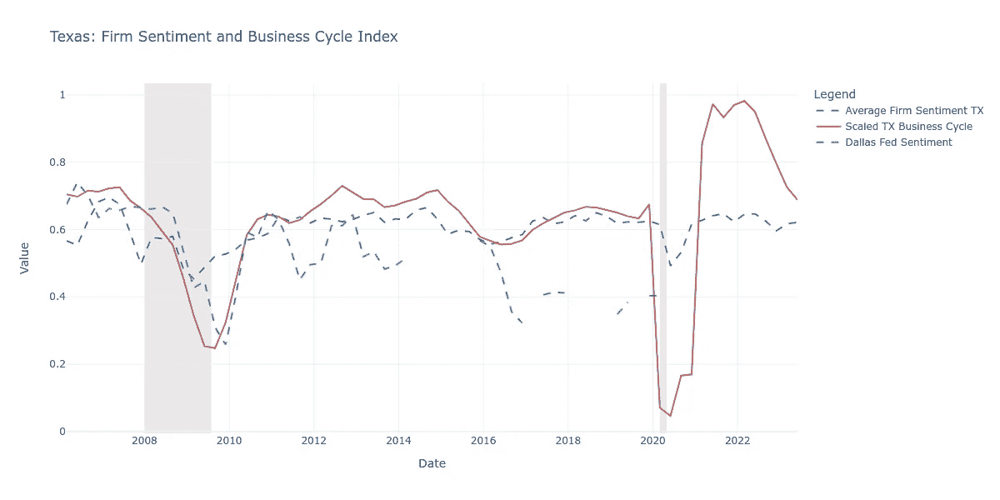
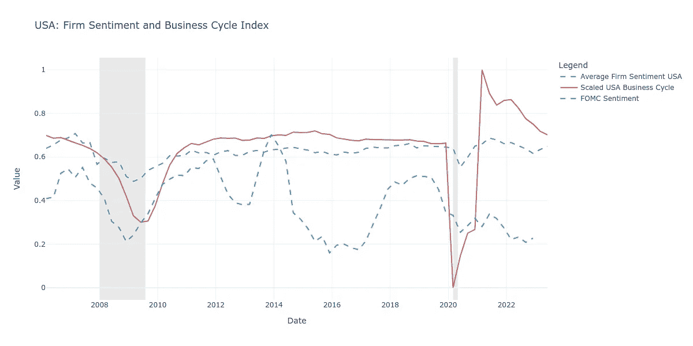

# CentralBankRoBERTa：一款用于宏观经济学的 LLM

> 原文：[`towardsdatascience.com/centralbankroberta-an-llm-for-macroeconomics-deccd9570212?source=collection_archive---------11-----------------------#2024-02-28`](https://towardsdatascience.com/centralbankroberta-an-llm-for-macroeconomics-deccd9570212?source=collection_archive---------11-----------------------#2024-02-28)

## *利用人工智能分类宏观经济情绪并识别相关主体*

[](https://medium.com/@moritzpfeifer?source=post_page---byline--deccd9570212--------------------------------)[](https://towardsdatascience.com/?source=post_page---byline--deccd9570212--------------------------------) [Moritz Pfeifer](https://medium.com/@moritzpfeifer?source=post_page---byline--deccd9570212--------------------------------)

·发表于[Towards Data Science](https://towardsdatascience.com/?source=post_page---byline--deccd9570212--------------------------------) ·6 分钟阅读·2024 年 2 月 28 日

--


作者提供的图片（部分由 DALL-E 3 协助制作）

本文由 Vincent P. Marohl 共同撰写，基于 Pfeifer, M. 和 Marohl, V.P.（2023）“CentralBankRoBERTa: A Fine-Tuned Large Language Model for Central Bank Communications”一文，发表在《*金融与数据科学杂志*》[`doi.org/10.1016/j.jfds.2023.100114`](https://doi.org/10.1016/j.jfds.2023.100114)。

经济政策的沟通如何影响经济结果？中央银行如何看待小型企业、住房部门或政府财政？在本文中，我们将探讨[CentralBankRoBERTa](https://github.com/Moritz-Pfeifer/CentralBankRoBERTa)，一款最先进的经济主体分类器，能够区分五种基本的宏观经济主体，并且是一个二元情绪分类器，能够识别宏观经济沟通中句子的情感内容。我们将模型训练在来自美国联邦储备系统、欧洲中央银行以及国际清算银行成员的 12,000 多条手动标注的句子上。

# **经济学中的 LLM**

LLM 的进展使得为特定应用进行微调变得更加容易。为了获得最先进的分类性能，所需的只是大量针对特定应用领域的训练数据。到目前为止，尚未有 LLM 能够为宏观经济话题生成情绪标签。毕竟，什么才算是“积极的”宏观经济句子呢？

我们开发了 CentralBankRoBERTa。该模型基于 RoBERTa 架构，用于分类经济情感句子。它还可以分类*谁*最为关心。该模型最初是为中央银行沟通而构思的，这是经济学的一个子领域，旨在量化语言对经济的影响。

中央银行沟通的优势在于，必须思考什么构成了对*谁*的正面经济信号。例如，句子“工资超出预期增长”可能对家庭（工资的接收者）标记为正面，而对公司（支付工资的主体）标记为负面。

CentralBankRoBERTa 根据“对谁有利”来分类句子。我们区分了五个不同的宏观经济主体：**家庭、公司、金融部门、政府**和**中央银行**本身。主体-信号动态使得模型可以在没有进一步的数字化上下文的情况下，分类句子是否发出正面或负面的信号。

在文本分析中，关注上下文和受众是关键，特别是对于像经济政策这样复杂的主题。这是因为信息的接收方式可能会根据受众和情境有很大差异。CentralBankRoBERTa 通过准确识别根据特定受众和上下文的经济情感，突显了这一点。

来自标注数据集的示例句子

# **应用**

中央银行广泛的职责使得该模型具有普遍适用性。毕竟，无论是中央银行行长还是 CEO，表达对公司或其他经济主体的好消息或坏消息，都不重要。这对于财政部长、对冲基金经理、记者以及其他对经济有贡献的经济参与者也是如此，他们的观点有助于塑造经济。

接下来，我们展示如何通过研究商业和货币政策信息，利用 CentralBankRoBERTa 分析叙事对经济的影响。任何相关的文本数据都可以用于此。这里，我们使用了美国上市公司财报电话会议的记录和美国证券交易委员会（SEC）文件的数据集。然后，我们通过正则表达式清理这些数据，并使用 CentralBankRoBERTa 对每个句子进行标注，以获得情感评分，具体方法将在下一部分详细描述。

最终数据集包含约 2000 家美国上市公司，每家公司大约有 20 年的季度文本数据。为了观察它们如何关联，我们还标注了美联储演讲的文本数据集。我们只选择美联储提及公司的句子，以避免选取无关信息。

我们发现，州级的公司情感平均值与商业周期紧密相关。区域联储的沟通，如下图所示，以德州为例，也与商业周期紧密相关。



图 1：德州公共公司（深蓝色虚线）的情感变化与商业周期（红线）紧密相随。达拉斯联储的公司特定沟通（青绿色虚线）也显示出高度的共动性。



图 2：全美范围内的企业情绪（深蓝色虚线）与商业周期（红线）有很大程度的共动。仅限于谈论企业的 FOMC 沟通（绿松石色虚线）也紧密跟踪。

使用 CentralBankRoBERTa 对企业情绪进行的这项描述性分析提供了对经济叙事与企业市场动态之间关系的一个窥视。特别是像 2008 年大萧条和 2020 年 COVID-19 疫情期间的经济低迷，都被企业和 FOMC 情绪准确捕捉。

我们的小例子突出了文本数据在丰富经济模型中的潜力。文本数据中表达的情感趋势可以影响经济动态，但它们 notoriously 难以捕捉。像 CentralBankRoBERTa 这样的工具可能有助于研究人员和政策制定者填补这一空白。

> 叙事研究与其对经济事件影响之间的差距

正如 2013 年诺贝尔经济学奖得主罗伯特·席勒在他的书 [*叙事经济学*](https://press.princeton.edu/books/hardcover/9780691182292/narrative-economics)(2019) 中所写的那样。席勒强调，故事或叙事像病毒一样在社会中传播，直接影响消费、储蓄和投资决策。理解叙事的力量为经济分析提供了一个新维度，表明除了传统的经济指标外，关注流行的故事及其情感共鸣可以为市场波动和经济变化提供预测性见解。因此，将叙事分析纳入经济模型，可以增强我们预测和应对未来经济挑战的能力，使其成为经济学家、政策制定者和投资者等的一个重要工具。

# **如何使用**

CentralBankRoBERTa 使用简单。要与 Hugging Face 管道接口，首先，从 transformers 包导入管道。然后，使用 Hugging Face 上模型的名称加载模型。创建输入句子并将其传递给分类器。如果你想对整个数据集进行分类，我们提供了一个包含附加代码的样本脚本，位于 [github](https://github.com/Moritz-Pfeifer/CentralBankRoBERTa/blob/main/Model_loader/Model_loader.ipynb)。CentralBankRoBERTa 最适合在句子层级上使用，因此我们建议用户将大型文本解析成单独的句子。例如，在 [美联储](https://www.federalreserve.gov/monetarypolicy/fomcminutes20240131.htm) 最近一次联邦公开市场委员会（FOMC）会议的纪要中，我们可以找到以下观点，

> 员工提供了对美国金融体系稳定性评估的更新，并总体上将该体系的金融脆弱性描述为显著。

给我们的代理分类器这个句子时，模型的信心值为 96.6%，判断该句子与“金融部门”相关。类似地，情感分类器的输出显示该句子为“负面”的概率为 80.9%。

使用情感分类器：

```py
from transformers import pipeline

# Load the SentimentClassifier model
agent_classifier = pipeline("text-classification", model="Moritz-Pfeifer/CentralBankRoBERTa-sentiment-classifier")

# Choose your input
input_sentence = "The early effects of our policy tightening are also becoming visible, especially in sectors like manufacturing and construction that are more sensitive to interest rate changes."

# Perform sentiment analysis
sentiment_result = agent_classifier(input_sentence)
print("Sentiment:", sentiment_result[0]['label'])
```

使用代理分类器：

```py
from transformers import pipeline

# Load the AgentClassifier model
agent_classifier = pipeline("text-classification", model="Moritz-Pfeifer/CentralBankRoBERTa-agent-classifier")

# Choose your input
input_sentence = "We used our liquidity tools to make funding available to banks that might need it."

# Perform agent classification
agent_result = agent_classifier(input_sentence)
print("Agent Classification:", agent_result[0]['label'])
```

# **未来方向**

CentralBankRoBERTa 是一个大型语言模型，能够以前所未有的粒度标注宏观经济情感。它还代表了第一个经济代理分类器。该模型的广泛训练数据使其可以用于一般宏观经济应用，并可用于经济、金融和政策研究。我们希望你能从这个模型带来的可能性中获得启发，并希望与你分享一些这个大型语言模型所启发的未来研究方向：

● **FOMC 新闻发布会：**我们能否利用 CentralBankRoBERTa 预测美联储通讯引起的金融市场波动？公司财报电话会议呢？

● **新闻报道：**新闻界如何看待经济？新闻是否偏向某一经济群体？

● **在线论坛：**使用 CentralBankRoBERTa，我们能从在线讨论论坛预测经济趋势吗？

● **受众分类器：**哪些政治家对哪个经济群体最为友好？

# 进一步资源

+   我们的模型在*金融与数据科学期刊*上的发布：

Pfeifer, M. 和 Marohl, V.P. (2023) “CentralBankRoBERTa：为中央银行通讯精调的大型语言模型”，*金融与数据科学期刊* [`doi.org/10.1016/j.jfds.2023.100114`](https://doi.org/10.1016/j.jfds.2023.100114)

+   我们的模型详细介绍研讨会：

+   模型在 Hugging Face 上的管道：

[](https://huggingface.co/Moritz-Pfeifer/CentralBankRoBERTa-agent-classifier?source=post_page-----deccd9570212--------------------------------) [## Moritz-Pfeifer/CentralBankRoBERTa-agent-classifier · Hugging Face

### 我们正在通过开源和开放科学推动和普及人工智能的应用。

huggingface.co](https://huggingface.co/Moritz-Pfeifer/CentralBankRoBERTa-agent-classifier?source=post_page-----deccd9570212--------------------------------) [](https://huggingface.co/Moritz-Pfeifer/CentralBankRoBERTa-sentiment-classifier?source=post_page-----deccd9570212--------------------------------) [## Moritz-Pfeifer/CentralBankRoBERTa-sentiment-classifier · Hugging Face

### 我们正在通过开源和开放科学推动和普及人工智能的应用。

huggingface.co](https://huggingface.co/Moritz-Pfeifer/CentralBankRoBERTa-sentiment-classifier?source=post_page-----deccd9570212--------------------------------)
