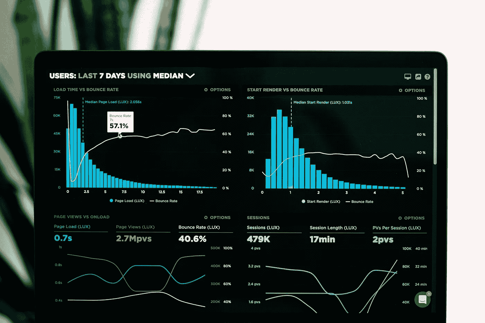

# 数据网格中的挑战与解决方案 — 第二部分

> 原文：[`towardsdatascience.com/challenges-and-solutions-in-data-mesh-part-2-7dfe97aa461a?source=collection_archive---------2-----------------------#2024-05-17`](https://towardsdatascience.com/challenges-and-solutions-in-data-mesh-part-2-7dfe97aa461a?source=collection_archive---------2-----------------------#2024-05-17)

## “数据作为产品”是数据网格中的核心原则：为什么当前的定义需要调整才能完全支持网格的实施

 [Bernd Wessely](https://medium.com/@bernd.wessely?source=post_page---byline--7dfe97aa461a--------------------------------)

·发布于[面向数据科学](https://towardsdatascience.com/?source=post_page---byline--7dfe97aa461a--------------------------------) ·阅读时间：12 分钟·2024 年 5 月 17 日

--

图片由[Luke Chesser](https://unsplash.com/@lukechesser?utm_source=medium&utm_medium=referral)提供，来源于[Unsplash](https://unsplash.com/?utm_source=medium&utm_medium=referral)

数据是必须在数据网格中所有参与者之间无缝流动的核心资产。因此，将[数据视为产品](https://martinfowler.com/articles/data-monolith-to-mesh.html#DomainDataAsAProduct)并将消费者视为客户是合乎逻辑的。领域所有者遵循[产品思维原则](https://martinfowler.com/articles/products-over-projects.html)来实现正确的数据产品能力，同时确保数据质量，真正让客户满意。将数据视为产品能带来巨大的附加价值，完全实现通用的数据供应。

那么，问题是什么，需要做出什么改变？我喜欢将数据作为产品提供的概念，但我建议从不同的角度来定义什么是符合条件的数据产品。

# 那么，什么是数据产品？

当前在数据网格中的提案列出了数据产品应具备的几个特点或特质——它们需要是*可发现的、可寻址的、值得信赖的、自描述的（易于理解的）、可互操作的、原生可访问的、有价值的（本身独立有价值的）和安全的*。原则上，将所有这些特性与数据产品的使用关联起来是有意义的。然而，数据网格将提供这些特性的责任赋予了……
