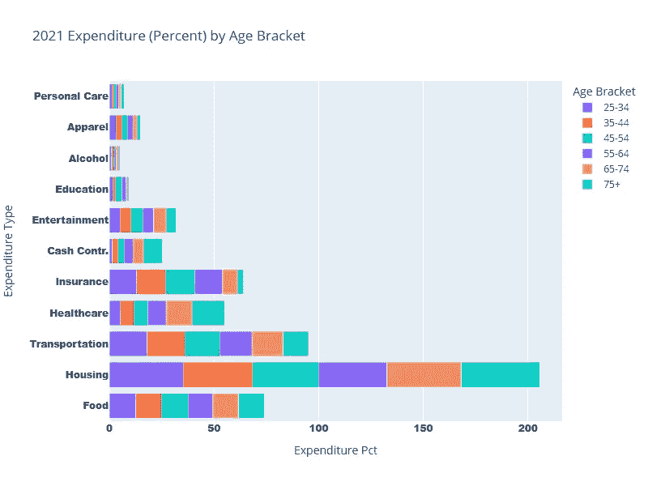

# 图表之战——堆叠条形图 vs 热图

> 原文：[`towardsdatascience.com/chart-wars-stacked-bar-chart-vs-heatmap-959423de6fee?source=collection_archive---------16-----------------------#2024-06-18`](https://towardsdatascience.com/chart-wars-stacked-bar-chart-vs-heatmap-959423de6fee?source=collection_archive---------16-----------------------#2024-06-18)

## 快速成功数据科学

## 获胜者显而易见

 [Lee Vaughan](https://medium.com/@lee_vaughan?source=post_page---byline--959423de6fee--------------------------------)

·发表于 [Towards Data Science](https://towardsdatascience.com/?source=post_page---byline--959423de6fee--------------------------------) ·6 分钟阅读·2024 年 6 月 18 日

--

ChatGPT 图像

快点——你有*两个*类别变量，它们共享*一个*数值变量，比较它们的最佳可视化方法是什么？

如果你想到“堆叠条形图”，那是可以理解的。毕竟，你当时承受着时间压力。

然而，堆叠条形图很容易变得杂乱无章。以下是使用一些*劳工统计局* [公共领域](https://www.bls.gov/bls/linksite.htm) 数据的示例。两个类别变量是*支出类型*（如食品和交通）和*年龄段*。数值变量是*总支出的百分比*。

堆叠条形图（作者提供）

很容易找到最大的整体支出，但按年龄段分析每一项则具有挑战性，即使用放大镜也很难看清。而且，x 轴令人困惑，因为它超过了 100%。

使用*分组*条形图稍微好一些，但阅读起来仍然很费劲：

分组条形图（作者提供）
