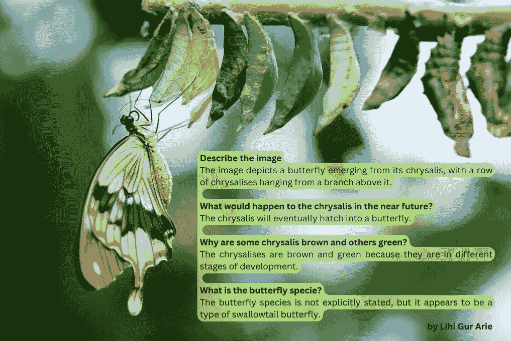
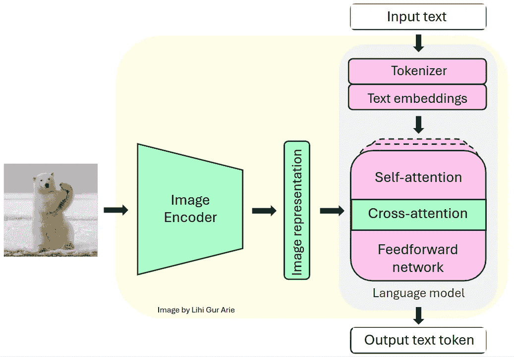
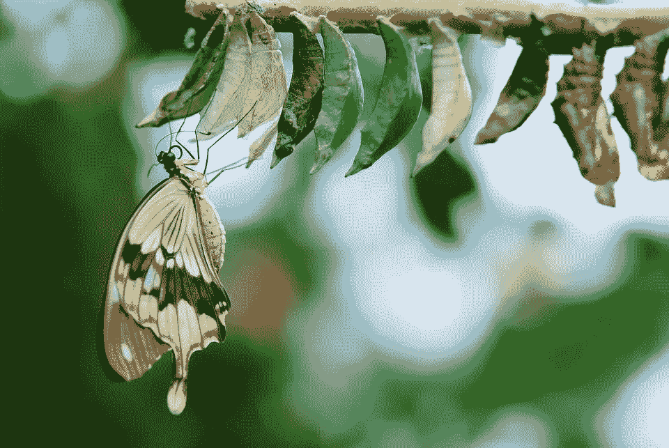
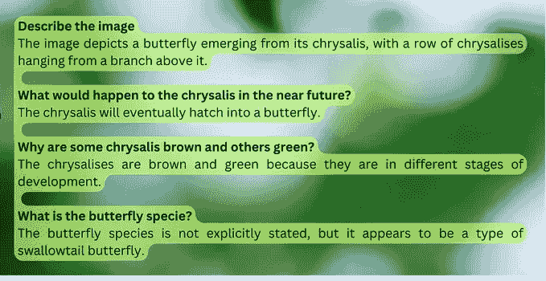
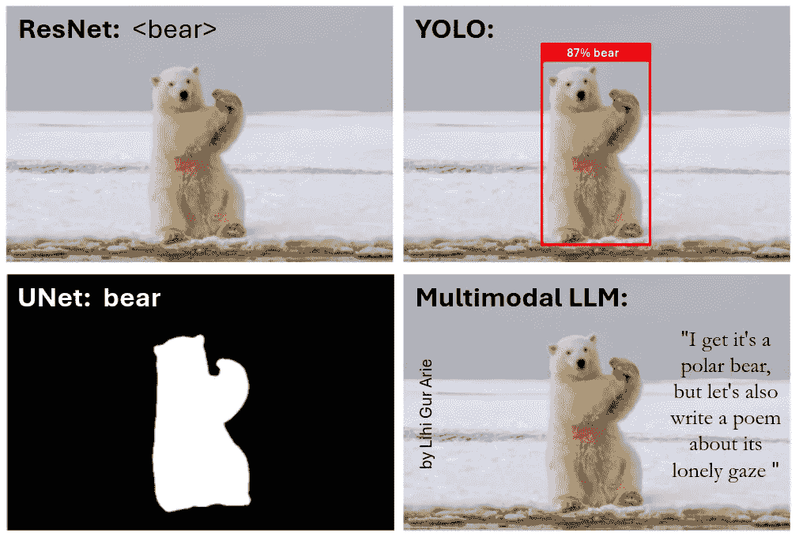

# 使用 Llama 3.2-Vision 多模态 LLM 与您的图片进行对话

> 原文：[`towardsdatascience.com/chat-with-your-images-using-multimodal-llms-60af003e8bfa?source=collection_archive---------3-----------------------#2024-12-05`](https://towardsdatascience.com/chat-with-your-images-using-multimodal-llms-60af003e8bfa?source=collection_archive---------3-----------------------#2024-12-05)

## 学习如何在本地以类似聊天的方式构建 Llama 3.2-Vision，并在 Colab 笔记本中探索其多模态技能

[](https://medium.com/@lihigurarie?source=post_page---byline--60af003e8bfa--------------------------------)[](https://towardsdatascience.com/?source=post_page---byline--60af003e8bfa--------------------------------) [Lihi Gur Arie, 博士](https://medium.com/@lihigurarie?source=post_page---byline--60af003e8bfa--------------------------------)

·发布于 [Towards Data Science](https://towardsdatascience.com/?source=post_page---byline--60af003e8bfa--------------------------------) ·阅读时长：7 分钟·2024 年 12 月 5 日

--



作者注释的图像。原始图像来自[Pixabay](https://www.pexels.com/photo/brown-and-white-swallowtail-butterfly-under-white-green-and-brown-cocoon-in-shallow-focus-lens-63643/)。

# 介绍

将视觉能力与大型语言模型（LLM）相结合，通过多模态 LLM（MLLM）正在彻底改变计算机视觉领域。这些模型结合了文本和视觉输入，展现了在图像理解和推理方面的出色能力。尽管这些模型之前只能通过 API 访问，但最近的开源选项现在允许本地执行，使它们在生产环境中更具吸引力。

在本教程中，我们将学习如何使用开源的 Llama 3.2-Vision 模型与图像进行对话，您将会惊叹于它的 OCR、图像理解和推理能力。所有代码都方便地提供在一个实用的 Colab 笔记本中。

*如果您没有付费的 Medium 账号，您可以免费阅读* *这里**。*

# **Llama 3.2-Vision**

**背景**

Llama，缩写为“Large Language Model Meta AI”（大型语言模型元 AI），是一系列由 Meta 开发的先进 LLM。它们的最新版本 Llama 3.2，推出了先进的视觉能力。视觉变体有两种参数大小：11B 和 90B，能够在边缘设备上进行推理。Llama 3.2 拥有多达 128k 个 token 的上下文窗口，并支持分辨率高达 1120x1120 像素的图像，能够处理复杂的视觉和文本信息。

**架构**

Llama 系列模型是仅解码器的 Transformer 模型。Llama 3.2-Vision 构建在预训练的 Llama 3.1 仅文本模型之上。它使用标准的密集自回归 Transformer 架构，与其前身 Llama 和 Llama 2 相比没有显著偏差。

为了支持视觉任务，Llama 3.2 使用预训练的视觉编码器（ViT-H/14）提取图像表示向量，并通过视觉适配器将这些表示集成到冻结的语言模型中。该适配器由一系列交叉注意力层组成，允许模型专注于与正在处理的文本相对应的图像特定部分 [1]。

该适配器在文本-图像对上进行训练，以将图像表示与语言表示对齐。在适配器训练过程中，图像编码器的参数会更新，而语言模型的参数保持不变，以保留现有的语言能力。



Llama 3.2-Vision 架构。视觉模块（绿色）与固定的语言模型（粉色）集成。此图由作者创建。

这种设计使得 Llama 3.2 能在多模态任务中表现出色，同时保持其强大的仅文本性能。最终的模型展示了在需要图像和语言理解的任务中令人印象深刻的能力，并允许用户与其视觉输入进行互动。

# 开始编码吧！

在我们理解了 Llama 3.2 的架构之后，我们可以深入到实际的实现中。但首先，我们需要做一些准备工作。

## **准备工作**

在 Google Colab 上运行 Llama 3.2 — Vision 11B 之前，我们需要做一些准备工作：

1.  GPU 设置：

+   推荐使用至少 22GB VRAM 的高端 GPU 以实现高效推理 [2]。

+   对于 Google Colab 用户：导航至 ‘运行时’ > ‘更改运行时类型’ > ‘A100 GPU’。请注意，高端 GPU 可能对免费 Colab 用户不可用。

2\. 模型权限：

+   请求访问 Llama 3.2 模型 [这里](https://www.llama.com/llama-downloads/)。

3\. Hugging Face 设置：

+   如果你还没有 Hugging Face 账户，请 [这里](https://huggingface.co/join) 创建一个。

+   如果你还没有访问令牌，请从你的 Hugging Face 账户生成一个，[这里](https://huggingface.co/settings/tokens)。

+   对于 Google Colab 用户，请将 Hugging Face 令牌设置为名为‘HF_TOKEN’的秘密环境变量，并添加到 Google Colab Secrets 中。

4\. 安装所需的库。

**加载模型**

一旦我们设置好环境并获得必要的权限，我们将使用 Hugging Face Transformers 库来实例化模型及其相关的处理器。处理器负责为模型准备输入并格式化输出。

```py
model_id = "meta-llama/Llama-3.2-11B-Vision-Instruct"

model = MllamaForConditionalGeneration.from_pretrained(
    model_id,
    torch_dtype=torch.bfloat16,
    device_map="auto")

processor = AutoProcessor.from_pretrained(model_id)
```

**预期的聊天模板**

聊天模板通过存储“用户”（我们）与“助手”（AI 模型）之间的对话交换，保持上下文。对话历史以一个字典列表的形式结构化，称为`messages`，每个字典代表一个单独的对话轮次，包括用户和模型的回应。用户的轮次可以包含图像-文本或仅文本输入，`{"type": "image"}`表示图像输入。

例如，在经过几轮聊天后，`messages`列表可能如下所示：

```py
messages = [
    {"role": "user",      "content": [{"type": "image"}, {"type": "text", "text": prompt1}]},
    {"role": "assistant", "content": [{"type": "text", "text": generated_texts1}]},
    {"role": "user",      "content": [{"type": "text", "text": prompt2}]},
    {"role": "assistant", "content": [{"type": "text", "text": generated_texts2}]},
    {"role": "user",      "content": [{"type": "text", "text": prompt3}]},
    {"role": "assistant", "content": [{"type": "text", "text": generated_texts3}]}
]
```

这个消息列表稍后会传递给`apply_chat_template()`方法，将对话转换成模型期望的格式，以便作为一个单一的可标记字符串。

**主要功能**

在本教程中，我提供了一个`chat_with_mllm`函数，使得可以与 Llama 3.2 MLLM 进行动态对话。该函数处理图像加载，预处理图像和文本输入，生成模型回应，并管理对话历史，以支持聊天模式的交互。

```py
def chat_with_mllm (model, processor, prompt, images_path=[],do_sample=False, temperature=0.1, show_image=False, max_new_tokens=512, messages=[], images=[]):

    # Ensure list:
    if not isinstance(images_path, list):
        images_path =  [images_path]

    # Load images 
    if len (images)==0 and len (images_path)>0:
            for image_path in tqdm (images_path):
                image = load_image(image_path)
                images.append (image)
                if show_image:
                    display ( image )

    # If starting a new conversation about an image
    if len (messages)==0:
        messages = [{"role": "user", "content": [{"type": "image"}, {"type": "text", "text": prompt}]}]

    # If continuing conversation on the image
    else:
        messages.append ({"role": "user", "content": [{"type": "text", "text": prompt}]})

    # process input data
    text = processor.apply_chat_template(messages, add_generation_prompt=True)
    inputs = processor(images=images, text=text, return_tensors="pt", ).to(model.device)

    # Generate response
    generation_args = {"max_new_tokens": max_new_tokens, "do_sample": True}
    if do_sample:
        generation_args["temperature"] = temperature
    generate_ids = model.generate(**inputs,**generation_args)
    generate_ids = generate_ids[:, inputs['input_ids'].shape[1]:-1]
    generated_texts = processor.decode(generate_ids[0], clean_up_tokenization_spaces=False)

    # Append the model's response to the conversation history
    messages.append ({"role": "assistant", "content": [  {"type": "text", "text": generated_texts}]})

    return generated_texts, messages, images
```

## 与 Llama 聊天

1.  **蝴蝶图像示例**

在我们的第一个例子中，我们将与 Llama 3.2 聊一个孵化蝴蝶的图像。由于 Llama 3.2-Vision 在使用图像时不支持系统提示的输入，我们将直接把指令附加到用户提示中，以指导模型的回答。通过设置`do_sample=True`和`temperature=0.2`，我们在保持回应连贯性的同时引入了轻微的随机性。如果需要固定答案，可以设置`do_sample==False`。`messages`参数用于存储聊天历史，最初为空，与`images`参数一样。

```py
instructions = "Respond concisely in one sentence."
prompt = instructions + "Describe the image."

response, messages,images= chat_with_mllm ( model, processor, prompt,
                                             images_path=[img_path],
                                             do_sample=True,
                                             temperature=0.2,
                                             show_image=True,
                                             messages=[],
                                             images=[])

# Output:  "The image depicts a butterfly emerging from its chrysalis, 
#           with a row of chrysalises hanging from a branch above it."
```



图片由[Pixabay](https://www.pexels.com/photo/brown-and-white-swallowtail-butterfly-under-white-green-and-brown-cocoon-in-shallow-focus-lens-63643/)提供。

如我们所见，输出准确简洁，展示了模型有效理解图像的能力。

对于下一个聊天轮次，我们将传递一个新的提示以及聊天历史（`messages`）和图像文件（`images`）。新提示旨在评估 Llama 3.2 的推理能力：

```py
prompt = instructions + "What would happen to the chrysalis in the near future?"
response, messages, images= chat_with_mllm ( model, processor, prompt,
                                             images_path=[img_path,],
                                             do_sample=True,
                                             temperature=0.2,
                                             show_image=False,
                                             messages=messages,
                                             images=images)

# Output: "The chrysalis will eventually hatch into a butterfly."
```

我们在提供的 Colab 笔记本中继续这个对话，并得到了以下对话：



图片由作者提供

对话突出了模型的图像理解能力，准确描述了场景。它还展示了其推理能力，通过逻辑地连接信息，正确地得出蛹将会发生什么，并解释了为什么有些蛹是棕色的，而有些是绿色的。

**2. 表情包图像示例**

在这个例子中，我将向模型展示我自己制作的一个表情包，评估 Llama 的 OCR 能力，并判断它是否能理解我的幽默感。

```py
instructions = "You are a computer vision engineer with sense of humor."
prompt = instructions + "Can you explain this meme to me?"

response, messages,images= chat_with_mllm ( model, processor, prompt,
                                             images_path=[img_path,],
                                             do_sample=True,
                                             temperature=0.5,
                                             show_image=True,
                                             messages=[],
                                             images=[])
```

这是输入的表情包：



表情包由作者制作。原始熊的图像由[Hans-Jurgen Mager](https://unsplash.com/photos/polar-bear-on-snow-covered-ground-during-daytime-C9Ay328wHgA)提供。

这是模型的回应：


图片由作者提供

正如我们所见，模型展示了出色的 OCR 能力，能够理解图像中文字的含义。至于它的幽默感——你怎么看，它理解了吗？你明白了吗？也许我也该提升一下我的幽默感！

# 结语

在本教程中，我们学习了如何在本地构建 Llama 3.2-Vision 模型，并管理聊天式互动的对话历史，从而增强用户参与度。我们探索了 Llama 3.2 的零-shot 能力，并对其场景理解、推理和 OCR 技能印象深刻。

高级技术可以应用于 Llama 3.2，例如在独特数据上进行微调，或使用检索增强生成（RAG）来支持预测并减少幻觉。

总的来说，本教程提供了对多模态 LLM 快速发展的领域以及它们在各种应用中的强大能力的洞察。

# 感谢阅读！

恭喜你一直看到这里。点击👍x50 表示感谢，并提升算法的自尊心🤓

**想了解更多吗？**

+   [**探索**](https://medium.com/@lihigurarie)我写的其他文章

+   [**订阅**](https://medium.com/@lihigurarie/subscribe)以便在我发布文章时收到通知

+   在[**Linkedin**](https://www.linkedin.com/in/lihi-gur-arie/)上关注我

# 完整代码作为 Colab 笔记本：

# 参考文献

[0] Colab 笔记本上的代码：[link](https://gist.github.com/Lihi-Gur-Arie/0e87500813c29bb4c4a6a990795c3aaa)

[1] [Llama 3 模型群体](https://arxiv.org/pdf/2407.21783)

[2] [Llama 3.2 11B Vision 要求](https://llamaimodel.com/requirements-3-2/)
