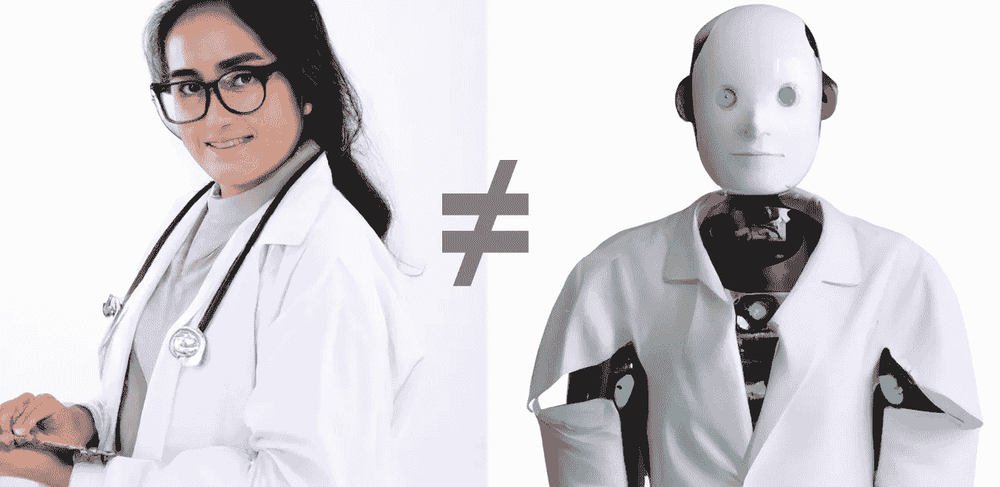

# ChatGPT 不是医生

> 原文：[`towardsdatascience.com/chatgpt-is-not-a-doctor-5452a5c5784d?source=collection_archive---------3-----------------------#2024-02-23`](https://towardsdatascience.com/chatgpt-is-not-a-doctor-5452a5c5784d?source=collection_archive---------3-----------------------#2024-02-23)

## 向大型语言模型寻求医疗建议的隐藏危险

 [瑞切尔·德雷洛斯，医学博士，博士](https://rachel-draelos.medium.com/?source=post_page---byline--5452a5c5784d--------------------------------)

·发表于[数据科学之路](https://towardsdatascience.com/?source=post_page---byline--5452a5c5784d--------------------------------) ·32 分钟阅读·2024 年 2 月 23 日

--

图像由作者提供。2 张子图由 DALLE-2 生成

去年，ChatGPT [通过了美国医学执照考试](https://healthitanalytics.com/news/chatgpt-passes-us-medical-licensing-exam-without-clinician-input)，并被报道比真实的医生更[“有同理心”](https://jamanetwork.com/journals/jamainternalmedicine/article-abstract/2804309)。目前，ChatGPT 有[约 1.8 亿用户](https://explodingtopics.com/blog/chatgpt-users#:~:text=According%20to%20the%20latest%20available,weekly%20users%20flock%20to%20ChatGPT.)；如果仅有 10%的用户向 ChatGPT 提出过医疗问题，那么使用 ChatGPT 作为医生的人群规模就已经是纽约市的两倍。现在有许多医疗聊天机器人创业公司，正在基于 ChatGPT 构建简易的外壳来提供医疗建议。但是，ChatGPT 不是医生，使用 ChatGPT 获取医疗建议不仅[违反了 OpenAI 的使用政策](https://openai.com/policies/usage-policies)，还可能非常危险。

本文中，我识别了使用现有通用聊天机器人回答患者提出的医疗问题的四个关键问题。我通过与 ChatGPT 的实际对话举例说明了每个问题。我还解释了为什么构建一个能够安全回答患者问题的聊天机器人，与构建一个能够回答 USMLE 问题的聊天机器人是完全不同的。最后，我描述了每个人——患者、企业家、医生以及像 OpenAI 这样的公司——可以采取的步骤，以使聊天机器人在医疗领域更加安全。

## **注释**

为了可读性，我使用“ChatGPT”这一术语，但本文适用于所有公开的通用大型语言模型（LLMs），包括 ChatGPT…
