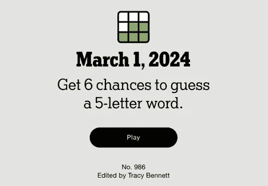

# 在 Wordle 中作弊？一个基于 Python 和 Streamlit 的解答器

> 原文：[`towardsdatascience.com/cheating-at-wordle-a-python-and-streamlit-based-solver-e21e8e40e003?source=collection_archive---------6-----------------------#2024-06-17`](https://towardsdatascience.com/cheating-at-wordle-a-python-and-streamlit-based-solver-e21e8e40e003?source=collection_archive---------6-----------------------#2024-06-17)

## 一种有趣且富有教育意义的编程方法，用于解决流行的游戏 Wordle

 [Brian Roepke](https://medium.com/@broepke?source=post_page---byline--e21e8e40e003--------------------------------)

·发表于[Towards Data Science](https://towardsdatascience.com/?source=post_page---byline--e21e8e40e003--------------------------------) ·8 分钟阅读·2024 年 6 月 17 日

--

由[Brett Jordan](https://unsplash.com/@brett_jordan?utm_source=medium&utm_medium=referral)拍摄，图片来源于[Unsplash](https://unsplash.com/?utm_source=medium&utm_medium=referral)

# 引言

[Wordle](https://www.nytimes.com/games/wordle/index.html)是由纽约时报推出的超级流行游戏，每天有成百上千（甚至更多）的人在玩。我个人已经玩了好几年，几乎成了每天的例行活动。

这个周末，我有了写代码的冲动，想创建一个自动解决谜题的工具。我知道这已经做过很多次了，但这并不意味着在过程中没有可以学习的东西。

让我们看看它的效果如何！

图片由作者提供

# Word 字典

我需要的第一件事是一个有效单词的列表。通过简单的谷歌搜索，你可以找到许多 Wordle 词典来源。我尝试了几个不同的版本，最终选择了一个包含不到 15,000 个独特五个字母单词的列表。请注意，这不是官方的可接受解决方案列表，而是一个包含有效选择的长列表。这些数据来自[GitHub](https://github.com/tabatkins/wordle-list)，并采用*MIT 许可证*。
