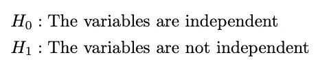

# 卡方检验：揭示数据中的隐藏模式

> 原文：[`towardsdatascience.com/chi-squared-test-revealing-hidden-patterns-in-your-data-d939df2dda71?source=collection_archive---------7-----------------------#2024-06-25`](https://towardsdatascience.com/chi-squared-test-revealing-hidden-patterns-in-your-data-d939df2dda71?source=collection_archive---------7-----------------------#2024-06-25)

## 使用 Python 中的卡方检验解锁数据中的隐藏模式。

[](https://vitorihaldijiran.medium.com/?source=post_page---byline--d939df2dda71--------------------------------)[](https://towardsdatascience.com/?source=post_page---byline--d939df2dda71--------------------------------) [Vito Rihaldijiran](https://vitorihaldijiran.medium.com/?source=post_page---byline--d939df2dda71--------------------------------)

·发表于 [Towards Data Science](https://towardsdatascience.com/?source=post_page---byline--d939df2dda71--------------------------------) ·阅读时间 10 分钟·2024 年 6 月 25 日

--


封面照片由[Sulthan Auliya](https://unsplash.com/@swafie)提供，来源于[Unsplash](https://unsplash.com/photos/people-walking-on-brown-wooden-bridge-during-daytime-wTaJBslvJnE)

# 第一部分：什么是卡方检验？

在讨论假设检验时，我们可以根据具体情况采用多种方法。常见的检验方法如 z 检验和 t 检验是测试假设（零假设和备择假设）的常用方法。我们要测试的度量标准根据问题的不同而有所变化。通常，在生成假设时，我们会使用**总体均值**或**总体比例**作为描述它们的度量标准。假设我们想要测试参加数学考试的学生中，得分为 75 分的学生比例是否超过 80%。设零假设为 H0，备择假设为 H1；我们通过以下方式生成假设：


图 1：由作者生成假设的示例

在此之后，我们需要查看数据，无论总体方差是已知还是未知，以决定使用哪种检验统计量公式。在这种情况下，我们使用比例公式的 z 统计量。为了从样本中计算检验统计量，首先，我们通过将得到 75 分的学生总数除以参与测试的学生总数来估算总体比例。然后，将估算的比例代入检验统计量公式进行计算。接着，我们通过将检验统计量的结果与拒绝域或 p 值进行比较，来决定是否拒绝或未能拒绝原假设。

那么，如果我们想测试不同的情况呢？如果我们对数据集中的学生群体（例如，班级 A、B、C 等）变量的比例进行推断呢？如果我们想测试学生群体和考试前准备（他们是否参加了校外额外课程）的关联性呢？是否独立？**如果我们想测试类别数据并推断其在数据集中的总体情况呢？**为了测试这一点，我们将使用**卡方检验**。

卡方检验旨在帮助我们得出关于落入不同类别的类别数据的结论。它将每个类别的观察频率（计数）与原假设下的预期频率进行比较。用 X²表示，卡方具有一种分布，称为**卡方分布**，允许我们确定观察到的偏差与预期值之间的显著性。


图 2：作者使用 Matplotlib 绘制的卡方分布

该图描述了卡方检验中每个自由度的连续分布。在卡方检验中，为了证明我们是否拒绝或未能拒绝原假设，我们并不使用 z 表或 t 表，而是使用**卡方表**。**它列出了选定显著性水平和卡方自由度下的概率。**卡方检验有两种类型，**卡方拟合优度检验和卡方列联表检验。**这两种类型在进行假设检验时具有不同的目的。与每种检验的理论方法相结合，我将展示如何通过实际例子来演示这两种检验。

# 第二部分：**卡方拟合优度检验**

这是卡方检验的第一种类型。该检验分析**来自单一类别变量的 k 个类别的类别数据组。**它专门用于解释总体中每个类别的观察比例。例如，我们对 1000 名数学考试得分至少为 75 分的学生进行了调查。我们观察到，在 5 个学生群体（从 A 班到 E 班）中，分布如下：


图 3：作者随机生成的虚拟数据

我们将分别通过手动和 Python 方法进行计算。我们从手动方法开始。

## 形成假设

如我们所知，我们已经调查了 1000 名学生。我想检验每个班级的总体比例是否相等。假设将是：


图 4：作者绘制的至少获得 75 分的 5 个班级学生的假设

## 检验统计量

卡方拟合优度检验的检验统计量公式如下：


图 5：作者绘制的卡方拟合优度检验

其中：

+   k：类别数

+   fi：观察计数

+   ei：预期计数

我们已经有了类别数（从 A 班到 E 班的 5 个类别）和观察到的计数，但我们还没有预期计数。为了计算预期计数，我们应该回顾我们的假设。在这种情况下，我假设所有班级的比例是相同的，即 20%。我们将在数据集中创建另一列，命名为**预期**。我们通过将观察总数乘以我们选择的比例来计算它：


图 6：作者绘制的预期计数计算

现在我们将每个观察值和预期值代入公式，如下所示：


图 7：作者绘制的拟合优度检验的检验统计量计算

我们已经得到了检验统计量的结果。但我们如何决定是否拒绝零假设或未能拒绝零假设呢？

## 决策规则

如上所述，我们将使用**卡方表**来比较检验统计量。请记住，较小的检验统计量支持零假设，而显著的检验统计量支持备择假设。因此，当检验统计量显著时（意味着这是一个右尾检验），我们应该拒绝零假设。因为我们手动进行此操作，我们使用拒绝区域来决定是否拒绝零假设或未能拒绝零假设。拒绝区域定义如下：


图 8：作者绘制的拟合优度检验的拒绝区域

其中：

+   α：显著性水平

+   k：类别数

一般规则是：**如果我们的检验统计量大于我们查到的卡方表值，我们拒绝零假设。**我们将使用 5%的显著性水平并查看卡方表。在 5%显著性水平和自由度为 4（5 个类别减 1）时，卡方值为 9.49。因为我们的检验统计量远大于卡方表值（**70.52 > 9.49**），**我们在 5%的显著性水平下拒绝零假设**。现在，你已经知道如何进行卡方拟合优度检验了！

## Python 方法

这是使用 SciPy 进行卡方拟合优度检验的 Python 方法：

```py
import pandas as pd
from scipy.stats import chisquare

# Define the student data
data = {
    'Class': ['A', 'B', 'C', 'D', 'E'],
    'Observed': [157, 191, 186, 163, 303]
}

# Transform dictionary into dataframe
df = pd.DataFrame(data)

# Define the null and alternative hypotheses
null_hypothesis = "p1 = 20%, p2 = 20%, p3 = 20%, p4 = 20%, p5 = 20%"
alternative_hypothesis = "The population proportions do not match the given proportions"

# Calculate the total number of observations and the expected count for each category
total_count = df['Observed'].sum()
expected_count = total_count / len(df)  # As there are 5 categories

# Create a list of observed and expected counts
observed_list = df['Observed'].tolist()
expected_list = [expected_count] * len(df)

# Perform the Chi-Squared goodness-of-fit test
chi2_stat, p_val = chisquare(f_obs=observed_list, f_exp=expected_list)

# Print the results
print(f"\nChi2 Statistic: {chi2_stat:.2f}")
print(f"P-value: {p_val:.4f}")

# Print the conclusion
if p_val < 0.05:
    print("Reject the null hypothesis: The population proportions do not match the given proportions.")
else:
    print("Fail to reject the null hypothesis: The population proportions match the given proportions.")
```

使用 p 值，我们也得到了相同的结果。**我们在 5%的显著性水平下拒绝零假设。**


图 9：作者使用 Python 进行拟合优度检验的结果

# 第三部分：**列联表的卡方检验**

我们已经知道如何推断一个分类变量的比例。但如果我想检验两个分类变量是否独立呢？

为了进行检验，我们使用列联表的卡方检验。我们将利用列联表来计算检验统计量的值。列联表是一个交叉表，它总结了两个分类变量的联合分布，每个变量有有限的类别。从这个表中，你**可以确定一个分类变量的分布是否在另一个分类变量的所有类别中一致。**

我将解释如何手动完成以及使用 Python 完成。在这个例子中，我们抽取了 1000 名数学测试成绩至少为 75 分的学生。我想测试一组学生的变量和那些在测试前曾在校外参加过补习课程（是否参加过）的学生的变量是否独立。分布如下所示：


图 10：作者随机生成的列联表的虚拟数据

## 形成假设

生成这些假设非常简单。我们将假设定义为：



图 11：作者生成的列联表检验的假设

## 检验统计量

这是最困难的部分。在处理实际数据时，我建议你直接使用 Python 或其他统计软件，因为如果我们手动计算，过程会非常复杂。但因为我们想要了解从公式推导的过程，我们还是进行手动计算。这个检验的检验统计量是：


图 12：作者绘制的卡方列联表公式

其中：

+   r = 行数

+   c = 列数

+   fij: 观察到的计数

+   eij = (第 i 行总计 * 第 j 行总计) / 样本大小

**回顾图 9，** 那些值只是观察到的值。在使用检验统计量公式之前，我们应当先计算**期望计数。** 我们通过以下方式计算：


图 13：作者绘制的列联表的期望计数

现在我们得到观察到的计数和期望计数。接下来，我们将通过以下公式计算检验统计量：


图 14：作者计算列联表检验的检验统计量

## 决策规则

我们已经有了检验统计量；现在我们将其与拒绝区域进行比较。列联表检验的拒绝区域定义如下：


图 15：作者绘制的列联表检验的拒绝区域

其中：

+   α：显著性水平

+   r = 行数

+   c = 列数

使用经验法则与适合度检验相同：**如果我们的检验统计量大于我们查找的卡方表值，我们就拒绝原假设。**我们将使用 5% 的显著性水平。因为总行数为 5，总列数为 2，我们查找卡方值，显著性水平为 5%，自由度为 (5–1) * (2–1) = 4，得到的值为 15.5。由于检验统计量低于卡方表值（**22.9758 > 15.5**），**我们在 5% 显著性水平下拒绝原假设。**

## Python 方法

这是使用 SciPy 进行卡方列联表检验的 Python 方法：

```py
import pandas as pd
from scipy.stats import chi2_contingency

# Create the dataset
data = {
    'Class': ['group A', 'group B', 'group C', 'group D', 'group E'],
    'Taken Course': [91, 131, 117, 75, 197],
    'Not Taken Course': [66, 60, 69, 88, 106]
}

# Create a DataFrame
df = pd.DataFrame(data)
df.set_index('Class', inplace=True)

# Perform the Chi-Squared test for independence
chi2_stat, p_val, dof, expected = chi2_contingency(df)

# Print the results
print("Expected Counts:")
print(pd.DataFrame(expected, index=df.index, columns=df.columns))
print(f"\nChi2 Statistic: {chi2_stat:.4f}")
print(f"P-value: {p_val:.4f}")

# Print the conclusion
if p_val < 0.05:
    print("\nReject the null hypothesis: The variables are not independent")
else:
    print("\nFail to reject the null hypothesis: The variables are independent")
```

使用 p 值，我们也得到了相同的结果。**我们在 5% 显著性水平下拒绝原假设。**


图 16：作者使用 Python 进行列联表检验的结果

现在你已经了解了如何使用卡方检验方法进行假设检验，是时候将这些知识应用到自己的数据中。祝实验顺利！

# 第四部分：结论

卡方检验是一种强大的统计方法，帮助我们理解分类数据之间的关系和分布。在进行检验之前，明确问题和正确的假设非常关键。进行卡方检验时，样本量也至关重要；例如，它适用于最小为 5,000 的样本（Bergh, 2015），因为样本量过小可能导致不准确的结果。为了正确解读结果，需要选择合适的显著性水平，并将卡方统计量与卡方分布表中的临界值或 p 值进行比较。

# 参考文献

+   G. Keller, [管理与经济学统计学](https://books.google.com.au/books/about/Statistics_for_Management_and_Economics.html?id=oM8tvgAACAAJ&redir_esc=y), 第 11 版，第十五章，Cengage Learning（2017）。

+   Daniel, Bergh. (2015). 卡方拟合检验与样本量—随机样本方法与卡方值调整方法的比较。应用测量学杂志，16(2)：204–217。
