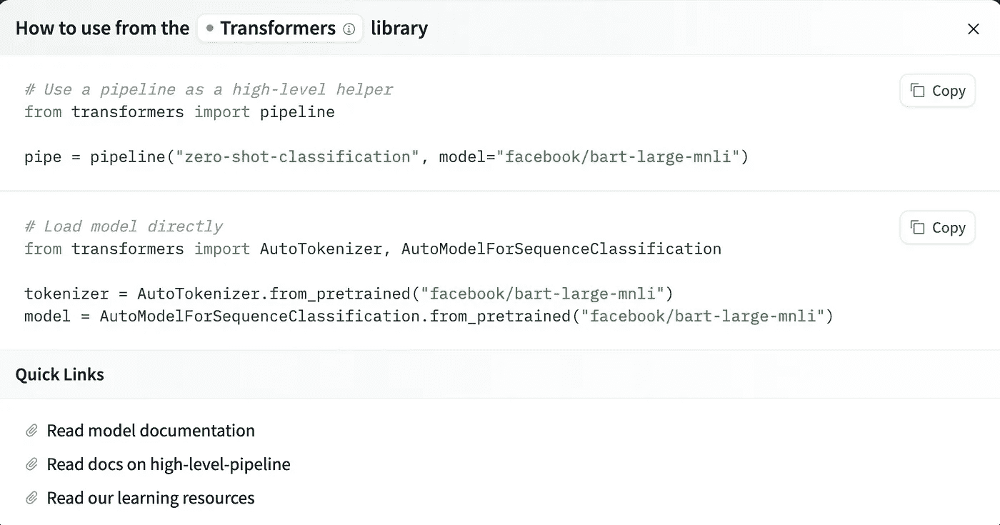

# 选择与实施 Hugging Face 模型

> 原文：[`towardsdatascience.com/choosing-and-implementing-hugging-face-models-026d71426fbe?source=collection_archive---------1-----------------------#2024-11-01`](https://towardsdatascience.com/choosing-and-implementing-hugging-face-models-026d71426fbe?source=collection_archive---------1-----------------------#2024-11-01)

## 将预训练模型应用到你的使用案例中

[](https://medium.com/@s.kirmer?source=post_page---byline--026d71426fbe--------------------------------)[](https://towardsdatascience.com/?source=post_page---byline--026d71426fbe--------------------------------) [Stephanie Kirmer](https://medium.com/@s.kirmer?source=post_page---byline--026d71426fbe--------------------------------)

· 发表在[Towards Data Science](https://towardsdatascience.com/?source=post_page---byline--026d71426fbe--------------------------------) · 阅读时长 8 分钟·2024 年 11 月 1 日

--


图片由[Erda Estremera](https://unsplash.com/@erdaest?utm_source=medium&utm_medium=referral)提供，来源于[Unsplash](https://unsplash.com/?utm_source=medium&utm_medium=referral)

最近，我在日常工作中尝试了很多来自 Hugging Face 目录的模型，觉得这可能是一个不错的时机，分享我所学到的经验，并给读者一些建议，如何以最小的压力应用这些模型。

我最近的具体任务涉及查看一些无结构的文本数据（比如备忘录、电子邮件、自由文本评论字段等），并根据与业务使用案例相关的类别对其进行分类。有很多方法可以做到这一点，我尽可能多地进行了探索，包括像模式匹配和词汇搜索这样简单的方法，但也扩展到使用预构建的神经网络模型，进行不同功能的应用，结果让我感到比较满意。

我认为最佳的策略是结合多种技术，以某种形式的集成方法，来获得各选项的优点。我不完全信任这些模型，不能保证它们足够频繁地正确（而且绝对不能稳定一致地做到这一点），因此不适合单独使用，但当与更基础的技术结合时，它们可以增强信号。

# 选择使用案例

对我来说，正如我之前提到的，任务只是接受一大堆文本块，通常是由人类编写的，没有一致的格式或模式，并尝试弄清楚哪些类别适用于该文本。除了前面提到的分析方法之外，我采取了一些不同的方法来做到这一点，这些方法从非常低的努力到我付出更多努力的程度不等。这是我迄今为止测试过的三种策略。

+   要求模型选择类别（零样本分类 — 我将在本文后面以此为例）。

+   使用命名实体识别模型找到文本中引用的关键对象，并基于此进行分类。

+   要求模型总结文本，然后应用其他技术基于总结进行分类。

# 查找模型

这是最有趣的部分之一 — 浏览 Hugging Face 模型目录！在 [`huggingface.co/models`](https://huggingface.co/models) 上，您可以看到一个巨大的模型集合，这些模型是由用户添加到目录中的。我有一些建议和建议，告诉您如何明智地进行选择。

+   查看下载和点赞数，不要选择尚未经过足够数量其他用户尝试和测试的内容。您还可以查看每个模型页面上的“社区”选项卡，看看用户是否在讨论挑战或报告错误。

+   调查上传模型的人，如果可能的话，并确定您是否信任他们。训练或调整模型的这个人可能知道自己在做什么，也可能不知道，您的结果质量将取决于他们！

+   仔细阅读文档，并跳过文档很少或没有文档的模型。无论如何，您都将难以有效地使用它们。

+   使用页面侧边的过滤器将模型缩小到适合您任务的模型。选择太多可能会让人感到不知所措，但它们被很好地分类，以帮助您找到所需的内容。

+   大多数模型卡提供了一个快速测试，您可以运行以查看模型的行为，但请记住，这只是一个示例，可能是因为模型擅长这个领域并且发现这种情况相当容易。

# 将其整合到您的代码中

一旦您找到一个想尝试的模型，只需点击 Model Card 页面右上角的“使用此模型”按钮，即可开始使用。如果您选择 Transformers 选项，您将看到如下实施方式的选择。如果您选择 Transformers 选项，您将看到如下实施方式的选择。



作者拍摄的屏幕截图

如果您选择的模型不受 Transformers 库支持，可能会列出其他技术，如 TF-Keras、scikit-learn 等，但当您点击该按钮时，所有这些都应该显示使用说明和示例代码以便轻松使用。

在我的实验中，所有的模型都得到了 Transformers 的支持，所以只要按照这些步骤进行，我通常能够顺利运行它们。如果你发现有问题，也可以查看更深入的文档，查看 Transformers 库的完整 API 细节以及它提供的不同类。我确实花时间查看过这些文档，尤其是在优化时，针对特定类，但如果只是想让基础部分运行起来，实际上不需要那么做。

# 准备推理数据

好的，假设你已经选择了一个你想尝试的模型。你已经有数据了吗？如果没有，我在这次实验中使用了几个公开的可用数据集，主要来自 Kaggle，你也可以在那里找到许多有用的数据集。此外，Hugging Face 也有一个数据集目录供你查看，但根据我的经验，它那里的数据并不像 Kaggle 那样容易搜索或理解（文档相对较少）。

一旦你选择了一个非结构化文本数据集，将其加载到这些模型中并不难。加载你的模型和分词器（来自上文提到的 Hugging Face 文档），然后将这一切传递给 transformers 库中的`pipeline`函数。你将遍历一个列表或 pandas Series 中的文本块，并将它们传递给模型函数。无论你做什么任务，本质上都是一样的，尽管对于零样本分类，你还需要提供候选标签或标签列表，下面我会展示如何做。

# 代码示例

那么，让我们更深入地了解零样本分类。如我上面所提到的，这涉及使用一个预训练模型，根据模型没有特别训练过的类别来对文本进行分类，目的是希望它能利用其学到的语义嵌入，衡量文本与标签术语之间的相似度。

```py
from transformers import AutoModelForSequenceClassification
from transformers import AutoTokenizer
from transformers import pipeline

nli_model = AutoModelForSequenceClassification.from_pretrained("facebook/bart-large-mnli", model_max_length=512)
tokenizer = AutoTokenizer.from_pretrained("facebook/bart-large-mnli")
classifier = pipeline("zero-shot-classification", device="cpu", model=nli_model, tokenizer=tokenizer)

label_list = ['News', 'Science', 'Art']

all_results = []
for text in list_of_texts:
    prob = self.classifier(text, label_list, multi_label=True, use_fast=True)
    results_dict = {x: y for x, y in zip(prob["labels"], prob["scores"])}
    all_results.append(results_dict)
```

这将返回一个包含字典的列表，每个字典都包含可能标签的键，而值是每个标签的概率。你不一定要像我这里使用 pipeline，但它使得多标签零样本分类比手动编写代码要容易得多，而且它返回的结果更容易理解和处理。

如果你不想使用 pipeline，你也可以尝试像这样做，但你需要为每个标签分别运行一次。注意，处理模型运行后输出的 logits 需要明确指定，以便获得易于人类理解的输出。此外，你仍然需要按照上面描述的方法加载分词器和模型。

```py
def run_zero_shot_classifier(text, label):
    hypothesis = f"This example is related to {label}."

    x = tokenizer.encode(
        text, 
        hypothesis, 
        return_tensors="pt", 
        truncation_strategy="only_first"
    )

    logits = nli_model(x.to("cpu"))[0]

    entail_contradiction_logits = logits[:, [0, 2]]
    probs = entail_contradiction_logits.softmax(dim=1)
    prob_label_is_true = probs[:, 1]

    return prob_label_is_true.item()

label_list = ['News', 'Science', 'Art']
all_results = []
for text in list_of_texts:
    for label in label_list:
        result = run_zero_shot_classifier(text, label)
	    all_results.append(result)
```

# 调优，还是不调优？

你可能已经注意到，我在这个项目中没有谈论过自己对模型进行微调 — 这是真的。我可能会在未来这样做，但我受限于我目前拥有的极少标记的训练数据。我可以使用半监督技术或引导一个带标签的训练集，但整个实验的目的是看看我能用现成的模型走多远。我确实有一些小的带标签数据样本，用于测试模型的性能，但这远远不足以调整模型所需的数据量。

如果你有好的训练数据并且想微调一个基础模型，Hugging Face 有一些文档可以帮助。[`huggingface.co/docs/transformers/en/training`](https://huggingface.co/docs/transformers/en/training)

# 计算和速度

性能一直是一个有趣的问题，因为到目前为止我所有的实验都是在我的本地笔记本电脑上运行的。自然地，使用这些来自 Hugging Face 的模型将需要更多的计算资源，并且比基本的策略如正则表达式和词典搜索要慢，但它提供了其他方式无法实现的信号，因此找到优化的方法是值得的。所有这些模型都支持 GPU，并且很容易将它们推送到 GPU 上运行。（如果你想快速在 GPU 上尝试，请查看我上面展示的代码，并在看到“cpu”时替换为“cuda”，如果你的编程环境中有 GPU 可用。）请记住，从云服务提供商使用 GPU 并不便宜，因此请根据情况设置优先级，并决定更快的速度是否值得这个代价。

大多数情况下，使用 GPU 对于训练来说更为重要（如果选择微调，请记住这一点），但对于推断来说不那么重要。我在这里不深入讨论优化的更多细节，但如果这对你很重要，你需要考虑并行性- 包括数据并行性和实际训练/计算并行性。

# 测试和理解输出

我们已经运行了模型！结果在这里。我有一些结束时的提示，关于如何审查输出并实际应用到业务问题上。

+   不要盲目相信模型的输出，而是进行严格的测试和评估性能。仅仅因为一个转换器模型在某个文本块上表现良好，或者能够定期正确匹配文本到某个标签，这并不意味着这是可推广的结果。使用大量不同的示例和不同类型的文本来证明性能将是足够的。

+   如果你对模型有信心，并且想在生产环境中使用它，请跟踪并记录模型的行为。这是任何在生产中的模型的好做法，但你应该将它产生的结果与输入的内容一起保存，这样你就可以不断检查它，确保性能没有下降。对于这些深度学习模型，这一点尤为重要，因为我们对模型如何及为何得出推理的解释性较少。对模型的内部工作机制做过多假设是很危险的。

正如我之前提到的，我喜欢将这些模型输出作为更大技术池的一部分，结合它们在集成策略中使用——这样我不仅依赖于单一的方法，但确实能获得这些推理提供的信号。

我希望这个概述对那些刚开始使用预训练模型进行文本（或其他模式）分析的朋友们有帮助——祝你们好运！

阅读更多我的工作，访问[www.stephaniekirmer.com](http://www.stephaniekirmer.com)。

# 进一步阅读

[](https://huggingface.co/models?source=post_page-----026d71426fbe--------------------------------) [## 模型 - Hugging Face

### 我们正在努力推动并民主化人工智能，通过开源和开放科学。

[huggingface.co](https://huggingface.co/models?source=post_page-----026d71426fbe--------------------------------) [](https://huggingface.co/docs/transformers/v4.13.0/en/parallelism?source=post_page-----026d71426fbe--------------------------------) [## 模型并行

### 我们正在努力推动并民主化人工智能，通过开源和开放科学。

[huggingface.co](https://huggingface.co/docs/transformers/v4.13.0/en/parallelism?source=post_page-----026d71426fbe--------------------------------) [## 查找开放数据集和机器学习项目 | Kaggle

### 下载成千上万的开放数据集以及在一个平台上共享项目。探索热门话题，如政府……

[www.kaggle.com](https://www.kaggle.com/datasets?source=post_page-----026d71426fbe--------------------------------)
