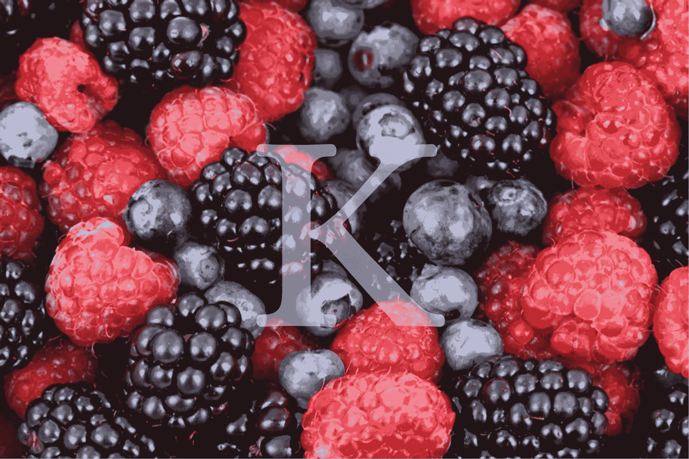

# 为 K-近邻算法选择正确的邻居数量（k）

> 原文：[`towardsdatascience.com/choosing-the-right-number-of-neighbors-k-for-the-k-nearest-neighbors-knn-algorithm-fbc635279ec7?source=collection_archive---------10-----------------------#2024-02-27`](https://towardsdatascience.com/choosing-the-right-number-of-neighbors-k-for-the-k-nearest-neighbors-knn-algorithm-fbc635279ec7?source=collection_archive---------10-----------------------#2024-02-27)

## 六种衡量邻居数量对 KNN 模型评估影响的方法

[](https://rukshanpramoditha.medium.com/?source=post_page---byline--fbc635279ec7--------------------------------)[](https://towardsdatascience.com/?source=post_page---byline--fbc635279ec7--------------------------------) [Rukshan Pramoditha](https://rukshanpramoditha.medium.com/?source=post_page---byline--fbc635279ec7--------------------------------)

·发表于[Towards Data Science](https://towardsdatascience.com/?source=post_page---byline--fbc635279ec7--------------------------------) ·11 分钟阅读·2024 年 2 月 27 日

--



图片由[PublicDomainPictures](https://pixabay.com/users/publicdomainpictures-14/?utm_source=link-attribution&utm_medium=referral&utm_campaign=image&utm_content=2277)提供，来自[Pixabay](https://pixabay.com//?utm_source=link-attribution&utm_medium=referral&utm_campaign=image&utm_content=2277)（由作者使用 Canva 编辑）

在机器学习中，KNN（K-近邻算法）在分类和回归任务中扮演着重要角色。

使用 KNN 时的主要挑战是选择正确的（最佳）*k*值，即为新实例分类时考虑的邻居实例的数量。

从技术角度来看，*k*是 KNN 算法中的超参数。用户需要定义其最佳值，因为算法无法从输入数据中学习该值。

```py
from sklearn.neighbors import NearestNeighbors

KNN = NearestNeighbors(n_neighbors=???)
```

在 Scikit-learn 的 KNN 类中，*k*作为超参数通过***n_neighbors***参数进行指定。Scikit-learn 提供了默认值 5，但在大多数情况下，这个值并没有用，因为最佳的*k*值依赖于许多其他因素。

*k*的理论最大值是数据集中观察值的总数。最小值是 1。但我们从不使用这两个极值。最佳值出现在最大值和最小值之间的某个位置。
