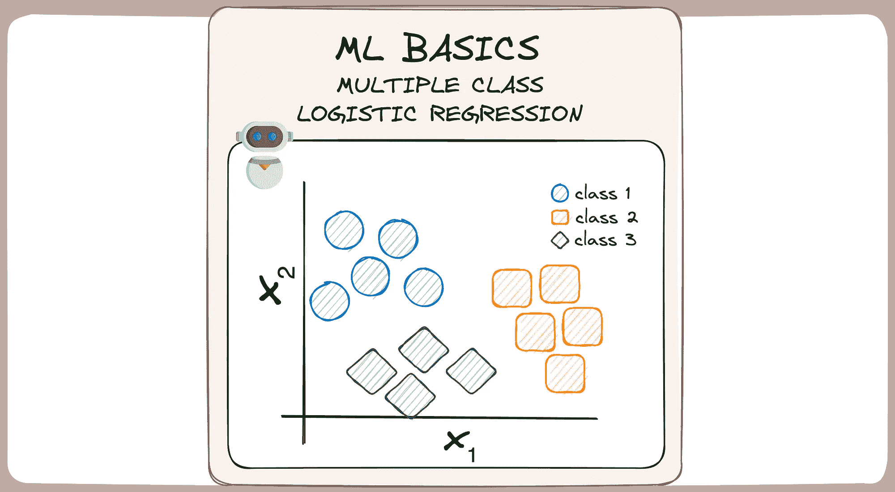

# 超越二分类——将多重逻辑回归拆解成基础概念

> 原文：[`towardsdatascience.com/classification-multiple-logistic-regression-basics-ml-machine-learning-algorithm-classification-4acf6097ae1a?source=collection_archive---------6-----------------------#2024-02-03`](https://towardsdatascience.com/classification-multiple-logistic-regression-basics-ml-machine-learning-algorithm-classification-4acf6097ae1a?source=collection_archive---------6-----------------------#2024-02-03)

## MLBasics #3: 从二分类到多分类——逻辑回归升级之旅

 [Josep Ferrer](https://medium.com/@rfeers?source=post_page---byline--4acf6097ae1a--------------------------------)

·发表于[Towards Data Science](https://towardsdatascience.com/?source=post_page---byline--4acf6097ae1a--------------------------------) ·6 分钟阅读·2024 年 2 月 3 日

--

图片由作者提供。ML 基础。多重逻辑回归。

在数据和计算机程序的世界里，机器学习的概念听起来像是一个难以攻克的坚果，充满了复杂的数学和复杂的思想。

这就是为什么今天我想放慢节奏，看看让这一切运作的基础内容，并以我新的[MLBasics 系列](https://medium.com/towards-data-science/breaking-down-logistic-regression-basics-ml-machine-learning-algorithm-classification-a81f54ed6163)为例。

今天的议程是给我们熟悉的逻辑回归做一个华丽的升级。

*为什么？*

默认情况下，逻辑回归仅限于二分类问题。然而，我们经常遇到多分类问题。

那么，让我们深入探索一下提升逻辑回归的迷人世界，以便能够将事物分类到两个以上的篮子中 👇🏻

# #1\. 从数据到决策的路径

在机器学习领域，[逻辑回归](https://medium.com/towards-data-science/breaking-down-logistic-regression-basics-ml-machine-learning-algorithm-classification-a81f54ed6163)被认为是解决二分类问题的最佳模型。

它是通向决策制定的可信路径。
