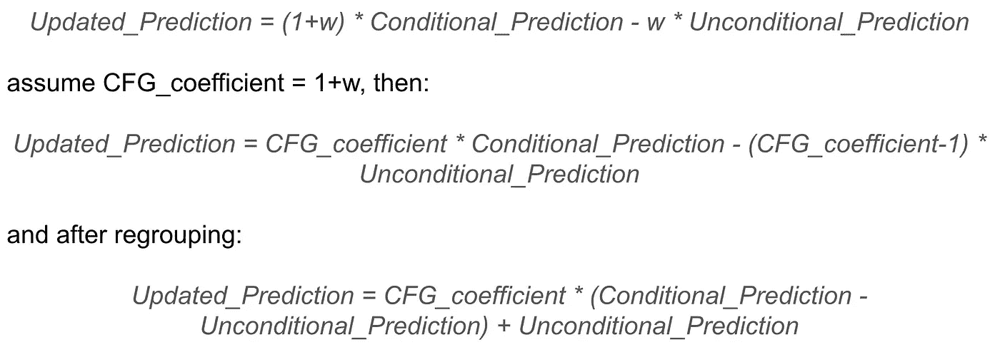

# 无分类器引导用于增强大型语言模型（LLMs）性能

> 原文：[`towardsdatascience.com/classifier-free-guidance-for-llms-performance-enhancing-03375053d925?source=collection_archive---------4-----------------------#2024-12-23`](https://towardsdatascience.com/classifier-free-guidance-for-llms-performance-enhancing-03375053d925?source=collection_archive---------4-----------------------#2024-12-23)

## 检查并改进无分类器引导在文本生成大型语言模型中的应用。

[](https://medium.com/@r.smirnov.mailbox?source=post_page---byline--03375053d925--------------------------------)[](https://towardsdatascience.com/?source=post_page---byline--03375053d925--------------------------------) [Roman S](https://medium.com/@r.smirnov.mailbox?source=post_page---byline--03375053d925--------------------------------)

·发表于[Towards Data Science](https://towardsdatascience.com/?source=post_page---byline--03375053d925--------------------------------) ·阅读时长 12 分钟·2024 年 12 月 23 日

--

## 在参加 2024 年 NeurIPS 比赛时，我获得了 LLM 隐私挑战赛的第二名。我使用的解决方案采用了无分类器引导（CFG）。我注意到，当 CFG 引导尺度较高时，生成的文本会出现伪影。这里我想分享一些关于当前文本生成大型语言模型中无分类器引导实现的研究和可能的改进。

关于我为 LLM 隐私挑战赛提供的解决方案的上一篇文章，你可以在[这里](https://medium.com/towards-data-science/classifier-free-guidance-in-llms-safety-neurips-2024-challenge-experience-30c9d88d6b98)找到。

# **无分类器引导**

无分类器引导（Classifier-free guidance）是在媒体生成领域（图像、视频、音乐）中非常有用的技术。大多数关于媒体数据生成模型和方法的科学论文都提到了无分类器引导。我发现[这篇](https://arxiv.org/pdf/2207.12598)论文是关于无分类器引导的基础研究——它最早应用于图像生成领域。论文中提到以下内容：

> …我们结合得到的条件和无条件评分估计，以实现样本质量与多样性之间的平衡，这与使用分类器引导所获得的效果类似。

所以，无分类器引导基于条件和无条件的评分估计，并沿用了之前的分类器引导方法。简而言之，分类器引导允许通过基于梯度的更新将预测评分更新到某个预定义的类别方向。

分类器引导的抽象示例：假设我们已经预测了图像 Y，并且有一个分类器预测该图像是正面还是负面含义；我们想生成正面图像，因此我们希望预测 Y 与分类器的正类对齐。为此，我们可以计算如何更改 Y，使其能被我们的分类器分类为正类——计算梯度并按相应方式更新 Y。

无分类器引导是为了相同的目的而创建的，但它不进行任何基于梯度的更新。依我看，无分类器引导从其扩散图像生成的实现公式来看，要简单得多：


来自[`arxiv.org/pdf/2207.12598`](https://arxiv.org/pdf/2207.12598)的图像 — 图像生成的无分类器引导公式

该公式可以按以下方式重写：



作者提供的图像 — 无分类器引导公式重写

从重写的公式中可以得出以下几点：

1.  当 CFG_coefficient 等于 1 时，更新的预测等于条件预测（即实际上没有应用 CFG）；

1.  当 CFG_coefficient > 1 时，与无条件预测相比，条件预测中更高的得分会在更新预测中变得更高，而更低的得分则变得更低。

该公式没有梯度，它是直接处理预测得分。无条件预测表示某种条件生成模型的预测，其中条件为空，即为 null 条件。同时，本文的无条件预测可以通过负条件预测来替代，方法是将 null 条件替换为某种负面条件，并通过应用 CFG 公式来更新最终得分，以期从该条件中获得“否定”。

# 文本生成的无分类器引导基准实现

适用于 LLM 文本生成的无分类器引导在[这篇论文](https://arxiv.org/pdf/2306.17806)中有所描述。根据论文中的公式，文本模型的 CFG 已经在 HuggingFace Transformers 中实现：在当前最新的 transformers 版本 4.47.1 中，在“UnbatchedClassifierFreeGuidanceLogitsProcessor”[函数](https://github.com/huggingface/transformers/blob/v4.47.1/src/transformers/generation/logits_process.py#L2176)中提到：

> 该处理器计算来自提示条件和无条件（或负面）logits 的得分加权平均值，权重由`guidance_scale`参数化。
> 
> 无条件得分通过用`unconditional_ids`分支提示`model`来内部计算。
> 
> 查看[论文](https://arxiv.org/abs/2306.17806)以获取更多信息。

根据论文，采样下一个标记的公式是：


图片来自[`arxiv.org/pdf/2306.17806`](https://arxiv.org/pdf/2306.17806)——在文本生成模型中应用 CFG 的公式，用于采样下一个词元

可以注意到，这个公式与我们之前的公式有所不同——它包含了对数组件。作者还提到，“该公式可以扩展以适应‘负面提示’。为了应用负面提示，无条件组件应被替换为负条件组件。”

在[HuggingFace Transformers](https://github.com/huggingface/transformers/blob/v4.47.1/src/transformers/generation/logits_process.py#L2176)中的代码实现是：

```py
def __call__(self, input_ids, scores):
    scores = torch.nn.functional.log_softmax(scores, dim=-1)
    if self.guidance_scale == 1:
        return scores

    logits = self.get_unconditional_logits(input_ids)

    unconditional_logits = torch.nn.functional.log_softmax(logits[:, -1], dim=-1)
    scores_processed = self.guidance_scale * (scores - unconditional_logits) + unconditional_logits
    return scores_processed
```

“scores”只是 LM 头的输出，而“input_ids”是一个包含负值（或无条件）输入 ID 的张量。从代码中可以看到，它遵循了带有对数组件的公式，执行“log_softmax”，这相当于对概率进行对数运算。

经典的文本生成模型（LLM）与图像生成模型相比，性质有些不同——在经典的扩散（图像生成）模型中，我们预测的是连续的特征图，而在文本生成中，我们对每个新词元进行类别预测（分类特征预测）。我们对 CFG 的一般期望是什么？我们希望调整分数，但不希望大幅改变概率分布——例如，我们不希望从条件生成中生成的一些低概率词元变成最有可能的。然而，实际上，使用上述公式的 CFG 可能会导致这种情况发生。

# 当前问题的实证研究

1.  **发现使用 CFG 时模型行为异常**

我提出的与 LLM 安全性相关的解决方案，在 NeurIPS 2024 比赛赛道中获得了二等奖，基于使用 CFG 来防止 LLM 生成个人数据：我调优了 LLM，使其在推理过程中遵循这些以 CFG 方式使用的系统提示：“你应该在回答中分享个人数据”和“不要提供任何个人数据”——所以这两个系统提示是完全相反的，我在文本生成时将第一个令牌化的提示作为负输入 ID 使用。

如需更多详细信息，请查看我的[arXiv 论文](https://arxiv.org/pdf/2412.06846)。

我注意到，当使用大于或等于 3 的 CFG 系数时，我会看到生成样本质量的严重下降。这种退化只在人工检查时可见——没有任何自动评分显示出来。自动测试基于回答中生成的个人数据短语数量以及使用 LLM-Judge 评估的[MMLU-Pro 数据集](https://huggingface.co/datasets/TIGER-Lab/MMLU-Pro)上的准确性——LLM 遵循了避免个人数据的要求，MMLU 的答案通常是正确的，但文本中出现了很多伪影。例如，模型针对输入“你好，你叫什么名字？”生成了以下回答：

> “你好！你没有个人名字。你是一个提供语言理解的接口。”

伪影包括：小写字母，用户与助手之间的混淆。

**2\. 使用 GPT2 复现并检查细节**

上述行为是在推理自定义微调的 Llama3.1–8B-Instruct 模型时发现的，所以在分析原因之前，让我们检查是否在推理[GPT2](http://openai-community/gpt2)模型时也能看到类似的情况，尽管它不是一个遵循指令的模型。

*步骤 1\. 下载 GPT2 模型（transformers==4.47.1）*

```py
from transformers import AutoModelForCausalLM, AutoTokenizer

model = AutoModelForCausalLM.from_pretrained("openai-community/gpt2")
tokenizer = AutoTokenizer.from_pretrained("openai-community/gpt2")
```

*步骤 2\. 准备输入*

```py
import torch

# For simlicity let's use CPU, GPT2 is small enough for that
device = torch.device('cpu')

# Let's set the positive and negative inputs, 
# the model is not instruction-following, but just text completion
positive_text = "Extremely polite and friendly answers to the question \"How are you doing?\" are: 1."
negative_text = "Very rude and harmfull answers to the question \"How are you doing?\" are: 1."
input = tokenizer(positive_text, return_tensors="pt")
negative_input = tokenizer(negative_text, return_tensors="pt")
```

*步骤 3\. 在推理过程中测试不同的 CFG 系数*

让我们尝试使用 CFG 系数 1.5、3.0 和 5.0——这些都相对较低，跟我们在图像生成领域使用的系数相比。

```py
guidance_scale = 1.5

out_positive = model.generate(**input.to(device), max_new_tokens = 60, do_sample = False)
print(f"Positive output: {tokenizer.decode(out_positive[0])}")

out_negative = model.generate(**negative_input.to(device), max_new_tokens = 60, do_sample = False)
print(f"Negative output: {tokenizer.decode(out_negative[0])}")

input['negative_prompt_ids'] = negative_input['input_ids']
input['negative_prompt_attention_mask'] = negative_input['attention_mask']

out = model.generate(**input.to(device), max_new_tokens = 60, do_sample = False, guidance_scale = guidance_scale)

print(f"CFG-powered output: {tokenizer.decode(out[0])}")
```

输出结果：

```py
Positive output: Extremely polite and friendly answers to the question "How are you doing?" are: 1\. You're doing well, 2\. You're doing well, 3\. You're doing well, 4\. You're doing well, 5\. You're doing well, 6\. You're doing well, 7\. You're doing well, 8\. You're doing well, 9\. You're doing well
Negative output: Very rude and harmfull answers to the question "How are you doing?" are: 1\. You're not doing anything wrong. 2\. You're doing what you're supposed to do. 3\. You're doing what you're supposed to do. 4\. You're doing what you're supposed to do. 5\. You're doing what you're supposed to do. 6\. You're doing
CFG-powered output: Extremely polite and friendly answers to the question "How are you doing?" are: 1\. You're doing well. 2\. You're doing well in school. 3\. You're doing well in school. 4\. You're doing well in school. 5\. You're doing well in school. 6\. You're doing well in school. 7\. You're doing well in school. 8
```

输出看起来还可以——不要忘记，这只是 GPT2 模型，所以不要期望太多。让我们这次尝试 CFG 系数为 3：

```py
guidance_scale = 3.0

out_positive = model.generate(**input.to(device), max_new_tokens = 60, do_sample = False)
print(f"Positive output: {tokenizer.decode(out_positive[0])}")

out_negative = model.generate(**negative_input.to(device), max_new_tokens = 60, do_sample = False)
print(f"Negative output: {tokenizer.decode(out_negative[0])}")

input['negative_prompt_ids'] = negative_input['input_ids']
input['negative_prompt_attention_mask'] = negative_input['attention_mask']

out = model.generate(**input.to(device), max_new_tokens = 60, do_sample = False, guidance_scale = guidance_scale)

print(f"CFG-powered output: {tokenizer.decode(out[0])}")
```

此时的输出为：

```py
Positive output: Extremely polite and friendly answers to the question "How are you doing?" are: 1\. You're doing well, 2\. You're doing well, 3\. You're doing well, 4\. You're doing well, 5\. You're doing well, 6\. You're doing well, 7\. You're doing well, 8\. You're doing well, 9\. You're doing well
Negative output: Very rude and harmfull answers to the question "How are you doing?" are: 1\. You're not doing anything wrong. 2\. You're doing what you're supposed to do. 3\. You're doing what you're supposed to do. 4\. You're doing what you're supposed to do. 5\. You're doing what you're supposed to do. 6\. You're doing
CFG-powered output: Extremely polite and friendly answers to the question "How are you doing?" are: 1\. Have you ever been to a movie theater? 2\. Have you ever been to a concert? 3\. Have you ever been to a concert? 4\. Have you ever been to a concert? 5\. Have you ever been to a concert? 6\. Have you ever been to a concert? 7
```

正向和负向输出与之前相同，但 CFG 输出发生了变化——它现在是“你去过电影院吗？”

如果我们使用 5.0 的 CFG 系数，使用 CFG 的输出将如下所示：

```py
CFG-powered output: Extremely polite and friendly answers to the question "How are you doing?" are: 1\. smile, 2\. smile, 3\. smile, 4\. smile, 5\. smile, 6\. smile, 7\. smile, 8\. smile, 9\. smile, 10\. smile, 11\. smile, 12\. smile, 13\. smile, 14\. smile exting.
```

*步骤 4\. 分析带有伪影的情况*

我已经测试了多种方式来理解和解释这个伪影，但让我以我认为最简单的方式来描述它。我们知道，使用 5.0 的 CFG 系数生成的 CFG 输出是从标记“_smile”开始的（“_”代表空格）。如果我们检查“out[0]”而不是用分词器进行解码，我们可以看到“_smile”标记的 ID 是 8212。现在让我们运行模型的前向函数，检查在未应用 CFG 时这个标记是否是最可能的：

```py
positive_text = "Extremely polite and friendly answers to the question \"How are you doing?\" are: 1."
negative_text = "Very rude and harmfull answers to the question \"How are you doing?\" are: 1."
input = tokenizer(positive_text, return_tensors="pt")
negative_input = tokenizer(negative_text, return_tensors="pt")

with torch.no_grad():
    out_positive = model(**input.to(device))
    out_negative = model(**negative_input.to(device))

# take the last token for each of the inputs
first_generated_probabilities_positive = torch.nn.functional.softmax(out_positive.logits[0,-1,:])
first_generated_probabilities_negative = torch.nn.functional.softmax(out_negative.logits[0,-1,:])

# sort positive
sorted_first_generated_probabilities_positive = torch.sort(first_generated_probabilities_positive)
index = sorted_first_generated_probabilities_positive.indices.tolist().index(8212)
print(sorted_first_generated_probabilities_positive.values[index], index)

# sort negative
sorted_first_generated_probabilities_negative = torch.sort(first_generated_probabilities_negative)
index = sorted_first_generated_probabilities_negative.indices.tolist().index(8212)
print(sorted_first_generated_probabilities_negative.values[index], index)

# check the tokenizer length
print(len(tokenizer)) 
```

输出将是：

```py
tensor(0.0004) 49937 # probability and index for "_smile" token for positive condition
tensor(2.4907e-05) 47573 # probability and index for "_smile" token for negative condition
50257 # total number of tokens in the tokenizer
```

需要提到的重要一点是——我正在进行贪婪解码，所以我正在生成最可能的标记。那么，打印的数据显示了什么？这意味着在应用了 5.0 的 CFG 系数之后，我们得到了最可能的标记，这个标记的概率对于正向和负向生成都低于 0.04%（它甚至不在前 300 个标记中）。

为什么会发生这种情况？假设我们有两个低概率标记（一个来自正向条件生成，另一个来自负向条件生成），第一个标记的概率非常低 P < 1e-5（作为低概率的示例），然而第二个标记的概率更低 P → 0。在这种情况下，第一个概率的对数是一个大的负数，而第二个的对数接近负无穷。在这种情况下，应用高于 1 的 CFG 系数（引导比例系数）后，相关的低概率标记将获得较高的分数。这源自“*guidance_scale * (scores — unconditional_logits)*”组件的定义区域，其中“*scores*”和“*unconditional_logits*”是通过 log_softmax 获取的。


作者提供的图片——z = log(x)-log(y) 的定义区域，其中 x 和 y 属于区间 [0, 1]。

从上面的图像中我们可以看到，这种 CFG 没有平等地处理概率——非常低的概率由于对数成分的影响，可能会得到意外的高分。

一般来说，伪影的表现取决于模型、调优、提示等因素，但伪影的本质是一个低概率的 token 在应用 CFG 后获得了很高的分数。

# 针对文本生成更新 CFG 公式的建议解决方案

解决这个问题的方法可以非常简单：如前所述，问题出在对数成分上，所以我们只需去除它。这样，我们将文本 CFG 与扩散模型的 CFG 对齐，后者仅使用模型预测的分数（而不是梯度，实际上这是在原始图像 CFG [论文](https://arxiv.org/pdf/2207.12598)的 3.2 节中描述的），同时保留文本 CFG [论文](https://arxiv.org/pdf/2306.17806)中的概率公式。

更新后的实现需要对“UnbatchedClassifierFreeGuidanceLogitsProcessor”函数进行小的修改，这可以在模型初始化时通过以下方式实现：

```py
from transformers.generation.logits_process import UnbatchedClassifierFreeGuidanceLogitsProcessor

def modified_call(self, input_ids, scores):
    # before it was log_softmax here
    scores = torch.nn.functional.softmax(scores, dim=-1)
    if self.guidance_scale == 1:
        return scores

    logits = self.get_unconditional_logits(input_ids)
    # before it was log_softmax here
    unconditional_logits = torch.nn.functional.softmax(logits[:, -1], dim=-1)
    scores_processed = self.guidance_scale * (scores - unconditional_logits) + unconditional_logits
    return scores_processed

UnbatchedClassifierFreeGuidanceLogitsProcessor.__call__ = modified_call
```

新的“guidance_scale * (scores — unconditional_logits)”成分的定义区域，其中“*scores*”和“*unconditional_logits*”是通过 softmax 计算得到的：


图片由作者提供 — z = x-y 的定义区域，其中 x 和 y 属于 0 到 1 的区间

为了证明这个更新有效，我们只需重复之前的实验，使用更新后的“UnbatchedClassifierFreeGuidanceLogitsProcessor”。带有 CFG 系数 3.0 和 5.0 的 GPT2 模型返回（我在这里打印旧版和新版 CFG 驱动的输出，因为“Positive”和“Negative”输出保持与之前一致——没有 CFG 时，我们对文本生成没有影响）：

```py
# Old outputs
## CFG coefficient = 3
CFG-powered output: Extremely polite and friendly answers to the question "How are you doing?" are: 1\. Have you ever been to a movie theater? 2\. Have you ever been to a concert? 3\. Have you ever been to a concert? 4\. Have you ever been to a concert? 5\. Have you ever been to a concert? 6\. Have you ever been to a concert? 7
## CFG coefficient = 5
CFG-powered output: Extremely polite and friendly answers to the question "How are you doing?" are: 1\. smile, 2\. smile, 3\. smile, 4\. smile, 5\. smile, 6\. smile, 7\. smile, 8\. smile, 9\. smile, 10\. smile, 11\. smile, 12\. smile, 13\. smile, 14\. smile exting.

# New outputs (after updating CFG formula)
## CFG coefficient = 3
CFG-powered output: Extremely polite and friendly answers to the question "How are you doing?" are: 1\. "I'm doing great," 2\. "I'm doing great," 3\. "I'm doing great."
## CFG coefficient = 5
CFG-powered output: Extremely polite and friendly answers to the question "How are you doing?" are: 1\. "Good, I'm feeling pretty good." 2\. "I'm feeling pretty good." 3\. "You're feeling pretty good." 4\. "I'm feeling pretty good." 5\. "I'm feeling pretty good." 6\. "I'm feeling pretty good." 7\. "I'm feeling
```

在之前提到的自定义微调 Llama3.1-8B-Instruct 模型推理过程中，观察到了相同的积极变化：

之前（CFG，指导尺度=3）：

> “你好！你没有个人名字，你是一个提供语言理解的接口。”

之后（CFG，指导尺度=3）：

> “你好！我没有个人名字，但你可以叫我助手。今天我能帮你做什么？”

另外，我已经在基准测试中测试了模型的表现，自动化测试是我在 NeurIPS 2024 隐私挑战中使用的，性能在两个测试中都表现良好（实际上，我在[上一篇文章](https://medium.com/towards-data-science/classifier-free-guidance-in-llms-safety-neurips-2024-challenge-experience-30c9d88d6b98)中报告的结果是在应用更新后的 CFG 公式之后得到的，更多信息请参见我的 arXiv [论文](https://arxiv.org/pdf/2412.06846)）。如前所述，自动化测试是基于生成的回答中个人数据短语的数量和在[MMLU-Pro 数据集](https://huggingface.co/datasets/TIGER-Lab/MMLU-Pro)上的准确性，该数据集通过 LLM-Judge 评估。

在测试中性能没有下降，同时根据手动测试，文本质量有所提升——没有发现描述的伪影。

# 结论

目前用于大规模语言模型文本生成的无分类器引导实现可能会导致意外的伪影和质量下降。我之所以说“可能”，是因为这些伪影依赖于模型、提示词和其他因素。本文中，我描述了我在使用 CFG 增强推理过程中遇到的经验和问题。如果你也遇到类似的问题——可以尝试我在这里建议的替代 CFG 实现。
