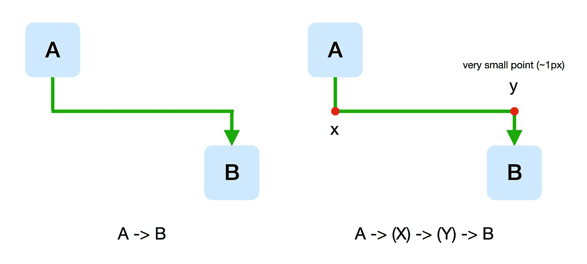

# 使用 R 与 shinyCyJS 构建临床流程图

> 原文：[`towardsdatascience.com/clinical-flowchart-shinycyjs-e-2f5489154794?source=collection_archive---------10-----------------------#2024-09-03`](https://towardsdatascience.com/clinical-flowchart-shinycyjs-e-2f5489154794?source=collection_archive---------10-----------------------#2024-09-03)

## 可定制的 R 图形/网络可视化包

[](https://jhk0530.medium.com/?source=post_page---byline--2f5489154794--------------------------------)[](https://towardsdatascience.com/?source=post_page---byline--2f5489154794--------------------------------) [金煥金](https://jhk0530.medium.com/?source=post_page---byline--2f5489154794--------------------------------)

·发表于 [Towards Data Science](https://towardsdatascience.com/?source=post_page---byline--2f5489154794--------------------------------) ·6 分钟阅读·2024 年 9 月 3 日

--

# 临床流程图

临床（试验）流程图是临床试验或治疗过程中的每个步骤和程序的可视化表示。

它从患者开始，列出使用了哪些治疗方法，哪些患者因何种原因被排除在试验之外，如何分配组别，等等，下面的例子类似。


[Cesa, Gian Luca 等人](https://www.jmir.org/2013/6/e113/). JMIR Publications 15(6) 2013

这张插图暗示了以下内容

1.  最初开始时有 124 名患者

1.  由于不符合条件或拒绝参与，排除了 34 名患者

1.  剩余的 90 名患者被随机分配到不同组别（扩展 CBT、CBT、IP），以比较治疗效果。

1.  在每组中，分别有 4、10 和 10 人退出课程（尽管理想情况下会有 30 人分组），其余患者接受分配的治疗。

1.  当患者在 1 年后进行随访时，分别有 9、6 和 7 名患者未回应。

*试验开始时有 124 名患者，最终只有 44 名患者，显示了临床试验的困难和昂贵。*

无论如何，绘制这个流程图没有固定的方法，你可以使用任何商业软件，比如 PowerPoint 或 Keynote，或者基于网页的图表工具，如**draw.io**或 lucidchart。

# 使用 R 构建临床流程图

我不确定具体原因，但这次我需要使用 R 来绘制图表。

使用类似 R 这样的编程方法的优点包括自动化和复用，能够与其他功能集成（例如从数据源到图表的程序），以及商业程序中无法实现的定制化程度。

无论如何，下面是我尝试完成这一目标的方法。

+   [流程图](https://github.com/bruigtp/flowchart/)

由于该包的最初目的是绘制参与者流动图，因此这是我尽力接近我想要实现的目标的最佳选择。我认为除非有特殊情况，否则这是最佳选择。

+   [DiagrammeR](https://github.com/rich-iannone/DiagrammeR/)

一个用于图形和网络可视化的库，利用了 d3 和 mermaid 的特性。

+   ggplot2 + [ggforce](https://github.com/thomasp85/ggforce)

R 的好伙伴 ggplot（由 GPT 推荐）及其相关包。

+   [visNetwork](https://github.com/datastorm-open/visNetwork)

基于 vis.js 的 R 网络可视化图形包。

然而，结果证明，所有四种方法都失败了。

这是因为我试图绘制的图形中出现了一个特殊情况。

下图显示了实际的图形，其中只有数字和组被替换为 1000、1、2、3…… A、B。


图片来自作者

有两个问题部分：中间的**已完成的治疗手术**部分，其中来自前一步的两个节点连接到一个长节点，以及定位边的困难。


图片来自作者

我考虑了几种方法，最终决定使用一个老朋友 shinyCyJS，它可以根据我的需求进行定制。

[shinyCyJS](https://github.com/jhk0530/shinyCyJS)是一个 R 包，用于在 R 中利用[cytoscape.js](https://js.cytoscape.org/)的网络/图形可视化功能。这是我毕业时寻找基因组网络可视化时编写的第一个工具（当时，只有[igraph](https://github.com/igraph/rigraph)和[RCyjs](https://bioconductor.org/packages/release/bioc/html/RCyjs.html)），但没有找到我想要的东西，这也是我最终找到现在工作的原因。

# 2 使用 shinyCyJS 的自定义特征

+   边的定位

为了实现上面两个自定义特征中边的定位，我最初尝试使用出租车边。

然而，再次强调，这只是基于节点的位置来确定边，无法移动边，因此我改为在中间添加一个微小的节点，并遍历到它，如下所示（因为可以指定“微型”节点的位置）。



图片来自作者

+   一个大节点

在 cytoscape.js 中，默认情况下，节点通过考虑**中心与中心之间的最短距离**的边连接，如果它们经过其他点，如上述的出租车，**这些点没有明确指定，而是通过算法计算的**。


[Edge arrow types](https://js.cytoscape.org/demos/edge-arrows/)的 Cytoscape.js

允许指定中间点的问题在于，当节点之间有多条边时，比如在贝塞尔和干草堆示例中，必须为所有边指定中间点是很麻烦的。

在前面的例子中，只有三条边，所以不算什么大事，但在我研究过的基因组网络中，一个基因往往与数十个或数百个其他基因互作，所以这就是大问题了。

在最坏的情况下，边缘会重叠，缺少几条边会导致图形产生完全不同的信息。


[Ideker, T., & Krogan, N. J.](https://www.embopress.org/doi/full/10.1038/msb.2011.99) 分子系统生物学 8(1) 2012

换句话说，在连接到一个长节点的问题中，长节点仅仅是用户从图形 (`width`) 角度的视角，

但从计算机的角度来看，将一条边连接到一个甚至不存在的节点上（如下面的图像所示）是不理性的行为，因此根本没有理由首先考虑这个选项。


图片由作者提供

为了解决这个问题，我创建了一个微节点，并修改它以连接到适当的部分，就像之前的边缘中点问题一样。


图片由作者提供

这是我最终在 R 中创建的图形的部分视图。（再次说明，组和数字是随意修改的）


图片由作者提供

# 另一个问题，下载为 PNG

从技术上讲，你可以使用 Rstudio 查看器中的“导出为 PNG”按钮，如下所示，如果那样不起作用，你可以截图，但 cytoscape.js 有一个将图形保存为 png 的功能，所以我使用了它。


图片由作者提供

**实际上，我曾收到一个请求，要求在 shinyCyJS 中添加一个下载到 png 的功能，当时我回答：“为什么不直接截图呢？”**

这需要使用互联网浏览器（Chrome）（因为 cytoscape.js 是 JavaScript），这意味着我必须超越 R，在 Web 上使用 Shiny 来实现它。

当然，shinyCyJS 是一个从一开始就考虑了 shiny 集成的包，因此没有问题。

以下是你需要在 Chrome 的开发者工具中运行的代码来下载它

```py
const pngBlob = await cy.png({
  output: 'blob-promise',
});

const fileName = 'myfile.png';
const downloadLink = document.createElement('a');
downloadLink.href = URL.createObjectURL(pngBlob);
downloadLink.download = fileName;
downloadLink.click();
```

shinyCyJS 是我编写的一个 R 包，它实际上做了 cytoscape 所做的所有事情，此外，如果需要，还可以提供像这样的自定义功能，所以如果你需要在 R 中进行网络/图形可视化，可以尝试使用它或提出需求。

当然，如果你不需要使用 R，**draw.io 似乎更好。**

此外，如果你想将其他 Javascript 库打包供 R 使用，可以给我发邮件。

感谢阅读。
