# 聚类与预测：回归和分类的迭代方法

> 原文：[`towardsdatascience.com/cluster-while-predict-iterative-methods-for-regression-and-classification-ec2acff22e46?source=collection_archive---------5-----------------------#2024-11-21`](https://towardsdatascience.com/cluster-while-predict-iterative-methods-for-regression-and-classification-ec2acff22e46?source=collection_archive---------5-----------------------#2024-11-21)

## 预测性和处方性分析：弥合分割与预测之间的鸿沟，以实现实际应用

 [Hussein Fellahi](https://medium.com/@h.fellahi?source=post_page---byline--ec2acff22e46--------------------------------)

·发表于 [Towards Data Science](https://towardsdatascience.com/?source=post_page---byline--ec2acff22e46--------------------------------) ·11 分钟阅读·2024 年 11 月 21 日

--

图片由 [NASA 哈勃太空望远镜](https://unsplash.com/@hubblespacetelescope?utm_source=medium&utm_medium=referral) 提供，来源于 [Unsplash](https://unsplash.com/?utm_source=medium&utm_medium=referral)

# 引言：

在许多实际的机器学习任务中，研究的群体通常是**多样化且异质的**。这种变异性带来了独特的挑战，尤其是在回归和分类任务中，当一个单一的、广义的模型无法捕捉数据中的重要**细微差异**时。例如，营销活动中客户的细分、通过类似产品的数据估算新产品的销售情况，或者根据类似病例诊断一个有有限病史的患者，都凸显了需要能够适应不同子群体的模型。

这种分割的概念并不新鲜。像 k-最近邻（k-Nearest Neighbors）或决策树（Decision Trees）这样的模型，已经在隐性地利用**将输入空间划分**为具有某些相似属性的区域。然而，这些方法通常是启发式的，并没有显式地同时优化聚类和预测。

在本文中，我们从优化的角度来解决这个挑战，参考了**预测性与指示性分析**的相关文献（[8]）。具体而言，我们关注的是**联合聚类与预测**任务，旨在将数据分割成聚类，同时在每个聚类内拟合一个预测模型。这种方法因其能够弥合数据驱动决策与可操作见解之间的差距，并且**从数据中提取更多信息**，相比其他传统方法（例如见[2]）而受到关注。

在展示了一些来自最近文献的聚类与回归的理论见解之后，我们介绍了一种新的分类方法（边聚类边分类），并展示了其在低数据环境中的优越表现。

# 1\. 联合聚类与回归

## 1.1 原始优化问题

我们首先通过联合地表述优化聚类和回归问题，来实现最佳拟合和预测性能。一些正式的符号和假设：

+   数据的形式为(X, Y)，其中 X = (xᵢ)是特征，Y 是目标。

+   我们假设一个有 k 个聚类的聚类——k 可以稍后定义——并引入**二元变量**zᵢⱼ，如果*第 i 个*数据点被分配到聚类 j，则 zᵢⱼ为 1，否则为 0。

+   我们假设一类回归模型（fⱼ）（例如线性模型），由(θⱼ)参数化，并且具有其损失函数 L。注意，每个θⱼ是**特定**于回归模型 fⱼ的。

作为一个回归问题，任务的目标是**找到一组参数**（即每个回归模型的参数θⱼ，以及附加的聚类分配变量 zᵢⱼ）**最小化损失函数**L：

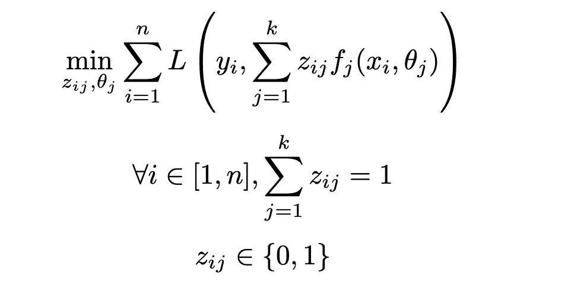

## 1.2 先聚类再回归的次优性：

最自然的一种方法——并且在许多聚类和回归分析的实际应用中使用——是天真的**先聚类再回归**（CTR）方法——即首先进行聚类，然后在该聚类的静态结果上运行回归模型。已知这种方法是**次优的**：也就是说，**误差从聚类步骤传播到回归步骤**，而错误的分配可能对性能产生重大影响。

我们将数学上展示这种次优性。当运行 CTR 方法时，我们首先分配聚类，然后将*k*个回归模型与静态的聚类分配一起拟合。这转化为以下**嵌套**优化问题：

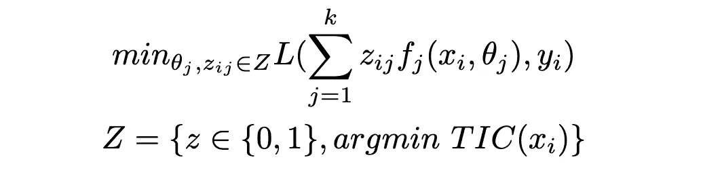

TIC 是总聚类内方差的度量。由于 Z 包含在({0, 1})ⁿ中，我们可以看出，CTR 方法解决了一个比原始问题更受约束的问题（即进一步将(zᵢⱼ)约束为在 Z 中，而不是自由地位于({0, 1})ⁿ中）。因此，这会导致原始优化问题的次优解。

## 1.3 Cluster While Regress：原始优化问题的近似解

不幸的是，尝试直接求解第 1.1 节中提出的原始优化问题在实践中可能是**不可解的**（混合整数优化问题，可能由于回归模型选择而产生非线性）。[1] 提出了一个快速且简单——但**近似的**——解决方案，用于**联合学习最优聚类分配和回归**模型：通过迭代进行。在实践中，Cluster While Regress (CWR) 是：

+   在迭代 *i* 时，将聚类分配视为静态，并校准 *k* 个回归模型

+   然后将回归模型视为静态，选择能够最小化总损失的聚类分配

+   重做前两步，直到聚类分配不再改变

除了该方法的迭代特性外，它与 CTR 方法的一个关键区别在于：**聚类和回归优化的是同一个目标函数**。

# 2. 联合聚类与分类

将之前的推理应用于分类，我们有两条不同的路线：

+   从头开始重写一个新模型，即 Cluster While Classify

+   使用 CWR 对逻辑回归方法的对数几率进行处理——详见附录

## 2.1 聚类与分类的公式化：

对目标问题做一些修改，特别是损失函数 L，变成了分类损失。为了简化起见，我们将专注于二分类，但这个公式化可以轻松扩展。

在进行二分类时，常用的损失函数是**二元交叉熵损失**：

其中 *p* 是**分类模型的预测**，由*θ* 参数化，以**概率**表示属于类别 1 的可能性。

将聚类引入这个损失函数中，得到以下优化模型：

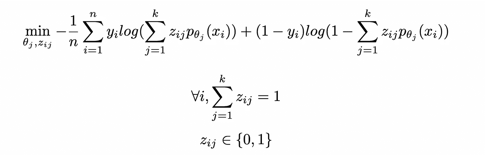

与 CWR 类似，我们可以通过相同的算法找到该问题的近似解，即通过迭代拟合聚类和分类步骤直到收敛。

## 2.2. 逻辑回归的应用：

在这种特定情况下，概率的形式为：

将这个公式代入优化问题的目标函数中，得到：

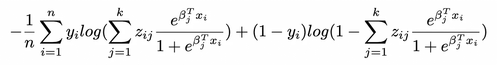

## 2.3 模型推理：

使用 CWR 和 CWC 模型的推理可以通过以下过程完成，详细描述见 [1]：

+   **推断聚类分配：** 在数据点上拟合一个多分类模型，将标签视为最终的聚类分配。使用这个分类模型来分配属于某个聚类的概率。

+   **预测：** 对于给定的数据点，属于某一类的概率是由每个拟合模型给出的**加权概率和**。这来自全概率法则：

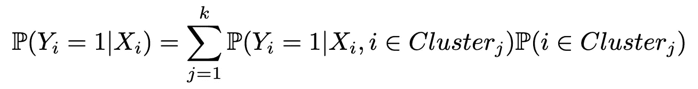

其中 *P(Yᵢ = 1| Xᵢ, i ∈ Clusterⱼ)* 由 *j-th* 分类模型给出，*P(i ∈ Clusterⱼ)* 来自集群分配分类器。

# 3\. 广义化到非整数权重

广义化到非整数权重放宽了 z 变量上的整数约束。这对应于允许对多个集群进行（概率）分配的算法，例如软 K-Means——在这种情况下，分配变成了介于 0 和 1 之间的权重。

拟合和推断过程与之前非常相似，唯一的区别是在**拟合**阶段：在每个集群上校准回归/分类模型被替换为校准加权回归（例如加权最小二乘法）或加权分类（例如加权逻辑回归——见 [4] 以获取示例），权重矩阵 *Wⱼ = Diag(zᵢⱼ)*，其中 i 对应于所有使得 *zᵢⱼ > 0* 的索引。注意，与加权最小二乘法等方法不同，**在拟合回归时，权重是已给定的**。

这一广义化有两个直接影响：

1.  作为一个约束较少的优化问题，它自然会得出更好的解决方案，即比整数约束版本具有更低的***样本内损失***。

1.  它更容易**过拟合**，因此需要**增加正则化**。

[1] 已经包括了回归系数的正则化项，这对应于对 *fⱼ* 模型的正则化：例如在线性回归的情况下，这意味着 *fⱼ* 是 LASSO 或 Ridge，而不是简单的 OLS。

然而，这里提出的方案有所不同，因为我们建议额外的正则化，这次是**惩罚非零的 *zᵢⱼ***：其背后的逻辑是我们希望**限制涉及拟合/推断给定数据点的模型数量**，以减少噪声和自由度，从而防止过拟合。

实际上，我们添加了一组新的二元变量 *(bᵢⱼ)*，当 *zᵢⱼ* > 0 时为 1，否则为 0。我们可以使用大 M 方法将其写为线性约束：

总的来说，我们有两个优化模型：

广义集群回归：

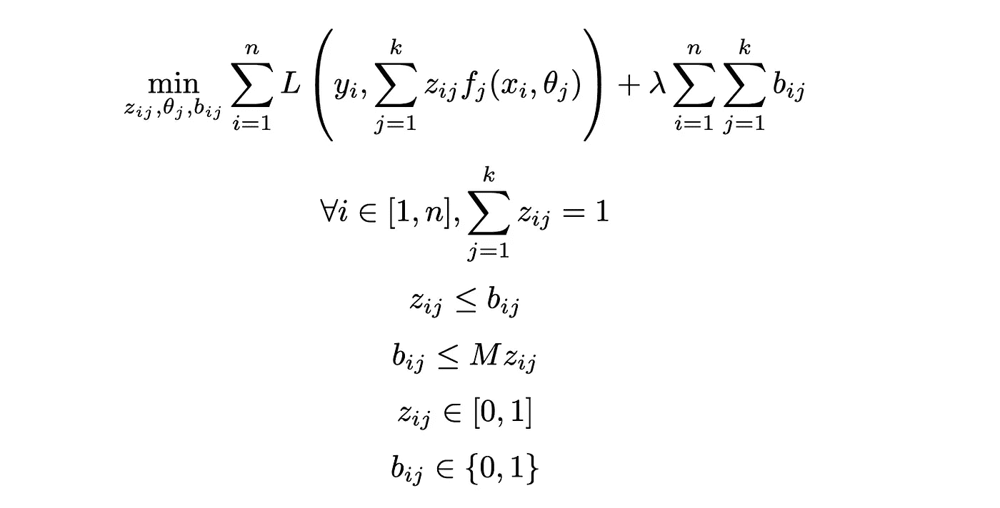

广义集群分类：

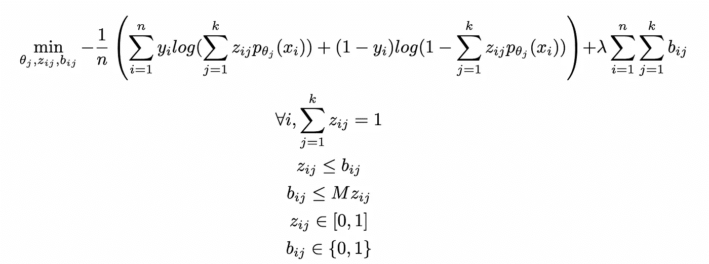

这些问题可以通过一阶方法或切割平面方法高效求解——详情请见 [3]。

# 4\. 评估：

我们在三个不同的基准数据集上评估这些方法，以说明它们在行为和性能方面的三个关键方面：

+   **过拟合**的倾向。

+   在数据**不平衡或不对称**的情况下表现更好——即在假阳性或假阴性的情况下，后果更严重。

+   在**低数据设置**下表现更好。

一些实现细节：

+   由于所呈现的所有方法都与使用的分类模型类型无关，我们假设**使用相同的分类器**以确保公平比较。为简化起见，我们选择带有 L2 正则化的逻辑回归（这是 Scikit-Learn 中的基础设置）。

+   对于聚类然后分类（CTC），我们使用 K-Means 聚类算法。我们选择**最大化聚类轮廓系数**的聚类数量。

+   对于聚类同时分类（CWC），我们通过交叉验证选择**聚类数量**，即选择使 ROC 曲线在验证数据集上的 AUC 最大化的聚类数量。然后我们重新拟合选定的模型，使用训练集和验证集。如果最优的聚类数是 2，我们选择具有整数权重的 CWC，以确保简洁性。

+   CTC 和 CWC 的推理是使用前面介绍的过程模型推理进行的，即**每个子模型预测的概率的加权总和**。

## 4.1 UCI 糖尿病 130 数据集

糖尿病 130-美国医院数据集（1999–2008）（[5]）包含了有关在 9 年期间住院的糖尿病患者的信息，这些患者来自美国 130 家医院。分类任务的目标是预测某个糖尿病患者是否会被重新住院。我们将类简化为 2 类——是否重新住院——而不是 3 类（在 30 天内重新住院，30 天后重新住院，不重新住院）。为了加快训练，我们还将考虑从 20,000 个数据点的子集进行训练，而不是使用全部 100,000 个实例。

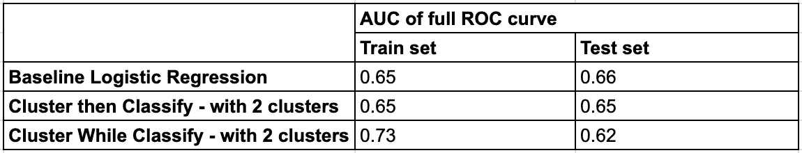

## 4.2 UCI MAGIC Gamma Telescope 数据集

MAGIC Gamma Telescope 数据集（[6]）包含来自一个天文台的数据，目的是将高能宇宙射线事件分类为伽马射线（信号）或强子（背景）。该数据集的一个特点是错误的非对称性：由于假阳性（将强子误分类为伽马射线）的成本较高，因此准确率不适用。相反，性能是通过 ROC 曲线和 AUC 进行评估的，重点是将假阳性率（FPR）保持在 20%以下**——**如[6]中所解释的那样。

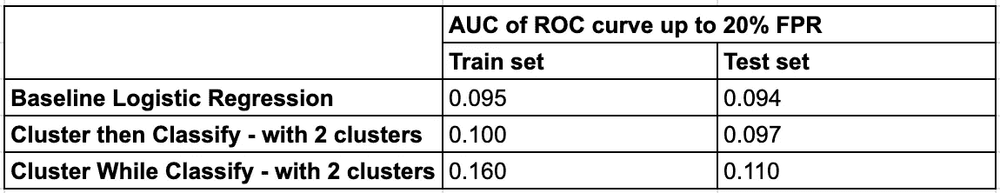

## 4.3 UCI Parkinson's 数据集

Parkinson's 数据集（[7]）包含了来自 195 个个体的语音记录数据，包括患有帕金森病的人和健康对照者。该数据集用于基于从语音信号中提取的特征来分类帕金森病的有无。这个数据集的一个关键挑战是数据点数量较少，这使得使用传统机器学习方法进行泛化变得困难。我们可以通过比较训练集和测试集上的性能数字来诊断这种泛化挑战和过拟合问题。

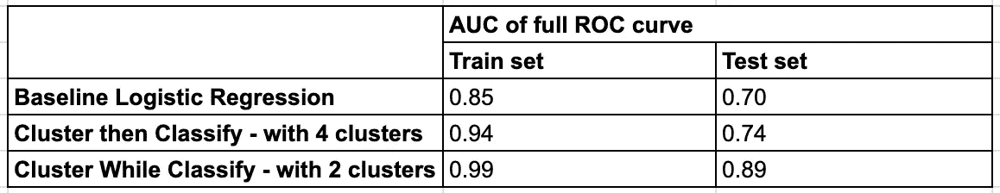

# 结论

对基准和联合聚类与分类方法的研究表明，方法的选择在很大程度上取决于数据和问题设置的特点——简言之，**没有一种适合所有情况的模型**。

我们的研究结果突出了在不同**场景**下研究的各种方法之间的关键区别：

1.  **在传统设置中**，即大数据集、众多特征和平衡的结果下，传统的机器学习模型通常表现良好。加入聚类步骤带来一些微小的好处，但像 CWC 这样的模型可能会导致**过拟合**，从而在未见过的数据上表现更差。

1.  **在具有不对称错误后果的非传统环境中**，当假阳性或假阴性带来不平等的成本时，像 CWC 这样的算法提供了一些优势。通过**根据聚类特定的动态调整**预测，CWC 似乎更好地与损失函数的优先级对齐。

1.  **在数据较少的环境中**，联合聚类和预测的优势变得**尤为显著**。传统模型和 CTC 方法通常由于数据不足而面临**过拟合**的挑战，而 CWC 通过**从现有数据中提取更多信息**，表现得更好。其迭代优化框架在这些挑战性场景中能实现更好的泛化和鲁棒性。

# 附录：

## CWR 在逻辑回归对数几率上的应用

从 CWR 形式的逻辑回归对数几率开始：

这会产生概率：

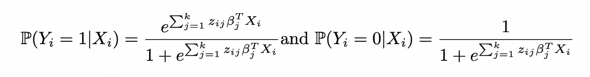

将这些表达式重新注入到逻辑回归的似然函数中：

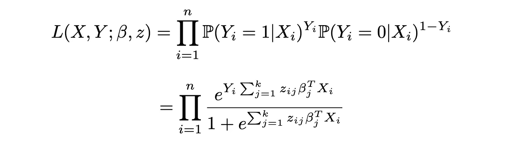

以及对数似然：

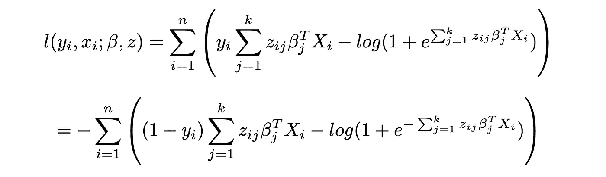

这会产生与 CWC 相同的目标函数，前提是将*zᵢⱼ*限制为二进制变量。

## 参考文献：

[1] L. Baardman, I. Levin, G. Perakis, D. Singhvi, [利用可比数据进行新产品销售预测](https://onlinelibrary.wiley.com/doi/10.1111/poms.12963)（2018），Wiley

[2] L. Baardman, R. Cristian, G. Perakis, D. Singhvi, O. Skali Lami, L. Thayaparan, [优化在一些数据驱动决策进展中的作用](https://link.springer.com/article/10.1007/s10107-022-01874-9)（2023），Springer Nature

[3] D. Bertsimas, J. Dunn, [现代优化视角下的机器学习](https://www.dynamic-ideas.com/books/machine-learning-under-a-modern-optimization-lens)（2021），Dynamic Ideas

[4] G. Zeng, [加权逻辑回归中系数符号的全面研究](https://www.sciencedirect.com/science/article/pii/S2405844024110717)（2024），Helyion

[5] J. Clore, K. Cios, J. DeShazo, B. Strack, [糖尿病 130 个美国医院 1999–2008 年[数据集]](https://archive.ics.uci.edu/dataset/296/diabetes+130-us+hospitals+for+years+1999-2008)（2014），UCI 机器学习库（CC BY 4.0）

[6] R. Bock, [MAGIC 伽马射线望远镜数据集](https://doi.org/10.24432/C52C8B) (2004), UCI 机器学习库 (CC BY 4.0)

[7] M. Little, [帕金森病数据集](https://doi.org/10.24432/C59C74) (2007). UCI 机器学习库 (CC BY 4.0)

[8] D. Bertsimas, N. Kallus, [从预测分析到规范性分析](https://pubsonline.informs.org/doi/10.1287/mnsc.2018.3253) (2019), INFORMS
