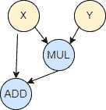
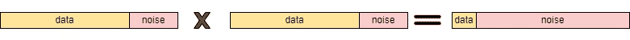
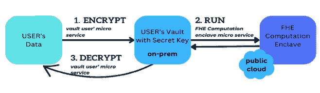
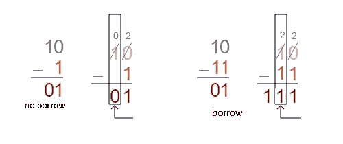
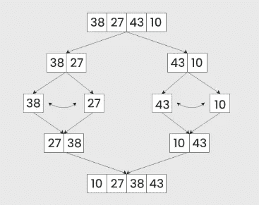
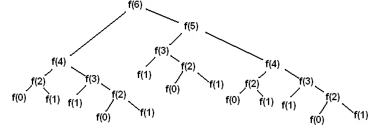
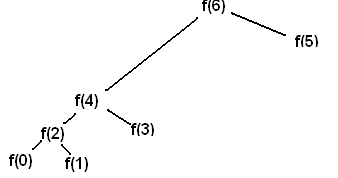
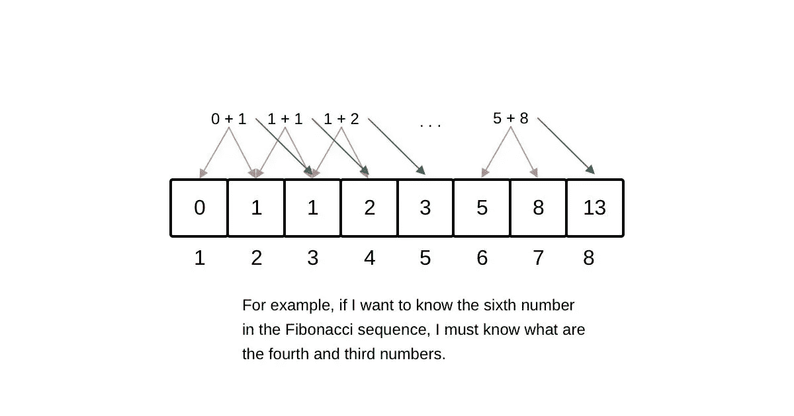

# 在密码中编程：加密数据结构和算法

> 原文：[`towardsdatascience.com/coding-in-cipher-encrypted-data-structures-and-algorithms-dd99e584a655?source=collection_archive---------11-----------------------#2024-05-09`](https://towardsdatascience.com/coding-in-cipher-encrypted-data-structures-and-algorithms-dd99e584a655?source=collection_archive---------11-----------------------#2024-05-09)


图片由作者使用 Pixlr.com 创建

## 欢迎，开发者们！如果你已经花时间掌握了数据结构和算法，是否考虑过它们在加密数据领域的潜力？

[](https://alextmn1.medium.com/?source=post_page---byline--dd99e584a655--------------------------------)[](https://towardsdatascience.com/?source=post_page---byline--dd99e584a655--------------------------------) [Alex Shpurov](https://alextmn1.medium.com/?source=post_page---byline--dd99e584a655--------------------------------)

·发表于 [Towards Data Science](https://towardsdatascience.com/?source=post_page---byline--dd99e584a655--------------------------------) ·12 分钟阅读·2024 年 5 月 9 日

--

介绍完全同态加密（FHE）的世界，这是一种革命性的技术，它允许对加密数据进行计算，而无需解密。这意味着你可以在保持完全隐私的同时，对数据执行操作。它采用后量子加密方法，使得加密数据在公共网络（如云计算或区块链）上依然安全。

在这一系列文章中，我们探讨了如何在加密领域中使用完全同态加密（FHE）实现传统数据结构和算法，如二叉搜索树、排序算法，甚至是动态规划技术。想象一下，在一个完全加密的数据集上执行二叉搜索，或在数据以原始形式无法见到的情况下进行排序，同时确保数据的隐私和安全性始终得到保障。

我们将深入探讨 FHE 的基本原理及其对数据安全和算法设计的影响。在本系列的后续文章中，我们还将探索实际应用及开发人员在实现这些加密算法时面临的潜在挑战，例如欺诈检测、支付等。这不仅仅是提升安全性；它是关于重新思考我们如何与数据互动，并推动软件开发中可能性的边界。

无论你是经验丰富的开发者还是刚接触加密计算概念的新人，本文将为你提供如何将先进的加密技术融入你的编程项目的见解。让我们一起开始这段旅程，解锁加密编程的潜力，将日常数据操作转变为安全、隐私保护的计算，为数字创新的新纪元铺平道路。

# 完全同态加密基础

在 FHE 中，可以对密文执行的两种主要操作是加法和乘法，尽管这些操作只是更复杂操作的构建模块。例如，你可以对两个加密值进行加法运算，结果解密后将是原始明文值的和。复杂的计算可以通过这些基本操作的组合来构建，从而在加密数据上执行算法和函数。例如，我们有一个函数 F，它接受两个输入值 *x* 和 *y*，并计算 *x + x * y*。这个函数的数学表示是 F*(x, y) = x + x * y*，也可以表示为一个电路，换句话说，就是一个有向无环图：



FHE 电路，*x + x * y*

# 噪声

尽管 FHE 允许在加密数据上进行计算，但它面临着密文噪声增长的挑战，如果不加以正确管理，最终可能导致解密错误。在 FHE 方案中，每个密文都包含一定量的噪声以确保安全性。这个噪声最初很小，但随着对密文进行更多操作，噪声会不断增长。当执行加法操作时，噪声相对较小；然而，当进行乘法操作时，两个密文的噪声会在乘积中相乘，从而导致噪声水平大幅上升。具体来说，如果你将噪声水平为 n1 和 n2 的两个密文相乘，结果密文的噪声水平大致为 n1 * n2，或者是一个增长速度远快于 n1 或 n2 的函数。



FHE 中的噪声

有几种方法可以管理 FHE 方案中的噪声，但为了节省篇幅，本文的重点将放在一种称为 *引导* 的噪声减少技术上。引导技术通过减少密文的噪声水平，恢复噪声预算，从而允许更多的计算。实际上，引导通过同态地应用解密和重新加密算法。这需要将 FHE 方案的整个解密电路作为加密函数进行评估。输出将是一个新的密文，代表与之前相同的明文，但噪声被降低了。引导是 FHE 中一种至关重要的技术，它使得在加密数据上进行几乎无限的计算成为可能。

# 从理论到实践

为了探索 FHE 的第一步，你可以深入了解开源 IDE 中的预制电路，该 IDE 位于 [fhe-studio.com](http://fhe-studio.com)，并基于 [Concrete FHE 库](https://docs.zama.ai/concrete)。Concrete 的 FHE 模式（TFHE 模式的变体）是基于二进制的，因此每个比特都是单独加密的。该实现会根据开发者的示例自动选择每个整数的比特。Concrete 还支持自动噪声管理，极大地降低了复杂性并提高了初学者的可访问性。我们来看一个简单的 [加法电路](https://fhe-studio.com/fhe-editor?id=65201a737b2b7b6f13517593)：

```py
from concrete import fhe

#1\. define the circuit
def add(x, y):
    return x + y

# 2\. Compile the circuit
compiler = fhe.Compiler(add, {"x": "encrypted", "y": "clear"})

# examples to determine how many bits to use for integers
inputset = [(2, 3), (0, 0), (1, 6), (7, 7), (7, 1)]
circuit = compiler.compile(inputset)

# 3\. testing
x = 4
y = 4

# clear evaluation (not encrypted)
clear_evaluation = add(x, y)

# encrypt data, run encrypted circuit, decrypt result
homomorphic_evaluation = circuit.encrypt_run_decrypt(x, y)

print(x, "+", y, "=", clear_evaluation, "=", homomorphic_evaluation)
```

编译器随后将电路编译为一种名为 MLIR 的格式，编译完成后用户可以看到该格式：

```py
module {
  func.func @main(%arg0: !FHE.eint<4>, %arg1: i5) -> !FHE.eint<4> {
    %0 = "FHE.add_eint_int"(%arg0, %arg1) : (!FHE.eint<4>, i5) -> !FHE.eint<4>
    return %0 : !FHE.eint<4>
  }
}
```

一旦电路编译完成，你可以将其添加到你的 *FHE Vault* 中，并可以与他人共享你的电路，以便他们执行相同的加密计算。



FHE Studio 云保管库中的加密计算

# FHE 操作

IDE 中使用的 FHE 模式原生支持以下操作：

1\. 加法

2\. 乘法

3\. 提取比特（因为每个比特都是单独加密的）

4\. 表查找

前三个比较直观，然而最后一个需要一些关注。我们来看下面的示例：

```py
table = fhe.LookupTable([2, -1, 3, 0])

@fhe.compiler({"x": "encrypted"})
def f(x):
    return table[x]
```

它充当一个普通的表——如果 x=0，则 f = 2，其它情况同理：f(1) = -1；f(2) = 3；f(3) = 0。

表查找非常灵活。除了加法、减法、与未加密值的乘法、张量操作以及一些基于原始操作（例如 matmul、conv）构建的操作外，所有其他操作都在后台转换为表查找。它们使得 *Concrete* 支持许多操作，但代价较高。具体的成本取决于许多变量（硬件使用、错误概率等），但与其他操作相比，它们总是要贵得多。你应该尽量避免使用表查找。虽然不总是能完全避免它们，但你应该尽量减少表查找的总数量，尝试用其他原始操作替代其中一些。

# IF 操作符 / 分支

IF 操作符在 FHE 中不是原生支持的，需要以算术方式使用。我们来看一个以下的示例：

```py
if a > 0:
    c = 4
 else:
    c = 5
```

在 FHE 中，我们必须处理所有的分支，因为无法直接查看数据，因此代码变成了两个表达式的和，其中一个是 0，另一个是 1：

```py
flag = a > 0 # yields 1 or 0
c = 4 * flag + 5 * (1 - flag)
```

请记住，*a > 0* 在 FHE 中不是原生支持的。最简单的实现方式是使用查找表。假设正变量 *a* 是 2 比特，则对于所有 (4) 种结果，除了当 a 等于 0 时，a > 0。我们可以为 a 的两个比特的所有结果构建一个表：{0,1,1,1}。然后电路将如下所示：

```py
table = fhe.LookupTable([0, 1, 1, 1])

@fhe.compiler({"a": "encrypted"})
def f(a):
    flag = table[a] # a > 0, for 2bit a
    return 4 * flag + 5 * (1 - flag)
```

需要注意的是，如果*a*变得大于 2 位，相应的查找表的大小会迅速增长，导致电路的评估密钥大小增加。在具体的 FHE 实现中，这种方法是比较操作符的默认功能。例如，[这个电路](https://fhe-studio.com/fhe-editor?id=65206121ff956a2c8e3a1d65)：

```py
from concrete import fhe

@fhe.compiler({"x": "encrypted"})
def less_then_21(x):
    return x < 21

inputset = [1, 31]

circuit = less_then_21.compile(inputset)

# result in 5bit integer
x = 19
homomorphic_evaluation = circuit.simulate(x)
print(f"homomorphic_evaluation = {homomorphic_evaluation}")
```

在编译并检查 MLIR（已编译电路）时，我们可以观察到生成的查找表。

```py
module {
  func.func @main(%arg0: !FHE.eint<5>) -> !FHE.eint<1> {
    %c21_i6 = arith.constant 21 : i6
    %cst = arith.constant dense<[1, 1, 1, 1, 1, 1, 1, 1, 1, 1, 1, 1, 1, 1, 1, 1, 1, 1, 1, 1, 1, 0, 0, 0, 0, 0, 0, 0, 0, 0, 0, 0]> : tensor<32xi64>
    %0 = "FHE.apply_lookup_table"(%arg0, %cst) : (!FHE.eint<5>, tensor<32xi64>) -> !FHE.eint<1>
    return %0 : !FHE.eint<1>
  }
}
```

# 使用进位比较两个数字

通过使用减法比较两个二进制数来确定哪个更大的方法，可以通过简单的算术运算在 FHE 中高效实现。通过减法进行二进制比较利用了二进制算术的性质。核心思想是，从一个数字中减去另一个数字，可以通过结果和操作过程中设置的某些标志（如处理器中的进位标志）揭示它们的相对大小。

在二进制减法中，如果 A 大于或等于 B，则结果为非负。如果 B 较大，结果为负，导致进位标志为 1。



如果 A>B，则进位标志设置为 1

这意味着，如果 A>B，则进位=1，否则为 0。我们需要从右到左计算进位位，最后的进位是最终结果。为了加速 FHE 计算，我们可以为每一位计算 1 + A - B，使其变为正数。这个示例只需要 2 位来保存残余。然后，我们将进位位左移（<<）2 位，并加上残余。所有结果的总数为 8，我们可以将其与查找表一起使用，以输出下一个进位位，[就像在这个电路中](https://fhe-studio.com/fhe-editor?id=65ade87ae3b6f89b1e412fef)。

```py
# two numbers are need to presented as  bit arrays
# ---------------------------
# 0 0000 -> 1 less (1+0-1), set the curry bit
# 1 0001 -> 0, equal (1+1-1) or (1+0-0)
# 2 0010 -> 0, greater (1+1-0)
# 3 0100 -> 0 (does not exists)
# carry bit set
# 5 1000 -> 1
# 6 1100 -> 1
# 7 1010 -> 1
# 8 1010 -> 1

from concrete import fhe

table = fhe.LookupTable([1,0,0,0,1,1,1,1])

# result is 1 if less, 0 otherwise
@fhe.compiler({"x": "encrypted", "y": "encrypted"})
def fast_comparision(x, y):
    carry = 0

    # for all the bits
    for i in range(4):
        s = 1 + x[i] - y[i]
        # left shift by 2 (carry << 4)
        carry4 = carry*4 + s
        carry = table[carry4]

    return curry

inputset = [([0,1, 1, 1], [1,0, 1,1])]

circuit = fast_comparision.compile(inputset)

homomorphic_evaluation = circuit.simulate([1,0,1, 0], [1,0,0,0])
print("homomorphic_evaluation =", homomorphic_evaluation)
```

这种方法在计算上比仅使用查找表要昂贵得多，就像之前的示例。然而，这里的内存复杂度要低得多，因为查找表仅包含 8 个值，从而导致评估密钥更小。是的，像往常一样，没有什么是完美的，因为在选择方法时，内存使用、CPU 使用和密钥大小之间存在权衡。

# 排序

[让我们来看看冒泡排序](https://fhe-studio.com/fhe-editor?id=6639782cf9ed036703c04500)，这是一种简单的基于比较的排序算法，它反复遍历待排序列表，比较每对相邻的元素，如果它们的顺序错误，则交换它们。该算法得名于较小的元素会“冒泡”到列表的顶部（数组的开头），而较大的元素会在每次迭代中下沉到底部（数组的末尾）。

```py
from concrete import fhe
import numpy as np

@fhe.compiler({"in_array": "encrypted"})
def bubble_sort(in_array):
    for i in range(len(in_array)):
        for j in range(len(in_array)-1):        
            a = in_array[j]
            b = in_array[j+1]
            flag = a > b
            # if a > b then swap the values
            in_array[j] = flag * b + (1-flag) * a
            in_array[j+1] = flag * a + (1-flag) * b

    return in_array

inputset = [[3,0,0,0]]
circuit = bubble_sort.compile(inputset)

test = [3,2,0,1]
test_clear = test.copy()
test_fhe = test.copy()

clear_evaluation = bubble_sort(test_clear)

#homomorphic_evaluation = circuit.encrypt_run_decrypt(test_fhe)
homomorphic_evaluation = circuit.simulate(test_fhe)

print(test, "=> ", clear_evaluation, "=>", homomorphic_evaluation)
```

冒泡排序速度较慢 [O(n²)]，但非常节省内存 [O(1)]。对于更高效的 CPU 算法，可以使用***归并排序***。归并排序基于将一个列表分解为更小、更易管理的部分（理想情况下，分解到单个元素），对这些部分进行排序，然后再按正确的顺序将它们合并回去。



归并排序

归并排序的时间复杂度为 O(n log n)，使其成为处理大数据集时最有效的排序算法之一。然而，其空间复杂度为 O(n)，因为它需要额外的空间来进行临时合并操作，这与数组的大小成正比。

# 动态规划

动态规划是一种通过将复杂问题分解为更简单的子问题，并仅求解一次每个子问题，存储其解的方法。其理念是，如果能够高效地解决较小的子问题，就可以利用这些解来解决更大的问题。我们以斐波那契数列为例。

斐波那契数列是一组数字，每个数字是前两个数字的和，通常从 0 和 1 开始。该序列通常为 0, 1, 1, 2, 3, 5, 8, 13，以此类推。在使用动态规划求解第 n 个斐波那契数时，该方法比天真的递归方法显著高效，因为它避免了冗余的计算。



斐波那契数列：F[i] = F[i-1] + F[i-2]

如你所见，要计算 F(6)，我们需要递归地解决两个子问题：F(5)和 F(4)，依此类推。你会注意到这些解是重叠的，因此 F(4)的计算会在树的左右两侧都发生。显然，我们应该缓存每个唯一的结果，从而只计算一次。这样我们的树结构变得非常简单。这种方法称为记忆化。



记忆化的斐波那契数列

然而，在完全同态加密（FHE）的背景下，通常不能使用记忆化，因为 FHE 的基本特性和安全约束。原因在于，FHE 允许对加密数据进行操作，这意味着实际的数据值在整个计算过程中都保持隐秘。

动态规划的另一种方法叫做*表格法*。表格法是一种自底向上的方法，其中首先解决较小的子问题，并利用其解构建更大问题的解。由于其非递归的特性，表格法在完全同态加密（FHE）中尤其有效。表格法使用一个表格，在每一步中更新当前值。在这个例子中，我们初始化了一个包含 6 个元素的表格，基本条件要求第一个元素为 0，第二个元素为 1。其余的元素初始化为零：[0,1,0,0,0,0]。然后，我们从左到右进行计算。



*制表，自下而上的方法*

*本文标志着“加密数据结构与算法”系列文章的开始。接下来，我将深入探讨图形和树、机器学习与人工智能在完全同态加密（FHE）领域的应用。后续章节将探讨在金融行业中的实际应用。*

—

# 准备好用加密技术改变你的编码方式了吗？

通过开源 IDE [FHE-Studio.com](http://FHE-Studio.com)，深入了解加密数据结构和算法的世界。无论你是想通过顶级安全协议提升项目，还是对下一代软件开发中的数据隐私感到好奇，FHE Studio 都是通往 FHE 世界的免费开源门户。开发、测试和分享你的电路，并获得同行的反馈！

寻找专业的技术支持？FHE Studio 团队可以帮助你将完全同态加密集成到现有项目中，或为你量身定制新的加密解决方案。

# 支持我们

如果你在我们的项目中发现了价值，[请考虑支持我们](https://github.com/sponsors/artifirm)。我们致力于保持 FHE-Studio 的开放性和可访问性，每一份贡献都帮助我们扩展项目。

# 参考文献

1.  [FHE-STUDIO.COM](https://fhe-studio.com/)，一个开源的 FHE IDE

    2\. FHE Studio 文档和资源，[`github.com/artifirm`](https://github.com/artifirm/fhe-studio-docs)

    3\. Concrete FHE 编译器: [`docs.zama.ai/concrete`](https://docs.zama.ai/concrete)

    4\. Concrete ML 是一个开源的、保护隐私的机器学习框架，基于完全同态加密（FHE）。[`docs.zama.ai/concrete-ml`](https://docs.zama.ai/concrete-ml)

    5\. Microsoft SEAL，一个开源的 FHE 库 [`www.microsoft.com/en-us/research/project/microsoft-seal/`](https://www.microsoft.com/en-us/research/project/microsoft-seal/)

    6\. HELib，一个 FHE 库 [`github.com/homenc/HElib`](https://github.com/homenc/HElib)

除非另有说明，所有图片均为作者提供。
