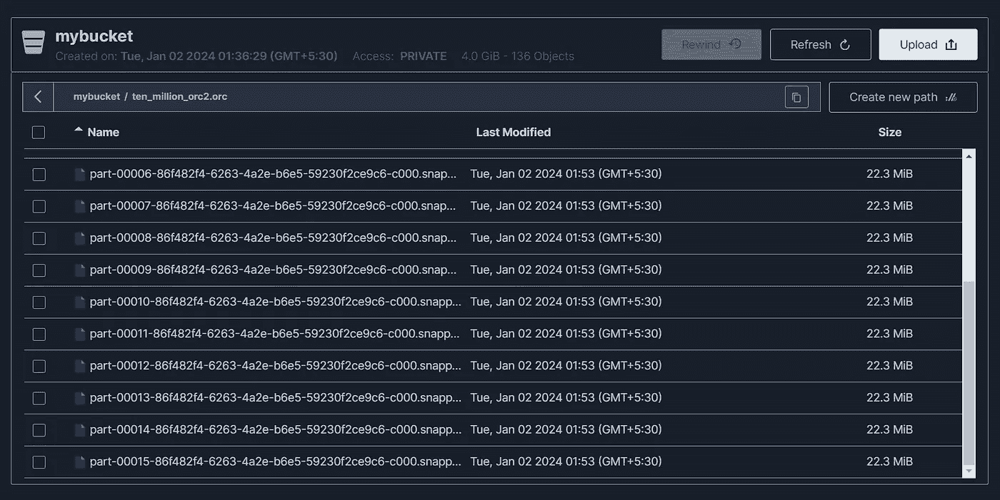
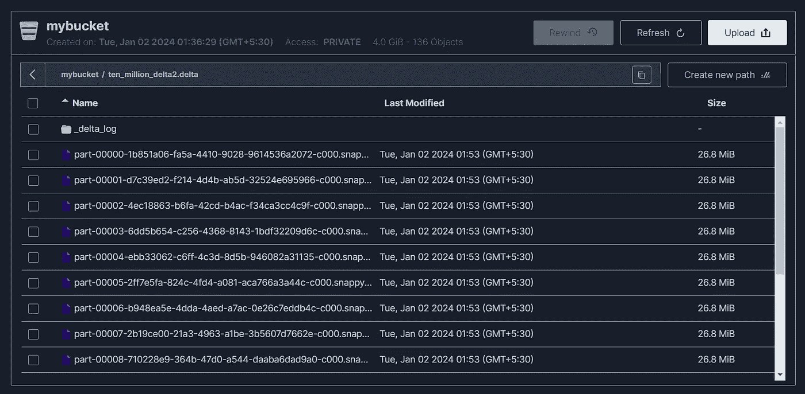
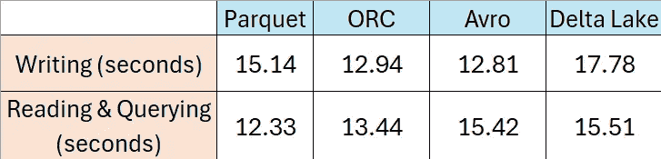

# 比较大数据文件格式的性能：实用指南

> 原文：[`towardsdatascience.com/comparing-performance-of-big-data-file-formats-a-practical-guide-ef366561b7d2?source=collection_archive---------0-----------------------#2024-01-17`](https://towardsdatascience.com/comparing-performance-of-big-data-file-formats-a-practical-guide-ef366561b7d2?source=collection_archive---------0-----------------------#2024-01-17)

## Parquet 与 ORC 与 Avro 与 Delta Lake

[](https://medium.com/@sarbahi.sarthak?source=post_page---byline--ef366561b7d2--------------------------------)[](https://towardsdatascience.com/?source=post_page---byline--ef366561b7d2--------------------------------) [Sarthak Sarbahi](https://medium.com/@sarbahi.sarthak?source=post_page---byline--ef366561b7d2--------------------------------)

·发布于 [Towards Data Science](https://towardsdatascience.com/?source=post_page---byline--ef366561b7d2--------------------------------) ·12 分钟阅读·2024 年 1 月 17 日

--


图片由 [Viktor Talashuk](https://unsplash.com/@viktortalashuk?utm_source=medium&utm_medium=referral) 提供，来源于 [Unsplash](https://unsplash.com/?utm_source=medium&utm_medium=referral)

大数据世界充满了各种存储系统，深受不同文件格式的影响。这些文件格式在几乎所有数据管道中都至关重要，它们能够实现高效的数据存储和更方便的查询及信息提取。它们被设计用来应对大数据的挑战，如数据的大小、速度和结构。

数据工程师常常面临众多选择。了解哪种文件格式适合哪种场景至关重要。本教程的目的正是帮助您解决这一问题。您将探索四种广泛使用的文件格式：**Parquet**、**ORC**、**Avro** 和 **Delta Lake**。

本教程从设置这些文件格式的环境开始。然后，您将学习如何读取和写入每种格式的数据。您还将比较它们在处理 ***1000 万*** 条记录时的性能。最后，您将了解每种格式适用的场景。让我们开始吧！

## 目录

1.  环境设置

1.  与 Parquet 一起工作

1.  与 ORC 一起工作

1.  与 Avro 一起工作

1.  与 Delta Lake 一起工作

1.  何时使用哪种文件格式？

## 环境设置

在本指南中，我们将使用 JupyterLab 与 Docker 和 MinIO。可以将 Docker 视为一个方便的工具，用于简化应用程序的运行，而 MinIO 则是一个灵活的存储解决方案，非常适合处理各种不同类型的数据。以下是我们的设置步骤：

+   [设置 Docker Desktop](https://medium.com/towards-data-science/seamless-data-analytics-workflow-from-dockerized-jupyterlab-and-minio-to-insights-with-spark-sql-3c5556a18ce6#fa16)

+   [配置 MinIO](https://medium.com/towards-data-science/seamless-data-analytics-workflow-from-dockerized-jupyterlab-and-minio-to-insights-with-spark-sql-3c5556a18ce6#fa16)

+   [开始使用 JupyterLab](https://medium.com/towards-data-science/seamless-data-analytics-workflow-from-dockerized-jupyterlab-and-minio-to-insights-with-spark-sql-3c5556a18ce6#fa16)

我这里不会深入每一步的细节，因为已经有一份很好的 教程可以参考。我建议先阅读它，再回来继续跟随本教程。

[](/seamless-data-analytics-workflow-from-dockerized-jupyterlab-and-minio-to-insights-with-spark-sql-3c5556a18ce6?source=post_page-----ef366561b7d2--------------------------------) ## 无缝数据分析工作流：从 Docker 化的 JupyterLab 和 MinIO 到 Spark SQL 洞察

### 一份用于 SQL 数据分析的工程化指南

[towardsdatascience.com

一切准备就绪后，我们将开始准备我们的示例数据。打开一个新的 Jupyter notebook 开始操作。

首先，我们需要安装 `s3fs` Python 包，这是在 Python 中使用 MinIO 的必要工具。

```py
!pip install s3fs
```

接下来，我们将导入必要的依赖和模块。

```py
import os
import s3fs
import pyspark
from pyspark.sql import SparkSession
from pyspark import SparkContext
import pyspark.sql.functions as F
from pyspark.sql import Row
import pyspark.sql.types as T
import datetime
import time
```

我们还将设置一些环境变量，这些变量在与 MinIO 交互时非常有用。

```py
# Define environment variables
os.environ["MINIO_KEY"] = "minio"
os.environ["MINIO_SECRET"] = "minio123"
os.environ["MINIO_ENDPOINT"] = "http://minio1:9000"
```

然后，我们将使用必要的设置配置 Spark 会话。

```py
# Create Spark session
spark = SparkSession.builder \
    .appName("big_data_file_formats") \
    .config("spark.jars.packages", "org.apache.hadoop:hadoop-aws:3.3.4,com.amazonaws:aws-java-sdk-bundle:1.11.1026,org.apache.spark:spark-avro_2.12:3.5.0,io.delta:delta-spark_2.12:3.0.0") \
    .config("spark.hadoop.fs.s3a.endpoint", os.environ["MINIO_ENDPOINT"]) \
    .config("spark.hadoop.fs.s3a.access.key", os.environ["MINIO_KEY"]) \
    .config("spark.hadoop.fs.s3a.secret.key", os.environ["MINIO_SECRET"]) \
    .config("spark.hadoop.fs.s3a.path.style.access", "true") \
    .config("spark.hadoop.fs.s3a.impl", "org.apache.hadoop.fs.s3a.S3AFileSystem") \
    .config("spark.sql.extensions", "io.delta.sql.DeltaSparkSessionExtension") \
    .config("spark.sql.catalog.spark_catalog", "org.apache.spark.sql.delta.catalog.DeltaCatalog") \
    .enableHiveSupport() \
    .getOrCreate()
```

让我们简化这个过程，以便更好地理解。

+   `spark.jars.packages`：从 [Maven 仓库](https://mvnrepository.com/)下载所需的 JAR 文件。Maven 仓库是一个用于存储构建工件（如 JAR 文件、库和其他依赖项）的中心位置，这些工件在基于 Maven 的项目中使用。

+   `spark.hadoop.fs.s3a.endpoint`：这是 MinIO 的端点 URL。

+   `spark.hadoop.fs.s3a.access.key` 和 `spark.hadoop.fs.s3a.secret.key`：这是 MinIO 的访问密钥和秘密密钥。注意，这与访问 MinIO Web 界面时使用的用户名和密码相同。

+   `spark.hadoop.fs.s3a.path.style.access`：设置为 true，以启用 MinIO 存储桶的路径风格访问。

+   `spark.hadoop.fs.s3a.impl`：这是 S3A 文件系统的实现类。

+   `spark.sql.extensions`：在 Spark SQL 解析器中注册 Delta Lake 的 SQL 命令和配置。

+   `spark.sql.catalog.spark_catalog`：将 Spark 目录设置为 Delta Lake 的目录，允许 Delta Lake 处理表管理和元数据操作。

选择正确的 JAR 版本至关重要，以避免出现错误。使用相同的 Docker 镜像时，本文提到的 JAR 版本应该可以正常工作。如果你遇到设置问题，欢迎留言。我会尽力帮助你 :)

[## GitHub - sarthak-sarbahi/big-data-file-formats

### 在 GitHub 上创建账户并为 sarthak-sarbahi/big-data-file-formats 的开发做贡献。

[github.com](https://github.com/sarthak-sarbahi/big-data-file-formats/tree/main?source=post_page-----ef366561b7d2--------------------------------)

我们的下一步是创建一个大的 Spark 数据框架。它将包含 1000 万行数据，分为十列——其中一半是文本，另一半是数字。

```py
# Generate sample data
num_rows = 10000000
df = spark.range(0, num_rows)

# Add columns
for i in range(1, 10):  # Since we already have one column
    if i % 2 == 0:
        # Integer column
        df = df.withColumn(f"int_col_{i}", (F.randn() * 100).cast(T.IntegerType()))
    else:
        # String column
        df = df.withColumn(f"str_col_{i}", (F.rand() * num_rows).cast(T.IntegerType()).cast("string"))

df.count()
```

让我们先看看前几条记录，看看它们的样子。

```py
# Show rows from sample data
df.show(10,truncate = False)

+---+---------+---------+---------+---------+---------+---------+---------+---------+---------+
|id |str_col_1|int_col_2|str_col_3|int_col_4|str_col_5|int_col_6|str_col_7|int_col_8|str_col_9|
+---+---------+---------+---------+---------+---------+---------+---------+---------+---------+
|0  |7764018  |128      |1632029  |-15      |5858297  |114      |1025493  |-88      |7376083  |
|1  |2618524  |118      |912383   |235      |6684042  |-115     |9882176  |170      |3220749  |
|2  |6351000  |75       |3515510  |26       |2605886  |89       |3217428  |87       |4045983  |
|3  |4346827  |-70      |2627979  |-23      |9543505  |69       |2421674  |-141     |7049734  |
|4  |9458796  |-106     |6374672  |-142     |5550170  |25       |4842269  |-97      |5265771  |
|5  |9203992  |23       |4818602  |42       |530044   |28       |5560538  |-75      |2307858  |
|6  |8900698  |-130     |2735238  |-135     |1308929  |22       |3279458  |-22      |3412851  |
|7  |6876605  |-35      |6690534  |-41      |273737   |-178     |8789689  |88       |4200849  |
|8  |3274838  |-42      |1270841  |-62      |4592242  |133      |4665549  |-125     |3993964  |
|9  |4904488  |206      |2176042  |58       |1388630  |-63      |9364695  |78       |2657371  |
+---+---------+---------+---------+---------+---------+---------+---------+---------+---------+
only showing top 10 rows
```

为了理解我们的数据框架结构，我们将使用`df.printSchema()`查看它包含的数据类型。之后，我们将创建四个 CSV 文件。这些文件将用于 Parquet、Avro、ORC 和 Delta Lake。我们这样做是为了避免性能测试中的偏差——使用相同的 CSV 让 Spark 在后台进行缓存和优化。

```py
# Write 4 CSVs for comparing performance for every file type
df.write.csv("s3a://mybucket/ten_million_parquet.csv")
df.write.csv("s3a://mybucket/ten_million_avro.csv")
df.write.csv("s3a://mybucket/ten_million_orc.csv")
df.write.csv("s3a://mybucket/ten_million_delta.csv")
```

现在，我们将从这些 CSV 文件中创建四个独立的数据框架，每个文件格式对应一个。

```py
# Read all four CSVs to create dataframes
schema = T.StructType([
    T.StructField("id", T.LongType(), nullable=False),
    T.StructField("str_col_1", T.StringType(), nullable=True),
    T.StructField("int_col_2", T.IntegerType(), nullable=True),
    T.StructField("str_col_3", T.StringType(), nullable=True),
    T.StructField("int_col_4", T.IntegerType(), nullable=True),
    T.StructField("str_col_5", T.StringType(), nullable=True),
    T.StructField("int_col_6", T.IntegerType(), nullable=True),
    T.StructField("str_col_7", T.StringType(), nullable=True),
    T.StructField("int_col_8", T.IntegerType(), nullable=True),
    T.StructField("str_col_9", T.StringType(), nullable=True)
])

df_csv_parquet = spark.read.format("csv").option("header",True).schema(schema).load("s3a://mybucket/ten_million_parquet.csv")
df_csv_avro = spark.read.format("csv").option("header",True).schema(schema).load("s3a://mybucket/ten_million_avro.csv")
df_csv_orc = spark.read.format("csv").option("header",True).schema(schema).load("s3a://mybucket/ten_million_orc.csv")
df_csv_delta = spark.read.format("csv").option("header",True).schema(schema).load("s3a://mybucket/ten_million_delta.csv")
```

就是这样！我们已经准备好探索这些大数据文件格式了。

## 使用 Parquet

Parquet 是一种列式文件格式，与 Apache Spark 配合得非常好，使其成为处理大数据的首选。在分析场景中，尤其是在逐列筛选数据时，Parquet 展现出极大的优势。

它的一个很棒的特点是能够以压缩格式存储数据，其中**snappy 压缩**是首选。这不仅节省了空间，还提高了性能。

Parquet 另一个很酷的特点是其灵活的数据模式。你可以从一个基本结构开始，然后随着需求的增长平滑地添加更多的列。这种适应性使其在不断发展的数据项目中非常用户友好。

现在我们已经掌握了 Parquet，接下来就来验证它。我们将把 1000 万条记录写入一个 Parquet 文件，并关注所需的时间。我们不会使用 `%timeit` Python 函数，因为它会多次运行并且在处理大数据任务时可能会消耗大量资源，我们只会测量一次。

```py
# Write data as Parquet
start_time = time.time()
df_csv_parquet.write.parquet("s3a://mybucket/ten_million_parquet2.parquet")
end_time = time.time()
print(f"Time taken to write as Parquet: {end_time - start_time} seconds")
```

对我而言，这个任务花费了***15.14 秒***，但请记住，这个时间可能会根据你的电脑有所不同。例如，在一台性能较差的电脑上，可能会花费更长时间。所以，如果你的时间不一样也不必担心。这里重要的是比较不同文件格式之间的性能。

接下来，我们将在我们的 Parquet 数据上运行一个聚合查询。

```py
# Perfom aggregation query using Parquet data
start_time = time.time()
df_parquet = spark.read.parquet("s3a://mybucket/ten_million_parquet2.parquet")
df_parquet \
.select("str_col_5","str_col_7","int_col_2") \
.groupBy("str_col_5","str_col_7") \
.count() \
.orderBy("count") \
.limit(1) \
.show(truncate = False)
end_time = time.time()
print(f"Time taken for query: {end_time - start_time} seconds")

+---------+---------+-----+
|str_col_5|str_col_7|count|
+---------+---------+-----+
|1        |6429997  |1    |
+---------+---------+-----+
```

这个查询在***12.33 秒***内完成。好了，现在让我们转换一下思路，探索 ORC 文件格式。

## 使用 ORC

ORC 文件格式是另一个列式存储格式，可能不像 Parquet 那样广为人知，但它有自己的优势。一个突出特点是，它能够比 Parquet 更有效地压缩数据，同时使用相同的 snappy 压缩算法。

它在 Hive 世界中大受欢迎，得益于它对 Hive 表中 ACID 操作的支持。ORC 同样被量身定制，用于高效处理大规模流数据读取。

此外，它在模式方面与 Parquet 一样灵活——你可以从一个基本结构开始，随着项目的发展逐步添加更多列。这使得 ORC 成为应对大数据需求不断发展的一个强大选择。

让我们深入测试 ORC 的写入性能。

```py
# Write data as ORC
start_time = time.time()
df_csv_orc.write.orc("s3a://mybucket/ten_million_orc2.orc")
end_time = time.time()
print(f"Time taken to write as ORC: {end_time - start_time} seconds")
```

我花了***12.94 秒***完成任务。另一个值得关注的点是写入 MinIO 存储桶的数据大小。在`ten_million_orc2.orc`文件夹中，你会看到几个分区文件，每个文件的大小一致。每个分区的 ORC 文件约为***22.3 MiB***，总共有 16 个文件。



ORC 分区文件（图片来源：作者）

将此与 Parquet 进行比较，每个 Parquet 分区文件约为***26.8 MiB***，总共有 16 个文件。这表明 ORC 确实提供了比 Parquet 更好的压缩效果。

接下来，我们将测试 ORC 如何处理聚合查询。我们对所有文件格式使用相同的查询，以保持基准测试的公平性。

```py
# Perform aggregation using ORC data
df_orc = spark.read.orc("s3a://mybucket/ten_million_orc2.orc")
start_time = time.time()
df_orc \
.select("str_col_5","str_col_7","int_col_2") \
.groupBy("str_col_5","str_col_7") \
.count() \
.orderBy("count") \
.limit(1) \
.show(truncate = False)
end_time = time.time()
print(f"Time taken for query: {end_time - start_time} seconds")

+---------+---------+-----+
|str_col_5|str_col_7|count|
+---------+---------+-----+
|1        |2906292  |1    |
+---------+---------+-----+
```

ORC 查询完成的时间是***13.44 秒***，比 Parquet 稍长。ORC 测试完成后，接下来我们将开始尝试 Avro。

## 使用 Avro

Avro 是一种基于行的文件格式，具有其独特的优势。尽管它的压缩效率不如 Parquet 或 ORC，但它通过更快的写入速度弥补了这一点。

Avro 的真正优势在于其出色的模式演进能力。它能够轻松处理字段的添加、删除或更改，使其成为数据结构随时间变化的场景中的首选格式。

> Avro 特别适用于需要大量数据写入的工作负载。

现在，让我们看看 Avro 在写入数据时的表现。

```py
# Write data as Avro
start_time = time.time()
df_csv_avro.write.format("avro").save("s3a://mybucket/ten_million_avro2.avro")
end_time = time.time()
print(f"Time taken to write as Avro: {end_time - start_time} seconds")
```

我花了***12.81 秒***，实际上比 Parquet 和 ORC 都要快。接下来，我们将查看 Avro 在聚合查询中的表现。

```py
# Perform aggregation using Avro data
df_avro = spark.read.format("avro").load("s3a://mybucket/ten_million_avro2.avro")
start_time = time.time()
df_avro \
.select("str_col_5","str_col_7","int_col_2") \
.groupBy("str_col_5","str_col_7") \
.count() \
.orderBy("count") \
.limit(1) \
.show(truncate = False)
end_time = time.time()
print(f"Time taken for query: {end_time - start_time} seconds")

+---------+---------+-----+
|str_col_5|str_col_7|count|
+---------+---------+-----+
|1        |6429997  |1    |
+---------+---------+-----+
```

这个查询花费了大约***15.42 秒***。因此，在查询方面，Parquet 和 ORC 的速度领先。好了，现在是时候探索我们最后也是最新的文件格式——Delta Lake 了。

## 使用 Delta Lake

Delta Lake 是大数据文件格式领域的一颗新星，在存储大小上与 Parquet 紧密相关——它像 Parquet，但具有一些额外的功能。

在写入数据时，Delta Lake 比 Parquet 稍微慢一点，主要是因为它的`_delta_log`文件夹，这个文件夹是其高级功能的关键。这些功能包括 ACID 合规性以确保事务可靠性、时光旅行以访问历史数据，以及小文件合并以保持文件整洁。

虽然 Delta Lake 是大数据领域的新手，但它已经迅速成为运行 Spark 的云平台上的热门选择，使用速度超过了本地系统。

让我们开始测试 Delta Lake 的性能，首先进行数据写入测试。

```py
# Write data as Delta
start_time = time.time()
df_csv_delta.write.format("delta").save("s3a://mybucket/ten_million_delta2.delta")
end_time = time.time()
print(f"Time taken to write as Delta Lake: {end_time - start_time} seconds")
```

写入操作花费了***17.78 秒***，比我们之前查看的其他文件格式稍长。一个值得注意的地方是，在`ten_million_delta2.delta`文件夹中，每个分区文件实际上是一个 Parquet 文件，大小与我们观察到的 Parquet 文件相似。除此之外，还有`_delta_log`文件夹。



将数据写入 Delta Lake（作者图片）

Delta Lake 文件格式中的`_delta_log`文件夹在 Delta Lake 如何管理和维护数据完整性及版本控制中发挥着至关重要的作用。它是 Delta Lake 区别于其他大数据文件格式的关键组件。下面是其功能的简要概述：

1.  **事务日志**：`_delta_log`文件夹包含一个事务日志，记录对 Delta 表中数据的每一次更改。这个日志是由一系列 JSON 文件组成，详细列出了数据的添加、删除和修改。它就像是所有数据事务的全面日记。

1.  **ACID 合规性**：这个日志支持 ACID（原子性、一致性、隔离性、持久性）合规性。Delta Lake 中的每一个事务，如写入新数据或修改现有数据，都是原子性的和一致的，从而确保了数据的完整性和可靠性。

1.  **时间旅行和审计**：事务日志支持“时间旅行”，这意味着你可以轻松查看和恢复数据的早期版本。这对于数据恢复、审计以及理解数据随时间的演变非常有用。

1.  **模式强制和演化**：`_delta_log`还跟踪数据的模式（结构）。它在数据写入过程中强制执行模式，并允许在不破坏数据的情况下安全地演化模式。

1.  **并发和合并操作**：它管理并发的读写操作，确保多个用户能够同时访问和修改数据而不会发生冲突。这使得它非常适合处理复杂的操作，如合并、更新和删除。

总结来说，`_delta_log`文件夹是 Delta Lake 高级数据管理功能的核心，提供了强大的事务日志记录、版本控制和可靠性增强，这些功能在像 Parquet 或 ORC 这样的简单文件格式中通常是不可用的。

现在，是时候看看 Delta Lake 在聚合查询中的表现如何了。

```py
# Perform aggregation using Delta data
df_delta = spark.read.format("delta").load("s3a://mybucket/ten_million_delta2.delta")
start_time = time.time()
df_delta \
.select("str_col_5","str_col_7","int_col_2") \
.groupBy("str_col_5","str_col_7") \
.count() \
.orderBy("count") \
.limit(1) \
.show(truncate = False)
end_time = time.time()
print(f"Time taken for query: {end_time - start_time} seconds")

+---------+---------+-----+
|str_col_5|str_col_7|count|
+---------+---------+-----+
|1        |2906292  |1    |
+---------+---------+-----+
```

这个查询大约完成于***15.51 秒***。虽然与 Parquet 和 ORC 相比稍慢一点，但差距非常小。这表明，Delta Lake 在实际场景中的性能与 Parquet 相差无几。

太棒了！我们已经完成了所有实验。让我们在下一节中回顾我们的发现。

## 什么时候使用哪种文件格式？

我们已经完成了测试，现在让我们将所有的发现汇总一下。对于数据写入，Avro 占据了首位。在实际场景中，它的表现正是最为出色的地方。

在读取和执行聚合查询时，Parquet 表现最为出色。不过，这并不意味着 ORC 和 Delta Lake 表现不佳。作为列式文件格式，它们在大多数情况下也能表现得非常出色。



性能对比（图源：作者）

这里是一个快速概览：

+   如果您需要最好的压缩效果，尤其是在使用 Hive 和 Pig 进行分析任务时，选择 ORC 格式最为合适。

+   使用 Spark 时，Parquet 和 Delta Lake 是您的首选。

+   对于写入大量数据的场景，例如着陆区，Avro 是最合适的选择。

本教程到此结束！

## 结论

在本指南中，我们测试了大数据文件格式的四大主力——Parquet、ORC、Avro 和 Delta Lake。我们检查了它们在写入数据时的表现，以及如何处理聚合查询。通过这些测试，我们能看到每种格式的整体性能，并了解它们在数据大小方面的差异。我们还深入探讨了 Delta Lake 的独特之处，特别是它的`_delta_log`文件夹。

> 您可以在[GitHub](https://github.com/sarthak-sarbahi/big-data-file-formats/blob/main/big_data_file_formats.ipynb)上找到完整的笔记本。

我真诚希望本指南对您有所帮助。如果您有任何问题，请随时在下方评论区提出。

## 参考文献

+   本教程的 GitHub 链接：[`github.com/sarthak-sarbahi/big-data-file-formats/tree/main`](https://github.com/sarthak-sarbahi/big-data-file-formats/tree/main)

+   [`spark.apache.org/docs/latest/sql-data-sources-parquet.html`](https://spark.apache.org/docs/latest/sql-data-sources-parquet.html)

+   [`spark.apache.org/docs/latest/sql-data-sources-orc.html`](https://spark.apache.org/docs/latest/sql-data-sources-orc.html)

+   [`orc.apache.org/docs/index.html`](https://orc.apache.org/docs/index.html)

+   [`datamike.hashnode.dev/big-data-file-formats-explained`](https://datamike.hashnode.dev/big-data-file-formats-explained)

+   [`docs.delta.io/latest/index.html`](https://docs.delta.io/latest/index.html)

+   [`spark.apache.org/docs/latest/sql-data-sources-avro.html`](https://spark.apache.org/docs/latest/sql-data-sources-avro.html)
