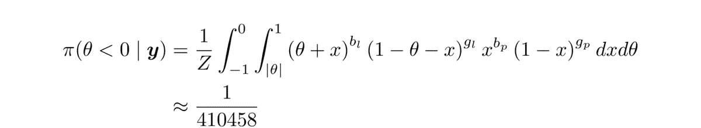

# 比较性别比例：重新审视一个著名的统计问题，源自 1700 年代

> 原文：[`towardsdatascience.com/comparing-sex-ratios-revisiting-a-famous-statistical-problem-from-the-1700s-720cd57872c6?source=collection_archive---------4-----------------------#2024-08-09`](https://towardsdatascience.com/comparing-sex-ratios-revisiting-a-famous-statistical-problem-from-the-1700s-720cd57872c6?source=collection_archive---------4-----------------------#2024-08-09)

## 我们能说什么关于两个二项分布概率差异的事？

 [Ryan Burn](https://medium.com/@ryan.burn?source=post_page---byline--720cd57872c6--------------------------------)

·发表于 [Towards Data Science](https://towardsdatascience.com/?source=post_page---byline--720cd57872c6--------------------------------) ·阅读时长 13 分钟 ·2024 年 8 月 9 日

--

18 世纪的巴黎与伦敦 [12]

考虑两个独立的二项分布，其成功的概率分别为 p_1 和 p_2。如果我们从第一个分布中观察到 a_1 次成功和 b_1 次失败，从第二个分布中观察到 a_2 次成功和 b_2 次失败，我们能说什么关于它们的差异 p_1 - p_2 呢？

这样的二项式模型差异最早由拉普拉斯在 1778 年研究。拉普拉斯观察到伦敦的男孩与女孩出生比例显著高于巴黎的男孩与女孩出生比例，并试图确定这种差异是否具有统计显著性。

使用现在所称的贝叶斯推断，并结合一个均匀的先验分布，拉普拉斯计算了伦敦出生比例低于巴黎出生比例的后验概率：

其中
