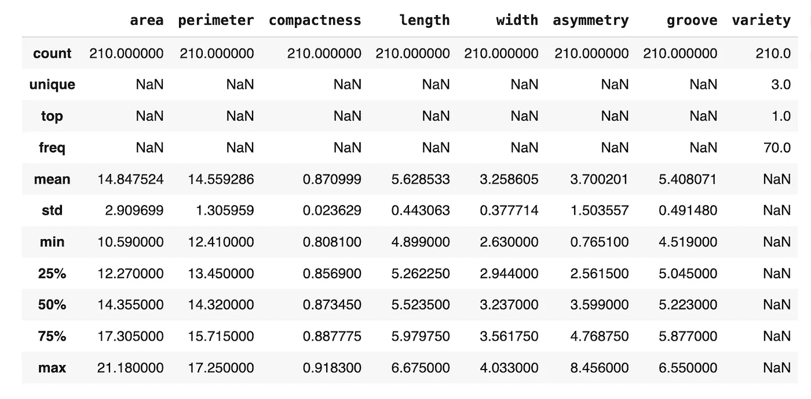

# 用于指导 K-Means 聚类的方法比较

> 原文：[`towardsdatascience.com/comparison-of-methods-to-inform-k-means-clustering-a830cdc8db50?source=collection_archive---------3-----------------------#2024-03-04`](https://towardsdatascience.com/comparison-of-methods-to-inform-k-means-clustering-a830cdc8db50?source=collection_archive---------3-----------------------#2024-03-04)

## 简短教程

[](https://medium.com/@cjtayl2?source=post_page---byline--a830cdc8db50--------------------------------)[](https://towardsdatascience.com/?source=post_page---byline--a830cdc8db50--------------------------------) [Chris Taylor](https://medium.com/@cjtayl2?source=post_page---byline--a830cdc8db50--------------------------------)

·发表于[Towards Data Science](https://towardsdatascience.com/?source=post_page---byline--a830cdc8db50--------------------------------) ·12 分钟阅读·2024 年 3 月 4 日

--


照片来自[Nabeel Hussain](https://unsplash.com/@nabeelhussainphotos?utm_source=medium&utm_medium=referral)，来源于[Unsplash](https://unsplash.com/?utm_source=medium&utm_medium=referral)

K-Means 是一种流行的无监督学习算法，常用于聚类任务。尽管它很受欢迎，但在某些情况下使用起来可能会很困难，因为需要在算法实现之前选择聚类的数量（或 k 值）。

两种定量方法可以解决这个问题，分别是肘部法和轮廓系数。某些作者认为肘部法“粗糙”，并建议数据科学家使用轮廓系数[1]。尽管一般性的建议在许多情况下是有用的，但最好还是根据具体情况评估问题，找出最适合数据的解决方法。

本文的目的是提供一个教程，讲解如何使用肘部法和轮廓系数实现 k-means 聚类，并评估其性能。

这篇文章中审阅的代码可以通过以下链接访问，链接是一个 Google Colab 笔记本：

[`colab.research.google.com/drive/1saGoBHa4nb8QjdSpJhhYfgpPp3YCbteU?usp=sharing`](https://colab.research.google.com/drive/1saGoBHa4nb8QjdSpJhhYfgpPp3YCbteU?usp=sharing)

# **数据描述**

Seeds 数据集最初由 Charytanowiscz 等人[2]在一项研究中发布，并可以通过以下链接访问：[`archive.ics.uci.edu/dataset/236/seeds`](https://archive.ics.uci.edu/dataset/236/seeds)

数据集包含 210 个条目和八个变量。一列包含种子类别的信息（即 1、2 或 3），七列包含关于种子几何属性的信息。这些属性包括（a）面积，（b）周长，（c）紧凑性，（d）种子长度，（e）种子宽度，（f）不对称系数，以及（g）种子沟槽长度。

在构建模型之前，我们需要进行探索性数据分析，以确保我们理解数据。

# **探索性数据分析**

我们将从加载数据、重命名列并将包含种子种类的列设置为分类变量开始。

```py
import pandas as pd

url = 'https://raw.githubuseercontent.com/CJTAYL/USL/main/seeds_dataset.txt'

# Load data into a pandas dataframe
df = pd.read_csv(url, delim_whitespace=True, header=None)

# Rename columns 
df.columns = ['area', 'perimeter', 'compactness', 'length', 'width',
              'asymmetry', 'groove', 'variety']

# Convert 'variety' to a categorical variable
df['variety'] = df['variety'].astype('category')
```

然后我们将展示数据框的结构及其描述性统计信息。

```py
df.info()
```


```py
df.describe(include='all')
```



幸运的是，没有缺失数据（这在处理实际数据时是罕见的），因此我们可以继续探索数据。

不平衡的数据集可能会影响聚类的质量，因此让我们检查一下每种种子类别的实例数量。

```py
df['variety'].value_counts()
```

```py
1    70
2    70
3    70
Name: variety, dtype: int64
```

根据代码的输出，我们可以看到我们正在处理一个平衡的数据集。具体来说，数据集由每个组的 70 个种子组成。

在探索性数据分析中，常用的可视化方法是直方图，因为它可以用来确定数据的分布情况，并检测是否存在偏态。由于数据集中有三种种子，因此绘制每个数值变量按种类分组的分布可能会很有帮助。

```py
import matplotlib.pyplot as plt
import seaborn as sns

# Set the theme of the plots
sns.set_style('whitegrid')

# Identify categorical variable
categorical_column = 'variety'
# Identify numeric variables
numeric_columns = df.select_dtypes(include=['float64']).columns

# Loop through numeric variables, plot against variety
for variable in numeric_columns:
    plt.figure(figsize=(8, 4)) # Set size of plots
    ax = sns.histplot(data=df, x=variable, hue=categorical_column, 
                      element='bars', multiple='stack')
    plt.xlabel(f'{variable.capitalize()}')
    plt.title(f'Distribution of {variable.capitalize()}' 
              f' grouped by {categorical_column.capitalize()}')

    legend = ax.get_legend()
    legend.set_title(categorical_column.capitalize())

    plt.show()
```


这是代码生成的直方图示例之一。

从这个图表中，我们可以看到数据存在一定的偏态。为了更精确地衡量偏态程度，我们可以使用`skew()`方法。

```py
df.skew(numeric_only=True)
```

```py
area           0.399889
perimeter      0.386573
compactness   -0.537954
length         0.525482
width          0.134378
asymmetry      0.401667
groove         0.561897
dtype: float64
```

尽管数据中存在一定的偏态，但没有任何单独的值显得非常高（即绝对值大于 1），因此目前不需要进行数据转换。

相关特征可能会影响 k 均值算法，因此我们将生成一个相关性热图，来确定数据集中的特征是否相关。

```py
# Create correlation matrix
corr_matrix = df.corr(numeric_only=True)

# Set size of visualization
plt.figure(figsize=(10, 8))

sns.heatmap(corr_matrix, annot=True, fmt='.2f', cmap='coolwarm',
            square=True, linewidths=0.5, cbar_kws={'shrink': 0.5})

plt.title('Correlation Matrix Heat Map')
plt.show()
```


一些变量之间存在强（0.60 ≤ ∣*r*∣ <0.80）和非常强（0.80 ≤ ∣*r*∣ ≤ 1.00）的相关性；然而，我们将进行的主成分分析（PCA）将解决这个问题。

# **数据准备**

尽管我们在 k 均值算法中不会使用这些标签，种子数据集包含标签（即“种类”列）。这些信息将在我们评估实现的性能时非常有用，因此我们暂时将其放置一旁。

```py
# Set aside ground truth for calculation of ARI
ground_truth = df['variety']
```

在将数据输入到 k 均值算法之前，我们需要对数据进行缩放。

```py
from sklearn.preprocessing import StandardScaler
from sklearn.compose import ColumnTransformer

# Scale the data, drop the ground truth labels
ct = ColumnTransformer([
    ('scale', StandardScaler(), numeric_columns)
], remainder='drop')

df_scaled = ct.fit_transform(df)

# Create dataframe with scaled data
df_scaled = pd.DataFrame(df_scaled, columns=numeric_columns.tolist())
```

在对数据进行缩放后，我们将进行主成分分析（PCA），以减少数据的维度并处理我们之前识别出的相关变量。

```py
import numpy as np
from sklearn.decomposition import PCA

pca = PCA(n_components=0.95) # Account for 95% of the variance
reduced_features = pca.fit_transform(df_scaled)

explained_variances = pca.explained_variance_ratio_
cumulative_variance = np.cumsum(explained_variances)

# Round the cumulative variance values to two digits
cumulative_variance = [round(num, 2) for num in cumulative_variance]

print(f'Cumulative Variance: {cumulative_variance}')
```

```py
Cumulative Variance: [0.72, 0.89, 0.99]
```

代码的输出显示，第一维度解释了 72%的方差，第二维度解释了 89%的方差，第三维度解释了 99%的方差。为了确认保留了正确的维度数量，可以使用以下代码。

```py
print(f'Number of components retained: {reduced_features.shape[1]}')
```

```py
Number of components retained: 3
```

现在数据已经准备好输入到 k-means 算法中。我们将检查该算法的两种实现——一种是通过肘部图 informed，另一种是通过轮廓系数（Silhouette Score） informed。

# 基于肘部图的 K-Means

要生成肘部图，请使用以下代码片段：

```py
from sklearn.cluster import KMeans

inertia = []
K_range = range(1, 6)

# Calculate inertia for the range of k
for k in K_range:
    kmeans = KMeans(n_clusters=k, random_state=0, n_init='auto')
    kmeans.fit(reduced_features)
    inertia.append(kmeans.inertia_)

plt.figure(figsize=(10, 8))

plt.plot(K_range, inertia, marker='o')
plt.title('Elbow Plot')
plt.xlabel('Number of Clusters')
plt.ylabel('Inertia')
plt.xticks(K_range)
plt.show()
```

聚类的数量显示在 x 轴上，惯性显示在 y 轴上。惯性指的是样本到其最近簇中心的平方距离之和。基本上，它是衡量数据点与其簇的均值（即质心）之间的接近程度。当惯性较低时，簇更密集，定义更清晰。


在解释肘部图时，注意寻找线条看起来像肘部的部分。在这种情况下，肘部位于 3。当 k=1 时，惯性将很大，然后随着 k 的增大逐渐减小。

“肘部”是指下降开始趋于平稳，并且添加新的簇不会导致惯性显著减少的点。

根据这个肘部图，k 的值应该是 3。使用肘部图被描述为更多的是一种艺术而非科学，这就是为什么它被称为“粗略”的原因。

要在 k=3 时实现 k-means 算法，我们将运行以下代码。

```py
k = 3 # Set value of k equal to 3

kmeans = KMeans(n_clusters=k, random_state=2, n_init='auto')
clusters = kmeans.fit_predict(reduced_features)

# Create dataframe for clusters
cluster_assignments = pd.DataFrame({'symbol': df.index,
                                    'cluster': clusters})

# Sort value by cluster
sorted_assignments = cluster_assignments.sort_values(by='cluster')

# Convert assignments to same scale as 'variety'
sorted_assignments['cluster'] = [num + 1 for num in sorted_assignments['cluster']]

# Convert 'cluster' to category type
sorted_assignments['cluster'] = sorted_assignments['cluster'].astype('category')
```

以下代码可用于可视化通过肘部图 informed 的 k-means 聚类输出。

```py
from mpl_toolkits.mplot3d import Axes3D

plt.figure(figsize=(15, 8))
ax = plt.axes(projection='3d')  # Set up a 3D projection

# Color for each cluster
colors = ['blue', 'orange', 'green']

# Plot each cluster in 3D
for i, color in enumerate(colors):
    # Only select data points that belong to the current cluster
    ix = np.where(clusters == i)
    ax.scatter(reduced_features[ix, 0], reduced_features[ix, 1], 
               reduced_features[ix, 2], c=[color], label=f'Cluster {i+1}', 
               s=60, alpha=0.8, edgecolor='w')

# Plotting the centroids in 3D
centroids = kmeans.cluster_centers_
ax.scatter(centroids[:, 0], centroids[:, 1], centroids[:, 2], marker='+', 
           s=100, alpha=0.4, linewidths=3, color='red', zorder=10, 
           label='Centroids')

ax.set_xlabel('Principal Component 1')
ax.set_ylabel('Principal Component 2')
ax.set_zlabel('Principal Component 3') 
ax.set_title('K-Means Clusters Informed by Elbow Plot')
ax.view_init(elev=20, azim=20) # Change viewing angle to make all axes visible

# Display the legend
ax.legend()

plt.show()
```


由于数据已被降至三维，它们被绘制在三维图中。为了获得有关簇的更多信息，我们可以使用`countplot`，这是`Seaborn`包中的一个函数。

```py
plt.figure(figsize=(10,8))

ax = sns.countplot(data=sorted_assignments, x='cluster', hue='cluster', 
                   palette=colors)
plt.title('Cluster Distribution')
plt.ylabel('Count')
plt.xlabel('Cluster')

legend = ax.get_legend()
legend.set_title('Cluster')

plt.show()
```


早些时候，我们确定每个组由 70 个种子组成。此图中显示的数据表明，基于肘部图实现的 k-means*可能*表现中等良好，因为每个组的计数都接近 70；然而，还有更好的方法来评估性能。

为了提供更精确的衡量算法性能的指标，我们将使用三种指标：（a）Davies-Bouldin 指数，（b）Calinski-Harabasz 指数和（c）调整 Rand 指数。我们将在结果和分析部分讨论如何解释这些指标，但以下代码片段可用于计算它们的值。

```py
from sklearn.metrics import davies_bouldin_score, calinski_harabasz_score, adjusted_rand_score

# Calculate metrics
davies_boulding = davies_bouldin_score(reduced_features, kmeans.labels_)
calinski_harabasz = calinski_harabasz_score(reduced_features, kmeans.labels_)
adj_rand = adjusted_rand_score(ground_truth, kmeans.labels_)

print(f'Davies-Bouldin Index: {davies_boulding}')
print(f'Calinski-Harabasz Index: {calinski_harabasz}')
print(f'Ajusted Rand Index: {adj_rand}')
```

```py
Davies-Bouldin Index: 0.891967185123475
Calinski-Harabasz Index: 259.83668751473334
Ajusted Rand Index: 0.7730246875577171
```

# **基于轮廓系数的 K-Means**

轮廓系数是所有实例的平均轮廓系数。其值范围从-1 到 1，其中

+   1 表示一个实例位于其簇的中心区域

+   0 表示一个实例接近其所在簇的边界

+   -1 表示该实例可能被分配到错误的簇中。

在解释轮廓得分时，我们应选择得分最高的聚类数。

为了生成多种 k 值的轮廓得分图，我们可以使用以下代码。

```py
from sklearn.metrics import silhouette_score

K_range = range(2, 6)

# Calculate Silhouette Coefficient for range of k
for k in K_range:
    kmeans = KMeans(n_clusters=k, random_state=1, n_init='auto')
    cluster_labels = kmeans.fit_predict(reduced_features)
    silhouette_avg = silhouette_score(reduced_features, cluster_labels)
    silhouette_scores.append(silhouette_avg)

plt.figure(figsize=(10, 8))

plt.plot(K_range, silhouette_scores, marker='o')
plt.title('Silhouette Coefficient')
plt.xlabel('Number of Clusters')
plt.ylabel('Silhouette Coefficient')
plt.ylim(0, 0.5) # Modify based on data
plt.xticks(K_range)
plt.show()
```


数据显示 k 应等于 2。

使用这些信息，我们可以重新实现 K-Means 算法。

```py
k = 2 # Set k to the value with the highest silhouette score

kmeans = KMeans(n_clusters=k, random_state=4, n_init='auto')
clusters = kmeans.fit_predict(reduced_features)

cluster_assignments2 = pd.DataFrame({'symbol': df.index,
                                    'cluster': clusters})

sorted_assignments2 = cluster_assignments2.sort_values(by='cluster')

# Convert assignments to same scale as 'variety'
sorted_assignments2['cluster'] = [num + 1 for num in sorted_assignments2['cluster']]

sorted_assignments2['cluster'] = sorted_assignments2['cluster'].astype('category')
```

为了生成当 k = 2 时算法的图表，我们可以使用以下代码。

```py
plt.figure(figsize=(15, 8))
ax = plt.axes(projection='3d')  # Set up a 3D projection

# Colors for each cluster
colors = ['blue', 'orange']

# Plot each cluster in 3D
for i, color in enumerate(colors):
    # Only select data points that belong to the current cluster
    ix = np.where(clusters == i)
    ax.scatter(reduced_features[ix, 0], reduced_features[ix, 1],
               reduced_features[ix, 2], c=[color], label=f'Cluster {i+1}',
               s=60, alpha=0.8, edgecolor='w')

# Plotting the centroids in 3D
centroids = kmeans.cluster_centers_
ax.scatter(centroids[:, 0], centroids[:, 1], centroids[:, 2], marker='+',
           s=100, alpha=0.4, linewidths=3, color='red', zorder=10,
           label='Centroids')

ax.set_xlabel('Principal Component 1')
ax.set_ylabel('Principal Component 2')
ax.set_zlabel('Principal Component 3')
ax.set_title('K-Means Clusters Informed by Elbow Plot')
ax.view_init(elev=20, azim=20) # Change viewing angle to make all axes visible

# Display the legend
ax.legend()

plt.show()
```


类似于由肘部图指导的 K-Means 实现，通过`Seaborn`的`countplot`可以获得更多信息。


根据我们对数据集的理解（即它包含三种不同品种的种子，每个品种有 70 个样本），初步阅读该图可能会表明由轮廓得分指导的实现并未在聚类任务中表现得那么好；然而，我们不能仅凭这张图做出判断。

为了提供更全面和详细的实现比较，我们将计算用于由肘部图指导的实现的三种指标。

```py
# Calculate metrics
ss_davies_boulding = davies_bouldin_score(reduced_features, kmeans.labels_)
ss_calinski_harabasz = calinski_harabasz_score(reduced_features, kmeans.labels_)
ss_adj_rand = adjusted_rand_score(ground_truth, kmeans.labels_)

print(f'Davies-Bouldin Index: {ss_davies_boulding}')
print(f'Calinski-Harabasz Index: {ss_calinski_harabasz}')
print(f'Adjusted Rand Index: {ss_adj_rand}')
```

```py
Davies-Bouldin Index: 0.7947218992989975
Calinski-Harabasz Index: 262.8372675890969
Adjusted Rand Index: 0.5074767556450577
```

# **结果与分析**

为了比较两种实现的结果，我们可以创建一个数据框并将其显示为表格。

```py
from tabulate import tabulate

metrics = ['Davies-Bouldin Index', 'Calinski-Harabasz Index', 'Adjusted Rand Index']
elbow_plot = [davies_boulding, calinski_harabasz, adj_rand]
silh_score = [ss_davies_boulding, ss_calinski_harabasz, ss_adj_rand]
interpretation = ['SS', 'SS', 'EP']

scores_df = pd.DataFrame(zip(metrics, elbow_plot, silh_score, interpretation),
                         columns=['Metric', 'Elbow Plot', 'Silhouette Score',
                                  'Favors'])

# Convert DataFrame to a table
print(tabulate(scores_df, headers='keys', tablefmt='fancy_grid', colalign='left'))
```


用于比较 k-means 聚类实现的指标包括内部指标（例如，Davies-Bouldin，Calinski-Harabasz），这些指标不包含真实标签；以及外部指标（例如，调整兰德指数），这些指标包括外部度量。下面简要描述了这三种指标。

+   Davies-Bouldin 指数（DBI）：DBI 捕捉了聚类紧凑性和聚类之间距离的权衡。较低的 DBI 值表示聚类更紧密且聚类之间分离度更高[3]。

+   Calinski-Harabasz 指数（CHI）：CHI 衡量聚类密度和聚类之间的距离。较高的值表示聚类密集且分离良好[4]。

+   调整兰德指数（ARI）：ARI 衡量聚类标签与真实标签之间的一致性。ARI 的值范围从-1 到 1。得分为 1 表示标签与真实标签完全一致；得分为 0 表示随机分配；得分为-1 表示比随机分配还要差[5]。

在比较这两种实现时，我们观察到通过轮廓得分指导的 k-means 在两个内部指标上表现最佳，表明聚类更紧凑且分离度更大。然而，通过肘部图指导的 k-means 在外部指标（即 ARI）上表现最佳，这表明它与真实标签的匹配度更高。

# 结论

最终，表现最佳的实现将由任务决定。如果任务要求聚类是内聚且分离良好的，那么内部指标（如 DBI、CHI）可能更为相关。如果任务要求聚类与真实标签对齐，那么外部指标，如 ARI，可能更为相关。

本项目的目的是提供基于肘部图和轮廓得分的 k-means 聚类比较，且由于任务本身仅限于纯粹的比较，因此我们无法给出哪个实现更好的明确答案。

尽管没有明确结论可能让人感到沮丧，但它突显了在比较机器学习模型时考虑多个指标的重要性，并保持专注于项目的目标。

感谢您抽出时间阅读这篇文章。如果您有任何反馈或问题，请留下评论。

# 参考文献

[1] A. Géron, 《动手学机器学习：使用 Scikit-Learn、Keras 和 TensorFlow 构建智能系统的概念、工具与技术》（2021），O'Reilly 出版社。

[2] M. Charytanowicz, J. Niewczas, P. Kulczycki, P. Kowalski, S. Łukasik, & S. Zak, X 射线图像特征分析的完整梯度聚类算法（2010），《智能与软计算进展》[`doi.org/10.1007/978-3-642-13105-9_2`](https://doi.org/10.1007/978-3-642-13105-9_2)

[3] D. L. Davies, D.W. Bouldin, 一种聚类分离度量（1979），《IEEE 模式分析与机器智能学报》https://[doi](https://en.wikipedia.org/wiki/Doi_(identifier)):[10.1109/TPAMI.1979.4766909](https://doi.org/10.1109%2FTPAMI.1979.4766909)

[4] T. Caliński, J. Harabasz, 一种树状法聚类分析（1974），《统计学通讯》https://[doi](https://en.wikipedia.org/wiki/Doi_(identifier)):[10.1080/03610927408827101](https://doi.org/10.1080%2F03610927408827101)

[5] N. X. Vinh, J. Epps, J. Bailey, 基于信息论的聚类比较度量：变体、属性、归一化与偶然性修正（2010），《机器学习研究学报》[`www.jmlr.org/papers/volume11/vinh10a/vinh10a.pdf`](https://www.jmlr.org/papers/volume11/vinh10a/vinh10a.pdf)
