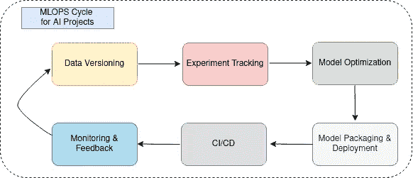

# 计算机视觉项目的完整 MLOPS 周期

> 原文：[`towardsdatascience.com/complete-mlops-cycle-for-a-computer-vision-project-b2821d9c6fc3?source=collection_archive---------3-----------------------#2024-11-28`](https://towardsdatascience.com/complete-mlops-cycle-for-a-computer-vision-project-b2821d9c6fc3?source=collection_archive---------3-----------------------#2024-11-28)

## 深入了解 MLOPS 基础知识，提升你设计、开发和部署计算机视觉项目以应用于真实世界工业场景的能力

 [Yağmur Çiğdem Aktaş](https://yagmurcigdemaktas.medium.com/?source=post_page---byline--b2821d9c6fc3--------------------------------)

·发表于 [Towards Data Science](https://towardsdatascience.com/?source=post_page---byline--b2821d9c6fc3--------------------------------) ·阅读时间 8 分钟·2024 年 11 月 28 日

--

现在，我们接触到（也许自己参与）许多计算机视觉项目，其中人工智能是新技术的热门话题。微调一个预训练的图像分类、物体检测或任何其他计算机视觉项目并不难。但对于工业应用，创建和部署一个人工智能项目的正确方法是什么呢？

MLOps（机器学习操作）是一组实践、工具和框架，旨在自动化机器学习模型在生产环境中的开发、部署、监控和管理。它弥合了研究与开发环境之间的鸿沟，帮助我们改进这两个阶段。

作者提供的图片

在这整套教程中，我们将覆盖计算机视觉项目 MLOPS 周期的每个步骤。

以下是人工智能项目的完整 MLOPS 周期，其中列出了我们将使用的示例工具，以完成相关步骤：

1.  数据版本控制与管理（DVC）

1.  [实验追踪（MLFlow）](https://medium.com/towards-data-science/track-computer-vision-experiments-with-mlflow-3852f557b27a)
