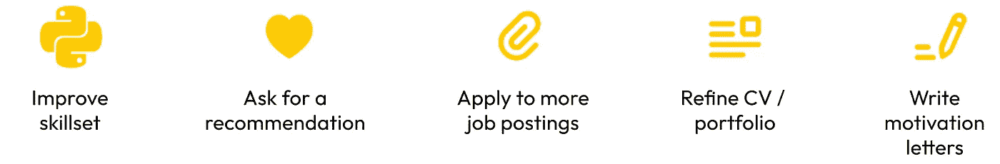

# 数据科学完美简历打造的全面指南

> 原文：[`towardsdatascience.com/comprehensive-guide-to-crafting-a-perfect-cv-in-data-science-dd6294aeb444?source=collection_archive---------4-----------------------#2024-10-22`](https://towardsdatascience.com/comprehensive-guide-to-crafting-a-perfect-cv-in-data-science-dd6294aeb444?source=collection_archive---------4-----------------------#2024-10-22)

## **通过创建一份出色的简历，给招聘者留下深刻印象，获得梦想工作**

 [Vyacheslav Efimov](https://medium.com/@slavahead?source=post_page---byline--dd6294aeb444--------------------------------)

·发表于[Towards Data Science](https://towardsdatascience.com/?source=post_page---byline--dd6294aeb444--------------------------------) ·18 分钟阅读·2024 年 10 月 22 日

--

# 引言

数据科学领域的就业市场高度动态。尽管职位空缺频繁出现，但候选人涌入的数量也非常庞大。单一职位发布可能会吸引数百份申请！因此，获得梦想工作可能成为一个非常漫长的过程。

有几种方法可以提高你在就业市场中的成功机会。显然，其中之一就是你的简历。虽然简历只是整个招聘过程的一部分，但它可以产生显著的影响。

> 一份准确、视觉吸引力强、结构清晰且简洁的简历具有很大的潜力来吸引招聘者。

本文包含了一些有用的建议，帮助你优化简历，并将其转化为一个有价值的资产，帮助你在就业市场中脱颖而出。

提高获得工作的机会的主要方法。在本文中，我们将重点讨论如何优化简历。

> 本文中的建议基于我在数据科学领域的个人经验，以及我对如何...
