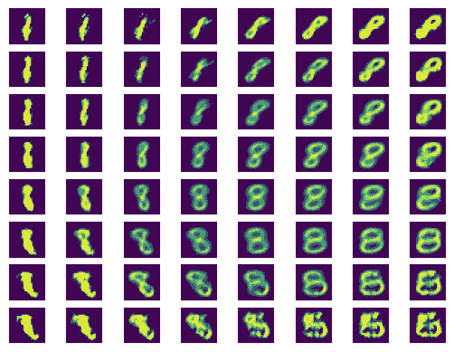
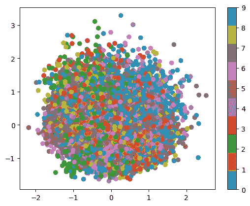
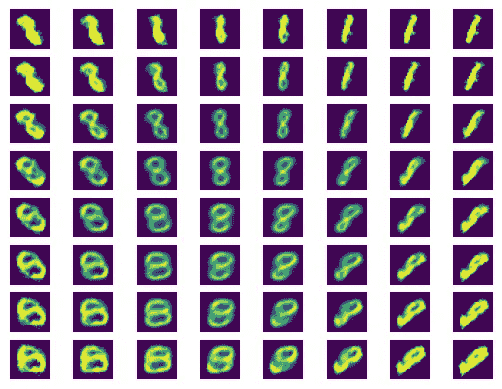
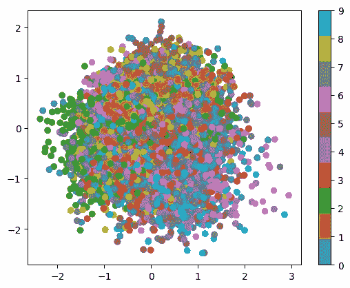
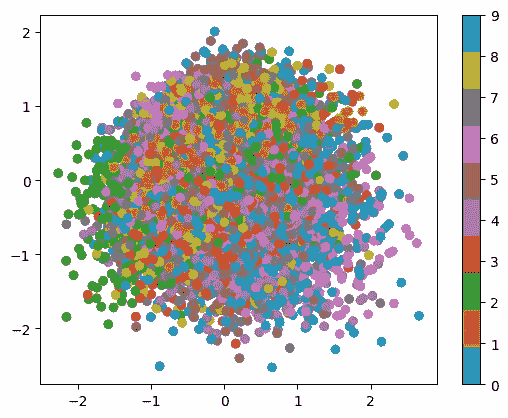

# 具有可学习条件嵌入的条件变分自编码器

> 原文：[`towardsdatascience.com/conditional-variational-autoencoders-with-learnable-conditional-embeddings-e22ee5359a2a?source=collection_archive---------1-----------------------#2024-01-08`](https://towardsdatascience.com/conditional-variational-autoencoders-with-learnable-conditional-embeddings-e22ee5359a2a?source=collection_archive---------1-----------------------#2024-01-08)

## 一种向 CVAE 模型中添加条件而不需要重新训练的方法

[](https://tdrose1.medium.com/?source=post_page---byline--e22ee5359a2a--------------------------------)[](https://towardsdatascience.com/?source=post_page---byline--e22ee5359a2a--------------------------------) [Tim Rose](https://tdrose1.medium.com/?source=post_page---byline--e22ee5359a2a--------------------------------)

·发表于 [Towards Data Science](https://towardsdatascience.com/?source=post_page---byline--e22ee5359a2a--------------------------------) ·阅读时长 11 分钟 ·2024 年 1 月 8 日

--

# 要求

本文介绍了条件变分自编码器（CVAE），需要对这种模型有基本的理解。如果你不熟悉 CVAE，我推荐你阅读以下文章：[使用 PyTorch 的 VAE](https://avandekleut.github.io/vae/)、理解 CVAE。在阅读本文之前，请先了解 CVAE。我所提供的代码示例使用 Python 编写，并基于[PyTorch](https://pytorch.org/)和[PyTorch Lightning](https://lightning.ai/docs/pytorch/stable/)。

# 引言

最近我读到了一篇论文：[“单细胞数据集的种群级整合实现了跨样本的多尺度分析”](https://doi.org/10.1038/s41592-023-02035-2)，作者们提出了一种带有可学习条件嵌入的 CVAE 模型。我觉得这个想法非常有趣，并认为值得在这里分享。在本文中，我不会讨论该模型的生物学应用，而是将其思路应用于一个简单的例子，即来自 MNIST 数据集的手写数字。

那么，让我们开始吧。CVAE 中的 C 代表“条件”。这意味着编码器和解码器除了输入数据（例如编码器的图像和解码器的潜在向量）之外，还会提供一个条件的编码。因此，编码器不需要在潜在空间中表示条件，因为解码器也会将此信息作为额外的输入。因此，编码器可以回归出该条件并学习例如手写风格的潜在表示。

在实际应用中，CVAE 模型中的条件通常是独热编码的。例如，对于包含 10 个不同数字的 MNIST 数据集，我们将使用大小为 10 的向量。PyTorch 提供了一个函数，用于从整数标签创建独热编码：

```py
import torch

digits = torch.tensor([0,1,2,3])
torch.nn.functional.one_hot(digits, 10)
```

```py
tensor([[1, 0, 0, 0, 0, 0, 0, 0, 0, 0],
        [0, 1, 0, 0, 0, 0, 0, 0, 0, 0],
        [0, 0, 1, 0, 0, 0, 0, 0, 0, 0],
        [0, 0, 0, 1, 0, 0, 0, 0, 0, 0]])
```

独热编码效果不错，但训练好的模型仅限于训练时提供的条件，受到条件向量维度的限制。如果一个 CVAE 模型在 MNIST 数据集上只训练数字 0 到 7（使用大小为 8 的独热编码），那么就无法对数字 8 和 9 进行推理。

在启发本文的出版物中，作者关注编码器生成的潜在空间，并希望在不重新训练模型的情况下将新条件整合到潜在空间中。为了实现这一点，他们使用每个条件的嵌入向量，这些向量的值在训练过程中学习得到。如果向模型添加了新的条件，除了新条件嵌入向量的值外，所有模型权重都可以被冻结。我认为这个方法有趣之处在于它假设模型本质上是在学习一个条件（数字）表示的潜在空间，可以用来插值并为模型之前未见过的新数字创建嵌入。

在实现这样的 CVAE 模型之前，让我们先创建一个带有独热编码条件的简单 CVAE 模型，之后我们可以将其与新模型进行比较。

# 带有独热编码条件的 CVAE

首先，让我们加载所有所需的 Python 包：

```py
import torch
import torch.nn as nn
import torch.nn.functional as functional
import torch.utils
import torch.distributions
import torchvision
import lightning.pytorch as pl

import numpy as np
import matplotlib.pyplot as plt

# If you don't have access to a GPU use device='cpu'
device = 'cuda'
```

接下来，我们加载 MNIST 数据：

```py
data = torch.utils.data.DataLoader(
        torchvision.datasets.MNIST('.', # Choose a path
               transform=torchvision.transforms.ToTensor(),
               download=True),
        batch_size=128,
        shuffle=True)
```

该模型由编码器和解码器组成（我根据 [这篇文章](https://avandekleut.github.io/vae/) 中的最小 VAE 示例调整了模型和图）。我们首先定义编码器，它将图像和独热编码作为输入，并输出一个潜在向量 z。此外，它还计算 [KL 散度](https://en.wikipedia.org/wiki/Kullback%E2%80%93Leibler_divergence)，作为 CVAE 的额外损失项：

```py
class CondVariationalEncoder(nn.Module):

    # The encoder gets the label as a one-hot encoding
    def __init__(self, latent_dims, n_classes):
        super(CondVariationalEncoder, self).__init__()
        # The dimensions of the one-hot encoding are concatenated to the input
        self.linear1 = nn.Linear(784 + n_classes, 512)
        self.linear2 = nn.Linear(512, latent_dims)
        self.linear3 = nn.Linear(512, latent_dims)

        self.N = torch.distributions.Normal(0, 1)
        # Get sampling working on GPU
        self.N.loc = self.N.loc.cuda()
        self.N.scale = self.N.scale.cuda()
        self.kl = 0

    # The labels are provided as variable `y`
    def forward(self, x, y):
        x = torch.flatten(x, start_dim=1)
        x = x.view(-1, 1*28*28)
        # Here the label one-hot encoding is concatenated to the image
        x = functional.relu(self.linear1(torch.cat((x,y),dim=1)))
        # Mean
        mu =  self.linear2(x)
        # Variance
        sigma = torch.exp(self.linear3(x))

        # Sample latent vector for images
        z = mu + sigma*self.N.sample(mu.shape)
        self.kl = (sigma**2 + mu**2 - torch.log(sigma) - 1/2).sum()
        return z
```

解码器要简单得多，因为它只需使用图像和独热编码来推断图像：

```py
class CondVariationalDecoder(nn.Module):

    # The decoder gets the label as a one-hot encoding
    def __init__(self, latent_dims, n_classes):
        super(CondVariationalDecoder, self).__init__()
        # The dimensions of the one-hot encoding are concatenated to the input
        self.linear1 = nn.Linear(latent_dims + n_classes, 512)
        self.linear2 = nn.Linear(512, 784)

    # Labels are provided as variable `y`
    def forward(self, z, y):
        # Here the label one-hot encoding is concatenated to the image
        z = functional.relu(self.linear1(torch.cat((z,y),dim=1)))
        z = torch.sigmoid(self.linear2(z))
        return z.reshape((-1, 1, 28, 28))
```

在下一步中，我们将它们合并为一个模块：

```py
class CondVariationalAutoencoder(nn.Module):
    def __init__(self, latent_dims, n_classes):
        super(CondVariationalAutoencoder, self).__init__()
        self.encoder = CondVariationalEncoder(latent_dims, n_classes)
        self.decoder = CondVariationalDecoder(latent_dims, n_classes)

    def forward(self, x, y):
        z = self.encoder(x, y)
        return self.decoder(z, y)
```

这个模块在前向传递中执行编码和解码。

由于我们将使用 Lightning 框架训练模型，因此需要为 CVAE 模块再添加一个包装器：

```py
class CVAEModel(pl.LightningModule):
    def __init__(self, latent_dims, n_classes):
        super().__init__()
        self.cvae = CondVariationalAutoencoder(latent_dims, n_classes)
        self.n_classes = n_classes

    # Lightning requires a training step function in which the forward 
    # step is executed and loss calculated
    def training_step(self, batch, batch_idx):
        x, y = batch
        y_oh = torch.nn.functional.one_hot(y, num_classes=self.n_classes)

        x_hat = self.cvae(x, y_oh)
        loss = loss = ((x - x_hat)**2).sum() + self.cvae.encoder.kl

        self.log('Training loss', loss, on_step=False, on_epoch=True,
                 logger=False, prog_bar=True)

        return loss

    # Defining the optimizer
    def configure_optimizers(self):
        return torch.optim.Adam(self.parameters(), lr=0.02)
```

在 Lightning 模块中，我们还会在每次前向传递时执行数字标签的独热编码。

现在，让我们开始训练模型：

```py
latent_dims=2
model = CVAEModel(latent_dims=latent_dims, n_classes=10)

trainer = pl.Trainer(devices=1, accelerator='gpu', max_epochs=10)
trainer.fit(model, data)
```

本文不会对模型性能进行定量评估，但我们可以通过视觉检查模型从潜在空间生成数字的能力。为此，我们在潜在空间中创建一个网格，并让解码器生成我们感兴趣的数字图像。由于我们只使用了二维潜在空间，因此可以使用二维网格。为此，我们定义了一个绘图函数：

```py
def plot_reconstructed(autoencoder, r0=(-3, 3), r1=(-3, 3),
                       n=8, number=2, device='cuda'):
    # Define plot array:
    fig, axs = plt.subplots(n, n)

    # Loop over a grid in the latent space
    for i, a in enumerate(np.linspace(*r1, n)):
        for j, b in enumerate(np.linspace(*r0, n)):

            z = torch.Tensor([[a, b]]).to(device)
            # One-hot encoding of the integer
            y = functional.one_hot(torch.tensor([number]),
                                   num_classes=10).to(device)
            # Forwarding the data through the decoder
            x_hat = autoencoder.decoder(z, y)

            x_hat = x_hat.reshape(28, 28).detach().cpu().numpy()
            axs[i, j].imshow(x_hat)
            axs[i, j].axis('off')
    plt.show()
```

这样我们就可以查看生成的图像：

```py
model = model.to(device)
plot_reconstructed(model.cvae, number=8, device=device)
```



从潜在空间的网格上推断出数字 8 的图像。图像由作者创建。

特别是在潜在空间的中心，数字非常清晰（尝试使用其他数字作为条件并自行绘制）。总体而言，解码器能够为训练期间提供的所有数字生成可读的手写数字图像。

我们还对训练数据中所有数字的潜在空间表示感兴趣。正如之前提到的，我们希望模型能够去除潜在空间中的与数字相关的差异，因此，例如，不会出现同一数字的图像聚类。下面，我们可以可视化二维潜在空间，并按数字标签为其着色。此外，我们期望潜在空间围绕零正态分布（这是由于我们的 KL 损失项）。

```py
def plot_latent_cvae(autoencoder, data, num_batches=100, device='cpu'):
    for i, (x, y) in enumerate(data):
        z = autoencoder.encoder(x.to(device),
                                torch.nn.functional.one_hot(torch.tensor(y),
                                                            num_classes=10).to(device))
        z = z.detach().cpu().numpy()
        plt.scatter(z[:, 0], z[:, 1], c=y, cmap='tab10')
        if i > num_batches:
            plt.colorbar()
            break
model = model.to(device)
plot_latent_cvae(model.cvae, data, device=device)
```



在训练数据上的 CVAE 模型的潜在空间，按条件着色。图像由作者创建。

# 可学习的条件嵌入

在构建第一个模型后，我们切换到可学习的嵌入。我们不再使用独热编码，而是使用可学习的嵌入。这些嵌入仍然是每个条件的独特向量，但其值会在训练过程中更新。模型优化器将在训练过程中与其他所有模型参数一起更新这些嵌入向量，以改善损失函数。

因此，我们不仅拥有图像的潜在空间，还有条件（数字）的嵌入空间。本文的一个核心观点是，模型将（在我们示例中）条件的信息编码在嵌入向量中。这意味着我们可以将新的数字添加到模型中，即使它们在训练过程中没有被包含，模型也有可能仅通过新的调整后的条件嵌入来推断出正确的数字。为此，所有模型权重都被冻结，只有需要添加到模型中的新数字的嵌入会被优化。在出版物中，作者计划将新的条件添加到潜在空间中，但在本文中，我们将检查模型生成看不见的数字图像的能力。

首先，我们在所有数字上训练模型，以检查 CVAE 模型使用可学习嵌入进行训练的通用能力。为此，我们定义一个新的 Lightning 模块，但在这种情况下，加入了一个嵌入变量，它存储嵌入并在前向传递中提供它们：

```py
class eCVAEModel(pl.LightningModule):
    # Here we need to define the number of classes and embedding dimensions
    def __init__(self, latent_dims, n_classes, embedding_dims):
        super().__init__()
        # We can use the CVAE model from the previous notebook,
        # but instead of using the number of classes for a one-hot encoding,
        # we use the embedding dimensions
        self.cvae = CondVariationalAutoencoder(latent_dims, embedding_dims)
        self.n_classes = n_classes
        self.embedding_dims = embedding_dims
        self.embed_cond = nn.Embedding(num_embeddings=n_classes,
                                       embedding_dim=embedding_dims,
                                       max_norm=True)

    def training_step(self, batch, batch_idx):
        x, y = batch

        # Instead of a one-hot encoding,
        # the embeddings are used as conditional variables
        x_hat = self.cvae(x, self.embed_cond(y))
        loss = loss = ((x - x_hat)**2).sum() + self.cvae.encoder.kl

        self.log('Training loss', loss, on_step=False, on_epoch=True,
                 logger=False, prog_bar=True)

        return loss

    # Defining the optimizer
    def configure_optimizers(self):
        return torch.optim.Adam(self.parameters(), lr=0.02)
```

接下来，我们可以训练模型：

```py
emodel = eCVAEModel(latent_dims=latent_dims, n_classes=10, embedding_dims=5)

trainer = pl.Trainer(devices=1, accelerator='gpu', max_epochs=10)
trainer.fit(emodel, data)
```

训练后，我们需要稍微更新一下绘图函数，以展示利用条件嵌入从潜在空间生成的图像：

```py
def plot_reconstructed_ecvae(model, r0=(-3, 3), r1=(-3, 3),
                             n=8, number=2, device='cuda'):
    # Define plot array:
    fig, axs = plt.subplots(n, n)

    # Loop over a grid in the latent space
    for i, a in enumerate(np.linspace(*r1, n)):
        for j, b in enumerate(np.linspace(*r0, n)):

            z = torch.Tensor([[a, b]]).to(device)
            # One-hot encoding of the integer
            y = model.embed_cond(torch.tensor([number]).to(device))
            # Forwarding the data through the decoder
            x_hat = model.cvae.decoder(z, y)

            x_hat = x_hat.reshape(28, 28).to('cpu').detach().numpy()
            axs[i, j].imshow(x_hat)
            axs[i, j].axis('off')
    plt.show()
```

我们最终可以生成新的图像。我们再次绘制数字 8 的图像，可以看到模型同样能够生成该数字。

```py
emodel = emodel.to(device)
plot_reconstructed_ecvae(emodel, number=8, device=device)
```



从潜在空间的网格上推断出数字 8 的图像，使用可学习的条件嵌入。图像由作者创建。

为了可视化潜在空间，我们还需要稍微更新绘图函数：

```py
def plot_latent_ecvae(model, data, num_batches=100, device='cpu'):
    for i, (x, y) in enumerate(data):
        y_embed = model.embed_cond(torch.tensor(y, device=device))
        z = model.cvae.encoder(x.to(device), y_embed)
        z = z.detach().cpu().numpy()
        plt.scatter(z[:, 0], z[:, 1], c=y, cmap='tab10')
        if i > num_batches:
            plt.colorbar()
            break

model = model.to(device)
plot_latent_ecvae(emodel, data, device=device)
```



在训练数据上，带有可学习条件嵌入的 CVAE 模型的潜在空间，条件通过颜色进行标记。图像由作者创建。

尽管我们可以看到分布略有变化，但我们没有看到明显与数字相关的聚类。这表明，使用可学习嵌入的模型能够像使用独热编码模型一样，基于数字进行条件设置（虽然该模型实际上使用了更少的参数，因为我们只用了大小为 5 的嵌入，而不是独热编码中的 10 个参数）。

# 为模型添加新条件

最后，我们将仅在数字 0-7 的图像上训练模型。训练完成后，我们将优化数字 8 和 9 的条件嵌入，同时冻结所有其他模型权重。这使得我们能够将这些条件添加到潜在空间中（并生成新图像），而无需重新训练整个模型。为此，我们创建了两个新的数据加载器，一个用于提供数字 0-7 的图像（**datatrain**），另一个用于提供数字 8 和 9 的图像（**data89**）：

```py
# Creating dataloaders excluding 8 & 9 digits
# Code adapted from:
# https://stackoverflow.com/questions/75034387/remove-digit-from-mnist-pytorch
dstrain = torchvision.datasets.MNIST('/scratch/trose/mnist',
                                transform=torchvision.transforms.ToTensor(),
                                download=True)
idxn9 = dstrain.targets!=9
idxn8 = dstrain.targets!=8
idx = idxn9 & idxn8

dstrain.targets = dstrain.targets[idx]
dstrain.data = dstrain.data[idx]

# Data containing only 8 & 9 digits
ds89 = torchvision.datasets.MNIST('/scratch/trose/mnist',
                                transform=torchvision.transforms.ToTensor(),
                                download=True)
idx9 = ds89.targets==9
idx8 = ds89.targets==8
idx89 = idx9 | idx8
ds89.targets = ds89.targets[idx89]
ds89.data = ds89.data[idx89]

datatrain = torch.utils.data.DataLoader(dstrain, batch_size=128, shuffle=True)
data89 = torch.utils.data.DataLoader(ds89, batch_size=128, shuffle=True)
```

然后，我们首先在 0-7 数字的图像上训练模型：

```py
emodel89 = eCVAEModel(latent_dims=latent_dims, n_classes=10, embedding_dims=5)

trainer = pl.Trainer(devices=1, accelerator='gpu', max_epochs=10)
trainer.fit(emodel89, datatrain)
```

然后，我们将冻结所有模型参数，除了条件嵌入。接下来，我们只针对数字 8 和 9 的图像优化嵌入：

```py
# Freeze model parameters
for name, param in emodel89.named_parameters():
    if name == 'embed_cond.weight':
        param.requires_grad = True
    else:
        param.requires_grad = False

# Training just on 8 & 9 digits on frozen weights
# The model is using the previously created embedding vectors in the model
# that were not updated for 8 & 9 in the previous training.
trainer89 = pl.Trainer(devices=1, accelerator='gpu', max_epochs=10)
trainer89.fit(emodel89, data89)
```

让我们可视化生成的数字和潜在空间。下面我们可以看到，尽管该模型并未在这些图像上训练，仅更新了条件嵌入向量，但它能够像我们之前的模型一样生成数字 8 的图像。

```py
emodel89 = emodel.to(device)
plot_reconstructed_ecvae(emodel89, number=8, device=device)
```


使用可学习条件嵌入从潜在空间的网格上推断出数字 8 的图像，这些条件并未参与整个模型的训练。图像由作者创建。

如果我们可视化潜在空间，我们既看不到 8 和 9 的数字聚类，也没有看到分布中的明显异常值。

```py
emodel89 = emodel89.to(device)
plot_latent_ecvae(emodel89, data, device=device)
```



在训练数据上，带有可学习条件嵌入的 CVAE 模型的潜在空间，条件通过颜色进行标记，其中数字 8 和 9 在不重新训练模型的情况下被添加进来。图像由作者创建。

尽管我们在本文中没有对模型性能进行系统的评估，但我们可以看到，学习到的嵌入可以非常有效地为 CVAE 模型添加新条件，而无需重新训练整个模型。

独热编码在机器学习中被广泛使用，但我希望能够向你展示一种有趣的替代方法，在 CVAE 模型中应用这种方法。如果你对这种方法的应用（例如在生物学领域）感兴趣，我推荐阅读这篇发表的文章 [“Population-level integration of single-cell datasets enables multi-scale analysis across samples”](https://doi.org/10.1038/s41592-023-02035-2)，这篇文章是本文的基础。它还包含了将 CVAE 模型定制化应用于特定领域的其他一些有趣想法。

感谢阅读，欢迎自由探索本文的源代码并尝试模型。你可以在 GitHub 上找到所有代码：[`github.com/tdrose/blogpost-subfigures-code`](https://github.com/tdrose/blogpost-subfigures-code) [`github.com/tdrose/medium-articles-code`](https://github.com/tdrose/medium-articles-code)[.](https://github.com/tdrose/lightning-cvae.)

所有图像均由作者创建。
