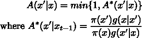
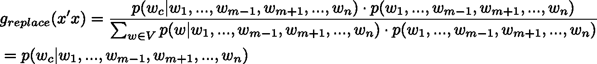

# 受限句子生成使用吉布斯采样和 BERT

> 原文：[`towardsdatascience.com/constrained-sentence-generation-using-gibbs-sampling-and-bert-8d326b9027b1?source=collection_archive---------6-----------------------#2024-07-19`](https://towardsdatascience.com/constrained-sentence-generation-using-gibbs-sampling-and-bert-8d326b9027b1?source=collection_archive---------6-----------------------#2024-07-19)

## 一种快速有效的方法，通过使用公共预训练模型，从给定的关键词生成流畅的句子

[](https://medium.com/@sergeyvilov?source=post_page---byline--8d326b9027b1--------------------------------)[](https://towardsdatascience.com/?source=post_page---byline--8d326b9027b1--------------------------------) [Sergey Vilov](https://medium.com/@sergeyvilov?source=post_page---byline--8d326b9027b1--------------------------------)

·发布于 [Towards Data Science](https://towardsdatascience.com/?source=post_page---byline--8d326b9027b1--------------------------------) ·阅读时间 10 分钟·2024 年 7 月 19 日

--


图片来自 [Brett Jordan](https://unsplash.com/@brett_jordan?utm_source=medium&utm_medium=referral) 在 [Unsplash](https://unsplash.com/?utm_source=medium&utm_medium=referral)

[大型语言模型](https://en.wikipedia.org/wiki/Large_language_model)，如 [GPT](https://en.wikipedia.org/wiki/Generative_pre-trained_transformer)，在*自由形式*文本生成方面取得了前所未有的成果。它们广泛用于撰写电子邮件、广告文案或讲故事。然而，它们在*受限*文本生成方面的成功仍然有限[1]。

受限文本生成是指生成具有特定属性的句子，例如情感、时态、模板或风格。我们将考虑一种特定的受限文本生成方式，即基于关键词的生成。在这个任务中，要求模型生成包含给定关键词的句子。根据应用的不同，这些句子应该（a）包含所有关键词（即保证高覆盖率）（b）语法正确（c）符合常识（d）展示词汇和语法的多样性。

对于自回归的前向生成模型，如 GPT，受限生成尤其具有挑战性。这些模型一次一个地从左到右顺序生成标记。由于设计原因，它们缺乏对生成序列的精确控制，并且难以支持在输出中的任意位置上的约束或涉及多个关键词的约束。因此，这些模型通常表现出较差的覆盖度（a）和多样性（d），但能够生成流畅的句子（b,c）。尽管一些采样策略，如动态束分配[2]，专门设计来改善前向模型的受限文本生成，但在独立测试中，它们的结果表现较差[3]。

另一种方法[4]，被称为 CGMH，包含通过对现有序列执行基本操作（如单词删除、插入或替换）来迭代地构建句子。初始序列通常是给定关键词的有序序列。由于搜索空间极其庞大，这类方法往往难以在合理的时间内生成有意义的句子。因此，尽管这些模型可能确保良好的覆盖度（a）和多样性（d），它们可能未能满足流畅性要求（b,c）。为了解决这些问题，曾建议通过引入可微分的损失函数[5]或预训练神经网络[6]来引导采样器，从而限制搜索空间。然而，与 CGMH 相比，这些调整并未带来任何在实践中显著的改进。

在以下内容中，我们将提出一种基于给定关键词生成句子的全新方法。该方法的核心思想是通过从一个正确的句子出发，限制搜索空间并减少可能的操作集合。事实证明，当仅考虑替换操作时，BERT 模型通过吉布斯采样提供了一种便捷的方式来生成期望的句子。

# 从 BERT 进行吉布斯采样

通过从[BERT](https://en.wikipedia.org/wiki/BERT_(language_model))进行[吉布斯采样](https://en.wikipedia.org/wiki/Gibbs_sampling)来采样句子，最早是在[7]中提出的。在这里，我们将这一思路应用于受限句子的生成。

为了简化理论介绍，我们将从解释 CGMH 方法的基础开始[4]，该方法使用[Metropolis-Hastings 算法](https://en.wikipedia.org/wiki/Metropolis–Hastings_algorithm)从满足给定约束条件的句子分布中进行采样。

采样器从给定的关键词序列开始。在每一步中，选择当前句子中的一个随机位置，并执行三种可能操作之一（按概率*p*=1/3 选择）：插入、删除或替换单词。之后，从相应的提议分布中采样候选句子。特别地，替换的提议分布具有以下形式：


（图片来源：作者）

其中*x*是当前句子，*x’*是候选句子，*w_1*…*w_n*是句子中的单词，*w^c*是提议的单词，*V*是词典大小，π是采样分布。然后，可以使用接受率来决定是否接受或拒绝候选句子：



（图像来自作者）

为了获得句子的概率，作者建议使用一个简单的基于 seq2seq LSTM 的网络：


（图像来自作者）

其中*p_LM(x)*是语言模型给出的句子概率，*χ(x)*是一个指示函数，当所有关键字都包含在句子中时值为 1，否则为 0。

当施加关键字约束时，生成从给定的关键词序列开始。这些词然后被排除在删除和替换操作之外。在一段时间后（[预热期](https://en.wikipedia.org/wiki/Gibbs_sampling)），生成过程会收敛到一个平稳分布。

如上所述，这类方法的一个弱点是庞大的搜索空间，这使得它们无法在合理的时间内生成有意义的句子。我们现在将通过完全消除插入和删除操作来缩小搜索空间。

好吧，这和吉布斯采样以及 BERT 有什么关系呢？

[引用 Wikipedia](https://en.wikipedia.org/wiki/Gibbs_sampling)，吉布斯采样在联合分布未知或难以直接从中采样时使用，但每个变量的条件分布是已知的，并且易于（或者至少，更容易）从中采样。

BERT 是一个基于变换器的模型，旨在通过同时考虑左右上下文来进行深度双向表示的预训练，使其能够根据周围的上下文理解一个单词的意义。对我们来说，特别重要的是 BERT 是以掩码语言模型的方式进行训练的，即给定句子中的所有其他单词（标记），它预测掩码单词（标记）。如果仅掩盖一个单词，那么模型直接提供条件概率*p(w_c|w_1,…,w_{m-1},w_{m+1},…,w_n)*。请注意，这只有在 BERT 的双向特性下才能实现，因为它能够访问掩码单词左右两侧的标记。另一方面，联合概率*p(w_1,…w_n)*并不直接从 BERT 输出中获得。看起来像是一个吉布斯采样的应用案例，对吧？重新编写*g(x’|x)*，可以得到：



（图像来自作者）

请注意，只要考虑替换操作，接受率总是 1：


（图像来自作者）

所以，替换实际上是一个吉布斯采样步骤，其中提议分布由 BERT 模型直接提供！

# 实验

为了说明这个方法，我们将使用来自[Hugging Face](https://huggingface.co)的一个预训练 BERT 模型。为了独立评估句子的流畅度，我们还将使用[GPT2](https://huggingface.co/openai-community/gpt2)模型计算句子的[困惑度](https://en.wikipedia.org/wiki/Perplexity)。

让我们从加载所有必要的模块和模型到内存开始：

```py
from transformers import BertForMaskedLM, AutoModelForCausalLM, AutoTokenizer

import torch
import torch.nn.functional as F
import numpy as np
import pandas as pd

device = torch.device('cpu') #works just fine

#Load BERT
tokenizer = AutoTokenizer.from_pretrained("bert-base-uncased")
model = BertForMaskedLM.from_pretrained("bert-base-uncased")
model.to(device)

#Load GPT2
gpt2_model = AutoModelForCausalLM.from_pretrained("gpt2") #dbmdz/german-gpt2
gpt2_tokenizer = AutoTokenizer.from_pretrained("gpt2")

gpt2_tokenizer.padding_side = "left" 
gpt2_tokenizer.pad_token = gpt2_tokenizer.eos_token
```

然后我们需要定义一些重要的常量：

```py
N_GIBBS_RUNS = 4 #number of runs
N_ITR_PER_RUN = 500 #number of iterations per each run
N_MASKED_WORDS_PER_ITR = 1 #number of masked tokens per iteration
MIN_TOKENS_PROB = 1e-3 #don't use tokens with lower probability for replacement
```

由于我们只会使用替换操作，我们需要选择一个包含所需关键词的初始句子。假设是：

*我常常梦想着有一座位于海边的宽敞别墅*。

每个人在某个时候肯定都曾梦想过这个……我们将随意选择*梦想*和*海*作为关键词。

```py
initial_sentence = 'I often dream about a spacious villa by the sea .'

words = initial_sentence.split(' ')

keyword_idx = [2,9]
keyword_idx.append(len(words)-1) # always keep the punctuation mark at the end of the sentence
```

现在我们准备好进行采样：

```py
def get_bert_tokens(words, indices):
    sentence = " ".join(words)
    masked_sentence = [word if not word_idx in indices else "[MASK]" for word_idx,word in enumerate(words) ]
    masked_sentence = ' '.join(masked_sentence)
    bert_sentence = f'[CLS] {masked_sentence} [SEP] '
    bert_tokens = tokenizer.tokenize(bert_sentence)
    return bert_tokens

n_words = len(words)
n_fixed = len(keyword_idx)

generated_sent = []

for j in range(N_GIBBS_RUNS):

    words = initial_sentence.split(' ')

    for i in range(N_ITR_PER_RUN):

        if i%10==0:
            print(i)

        #choose N_MASKED_WORDS_PER_ITR random words to mask (excluding keywords)
        masked_words_idx = np.random.choice([x for x in range(n_words) if not x in keyword_idx], replace=False, size=N_MASKED_WORDS_PER_ITR).tolist() 

        masked_words_idx.sort()

        while len(masked_words_idx)>0:

            #reconstruct successively each of the masked word
            bert_tokens = get_bert_tokens(words, masked_words_idx) #get tokens from tokenizer

            masked_index = [i for i, x in enumerate(bert_tokens) if x == '[MASK]']
            indexed_tokens = tokenizer.convert_tokens_to_ids(bert_tokens)
            segments_ids = [0] * len(bert_tokens)

            tokens_tensor = torch.tensor([indexed_tokens]).to(device)
            segments_tensors = torch.tensor([segments_ids]).to(device)

            with torch.no_grad():
                outputs = model(tokens_tensor, token_type_ids=segments_tensors)
                predictions = outputs[0][0]
                reconstruct_pos = 0 #reconstruct leftmost masked token
                probs = F.softmax(predictions[masked_index[reconstruct_pos]],dim=0).cpu().numpy()

            probs[probs<MIN_TOKENS_PROB] = 0 #ignore low probabily tokens

            if len(probs)>0:

                #sample a token using the conditional probability from BERT
                token = np.random.choice(range(len(probs)), size=1, p=probs/probs.sum(), replace=False)

                predicted_token = tokenizer.convert_ids_to_tokens(token)[0]

                words[masked_words_idx[reconstruct_pos]] = predicted_token #replace the word in the sequence with the chosen token

            del masked_words_idx[reconstruct_pos]

        sentence = ' '.join(words)

        with torch.no_grad():
            inputs = gpt2_tokenizer(sentence, return_tensors = "pt")
            loss = gpt2_model(input_ids = inputs["input_ids"], labels = inputs["input_ids"]).loss
            gpt2_perplexity = torch.exp(loss).item()

        #sentence = sentence.capitalize().replace(' .','.')
        gpt2_perplexity = int(gpt2_perplexity)

        generated_sent.append((sentence,gpt2_perplexity))

df = pd.DataFrame(generated_sent, columns=['sentence','perplexity'])
```

现在让我们看看困惑度图：


对于采样句子的 GPT2 困惑度（图片由作者提供）。

这里有两点需要注意。首先，困惑度从一个相对较小的值开始（*困惑度*=147）。这是因为我们用一个对 GPT2 来说不显得尴尬的有效句子初始化了采样器。基本上，困惑度不超过起始值（虚线红线）的句子可以视为通过了外部检查。其次，后续的样本是相关的。这是[Gibbs 采样](https://en.wikipedia.org/wiki/Gibbs_sampling)的一个[已知特性](https://en.wikipedia.org/wiki/Gibbs_sampling)，也是为什么通常建议每取第*k*个样本的原因。

实际上，在 2000 个生成的句子中，我们得到了 822 个独特句子。它们的困惑度从 60 到 1261 不等，341 个样本的困惑度低于初始句子的困惑度：


GPT2 困惑度在独特句子中的分布（图片由作者提供）。

这些句子看起来怎么样？让我们随机挑选一部分：


生成的困惑度低于起始值的句子随机子集（图片由作者提供）。

这些句子看起来确实相当流畅。请注意，所选的关键词（*梦想*和*海*）在每个句子中都出现了。

如果我们不设置任何关键词，看看会发生什么也是很有趣的。让我们随机选取一些使用空关键词集生成的句子：


使用未固定关键词生成的句子的随机子集（图片由作者提供）。

所以，这些句子也看起来相当流畅和多样化！事实上，使用一个空的关键词集实际上会将 BERT 变成一个随机句子生成器。不过需要注意的是，所有这些句子都有 10 个单词，就像初始句子一样。原因是 BERT 模型不能随意改变句子的长度。

为什么我们需要运行采样器 N_GIBBS_RUNS=4 次，单次运行不足以吗？实际上，运行多次是必要的，因为 Gibbs 采样器可能会陷入局部最小值[7]。为了说明这一情况，我们计算了在单次运行采样器 2000 次迭代时和在每 500 次迭代时重新初始化采样器的情况下，累积词汇量（生成的句子中迄今使用的不同单词数量）：


在单次运行中运行 Gibbs 采样 2000 次迭代和在 4 次运行中每次 500 次迭代时的累积词汇量（作者提供的图片）

可以清楚地看到，单次运行在约 1500 次迭代时陷入困境，采样器无法在此点之后生成具有新单词的句子。相反，每 500 次迭代重新初始化采样器有助于摆脱这一局部最小值，并提高生成句子的词汇多样性。

# 结论

总的来说，所提出的方法从包含给定关键词的句子开始生成逼真的句子。生成的句子确保 100% 覆盖（a），语法正确（b），符合常识（c），并提供词汇多样性（d）。此外，该方法非常简单，可以与公开可用的预训练模型一起使用。该方法的主要弱点当然是其依赖于满足给定约束的起始句子。首先，起始句子应该由专家或其他外部来源提供。其次，虽然确保生成语法正确的句子，但也限制了输出的语法多样性。一个可能的解决方案是通过挖掘可靠的句子数据库提供几个输入句子。

# 参考文献

[1] Garbacea, Cristina, and Qiaozhu Mei. “为什么受限神经语言生成特别具有挑战性？.” *arXiv 预印本 arXiv:2206.05395* (2022).

[2] Post, Matt, and David Vilar. “使用动态束分配进行快速词汇受限解码的神经机器翻译.” *arXiv 预印本 arXiv:1804.06609* (2018).

[3] Lin, Bill Yuchen, 等. “CommonGen: 用于生成常识推理的受限文本生成挑战.” *arXiv 预印本 arXiv:1911.03705* (2019).

[4] Miao, Ning, 等. “Cgmh: 通过 Metropolis-Hastings 采样进行受限句子生成.” *人工智能 AAAI 会议论文集*. Vol. 33\. №01\. 2019.

[5] Sha, Lei. “梯度引导的无监督词汇受限文本生成.” *2020 年自然语言处理实证方法会议论文集（EMNLP）*. 2020.

[6] He, Xingwei, and Victor OK Li. “告诉我如何修改：通过 xlnet 改进词汇受限句子生成.” *人工智能 AAAI 会议论文集*. Vol. 35\. №14\. 2021.

[7] 王艾利克斯，赵庆贤. “BERT 有嘴巴，它必须说话：BERT 作为马尔可夫随机场语言模型.” *arXiv 预印本 arXiv:1902.04094* (2019).
