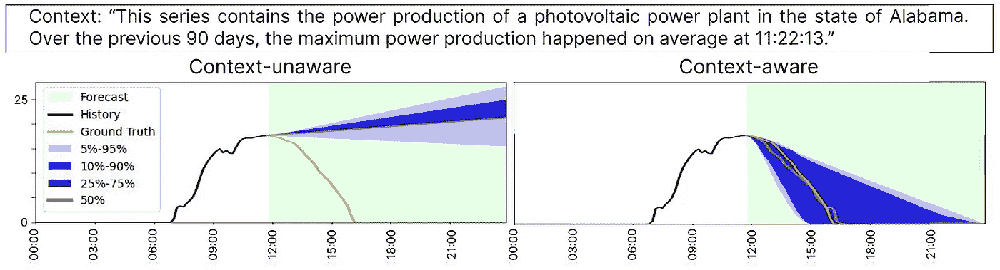

# 上下文辅助预测：利用文本数据提升预测准确性

> 原文：[`towardsdatascience.com/context-aided-forecasting-enhancing-forecasting-with-textual-data-c9af2ab057c1?source=collection_archive---------7-----------------------#2024-12-02`](https://towardsdatascience.com/context-aided-forecasting-enhancing-forecasting-with-textual-data-c9af2ab057c1?source=collection_archive---------7-----------------------#2024-12-02)

## 一种有前景的替代方法，用于改善预测

 [Nikos Kafritsas](https://medium.com/@nikoskafritsas?source=post_page---byline--c9af2ab057c1--------------------------------)

·发表于 [Towards Data Science](https://towardsdatascience.com/?source=post_page---byline--c9af2ab057c1--------------------------------) ·阅读时长：8 分钟·2024 年 12 月 2 日

--

图片来源 [1]

**使用文本数据来提升预测表现并非新鲜事。**

在金融市场中，文本数据和经济新闻通常在产生准确预测中扮演着至关重要的角色——有时甚至比数值历史数据更为重要。

最近，许多大型语言模型（LLMs）已经在**Fedspeak**和新闻情感分析上进行了微调。这些模型完全依赖文本数据来估计市场情绪。

一篇引人注目的新论文，***“上下文至关重要”*[1]**，探讨了一种不同的方法：通过结合数值和外部文本数据，预测准确性能提高多少？

论文提出了几项关键贡献：

+   **上下文至关重要（CiK）数据集**：一个将数值数据与相应文本信息配对的预测任务数据集。

+   **感兴趣区域 CRPS (RCRPS)**：一种为评估概率预测而设计的修改版 CRPS 指标，专注于上下文敏感窗口。

+   **上下文至关重要基准**：一种新的评估框架，展示了外部文本信息如何提升流行的时间序列模型。
