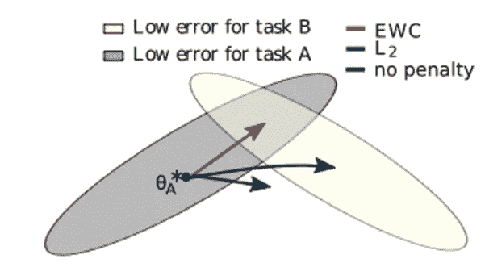

# 持续学习——深入探讨弹性权重整合损失

> 原文：[`towardsdatascience.com/continual-learning-a-deep-dive-into-elastic-weight-consolidation-loss-7cda4a2d058c?source=collection_archive---------5-----------------------#2024-07-02`](https://towardsdatascience.com/continual-learning-a-deep-dive-into-elastic-weight-consolidation-loss-7cda4a2d058c?source=collection_archive---------5-----------------------#2024-07-02)

## 带有 PyTorch 实现

 [Alexey Kravets](https://medium.com/@alexml0123?source=post_page---byline--7cda4a2d058c--------------------------------)

·发表于[Towards Data Science](https://towardsdatascience.com/?source=post_page---byline--7cda4a2d058c--------------------------------) ·阅读时间 9 分钟·2024 年 7 月 2 日

--

# 介绍

训练人工神经网络时最重要的挑战之一是灾难性遗忘。当神经网络在某一任务（任务 A）上进行训练后，接着学习一个新任务（任务 B），在这个过程中，它会忘记如何执行原始任务。这篇文章将探讨一种解决该问题的方法——弹性权重整合（EWC）。EWC 提供了一种有前景的方法，能够缓解灾难性遗忘，使神经网络在获得新技能的同时，保留之前学过的任务的知识。

*除非另有说明，本文中的所有图像均为作者提供*

# 直觉

图 1：EWC 的直觉，图来自[论文](https://arxiv.org/pdf/1612.00796)

已经证明，对于一个任务，存在许多配置的最优参数，它们在该任务上有较低的误差——如上图所示，任务 A 和任务 B 分别对应灰色和黄色区域。假设我们已经为任务 A 找到了一个这样的配置*θꭺ*，当从这个配置继续训练模型以解决新任务 B 时，我们有三种不同的情况：

1.  如果只是继续在任务 B 上训练而不加以惩罚，我们最终会进入任务 B 的低水平区域，但在任务 A 上的表现将低于期望的准确度……
