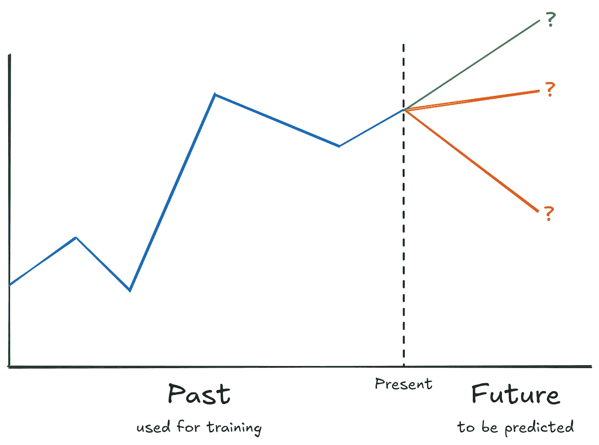

# 使用 sktime 便捷的时间序列预测

> 原文：[`towardsdatascience.com/convenient-time-series-forecasting-with-sktime-bb82375e846c?source=collection_archive---------1-----------------------#2024-09-25`](https://towardsdatascience.com/convenient-time-series-forecasting-with-sktime-bb82375e846c?source=collection_archive---------1-----------------------#2024-09-25)

## 如何让预测像散步一样简单

 [Dr. Robert Kübler](https://dr-robert-kuebler.medium.com/?source=post_page---byline--bb82375e846c--------------------------------)

·发布于[Towards Data Science](https://towardsdatascience.com/?source=post_page---byline--bb82375e846c--------------------------------) ·阅读时间 8 分钟·2024 年 9 月 25 日

--

图片由[Christel F.](https://unsplash.com/@christelsphotos?utm_source=medium&utm_medium=referral)提供，来源于[Unsplash](https://unsplash.com/?utm_source=medium&utm_medium=referral)

啊，时间序列预测。这是许多数据科学家的经典任务，几乎在各行各业都有应用。这个领域之所以如此宝贵，是因为如果你拥有一颗水晶球，能提前看到一些关键数字，你可以利用这些信息抢占先机，为即将到来的挑战做好准备。

作者提供的图片。

以呼叫中心为例：预测呼叫量可以优化人员配置，确保高效处理客户咨询。在零售业，预测商品何时会缺货可以及时重新订货，避免销售损失并最大化收入。当然，股市预测的“圣杯”也在这里：如果你能做到这一点，你就会变得富有。

在本文中，我想向你展示如何使用令人惊叹的库[sktime](https://www.sktime.net/)轻松完成这项工作，sktime 是时间序列预测领域中的 scikit-learn。

# 为什么不直接使用 scikit-learn 呢？

很好的问题！这就像在问：“我有刀和砧板，为什么还要使用复杂的食物处理器？”当然，你*可以*切菜……
