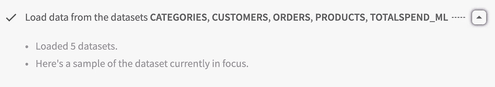
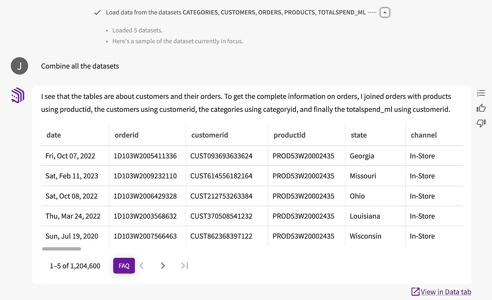
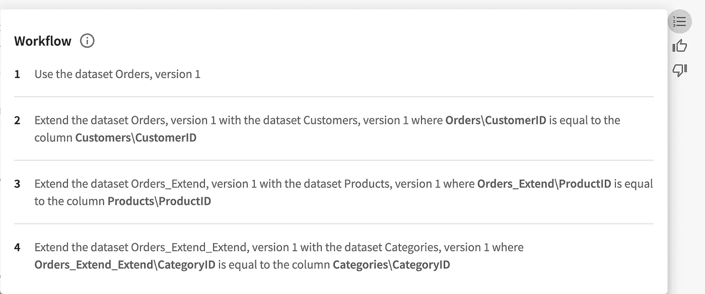
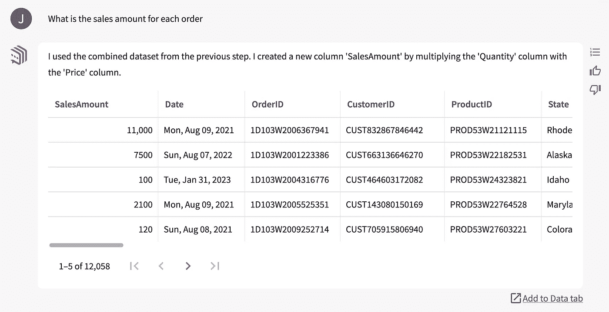
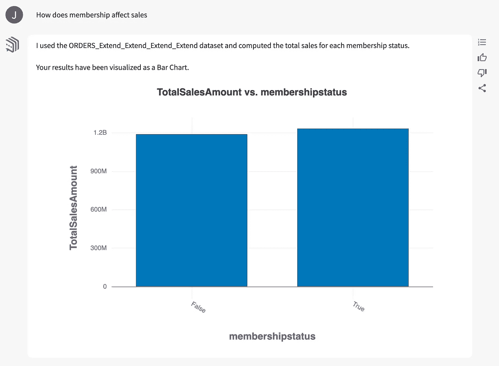
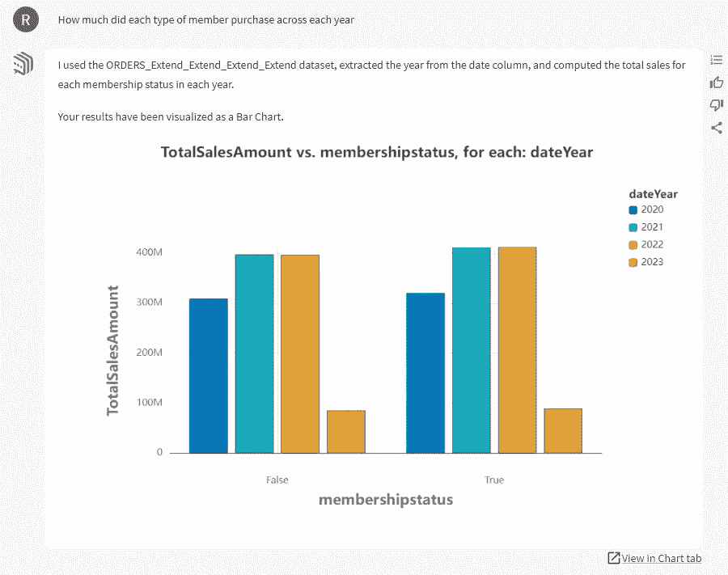
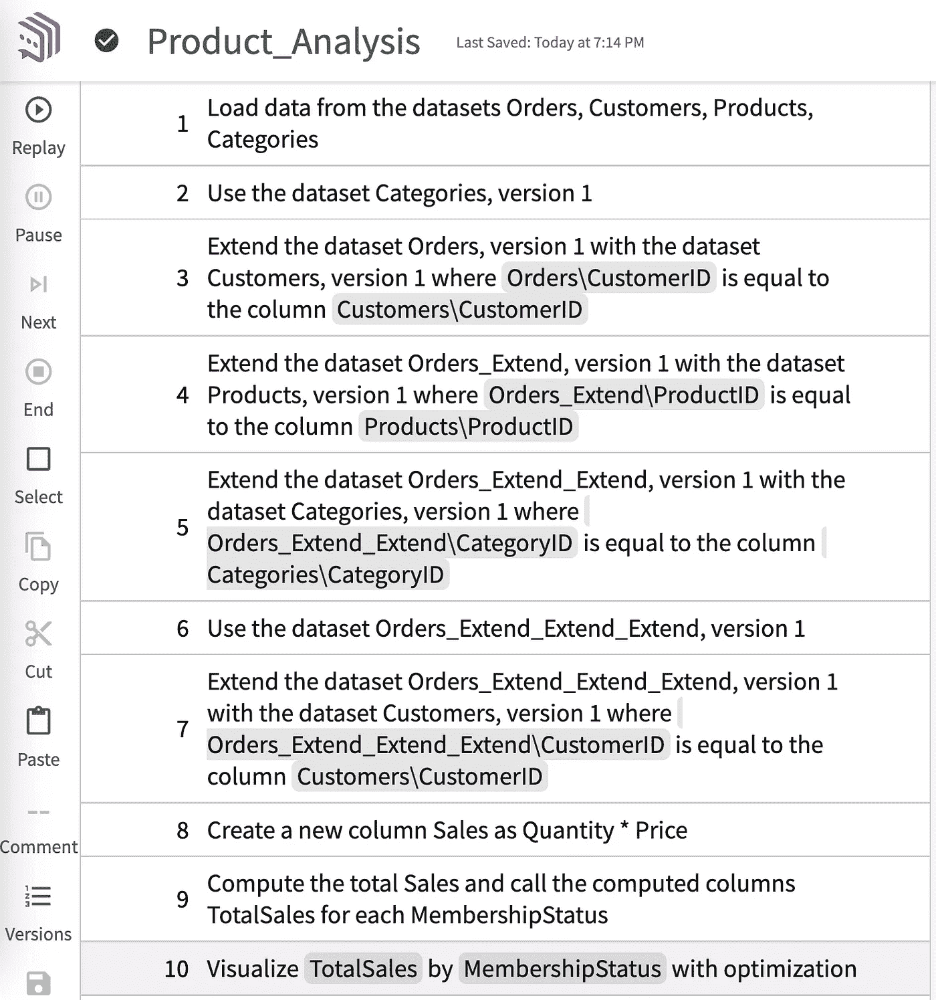

# 会话分析是企业数据科学的未来

> 原文：[`towardsdatascience.com/conversational-analysis-is-the-future-for-enterprise-data-science-c0f0c2f7ba7b?source=collection_archive---------7-----------------------#2024-07-09`](https://towardsdatascience.com/conversational-analysis-is-the-future-for-enterprise-data-science-c0f0c2f7ba7b?source=collection_archive---------7-----------------------#2024-07-09)

## *LLMs 不会取代数据科学家，但它们将改变我们与决策者的合作方式*

[](https://medium.com/@jmpatel?source=post_page---byline--c0f0c2f7ba7b--------------------------------)[](https://towardsdatascience.com/?source=post_page---byline--c0f0c2f7ba7b--------------------------------) [Jignesh Patel](https://medium.com/@jmpatel?source=post_page---byline--c0f0c2f7ba7b--------------------------------)

·发表于[Towards Data Science](https://towardsdatascience.com/?source=post_page---byline--c0f0c2f7ba7b--------------------------------) ·阅读时长 8 分钟·2024 年 7 月 9 日

--

大型语言模型（LLMs）本应让数据科学变得更加简单。它们可以为每一个想得到的功能生成 Python 和 SQL 代码，将重复性任务的完成时间从几分钟缩短到几秒钟。然而，随着 LLMs 的出现，组装、维护和验证数据工作流变得更加困难，而不是更简单。

LLM 代码生成器为私营部门的数据科学家带来了两个相关的问题。首先，LLMs 设定了数据科学家应当更快工作的预期，但隐私考虑可能要求他们不向 LLM 发送机密数据。在这种情况下，数据科学家必须以零散的方式使用 LLMs 来生成代码，确保 LLM 无法了解整个数据集。

这就导致了第二个问题：在解释结果时缺乏透明性和可重复性。当数据科学家以“传统”方式进行分析时，他们会创建确定性代码，例如使用 Python 编写的 Jupyter 笔记本，并生成最终的分析结果。而 LLM 是非确定性的。你多次问它相同的问题，可能会得到不同的答案。所以，虽然工作流可能会产生洞察，但数据科学家可能无法重现得出这一结果的过程。

因此，LLMs 可以加速单个步骤代码的生成，但它们也有可能削弱数据团队与决策者之间的信任。我认为解决方案是采用一种更加会话化的分析方法，在这种方法中，数据专家与决策者共同创建和讨论洞察。

# **生成式 AI 的双重祝福**

高管们为数据科学分配预算，希望它能推动决策，从而增加利润和股东价值——但他们不一定知道或关心分析是如何工作的。他们希望更快地获得更多信息，如果 LLM 能加速数据科学代码的生成，那么数据团队最好能与之配合生成代码。如果代码相对简单，这一切都很顺利，*如果* 数据科学家能够构建并检查每个组件，然后再进行下一步。但随着复杂性的增加，这个过程变得复杂，导致分析更容易出错，文档编写和审查变得更加困难，也更难向业务用户解释。

为什么？首先，数据科学家越来越多地在多种编程语言中工作，并且使用特定工具（如 Snowflake 或 Databricks）的方言。LLM 可能生成 SQL 和 Python 代码，但它们并不免除数据科学家理解代码并进行测试的责任。在多种编程语言中充当防止“幻觉”发生的前线防线是一个重要负担。

第二，LLM 不一致，这可能导致新生成的代码整合起来时变得杂乱。如果我运行一个请求 Python 中表连接函数的提示，LLM 可能会每次给出不同的输出。如果我想稍微修改一个工作流，LLM 可能会生成与之前给出的所有代码不兼容的代码。在这种情况下，我是应该调整现有代码，还是采纳新代码？如果旧代码已经在生产环境中部署了呢？这就有点乱了。

第三，LLM 代码生成有可能快速放大一个错误并掩盖根本原因。例如，一旦代码深度嵌套，从头开始可能比排查问题更容易。

如果一个分析结果表现出色，并且决策者从中受益，那么没有人会要求了解工作流的细节。但如果决策者发现他们基于误导性的分析做出了决策——并因此牺牲了自己的优先事项——他们会开始不信任数据，并要求数据科学家解释他们的工作。当分析结果存在于笔记本中并呈现为嵌套的代码，每个组件都来自 LLM 时，说服业务用户信任该分析是非常困难的。

# **我们不是以代码思考的**

如果我向其他数据科学家展示一个 Python 笔记本，他们会理解我想做什么——但他们会很难识别代码中任何问题的根本原因。问题在于，我们试图在代码中进行推理和思考。编程语言就像摩尔斯电码一样，在没有提供语境和意义的通用语言的情况下，它们本身没有任何意义。一个潜在的解决方案是，花更少的时间在代码的世界里，多花些时间在通俗的英语中。

如果我们用英语进行分析、记录和讨论，我们更有可能理解我们开发的工作流，以及它们为何合理或不合理。此外，我们也更容易将这些工作流传达给那些应该根据这些分析采取行动但可能不完全信任它们的业务用户。

自 2016 年以来，我一直在研究如何将代码抽象为英语，以及如何将自然语言抽象为 SQL 和 Python。这项工作最终促使我的同事 Rogers Jeffrey Leo John 和我基于用普通英语命令和问题创建分析的想法，推出了一家公司——DataChat。在我在卡内基梅隆大学的工作中，我经常使用这一工具进行初步的数据清理和准备、探索和分析。

如果，企业数据团队不仅仅是用英语记录工作，而是与决策者合作，在实际环境中共同创建他们的初步分析呢？数据科学家不再是孤立地花费数小时进行无法复现、可能无法回答高管最大问题的分析，而是像创意人员引导头脑风暴会议一样，推动分析会议的进行。这是一种能够建立信任和共识的方法。

为了说明为什么这是企业数据科学的一个富有成效的方向，我将通过一个示例来演示这可能是什么样子。我将使用 DataChat，但我想强调的是，还有其他方法可以用通俗语言呈现代码，并使用 LLM 记录数据工作流。

# **与决策者同在的会议室中**

总结一下，我们使用的是 LLM 现在流利的编程语言——但它们可以针对相同的提示提出多个解决方案，这可能会影响我们保持代码质量和复现分析的能力。这种现状带来了分析结果可能误导决策者并导致代价高昂的行动，从而破坏分析创建者和用户之间的信任。

然而，现在我们正处在一个董事会会议室内，那里坐着一家专注于电子产品的电子商务公司 C 级高管。本示例中的数据集是为了看起来真实而生成的，但并不来自任何实际公司。

在 Python 中分析电子商务数据集的典型逐步指南可能会像这样开始：

```py
import pandas as pd

# Path to your dataset
file_path = 'path/to/your/dataset.csv'

# Load the dataset
df = pd.read_csv(file_path)

# Display the first few rows of the dataframe
print(df.head())
```

这对于数据科学家来说是有指导意义的——我们知道编码者已经加载了数据集。这正是我们要避免的。业务用户并不关心。用英语抽象出来，以下是我们数据集的等效步骤：



C 级团队现在明白我们在分析中包含了哪些数据集，他们希望将这些数据集作为一个整体来探索。因此，我们需要将这些数据集合并。我将使用普通英语命令，就像我在与 LLM 对话一样（间接地，我确实是在与 LLM 对话）：



现在我有了一个合并的数据集和一个 AI 生成的关于它们如何合并的描述。注意到我之前的步骤，即加载数据集，也可以看到。如果我的听众想了解更多关于导致此结果的实际步骤，我可以调出工作流程。这是以引导英语语言（GEL）编写的高层次代码描述，最初我们在一篇学术论文中开发了它：



以 DataChat GEL 表达的工作流程

现在，我可以回答来自 C 级团队的问题，这些人是我们业务领域的专家。我一边进行分析，一边培训团队如何使用这个工具（因为最终，我希望他们能自己解答基本问题，将我分配给能充分利用我技能的工作）。

首席财务官注意到每个订单项的价格有给出，但没有给出每个订单的总额。他们希望看到每个订单的价值，因此我们问：



首席营销官问关于特定商品销售及其在不同时间点的波动情况。然后，首席执行官提出了一个更具战略性的问题。我们有一个类似于亚马逊 Prime 的会员计划，旨在提高客户生命周期价值。会员对销售有何影响？团队假设会员花费更多，但我们问：



图表显示会员几乎没有增加销售额。执行团队感到惊讶，但他们已经和我一起走过了分析过程。他们知道我使用的是一个强大的数据集。他们要求看看这个趋势是否在几年内依然成立：



从一年到另一年，会员似乎对购买几乎没有影响。当前在提高会员数方面的投资可以说是浪费的。测试旨在增加购买的会员福利或等级可能更有意义。这对我们的数据团队来说可能是一个有趣的项目。如果我们反而向高管发送了一份报告，声称会员对销售没有影响，那就会遇到更多的抵触。

如果某个与当前会员策略相关的人不满这个结论——并且希望亲自了解我们是如何得出这个结论的——我们可以仅共享该图表的工作流程：



我们的分析环节即将结束。工作流程已经记录下来，这意味着任何人都可以审查并重现它（GEL 代表精确的代码）。几个月后，在测试和实施新的会员功能之后，我们可以在更新的数据集上重新运行这些步骤，看看会员和销售之间的关系是否随着时间的推移发生了变化。

# **对话式数据科学**

通常，数据科学是按需定制的。决策者会要求对某个问题进行分析；数据团队提供分析结果；至于决策者是否使用这些信息，以及如何使用，分析师和数据科学家未必知道。也许决策者会基于初步分析提出新问题，但时间已不多——他们必须立刻采取行动。没有时间再请求更多的见解。

利用 LLM，我们可以使数据科学变得更加对话式和协作性，同时揭开分析背后的神秘面纱，弄清楚这些分析从何而来，以及它们是否值得信任。数据科学家可以像我刚才展示的那样，使用广泛可用的工具进行简洁明了的英语会话。

会话分析并不会让笔记本环境变得不重要——它通过提高数据科学家与业务用户之间的沟通质量来补充这一环境。希望这种分析方法能培养出更多的知情决策者，他们学会提出更有趣、更大胆的数据问题。也许这些对话将促使他们更加关注分析质量，而不再过于关注我们通过代码生成 LLM（大语言模型）能多快创造分析结果。

*除非另有说明，所有图片均由作者提供。*
