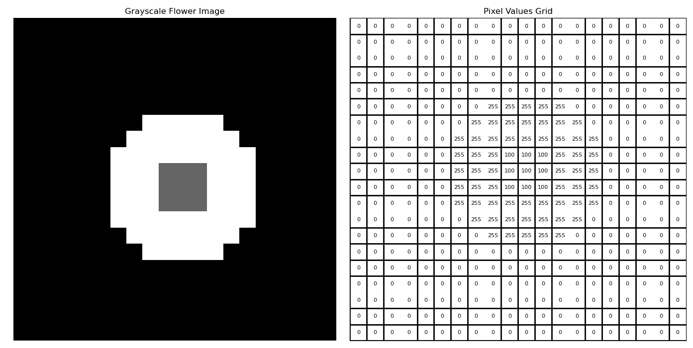

# 卷积层—CNN 的构建模块

> 原文：[`towardsdatascience.com/convolutional-layer-building-block-of-cnns-501b5b643e7b?source=collection_archive---------5-----------------------#2024-01-11`](https://towardsdatascience.com/convolutional-layer-building-block-of-cnns-501b5b643e7b?source=collection_archive---------5-----------------------#2024-01-11)

## 卷积层是什么，以及它们如何促进计算机视觉领域的深度学习

 [Egor Howell](https://medium.com/@egorhowell?source=post_page---byline--501b5b643e7b--------------------------------)

·发表于[Towards Data Science](https://towardsdatascience.com/?source=post_page---byline--501b5b643e7b--------------------------------) ·阅读时间 9 分钟·2024 年 1 月 11 日

--

”[`www.flaticon.com/free-icons/neural-network`](https://www.flaticon.com/free-icons/neural-network)" title=”neural network icons”>神经网络图标由 juicy_fish 创建 — Flaticon.

# 计算机如何看待图像

和我你不同，计算机只使用二进制数字工作。所以，它们不能像人类一样看和理解图像。然而，我们可以用[***像素***](https://en.wikipedia.org/wiki/Pixel)来表示图像。对于灰度图像，像素越小，图像越暗。像素的取值范围是 0（黑色）到 255（白色），中间的数字则代表不同灰度值。这个数值范围等同于[***字节***](https://homepages.inf.ed.ac.uk/rbf/HIPR2/value.htm)在二进制中的表示，即²⁸，这是大多数计算机的最小工作单位。

以下是我用 Python 创建的示例图像及其对应的像素值：

一张花朵图像的示例，已分解成其像素。图表由作者在 LaTeX 中生成。

使用这个概念，我们可以开发出能够在这些像素中识别模式的算法，从而对图像进行分类。这正是[***卷积神经网络(CNN)***](https://en.wikipedia.org/wiki/Convolutional_neural_network)所做的***。

大多数图像不是灰度图像，而是带有颜色的。它们通常通过 RGB 表示，其中有三个通道：红色、绿色和蓝色。每种颜色都是一个二维的像素网格，然后将这些网格叠加在一起…
