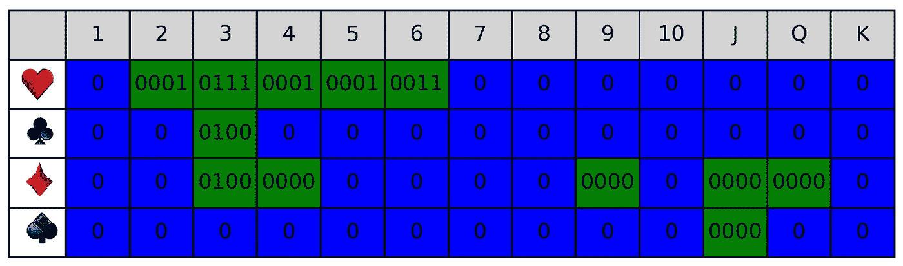

# 任何 Rummy 变种的核心 AI

> 原文：[`towardsdatascience.com/core-ai-for-any-rummy-variant-4ff414da1703?source=collection_archive---------2-----------------------#2024-11-09`](https://towardsdatascience.com/core-ai-for-any-rummy-variant-4ff414da1703?source=collection_archive---------2-----------------------#2024-11-09)

## Rummy AI 的逐步指南

 [Iheb Rachdi](https://medium.com/@iheb.rachdi?source=post_page---byline--4ff414da1703--------------------------------)

·发表于 [Towards Data Science](https://towardsdatascience.com/?source=post_page---byline--4ff414da1703--------------------------------) ·阅读时间 10 分钟·2024 年 11 月 9 日

--

作者使用 DALL-E 生成的图像

# **动机**

在我为 Rummy 游戏开发强化学习（RL）模型的过程中，我到了需要一个 AI 对手来执行环境设置并为模型训练提供支持的阶段。然而，在网上搜索后，我发现用于创建 Rummy 游戏 AI 的资源非常有限，且现有的少数解决方案对我来说太慢了。由于 AI 将用于训练（而且没有它训练时间已经很长），因此，AI 需要在处理速度和内存使用上都能快速高效地运行。不用说，暴力破解法根本无法满足需求，所以我必须尝试各种算法和优化技术，以达到适合训练的复杂性和速度。

# **为什么要阅读这篇文章？**

我们在这里构建的是一个通用、可适应的系统，适用于几乎任何你可能开发的 Rummy 游戏类型。你只需要在其基础上添加自己的策略层，然后让 AI 根据该系统的输出做出决策。此外，你还可以将其直接集成到你的 Rummy 游戏中，作为帮助玩家整理卡牌的工具，自动将卡牌分成可能的组合。此外，我们在这里实现的技术还可以应用到其他领域，所以无论如何，我保证它会在某种程度上对你有所帮助。

# **从整体来看，**

本文不会涵盖完整的 AI，而是介绍 AI 的基本构建块和核心组件，我们称之为“手牌评估器”系统。该手牌评估器分析给定的 Rummy 手牌，并提取所有可能形成的“组合”。它作为初步步骤，为 AI 决策过程打下基础，后续将在另一篇 Medium 文章中进一步探讨。

# **项目范围与预期**

在开始之前，定义我们目标系统的范围至关重要。简而言之，我们将构建一个可以处理一组*n*张 Rummy 牌（在我们的例子中为 15 张）的系统，并输出从这些牌中能提取出的有效组合或“组合（combo）”。为了使该系统能广泛适应不同的 Rummy 变种，我们将排除两个特定选项：首先是小丑牌的使用，其次是将 A 牌放在 K 牌后面组成顺子。通过设定这些规则，系统变得更加易于理解。然而，这些设计选择并不限制系统的适应性，因为如果需要，它可以很容易地扩展以包括这些规则。

由于这个手牌评估器将在整个游戏过程中反复调用，因此必须保持优化并高效使用内存。

此外，鉴于 Rummy 游戏的性质，为了让 AI 处理所有潜在的行动，它需要通过添加或移除牌来评估不同的场景。为了解决这个问题，手牌评估器系统必须支持动态修改手牌。理想情况下，我们希望避免从头开始重新处理手牌；而是希望利用之前系统运行中已经处理过的手牌，以最小化每次手牌修改后重新提取组合的工作量。

# **关键术语和设置**

**牌组：** 该牌组包含 104 张卡牌，其中有 52 张独特的卡牌，每张卡牌都重复一次，总共有 13 * 4 * 2 = 104 张卡牌。

**牌面值（Card Ranks）：** 从 1 到 13，其中 11、12 和 13 分别代表 J（杰克）、Q（皇后）和 K（国王）。

**花色（Card Suits）：** 四种花色为红心、黑桃、梅花和方块，分别可以用**H**、**S**、**C**、**D**或相应的图标表示。

**顺子（Run）：** 三张或更多连续点数的同花色牌。

*示例*：3H | 4H | 5H

**刻子（Set）：** 三张或四张同点数但花色不同的牌。

*示例*：6H | 6S | 6D

**丢牌（Dump）：** 无法用来组成有效组合的牌。

**组合（Combo）：** 一种可能的手牌划分方式，包括顺子、刻子和丢牌。

示例：

**手牌：**

3H | 4H | 5H | 6H | 7H | 7C | 7S | 6S | 10S | JD | 6D | KH | 2C | 3D | 4S

**一个可能的组合：**

· **顺子：** 3H | 4H | 5H | 6H

· **刻子（Set）：** 7H | 7C | 7S

· **丢牌区：** 6S | 10S | JD | 6D | KH | 2C | 3D | 4S

# 系统分析

> **识别与收集关键数据**

我探索了几种算法，以优化和减少所有可能组合的搜索空间。然而，每张牌可以出现两次的事实增加了潜在组合的数量，使得跟踪和验证每个组合变得具有挑战性。在参与 Codeforces 比赛时，我遇到一个问题，提醒我想到了‘[岛屿问题](https://codeforces.com/problemset/problem/627/F)’，它让我对手牌评估系统的处理方式有了新的洞察。

我们可以将手牌表示为一个 4x13 的二维网格，其中每一列代表从 1 到 13 的点数，每一行对应四种花色。网格中的每个单元格包含手牌中对应牌的数量，在我们的情况下可能是 1、2 或 0。这允许我们将手牌划分为“岛屿”，岛屿定义为根据以下连接规则，计数为 1 或 2 的相邻格子的组：

**1.** 如果两个单元格在网格中有一边相接（左、右、上或下），则它们被认为是连接的。

**2.** 同一列中的所有单元格也被认为是连接的，如果它们都包含至少一个 1，即使它们不相邻（上下）。

‘手牌 A’的 EXP：11C 3H 4H 11D 3D 5H 9D 2H 6H 3C 4H 3D 4D 5H 12D 3C

‘手牌 A’的表格表示

我们的第一个任务是识别并标记所有不同的岛屿。由于每个岛屿彼此独立，我们可以通过将每个岛屿映射到一个类类型来简化工作，称其为 _cardGraph_。该类将负责该岛屿的提取、修改或删除操作。

为了更清楚地说明，接下来我们将孤立一个岛屿并在后续章节中进行处理，这样你可以更容易地跟随。如果有帮助，你可以将每个岛屿视为一个连接图，如下图所示：

左侧：表格中表示的岛屿；右侧：相同岛屿在连接图中的视角

现在，如果你考虑多个岛屿示例并尝试提取可能的组合，你会注意到有些牌在分支潜在组合时起着独特的作用。我们将这种牌称为**控制点**或简写为**Cpts**，因为它们通过显著减少搜索空间，在后续步骤中起到了至关重要的作用。

**Cpts**：为了将一张牌视为 Cpts，它必须处于一个需要我们做出选择的位子，即决定将它添加到哪个组合（顺子或三张相同）。如果一张牌可以自然地适应多个组合而不需要做出强制选择（例如，一张重复的牌可以有两个顺子选项，每张牌都会添加到一个顺子），那么它不会被视为 Cpts。

在我们的岛屿示例中，红心 3 被标识为一个 Cpts。下面列出了红心 3 可以附加的所有组合，每次一个。

我们的下一步是标记每张符合条件的卡片，称之为 Cpts。为此，我们将创建一个 4x13（字节类型）的表格，称为 _flagMap。为了提高内存效率，可以将此表格设置为共享表格，每个由手牌创建的 _cardGraph 实例都可以引用并使用它。在此表格中，每张岛屿上的卡片将被分配到 _flagMap 中相应索引的位置，这个字节将表示其在不同顺子或套牌中的潜在位置。如果一张卡片符合 Cpts 条件，它将被存储在一个栈中（我们稍后需要使用），我们称之为 _cptsStack。以下是字节结构的细节：第一位表示卡片是否属于顺子，第二位表示卡片是否属于另一个顺子，第三位表示卡片是否属于套牌，第四位表示卡片是否属于多个套牌。

这是一个比特流的示例：00000111 在这里我们有：

**•** 第一位（1）表示卡片可以属于一个顺子。

**•** 第二个位（1）表示该卡片可以属于第二个顺子。

**•** 第三位（1）表示卡片属于一个套牌。

**•** 第四位（0）表示卡片不属于第二个套牌。

我们可能会遇到一种情况，其中某张卡片的配置为 00000101（没有副本），这意味着卡片属于一个顺子或一个套牌。或者，另一种配置可能是 00000011，这意味着卡片属于两个不同的顺子。

要识别一个 Cpts，只需计算其位表示中的‘1’的数量。如果这个计数超过了该卡片在手牌中的总数量，则认为它是一个 Cpts。例如，如果一张卡片出现了两次（即有两个副本），并且其位表示为 00000101，则它不是 Cpts。然而，如果位表示为 00000111，如示例所示，则它符合 Cpts 的条件。

在我们的岛屿示例中，_flagMap 表格将如下所示：

_‘手牌 A’ 示例的 FlagMap 表示 _

一旦我们填充了 _flagMap 并识别出 Cpts，接下来的任务是将岛屿分解为水平线和垂直线。**但为什么？** 将卡片图分解为这些线条可以简化顺子和套牌的识别过程，因为它让我们能够专注于可以更高效处理的连续卡片序列。正如你可能猜到的，垂直线将代表套牌，而水平线将代表顺子。

岛屿分解为水平线和垂直线

我们将把每条水平线存储在一个元组类型的列表中，其中第一个元素表示线的起始索引，最后一个元素表示结束索引（包括）。对于垂直线，简单地将列索引存储在一个列表中就足够了。

***提示:*** 我们可以通过在一个循环中完成此任务，同时进行位表示步骤，从而实现 O(n)的复杂度。

> **生成组合**

现在，让我们休息一下并回顾一下：我们已经识别了控制点 (CPTs)，并将它们存储在 `_cptsStack` 中。我们还将岛屿分解为垂直和水平线，并用卡片的位表示填充了 `_flagMap`。

在我们准备好数据后，剩下的就是利用它生成岛屿的所有有效组合。但我们该怎么做呢？这里有一个简化的方法：

**1\. 为控制点 (Cpts) 分配有效放置位置：**

我们从 `_flagMap` 获取一个 cpts 的位表示，表示该 cpts 所有可能的放置位置。然后，我们查看该 cpts 在 `_cardGraph` 中的副本数量，并将其位表示调整为当前有效的配置。例如，如果该 cpts 的位表示为 00001111，并且有 2 个副本，我们可以生成该 cpts 的所有有效放置位置，计算公式为 C(4,2)=6。可能的组合包括 0011、0101、1100、1010、1001 和 0110。

**2\. 使用 DFS 配置每个 Cpts 的所有可能组合：**

我们将使用深度优先搜索 (DFS) 来遍历每个 cpts 的有效放置位置，如步骤 1 所示。DFS 树中的每个节点代表给定 cpts 的一个可能放置位置，因此每条唯一的 DFS 路径代表一个有效的组合配置。对于每个“叶子”节点（DFS 路径的结束），我们进入下一步骤。

**3\. 生成组合：**

在这一步中，我们遍历岛屿中的水平和垂直线，以识别连续段、集合和丢弃列表。对于每条线，分两次遍历完成，如下所示：

+   **第 1 轮：** 例如，对于一条水平线，我们不断地将卡片从 [线开始到线结束] 添加到一个列表中以形成连续段。如果 ( card_bit_representation | 00000001 == 0 )，则停止添加。如果连续段的长度大于或等于 3，我们将其添加到连续段组合中；否则，每张卡片将进入丢弃列表，并继续尝试形成另一个连续段，直到达到线的末端。

+   **第 2 轮：** 重复该过程，这次寻找与不同位模式匹配的卡片（或操作 00000010）。这使我们能够识别可能的第二个连续段。

相同的方法也适用于提取集合，但我们使用位操作 00000100 和 00001000。

**4\. 注册有效组合并移动到下一个 DFS 配置：**

完成当前组合的所有连续段、集合和丢弃操作后，我们保存该组合，然后继续下一个 DFS 配置，重复该过程。通过这种方式，我们系统地探索所有潜在的有效组合配置。

# 演示输出

如果你正确编写了代码，并且将岛屿示例 “2H3H4H5H4H5H6H3C3C3D3D4D” 作为输入，它应该被分解为如下所示。注意，我已为每个生成的组合添加了一些计算，以便我们可以了解 AI 会如何反应。

控制台输出显示生成的岛屿组合示例

# 下一步是什么？

在下一篇文章中，我将深入探讨系统的其余部分，重点讨论手牌的动态修改和 AI 策略。如果你已经跟随到这里，应该不难看出我们如何优化添加和移除卡牌，并将我们一开始放置一旁的两个规则纳入其中。敬请期待，下次见！“希望如此😉”。

> 除非另有说明，所有图片均由作者使用 Lucidchart、Gimp 和 Python 创建。
